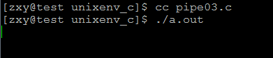
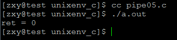
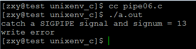
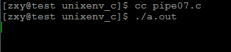
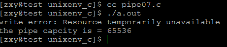
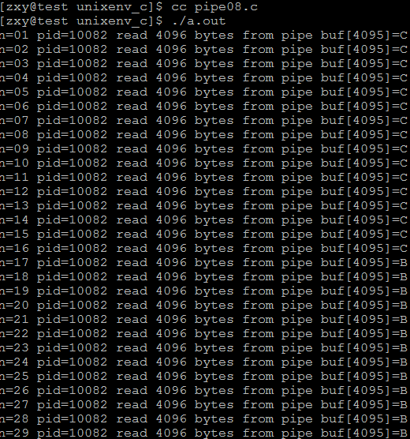
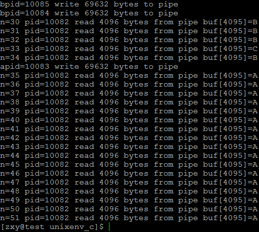

# linux系統編程之管道（二）：管道讀寫規則


##一，管道讀寫規則
當沒有數據可讀時

- O_NONBLOCK disable：read調用阻塞，即進程暫停執行，一直等到有數據來到為止。
- O_NONBLOCK enable：read調用返回-1，errno值為EAGAIN。

當管道滿的時候

- O_NONBLOCK disable： write調用阻塞，直到有進程讀走數據
- O_NONBLOCK enable：調用返回-1，errno值為EAGAIN
如果所有管道寫端對應的文件描述符被關閉，則read返回0

如果所有管道讀端對應的文件描述符被關閉，則write操作會產生信號SIGPIPE

當要寫入的數據量不大於PIPE_BUF時，linux將保證寫入的原子性。

當要寫入的數據量大於PIPE_BUF時，linux將不再保證寫入的原子性。

##二，驗證示例
示例一：O_NONBLOCK disable：read調用阻塞，即進程暫停執行，一直等到有數據來到為止。

```c
#include <stdio.h>
#include <unistd.h>
#include <stdlib.h>
#include <fcntl.h> 

int main(void)
{
    int fds[2];
    if(pipe(fds) == -1){
        perror("pipe error");
        exit(EXIT_FAILURE);
    }
    pid_t pid;
    pid = fork();
    if(pid == -1){
        perror("fork error");
        exit(EXIT_FAILURE);
    }
    if(pid == 0){
        close(fds[0]);//子進程關閉讀端
        sleep(10);
        write(fds[1],"hello",5);
        exit(EXIT_SUCCESS);
    }

    close(fds[1]);//父進程關閉寫端
    char buf[10] = {0};
    read(fds[0],buf,10);
    printf("receive datas = %s\n",buf);
    return 0;
}
```

結果：





說明：管道創建時默認打開了文件描述符，且默認是阻塞（block）模式打開

所以這裡，我們讓子進程先睡眠10s，父進程因為沒有數據從管道中讀出，被阻塞了，直到子進程睡眠結束，向管道中寫入數據後，父進程才讀到數據

示例二：O_NONBLOCK enable：read調用返回-1，errno值為EAGAIN。

```c
#include <stdio.h>
#include <unistd.h>
#include <stdlib.h>
#include <fcntl.h> 

int main(void)
{
    int fds[2];
    if(pipe(fds) == -1){
        perror("pipe error");
        exit(EXIT_FAILURE);
    }
    pid_t pid;
    pid = fork();
    if(pid == -1){
        perror("fork error");
        exit(EXIT_FAILURE);
    }
    if(pid == 0){
        close(fds[0]);//子進程關閉讀端
        sleep(10);
        write(fds[1],"hello",5);
        exit(EXIT_SUCCESS);
    }

    close(fds[1]);//父進程關閉寫端
    char buf[10] = {0};
    int flags = fcntl(fds[0], F_GETFL);//先獲取原先的flags
    fcntl(fds[0],F_SETFL,flags | O_NONBLOCK);//設置fd為阻塞模式
    int ret;
    ret = read(fds[0],buf,10);
    if(ret == -1){

        perror("read error");
        exit(EXIT_FAILURE);
    }

    printf("receive datas = %s\n",buf);
    return 0;
}
```

結果：


示例三：如果所有管道`寫端對應的文件描述符被關閉`，則read返回0

```c
#include <stdio.h>
#include <unistd.h>
#include <stdlib.h>
#include <fcntl.h> 

int main(void)
{
    int fds[2];
    if(pipe(fds) == -1){
        perror("pipe error");
        exit(EXIT_FAILURE);
    }
    pid_t pid;
    pid = fork();
    if(pid == -1){
        perror("fork error");
        exit(EXIT_FAILURE);
    }
    if(pid == 0){
        close(fds[1]);//子進程關閉寫端
        exit(EXIT_SUCCESS);
    }

    close(fds[1]);//父進程關閉寫端
    char buf[10] = {0};

    int ret;
    ret = read(fds[0],buf,10);
    printf("ret = %d\n", ret);

    return 0;
}
```

結果：





可知確實返回0，表示讀到了文件末尾，並不表示出錯

示例四：如果所有管道`讀端對應的文件描述符被關閉`，則write操作會產生信號SIGPIPE


```c
#include <stdio.h>
#include <unistd.h>
#include <stdlib.h>
#include <fcntl.h>
#include <signal.h>

void sighandler(int signo);
int main(void)
{
    int fds[2];
    if(signal(SIGPIPE,sighandler) == SIG_ERR)
    {
        perror("signal error");
        exit(EXIT_FAILURE);
    }
    if(pipe(fds) == -1){
        perror("pipe error");
        exit(EXIT_FAILURE);
    }
    pid_t pid;
    pid = fork();
    if(pid == -1){
        perror("fork error");
        exit(EXIT_FAILURE);
    }
    if(pid == 0){
        close(fds[0]);//子進程關閉讀端
        exit(EXIT_SUCCESS);
    }

    close(fds[0]);//父進程關閉讀端
    sleep(1);//確保子進程也將讀端關閉
    int ret;
    ret = write(fds[1],"hello",5);
    if(ret == -1){
        printf("write error\n");
    }
    return 0;
}

void sighandler(int signo)
{
    printf("catch a SIGPIPE signal and signum = %d\n",signo);
}
```

結果：




可知當所有讀端都關閉時，write時確實產生SIGPIPE信號

示例五：O_NONBLOCK disable： write調用阻塞，直到有進程讀走數據


```c
#include <stdio.h>
#include <unistd.h>
#include <stdlib.h>
#include <fcntl.h> 

int main(void)
{
    int fds[2];
    if(pipe(fds) == -1){
        perror("pipe error");
        exit(EXIT_FAILURE);
    }
    int ret;
    int count = 0;
    while(1){
        ret = write(fds[1],"A",1);//fds[1]默認是阻塞模式
        if(ret == -1){
            perror("write error");
            break;
        }
        count++;
    }

    return 0;
}
```

結果：




說明：fd打開時默認是阻塞模式，當pipe緩衝區滿時，write操作確實阻塞了，等待其他進程將數據從管道中取走

示例六：O_NONBLOCK enable：調用返回-1，errno值為EAGAIN


```c
#include <stdio.h>
#include <unistd.h>
#include <stdlib.h>
#include <fcntl.h> 

int main(void)
{
    int fds[2];
    if(pipe(fds) == -1){
        perror("pipe error");
        exit(EXIT_FAILURE);
    }
    int ret;
    int count = 0;
    int flags = fcntl(fds[1],F_GETFL);
    fcntl(fds[1],F_SETFL,flags|O_NONBLOCK);
    while(1){
        ret = write(fds[1],"A",1);//fds[1]默認是阻塞模式
        if(ret == -1){
            perror("write error");
            break;
        }
        count++;
    }
    printf("the pipe capcity is = %d\n",count);

    return 0;
}
```

結果：



可知也出現EGIN錯誤，管道容量是65536字節

man 7 pipe說明：

```c
Pipe capacity
       A pipe has a limited capacity.  If the pipe is full, then a write(2)
       will block or fail, depending on whether the O_NONBLOCK flag is set
       (see below).  Different implementations have different limits for the
       pipe capacity.  Applications should not rely on a particular
       capacity: an application should be designed so that a reading process
       consumes data as soon as it is available, so that a writing process
       does not remain blocked.

       In Linux versions before 2.6.11, the capacity of a pipe was the same
       as the system page size (e.g., 4096 bytes on i386).  Since Linux
       2.6.11, the pipe capacity is 65536 bytes.

```

## 三，管道寫與PIPE_BUF關係

man幫助說明：
```c
PIPE_BUF
       POSIX.1-2001 says that write(2)s of less than PIPE_BUF bytes must be
       atomic: the output data is written to the pipe as a contiguous
       sequence.  Writes of more than PIPE_BUF bytes may be nonatomic: the
       kernel may interleave the data with data written by other processes.
       POSIX.1-2001 requires PIPE_BUF to be at least 512 bytes.  (On Linux,
       PIPE_BUF is 4096 bytes.)  The precise semantics depend on whether the
       file descriptor is nonblocking (O_NONBLOCK), whether there are
       multiple writers to the pipe, and on n, the number of bytes to be
       written:

       O_NONBLOCK disabled, n <= PIPE_BUF
              All n bytes are written atomically; write(2) may block if
              there is not room for n bytes to be written immediately
       阻塞模式時且n<PIPE_BUF:寫入具有原子性，如果沒有足夠的空間供n個字節全部寫入，則阻塞直到有足夠空間將n個字節全部寫入管道       
       O_NONBLOCK enabled, n <= PIPE_BUF
              If there is room to write n bytes to the pipe, then write(2)
              succeeds immediately, writing all n bytes; otherwise write(2)
              fails, with errno set to EAGAIN.
      非阻塞模式時且n<PIPE_BUF：寫入具有原子性，立即全部成功寫入，否則一個都不寫入，返回錯誤
       O_NONBLOCK disabled, n > PIPE_BUF
              The write is nonatomic: the data given to write(2) may be
              interleaved with write(2)s by other process; the write(2)
              blocks until n bytes have been written.
      阻塞模式時且n>PIPE_BUF：不具有原子性，可能中間有其他進程穿插寫入，直到將n字節全部寫入才返回，否則阻塞等待寫入
       O_NONBLOCK enabled, n > PIPE_BUF
              If the pipe is full, then write(2) fails, with errno set to
              EAGAIN.  Otherwise, from 1 to n bytes may be written (i.e., a
              "partial write" may occur; the caller should check the return
              value from write(2) to see how many bytes were actually
              written), and these bytes may be interleaved with writes by
              other processes.
   非阻塞模式時且N>PIPE_BUF：如果管道滿的，則立即失敗，一個都不寫入，返回錯誤，如果不滿，則返回寫入的字節數為1~n，即部分寫入，寫入時可能有其他進程穿插寫入
當要寫入的數據量不大於PIPE_BUF時，linux將保證寫入的原子性。
當要寫入的數據量大於PIPE_BUF時，linux將不再保證寫入的原子性。
注：管道容量不一定等於PIPE_BUF

```

示例：當寫入數據大於PIPE_BUF時

```c
#include <stdio.h>
#include <stdlib.h>
#include <string.h>
#include <unistd.h>
#include <sys/types.h>
#include <errno.h>
#include <fcntl.h>


#define ERR_EXIT(m) \
        do \
        { \
                perror(m); \
                exit(EXIT_FAILURE); \
        } while(0)

#define TEST_SIZE 68*1024

int main(void)
{
    char a[TEST_SIZE];
    char b[TEST_SIZE];
    char c[TEST_SIZE];

    memset(a, 'A', sizeof(a));
    memset(b, 'B', sizeof(b));
    memset(c, 'C', sizeof(c));

    int pipefd[2];

    int ret = pipe(pipefd);
    if (ret == -1)
        ERR_EXIT("pipe error");

    pid_t pid;
    pid = fork();
    if (pid == 0)//第一個子進程
    {
        close(pipefd[0]);
        ret = write(pipefd[1], a, sizeof(a));
        printf("apid=%d write %d bytes to pipe\n", getpid(), ret);
        exit(0);
    }

    pid = fork();

    
    if (pid == 0)//第二個子進程
    {
        close(pipefd[0]);
        ret = write(pipefd[1], b, sizeof(b));
        printf("bpid=%d write %d bytes to pipe\n", getpid(), ret);
        exit(0);
    }

    pid = fork();

    
    if (pid == 0)//第三個子進程
    {
        close(pipefd[0]);
        ret = write(pipefd[1], c, sizeof(c));
        printf("bpid=%d write %d bytes to pipe\n", getpid(), ret);
        exit(0);
    }


    close(pipefd[1]);
    
    sleep(1);
    int fd = open("test.txt", O_WRONLY | O_CREAT | O_TRUNC, 0644);
    char buf[1024*4] = {0};
    int n = 1;
    while (1)
    {
        ret = read(pipefd[0], buf, sizeof(buf));
        if (ret == 0)
            break;
        printf("n=%02d pid=%d read %d bytes from pipe buf[4095]=%c\n", n++, getpid(), ret, buf[4095]);
        write(fd, buf, ret);

    }
    return 0;    
}
```

結果：





可見各子進程間出現穿插寫入，並沒保證原子性寫入，且父進程在子進程編寫時邊讀。