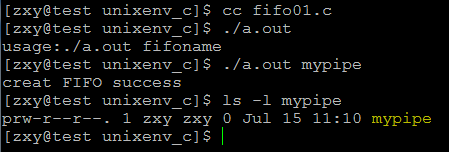
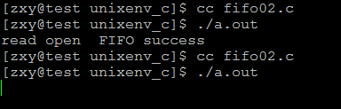
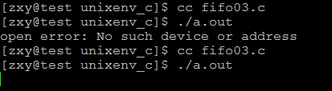
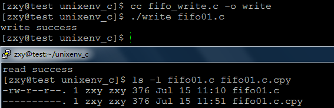

# linux系統編程之管道（三）：命令管道（FIFO)


##一，匿名管道PIPE侷限性
管道的主要侷限性正體現在它的特點上：

- 只支持單向數據流；
- 只能用於具有親緣關係的進程之間；
- 沒有名字；
- 管道的緩衝區是有限的（管道制存在於內存中，在管道創建時，為緩衝區分配一個頁面大小）；
- 管道所傳送的是無格式字節流，這就要求管道的讀出方和寫入方必須事先約定好數據的格式，比如多少字節算作一個消息（或命令、或記錄）等等；

如果我們想在不相關的進程之間交換數據，可以使用FIFO文件來做這項工作，它經常被稱為命名管道，是一種特殊類型的文件。

##二，命名管道FIFO。
###2.1 有名管道相關的關鍵概念
管 道應用的一個重大限制是它沒有名字，因此，只能用於具有親緣關係的進程間通信，在有名管道（named pipe或FIFO）提出後，該限制得到了克服。FIFO不同於管道之處在於它提供一個路徑名與之關聯，以FIFO的文件形式存在於文件系統中。這樣，即 使與FIFO的創建進程不存在親緣關係的進程，只要可以訪問該路徑，就能夠彼此通過FIFO相互通信（能夠訪問該路徑的進程以及FIFO的創建進程之 間），因此，通過FIFO不相關的進程也能交換數據。值得注意的是，FIFO嚴格遵循先進先出（first in first out），對管道及FIFO的讀總是從開始處返回數據，對它們的寫則把數據添加到末尾。它們不支持諸如lseek()等文件定位操作。

###2.2有名管道的創建
命名管道可以從命令行上創建，命令行方法是使用下面這個命令：

$ mkfifo filename

命名管道也可以從程序裡創建，相關函數有：

```c
#include <sys/types.h>
#include <sys/stat.h>
int mkfifo(const char * pathname, mode_t mode)
```

該函數的第一個參數是一個普通的路徑名，也就是創建 後FIFO的名字。第二個參數與打開普通文件的open()函數中的mode 參數相同。 如果mkfifo的第一個參數是一個已經存在的路徑名時，會返回EEXIST錯誤，所以一般典型的調用代碼首先會檢查是否返回該錯誤，如果確實返回該錯 誤，那麼只要調用打開FIFO的函數就可以了。一般文件的I/O函數都可以用於FIFO，如close、read、write等等。

man幫助說明：

```c
DESCRIPTION        
       mkfifo() makes a FIFO special file with name pathname.  mode
       specifies the FIFO's permissions.  It is modified by the process's
       umask in the usual way: the permissions of the created file are (mode
       & ~umask).

       A FIFO special file is similar to a pipe, except that it is created
       in a different way.  Instead of being an anonymous communications
       channel, a FIFO special file is entered into the file system by
       calling mkfifo().

       Once you have created a FIFO special file in this way, any process
       can open it for reading or writing, in the same way as an ordinary
       file.  However, it has to be open at both ends simultaneously before
       you can proceed to do any input or output operations on it.  Opening
       a FIFO for reading normally blocks until some other process opens the
       same FIFO for writing, and vice versa.  See fifo(7) for nonblocking
       handling of FIFO special files.
RETURN VALUE        
       On success mkfifo() returns 0.  In the case of an error, -1 is
       returned (in which case, errno is set appropriately).
 
```

###2.3有名管道的打開規則（與匿名管道一樣）

FIFO（命名管道）與pipe（匿名管道）之間唯一的區別在它們創建與打開的方式不同，一量這些工作完成之後，它們具有相同的語義。

man幫助說明：The only difference between pipes and FIFOs is the manner in which they are created and opened. Once these tasks have been accomplished, I/O on pipes and FIFOs has exactly the same semantics。

有名管道比管道多了一個打開操作：open。

FIFO的打開規則：

`如果當前打開操作是為讀而打開FIFO時，若已經有相應進程為寫而打開該FIFO，則當前打開操作將成功返回；否則，可能阻塞直到有相應進程為寫而打開該FIFO（當前打開操作設置了阻塞標誌）；或者，成功返回（當前打開操作沒有設置阻塞標誌）。`

`如果當前打開操作是為寫而打開FIFO時，如果已經有相應進程為讀而打開該FIFO，則當前打開操作將成功返回；否則，可能阻塞直到有相應進程為讀而打開該FIFO（當前打開操作設置了阻塞標誌）；或者，返回ENXIO錯誤（當前打開操作沒有設置阻塞標誌）。`

###2.4有名管道的讀寫規則
####從FIFO中讀取數據：

約定：如果一個進程為了從FIFO中讀取數據而阻塞打開FIFO，那麼稱該進程內的讀操作為設置了阻塞標誌的讀操作。

- 如果有進程寫打開FIFO，且當前FIFO內沒有數據，則對於設置了阻塞標誌的讀操作來說，將一直阻塞。對於沒有設置阻塞標誌讀操作來說則返回-1，當前errno值為EAGAIN，提醒以後再試。

- 對於設置了阻塞標誌的讀操作說，造成阻塞的原因有兩種：當前FIFO內有數據，但有其它進程在讀這些數據；另外就是FIFO內沒有數據。解阻塞的原因則是FIFO中有新的數據寫入，不論信寫入數據量的大小，也不論讀操作請求多少數據量。

- 讀打開的阻塞標誌只對本進程第一個讀操作施加作用，如果本進程內有多個讀操作序列，則在第一個讀操作被喚醒並完成讀操作後，其它將要執行的讀操作將不再阻塞，即使在執行讀操作時，FIFO中沒有數據也一樣（此時，讀操作返回0）。

- 如果沒有進程寫打開FIFO，則設置了阻塞標誌的讀操作會阻塞。
注：如果FIFO中有數據，則設置了阻塞標誌的讀操作不會因為FIFO中的字節數小於請求讀的字節數而阻塞，此時，讀操作會返回FIFO中現有的數據量。

####向FIFO中寫入數據：

約定：如果一個進程為了向FIFO中寫入數據而阻塞打開FIFO，那麼稱該進程內的寫操作為設置了阻塞標誌的寫操作。

對於設置了阻塞標誌的寫操作：

- 當要寫入的數據量不大於PIPE_BUF時，linux將保證寫入的原子性。如果此時管道空閒緩衝區不足以容納要寫入的字節數，則進入睡眠，直到當緩衝區中能夠容納要寫入的字節數時，才開始進行一次性寫操作。

- 當要寫入的數據量大於PIPE_BUF時，linux將不再保證寫入的原子性。FIFO緩衝區一有空閒區域，寫進程就會試圖向管道寫入數據，寫操作在寫完所有請求寫的數據後返回。
對於沒有設置阻塞標誌的寫操作：

- 當要寫入的數據量大於PIPE_BUF時，linux將不再保證寫入的原子性。在寫滿所有FIFO空閒緩衝區後，寫操作返回。

- 當要寫入的數據量不大於PIPE_BUF時，linux將保證寫入的原子性。如果當前FIFO空閒緩衝區能夠容納請求寫入的字節數，寫完後成功返回；如果當前FIFO空閒緩衝區不能夠容納請求寫入的字節數，則返回EAGAIN錯誤，提醒以後再寫；

## 三，FIFO使用
示例一：創建FIFO文件

```c
#include <stdio.h>
#include <unistd.h>
#include <stdlib.h>
#include <sys/stat.h>
#include <sys/types.h>

int main(int argc, char **argv)
{
    if(argc != 2){
        fprintf(stderr,"usage:%s fifoname\n",argv[0]);
        exit(EXIT_FAILURE);
    }
    if(mkfifo(argv[1],0644) == -1){
        perror("mkfifo error");
        exit(EXIT_FAILURE);
    }
    printf("creat FIFO success\n");
    return 0;
}
```




示例二：`如果當前打開操作是為讀而打開FIFO時，若已經有相應進程為寫而打開該FIFO，則當前打開操作將成功返回；否則，可能阻塞直到有相應進程為寫而打開該FIFO（當前打開操作設置了阻塞標誌）；或者，成功返回（當前打開操作沒有設置阻塞標誌）。`

```c
#include <stdio.h>
#include <unistd.h>
#include <stdlib.h>
#include <sys/stat.h>
#include <sys/types.h>
#include <fcntl.h>

int main(int argc, char **argv)
{

    int fd;
    
    //fd = open("mypipe",O_RDONLY| O_NONBLOCK);//非阻塞模式打開
    fd = open("mypipe",O_RDONLY);//默認是阻塞模式打開
    if(fd == -1){
        perror("open error");
        exit(EXIT_FAILURE);
    }
    printf("read open  FIFO success\n");
    return 0;
}
```

結果：



第一次以非阻塞打開

第二次以阻塞模式打開

示例三：`如果當前打開操作是為寫而打開FIFO時，如果已經有相應進程為讀而打開該FIFO，則當前打開操作將成功返回；否則，可能阻塞直到有相應進程為讀而打開該FIFO（當前打開操作設置了阻塞標誌）；或者，返回ENXIO錯誤（當前打開操作沒有設置阻塞標誌）。`

```c
#include <stdio.h>
#include <unistd.h>
#include <stdlib.h>
#include <sys/stat.h>
#include <sys/types.h>
#include <fcntl.h>

int main(int argc, char **argv)
{

    int fd;
    
    //fd = open("mypipe",O_WRONLY| O_NONBLOCK);//非阻塞模式打開
    fd = open("mypipe",O_WRONLY);//默認是阻塞模式打開
    if(fd == -1){
        perror("open error");
        exit(EXIT_FAILURE);
    }
    printf("read open  FIFO success\n");
    return 0;
}
```
結果：




第一次以非阻塞模式打開

第二次以阻塞模式打開

示例四：不同進程間利用命名管道實現文件複製

#### 寫管道進程：

```c
#include <stdio.h>
#include <unistd.h>
#include <stdlib.h>
#include <sys/stat.h>
#include <sys/types.h>
#include <fcntl.h>

int main(int argc, char **argv)
{
    if(argc != 2){
        fprintf(stderr,"usage:%s srcfile\n",argv[0]);
        exit(EXIT_FAILURE);
    }
    int infd;
    infd = open(argv[1],O_RDONLY);
    if(infd == -1){
        perror("open error");
        exit(EXIT_FAILURE);
    }

    if(mkfifo("tmpfifo",0644) == -1){
        perror("mkfifo error");
        exit(EXIT_FAILURE);
    }
    int fd ;
    fd = open("tmpfifo",O_WRONLY);
    if(fd == -1){
        perror("open error");
        exit(EXIT_FAILURE);
    }
    char buf[1024*4];
    int n = 0;
    while((n = read(infd,buf,1024*4))){
        write(fd,buf,n);
    }
    close(infd);
    close(fd);
    printf("write success\n");
    return 0;
}
```

#### 讀進程：

```c
#include <stdio.h>
#include <unistd.h>
#include <stdlib.h>
#include <sys/stat.h>
#include <sys/types.h>
#include <fcntl.h>

int main(int argc, char **argv)
{
    if(argc != 2){
        fprintf(stderr,"usage:%s desfile\n",argv[0]);
        exit(EXIT_FAILURE);
    }
    int outfd;
    outfd = open(argv[1],O_WRONLY|O_CREAT|O_TRUNC);
    if(outfd == -1){
        perror("open error");
        exit(EXIT_FAILURE);
    }

    int fd ;
    fd = open("tmpfifo",O_RDONLY);
    if(fd == -1){
        perror("open error");
        exit(EXIT_FAILURE);
    }
    char buf[1024*4];
    int n = 0;
    while((n = read(fd,buf,1024*4))){
        write(outfd,buf,n);
    }
    close(fd);
    close(outfd);
    unlink("tmpfifo");
    printf("read success\n");
    return 0;
}
```

結果：



複製成功！
