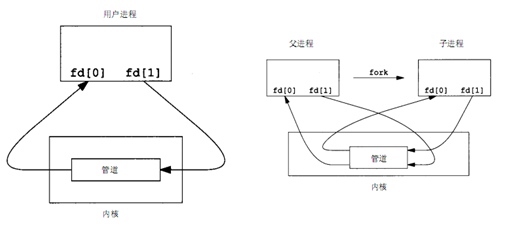
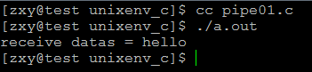
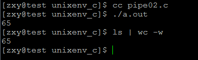

# linux系統編程之管道（一）：匿名管道（pipe)


##一，什麼是管道
管道是Linux支持的最初Unix IPC形式之一，具有以下特點：

`管道是半雙工的，數據只能向一個方向流動；需要雙方通信時，需要建立起兩個管道`；
只能用於父子進程或者兄弟進程之間（具有親緣關係的進程）；
單獨構成一種獨立的文件系統：管道對於管道兩端的進程而言，就是一個文件，但它不是普通的文件，它不屬於某種文件系統，而是自立門戶，單獨構成一種文件系統，並且只存在與內存中。
數據的讀出和寫入：一個進程向管道中寫的內容被管道另一端的進程讀出。寫入的內容每次都添加在管道緩衝區的末尾，並且每次都是從緩衝區的頭部讀出數據。
管道的實現機制：

`管道是由內核管理的一個緩衝區`，相當於我們放入內存中的一個紙條。管道的一端連接一個進程的輸出。這個進程會向管道中放入信息。管道的另一端連接一個進程的輸入，這個進程取出被放入管道的信息。一個緩衝區不需要很大，它被設計成為環形的數據結構，以便管道可以被循環利用。當管道中沒有信息的話，從管道中讀取的進程會等待，直到另一端的進程放入信息。當管道被放滿信息的時候，嘗試放入信息的進程會等待，直到另一端的進程取出信息。當兩個進程都終結的時候，管道也自動消失。

##二，管道的創建（pipe）
包含頭文件<unistd.h>

功能:創建一無名管道

原型：

```c
int pipe(int fd[2]);
```

參數：

fd：文件描述符數組,其中fd[0]表示讀端, fd[1]表示寫端
返回值:成功返回0，失敗返回錯誤代碼

man幫助說明：

```c
DESCRIPTION       
       pipe() creates a pipe, a unidirectional data channel that can be used
       for interprocess communication.  The array pipefd is used to return
       two file descriptors referring to the ends of the pipe.  pipefd[0]
       refers to the read end of the pipe.  pipefd[1] refers to the write
       end of the pipe.  Data written to the write end of the pipe is
       buffered by the kernel until it is read from the read end of the
       pipe.  For further details, see pipe(7).

```


該函數創建的管道的兩端處於一個進程中間，在實際應 用中沒有太大意義，因此，一個進程在由pipe()創建管道後，一般再fork一個子進程，然後通過管道實現父子進程間的通信（因此也不難推出，只要兩個 進程中存在親緣關係，這裡的親緣關係指的是具有共同的祖先，都可以採用管道方式來進行通信）。父子進程間具有相同的文件描述符，且指向同一個管道pipe，其他沒有關係的進程不能獲得pipe（）產生的兩個文件描述符，也就不能利用同一個管道進行通信。
創建管道後示意圖：





##三，利用管道進行父子進程間數據傳輸
示例一：子進程向管道中寫數據，父進程從管道中讀出數據

```c
#include <stdio.h>
#include <unistd.h>
#include <stdlib.h>
#include <fcntl.h> 

int main(void)
{
    int fds[2];
    if(pipe(fds) == -1){
        perror("pipe error");
        exit(EXIT_FAILURE);
    }
    pid_t pid;
    pid = fork();
    if(pid == -1){
        perror("fork error");
        exit(EXIT_FAILURE);
    }
    if(pid == 0){
        close(fds[0]);//子進程關閉讀端
        write(fds[1],"hello",5);
        exit(EXIT_SUCCESS);
    }

    close(fds[1]);//父進程關閉寫端
    char buf[10] = {0};
    read(fds[0],buf,10);
    printf("receive datas = %s\n",buf);
    return 0;
}
```

結果：



示例二：利用管道實現ls |wc –w功能


```c
#include <stdio.h>
#include <unistd.h>
#include <stdlib.h>
#include <fcntl.h> 

int main(void)
{
    int fds[2];
    if(pipe(fds) == -1){
        perror("pipe error");
        exit(EXIT_FAILURE);
    }
    pid_t pid;
    pid = fork();
    if(pid == -1){
        perror("fork error");
        exit(EXIT_FAILURE);
    }
    if(pid == 0){
        
        dup2(fds[1],STDOUT_FILENO);//複製文件描述符且指定新複製的fd為標準輸出
        close(fds[0]);//子進程關閉讀端
        close(fds[1]);
        execlp("ls","ls",NULL);
        fprintf(stderr,"exec error\n");
        exit(EXIT_FAILURE);
    }

    dup2(fds[0],STDIN_FILENO);
    close(fds[1]);//父進程關閉寫端
    close(fds[0]);
    execlp("wc","wc","-w",NULL);
    fprintf(stderr, "error execute wc\n");
    exit(EXIT_FAILURE);
}
```

結果：

