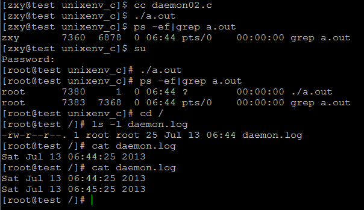
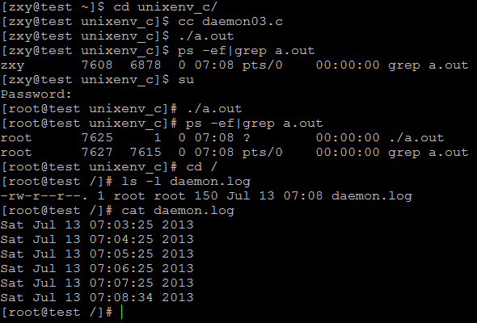
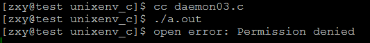

# linux系統編程之進程（八）：守護進程詳解及創建，daemon()使用


## 一，守護進程概述
Linux Daemon（守護進程）是運行在後臺的一種特殊進程。它獨立於控制終端並且週期性地執行某種任務或等待處理某些發生的事件。它不需要用戶輸入就能運行而且提供某種服務，不是對整個系統就是對某個用戶程序提供服務。Linux系統的大多數服務器就是通過守護進程實現的。常見的守護進程包括系統日誌進程syslogd、 web服務器httpd、郵件服務器sendmail和數據庫服務器mysqld等。

守護進程一般在系統啟動時開始運行，除非強行終止，否則直到系統關機都保持運行。守護進程經常以超級用戶（root）權限運行，因為它們要使用特殊的端口（1-1024）或訪問某些特殊的資源。

一個守護進程的父進程是init進程，因為它真正的父進程在fork出子進程後就先於子進程exit退出了，所以它是一個由init繼承的孤兒進程。守護進程是非交互式程序，沒有控制終端，所以任何輸出，無論是向標準輸出設備stdout還是標準出錯設備stderr的輸出都需要特殊處理。

守護進程的名稱通常以d結尾，比如sshd、xinetd、crond等

## 二，創建守護進程步驟
首先我們要了解一些基本概念：

進程組 ：

- 每個進程也屬於一個進程組
- 每個進程主都有一個進程組號，該號等於該進程組組長的PID號 .
- 一個進程只能為它自己或子進程設置進程組ID號
會話期：

會話期(session)是一個或多個進程組的集合。

setsid()函數可以建立一個對話期：

`如果，調用setsid的進程不是一個進程組的組長，此函數創建一個新的會話期。`

- (1)此進程變成該對話期的首進程

- (2)此進程變成一個新進程組的組長進程。

- (3)此進程沒有控制終端，如果在調用setsid前，該進程有控制終端，那麼與該終端的聯繫被解除。 如果該進程是一個進程組的組長，此函數返回錯誤。

- (4)為了保證這一點，我們先調用fork()然後exit()，此時只有子進程在運行

現在我們來給出創建守護進程所需步驟：

編寫守護進程的一般步驟步驟：

- （1）在父進程中執行fork並exit推出；

- （2）在子進程中調用setsid函數創建新的會話；

- （3）在子進程中調用chdir函數，讓根目錄 ”/” 成為子進程的工作目錄；

- （4）在子進程中調用umask函數，設置進程的umask為0；

- （5）在子進程中關閉任何不需要的文件描述符

說明：

-  在後臺運行。 
    - 為避免掛起控制終端將Daemon放入後臺執行。方法是在進程中調用fork使父進程終止，讓Daemon在子進程中後臺執行。 
if(pid=fork()) 
exit(0);//是父進程，結束父進程，子進程繼續 
- 脫離控制終端，登錄會話和進程組 
    - 有必要先介紹一下Linux中的進程與控制終端，登錄會話和進程組之間的關係：進程屬於一個進程組，進程組號（GID）就是進程組長的進程號（PID）。登錄會話可以包含多個進程組。這些進程組共享一個控制終端。這個控制終端通常是創建進程的登錄終端。 
控制終端，登錄會話和進程組通常是從父進程繼承下來的。我們的目的就是要擺脫它們，使之不受它們的影響。方法是在第1點的基礎上，調用setsid()使進程成為會話組長： 
setsid(); 
說明：當進程是會話組長時setsid()調用失敗。但第一點已經保證進程不是會話組長。setsid()調用成功後，進程成為新的會話組長和新的進程組長，並與原來的登錄會話和進程組脫離。由於會話過程對控制終端的獨佔性，進程同時與控制終端脫離。 
- 禁止進程重新打開控制終端 
    - 現在，進程已經成為無終端的會話組長。但它可以重新申請打開一個控制終端。可以通過使進程不再成為會話組長來禁止進程重新打開控制終端： 
```c
if(pid=fork()) 
exit(0);//結束第一子進程，第二子進程繼續（第二子進程不再是會話組長） 
```

- 關閉打開的文件描述符 
    - 進程從創建它的父進程那裡繼承了打開的文件描述符。如不關閉，將會浪費系統資源，造成進程所在的文件系統無法卸下以及引起無法預料的錯誤。按如下方法關閉它們： 
```c
for(i=0;i 關閉打開的文件描述符close(i);> 
```

- 改變當前工作目錄 
    - 進程活動時，其工作目錄所在的文件系統不能卸下。一般需要將工作目錄改變到根目錄。對於需要轉儲核心，寫運行日誌的進程將工作目錄改變到特定目錄如/tmpchdir("/") 
- 重設文件創建掩模 
    - 進程從創建它的父進程那裡繼承了文件創建掩模。它可能修改守護進程所創建的文件的存取位。為防止這一點，將文件創建掩模清除：umask(0); 
- 處理SIGCHLD信號 
    - 處理SIGCHLD信號並不是必須的。但對於某些進程，特別是服務器進程往往在請求到來時生成子進程處理請求。如果父進程不等待子進程結束，子進程將成為殭屍進程（zombie）從而佔用系統資源。如果父進程等待子進程結束，將增加父進程的負擔，影響服務器進程的併發性能。在Linux下可以簡單地將SIGCHLD信號的操作設為SIG_IGN。 
signal(SIGCHLD,SIG_IGN); 
這樣，內核在子進程結束時不會產生殭屍進程。這一點與BSD4不同，BSD4下必須顯式等待子進程結束才能釋放殭屍進程。

##三，創建守護進程
在創建之前我們先了解setsid()使用：

```c
#include <unistd.h>

pid_t setsid(void);
```
```c
DESCRIPTION 
       setsid()  creates a new session if the calling process is not a process 
       group leader.  The calling process is the leader of  the  new  session, 
       the  process group leader of the new process group, and has no control- 
       ling tty.  The process group ID and session ID of the  calling  process 
       are set to the PID of the calling process.  The calling process will be 
       the only process in this new process group and in this new session.

```

//調用進程必須是非當前進程組組長，調用後，產生一個新的會話期，且該會話期中只有一個進程組，且該進程組組長為調用進程，沒有控制終端，新產生的group ID 和 session ID 被設置成調用進程的PID

```c
RETURN VALUE 
       On success, the (new) session ID of the calling  process  is  returned. 
       On  error,  (pid_t) -1  is  returned,  and errno is set to indicate the 
       error.
```

現在根據上述步驟創建一個守護進程：

以下程序是創建一個守護進程，然後利用這個守護進程每個一分鐘向daemon.log文件中寫入當前時間

```c
#include <stdio.h>
#include <unistd.h>
#include <stdlib.h>
#include <time.h>
#include <fcntl.h>
#include <string.h>
#include <sys/stat.h>

#define ERR_EXIT(m) \
do\
{\
    perror(m);\
    exit(EXIT_FAILURE);\
}\
while (0);\

void creat_daemon(void);
int main(void)
{
    time_t t;
    int fd;
    creat_daemon();
    while(1){
        fd = open("daemon.log",O_WRONLY|O_CREAT|O_APPEND,0644);
        if(fd == -1)
            ERR_EXIT("open error");
        t = time(0);
        char *buf = asctime(localtime(&t));
        write(fd,buf,strlen(buf));
        close(fd);
        sleep(60);
            
    }
    return 0;
}
void creat_daemon(void)
{
    pid_t pid;
    pid = fork();
    if( pid == -1)
        ERR_EXIT("fork error");
    if(pid > 0 )
        exit(EXIT_SUCCESS);
    if(setsid() == -1)
        ERR_EXIT("SETSID ERROR");
    chdir("/");
    int i;
    for( i = 0; i < 3; ++i)
    {
        close(i);
        open("/dev/null", O_RDWR);
        dup(0);
        dup(0);
    }
    umask(0);
    return;
}
```
結果：



結果顯示：當我一普通用戶執行a.out時，進程表中並沒有出現新創建的守護進程，但當我以root用戶執行時，成功了，並在/目錄下創建了daemon.log文件，cat查看後確實每個一分鐘寫入一次。為什麼只能root執行，那是因為當我們創建守護進程時，已經將當前目錄切換我/目錄，所以當我之後創建daemon.log文件是其實是在/目錄下，那肯定不行，因為普通用戶沒有權限，或許你會問那為啥沒報錯呢？其實是有出錯，只不過我們在創建守護進程時已經將標準輸入關閉並重定向到/dev/null，所以看不到錯誤信息。

四，利用庫函數daemon()創建守護進程


其實我們完全可以利用daemon()函數創建守護進程，其函數原型：

```c
#include <unistd.h>

int daemon(int nochdir, int noclose);
```

```c
DESCRIPTION 
       The daemon() function is for programs wishing to detach themselves from 
       the controlling terminal and run in the background as system daemons.

       If nochdir is zero, daemon()  changes  the  process’s  current  working 
       directory to the root directory ("/"); otherwise,

       If  noclose is zero, daemon() redirects standard input, standard output 
       and standard error to /dev/null; otherwise,  no  changes  are  made  to 
       these file descriptors. 

```

功能：創建一個守護進程

參數：

nochdir：=0將當前目錄更改至“/”

noclose：=0將標準輸入、標準輸出、標準錯誤重定向至“/dev/null”

返回值：

成功：0

失敗：-1

現在我們利用daemon()改寫剛才那個程序：

```c
#include <stdio.h>
#include <unistd.h>
#include <stdlib.h>
#include <time.h>
#include <fcntl.h>
#include <string.h>
#include <sys/stat.h>

#define ERR_EXIT(m) \
do\
{\
    perror(m);\
    exit(EXIT_FAILURE);\
}\
while (0);\

void creat_daemon(void);
int main(void)
{
    time_t t;
    int fd;
    if(daemon(0,0) == -1)
        ERR_EXIT("daemon error");
    while(1){
        fd = open("daemon.log",O_WRONLY|O_CREAT|O_APPEND,0644);
        if(fd == -1)
            ERR_EXIT("open error");
        t = time(0);
        char *buf = asctime(localtime(&t));
        write(fd,buf,strlen(buf));
        close(fd);
        sleep(60);
            
    }
    return 0;
}
```
當daemon(0,0)時：



結果同剛才一樣，也是隻有root才能成功，普通用戶執行時看不到錯誤信息

現在讓daemon(0,1)，就是不關閉標準輸入輸出結果：



這次普通用戶執行成功了，以為沒有切換到/目錄下，有權限

其實我們可以利用我們剛才寫的創建守護進程程序默認daemon()實現：

代碼如下：

```c
#include <stdio.h>
#include <unistd.h>
#include <stdlib.h>
#include <time.h>
#include <fcntl.h>
#include <string.h>
#include <sys/stat.h>

#define ERR_EXIT(m) \
do\
{\
    perror(m);\
    exit(EXIT_FAILURE);\
}\
while (0);\

void creat_daemon(int nochdir, int noclose);
int main(void)
{
    time_t t;
    int fd;
    creat_daemon(0,0);
    while(1){
        fd = open("daemon.log",O_WRONLY|O_CREAT|O_APPEND,0644);
        if(fd == -1)
            ERR_EXIT("open error");
        t = time(0);
        char *buf = asctime(localtime(&t));
        write(fd,buf,strlen(buf));
        close(fd);
        sleep(60);
            
    }
    return 0;
}
void creat_daemon(int nochdir, int noclose)
{
    pid_t pid;
    pid = fork();
    if( pid == -1)
        ERR_EXIT("fork error");
    if(pid > 0 )
        exit(EXIT_SUCCESS);
    if(setsid() == -1)
        ERR_EXIT("SETSID ERROR");
    if(nochdir == 0)
        chdir("/");
    if(noclose == 0){
            int i;
    for( i = 0; i < 3; ++i)
    {
        close(i);
        open("/dev/null", O_RDWR);
        dup(0);
        dup(0);
    }

    umask(0);
    return;
}
```