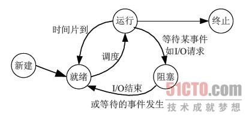
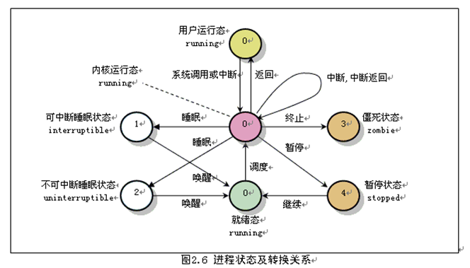

# linux系統編程之進程（二）：進程生命週期與PCB（進程控制塊）


- 本節目標：
    - 進程狀態變遷
    - 進程控制塊
    - 進程創建
    - 進程撤消
    - 終止進程的五種方法

## 一，進程狀態變遷
進程的三種基本狀態

- `就緒(Ready)狀態`
    - 當進程已分配到除CPU以外的所有必要的資源，只要獲得處理機便可立即執行，這時的進程狀態稱為就緒狀態。

- `執行（Running）狀態` 
    - 當進程已獲得處理機，其程序正在處理機上執行，此時的進程狀態稱為執行狀態。

- `阻塞(Blocked)狀態`
    - 正在執行的進程，由於等待某個事件發生而無法執行時，便放棄處理機而處於阻塞狀態。引起進程阻塞的事件可有多種，例如，等待I/O完成、申請緩衝區不能滿足、等待信件(信號)等。

狀態轉換圖：



一個進程在運行期間，不斷地從一種狀態轉換到另一種狀態，它可以多次處於就緒狀態和執行狀態，也可以多次處於阻塞狀態。

```c
(1) 就緒→執行 
處於就緒狀態的進程，當進程調度程序為之分配了處理機後，該進程便由就緒狀態轉變成執行狀態。

(2) 執行→就緒 
處於執行狀態的進程在其執行過程中，因分配給它的一個時間片已用完或更高優先級的進程搶佔而不得不讓出處理機，於是進程從執行狀態轉變成就緒狀態。

(3) 執行→阻塞 
正在執行的進程因等待某種事件發生而無法繼續執行時，便從執行狀態變成阻塞狀態。

(4) 阻塞→就緒 
處於阻塞狀態的進程，若其等待的事件已經發生，於是進程由阻塞狀態轉變為就緒狀態。

(5) 運行→終止

程序執行完畢，撤銷而終止
```


 

以上是最經典也是最基本的三種進程狀態，但現在的操作系統都根據需要重新設計了一些新的狀態。

- 如linux：
    - 運行狀態（TASK_RUNNING）：是運行態和就緒態的合併，表示進程正在運行或準備運行，Linux 中使用TASK_RUNNING 宏表示此狀態
    
    - 可中斷睡眠狀態（淺度睡眠）（TASK_INTERRUPTIBLE）：進程正在睡眠（被阻塞），等待資源到來是喚醒，也可以通過其他進程信號或時鐘中斷喚醒，進入運行隊列。Linux 使用TASK_INTERRUPTIBLE 宏表示此狀態。
    
    - 不可中斷睡眠狀態（深度睡眠狀態）（TASK_UNINTERRUPTIBLE）：
    其和淺度睡眠基本類似，但有一點就是不可被其他進程信號或時鐘中斷喚醒。Linux 使用TASK_UNINTERRUPTIBLE 宏表示此狀態。
    
    - 暫停狀態（TASK_STOPPED）：進程暫停執行接受某種處理。如正在接受調試的進程處於這種狀態，Linux 使用TASK_STOPPED 宏表示此狀態。
    
    - 僵死狀態（TASK_ZOMBIE）：進程已經結束但未釋放PCB，Linux 使用TASK_ZOMBIE 宏表示此狀態
    
狀態轉換圖如下：



就緒態在支持虛擬內存的操作系統中可能分為：在內存中就緒和在交換空間就緒，因為支持虛擬內存的操作系統會將當前不太活躍的一些進程交換到交換空間，交換空間就緒進程要運行要先換人內存出入內存就緒態，在由cpu調度執行。

## 二，進程控制塊（PCB)
- `進程控制塊包括：`
    - 進程描述信息：
        -進程標識符用於唯一的標識一個進程（pid，ppid）。
    - 進程控制信息：
        - 進程當前狀態
        - 進程優先級
        - 程序開始地址
        - 各種計時信息
        - 通信信息
    - 資源信息：
        - 佔用內存大小及管理用數據結構指針
        - 交換區相關信息
        - I/O設備號、緩衝、設備相關的數結構
        - 文件系統相關指針
    - 現場保護信息（cpu進行進程切換時）：
        - 寄存器
        - PC
        - 程序狀態字PSW
        - 棧指針
    - 進程標識：PID
        - 每個進程都會分配到一個獨一無二的數字編號，我們稱之為“進程標識”(process identifier),或者就直接叫它PID.
        - 是一個正整數，取值範圍從2到32768
             可以通過：cat /proc/sys/kernel/pid_max 查看系統支持多少進程
        - 當一個進程被啟動時，它會順序挑選下一個未使用的編號數字做為自己的PID
        - 數字1一般為特殊進程init保留的
         init進程實際上是用戶進程，它是一個程序，在/sbin/init，linux啟動的第一個進程
        實際上linux中還存在0號進程（內核進程），它是一個空閒進程，它進行空閒資源的統計及交換空間的換入換出，1（init）進程是由0號進程創建的。

 

##三，進程創建
- 不同的操作系統所提供的進程創建原語的名稱和格式不盡相同，但執行創建進程原語後，- 操作系統所做的工作卻大致相同，都包括以下幾點：
- 給新創建的進程分配一個內部標識（pcb），在內核中建立進程結構。
- 複製父進程的環境
- 為進程分配資源， 包括進程映像所需要的所有元素（程序、數據、用戶棧等），
- 複製父進程地址空間的內容到該進程地址空間中。
- 置該進程的狀態為就緒，插入就緒隊列。
 

## 四，進程撤銷
- 進程終止時操作系統做以下工作：
    - 關閉軟中斷:因為進程即將終止而不再處理任何軟中斷信號；
    - 回收資源：釋放進程分配的所有資源，如關閉所有已打開文件，釋放進程相應的數據結構等；
    - 寫記帳信息：將進程在運行過程中所產生的記帳數據（其中包括進程運行時的各種統計信息）記錄到一個全局記帳文件中；
    - 置該進程為僵死狀態:向父進程發送子進程死的軟中斷信號，將終止信息status送到指定的存儲單元中；
    - 轉進程調度:因為此時CPU已經被釋放，需要由進程調度進行CPU再分配。
    
## 五，終止進程的五種方法
- 從main函數返回：從return返回，執行完畢退出
- 調用exit：C函數庫，實際上也是調用系統調用_exit完成的，在任何一個函數調用exit函數都可使得進程撤銷
- 調用_exit：系統調用
- 調用abort：調用abort()函數使得進程終止，實際上該函數是產生一個SIGABRT信號，
- 由信號終止：發送一些信號如SINGINT等信號