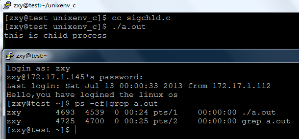
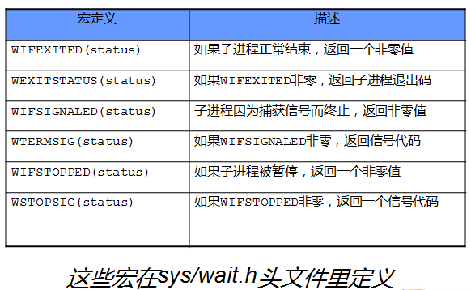
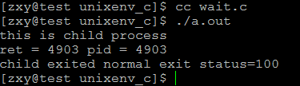
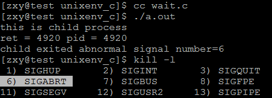
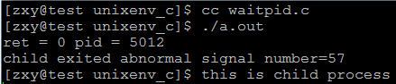

# linux系统编程之进程（六）：父进程查询子进程的退出,wait,waitpid


- 本节目标：
    - 僵进程
    - SIGCHLD
    - wait
    - waitpid


##一，僵尸进程
当一个子进程先于父进程结束运行时，它与其父进程之间的关联还会保持到父进程也正常地结束运行，或者父进程调用了wait才告终止。

子进程退出时，内核将子进程置为僵尸状态，这个进程称为僵尸进程，它只保留最小的一些内核数据结构，以便父进程查询子进程的退出状态。

进程表中代表子进程的数据项是不会立刻释放的，虽然不再活跃了，可子进程还停留在系统里，因为它的退出码还需要保存起来以备父进程中后续的wait调用使用。它将称为一个“僵进程”。

##二，如何避免僵尸进程
调用wait或者waitpid函数查询子进程退出状态，此方法父进程会被挂起。
如果不想让父进程挂起，可以在父进程中加入一条语句：signal(SIGCHLD,SIG_IGN);表示父进程忽略SIGCHLD信号，该信号是子进程退出的时候向父进程发送的。

## 三，SIGCHLD信号
当子进程退出的时候，内核会向父进程发送SIGCHLD信号，子进程的退出是个异步事件（子进程可以在父进程运行的任何时刻终止）

如果不想让子进程编程僵尸进程可在父进程中加入：signal(SIGCHLD,SIG_IGN);

如果将此信号的处理方式设为忽略，可让内核把僵尸子进程转交给init进程去处理，省去了大量僵尸进程占用系统资源。

示例：

```c
#include <stdio.h>
#include <unistd.h>
#include <signal.h>
#include <stdlib.h>

int main(void)
{
    pid_t pid;
    if(signal(SIGCHLD,SIG_IGN) == SIG_ERR)
    {
        perror("signal error");
        exit(EXIT_FAILURE);
    }
    pid = fork();
    if(pid == -1)
    {
        perror("fork error");
        exit(EXIT_FAILURE);
    }
    if(pid == 0)
    {
        printf("this is child process\n");
        exit(0);
    }
    if(pid > 0)
    {
        sleep(100);
        printf("this is parent process\n");
    }
    return 0;
}
```


可知，虽然子进程先退出了，但进程表中已经不存在子进程的僵尸状态

##四，wait()函数

```c
#include <sys/types.h> 
#include <sys/wait.h>

pid_t wait(int *status);
```

进程一旦调用了wait，就立即阻塞自己，由wait自动分析是否当前进程的某个子进程已经退出，如果让它找到了这样一个已经变成僵尸的子进程，wait就会收集这个子进程的信息，并把它彻底销毁后返回；如果没有找到这样一个子进程，wait就会一直阻塞在这里，直到有一个出现为止。 
参数status用来保存被收集进程退出时的一些状态，它是一个指向int类型的指针。但如果我们对这个子进程是如何死掉的毫不在意，只想把这个僵尸进程消灭掉，（事实上绝大多数情况下，我们都会这样想），我们就可以设定这个参数为NULL，就象下面这样：
```c
pid = wait(NULL);
```
	
如果成功，wait会返回被收集的子进程的进程ID，如果调用进程没有子进程，调用就会失败，此时wait返回-1，同时errno被置为ECHILD。

man帮助：

```c
DESCRIPTION 
       All of these system calls are used to wait for state changes in a child 
       of the calling process, and obtain information about  the  child  whose 
       state  has changed.  A state change is considered to be: the child ter- 
       minated; the child was stopped by a signal; or the child was resumed by 
       a  signal.  In the case of a terminated child, performing a wait allows 
       the system to release the resources associated with  the  child;  if  a 
       wait  is not performed, then the terminated child remains in a "zombie" 
       state (see NOTES below).

       If a child has already changed state, then these calls  return  immedi- 
       ately.   Otherwise  they  block until either a child changes state or a 
       signal handler interrupts the call (assuming that system calls are  not 
       automatically restarted using the SA_RESTART flag of sigaction(2)).  In 
       the remainder of this page, a child whose state has changed  and  which 
       has  not  yet  been  waited upon by one of these system calls is termed 
       waitable. 

wait() ： 
    The wait() system call suspends execution of the calling process  until 
    one  of  its children terminates.  The call wait(&status) is equivalent 
    to:

        waitpid(-1, &status, 0);

If status is not NULL, wait() and waitpid() store status information in 
      the  int  to  which  it points.  This integer can be inspected with the 
      following macros (which take the integer itself as an argument,  not  a 
      pointer to it, as is done in wait() and waitpid()!):

      WIFEXITED(status) 
             returns true if the child terminated normally, that is, by call- 
             ing exit(3) or _exit(2), or by returning from main().

      WEXITSTATUS(status) 
             returns the exit status of the  child.   This  consists  of  the 
             least  significant  8 bits of the status argument that the child 
             specified in a call to exit(3) or _exit(2) or  as  the  argument 
             for  a  return  statement  in main().  This macro should only be 
             employed if WIFEXITED returned true.

      WIFSIGNALED(status) 
             returns true if the child process was terminated by a signal.

    WTERMSIG(status) 
             returns the number of the signal that caused the  child  process 
             to terminate.  This macro should only be employed if WIFSIGNALED 
             returned true.

      WCOREDUMP(status) 
             returns true if the child produced  a  core  dump.   This  macro 
             should  only  be  employed  if  WIFSIGNALED returned true.  This 
             macro is not specified in POSIX.1-2001 and is not  available  on 
             some  Unix  implementations  (e.g.,  AIX, SunOS).  Only use this 
             enclosed in #ifdef WCOREDUMP ... #endif.

      WIFSTOPPED(status) 
             returns true if the child process was stopped by delivery  of  a 
             signal;  this  is  only possible if the call was done using WUN- 
             TRACED or when the child is being traced (see ptrace(2)).

      WSTOPSIG(status) 
             returns the number of the signal which caused the child to stop. 
             This  macro should only be employed if WIFSTOPPED returned true.


   WIFCONTINUED(status) 
       (since Linux 2.6.10) returns  true  if  the  child  process  was 
       resumed by delivery of SIGCONT.

```

- wait系统调用会使父进程暂停执行，直到它的一个子进程结束为止。
- 返回的是子进程的PID，它通常是结束的子进程
- 状态信息允许父进程判定子进程的退出状态，即从子进程的main函数返回的值或子进程中exit语句的退出码。
- 如果status不是一个空指针，状态信息将被写入它指向的位置

可以上述的一些宏判断子进程的退出情况：




示例程序：

```c
#include <stdio.h>
#include <sys/wait.h>
#include <stdlib.h>
#include <unistd.h>

int main(void)
{
    pid_t pid;
    pid = fork();
    if(pid < 0){
        perror("fork error");
        exit(EXIT_FAILURE);
    }
    if(pid == 0){
        printf("this is child process\n");
        exit(100);
    }
    
    int status;
    pid_t ret;
    ret = wait(&status);
    if(ret <0){
        perror("wait error");
        exit(EXIT_FAILURE);
    }
        printf("ret = %d pid = %d\n", ret, pid);
    if (WIFEXITED(status))
        printf("child exited normal exit status=%d\n", WEXITSTATUS(status));

    else if (WIFSIGNALED(status))
        printf("child exited abnormal signal number=%d\n", WTERMSIG(status));
    else if (WIFSTOPPED(status))
        printf("child stoped signal number=%d\n", WSTOPSIG(status));
    return 0;
}
```
结果：



当子进程正常退出时wait返回子进程pid，且WIFEXITED(status)验证为真，可以WEXITSTATUS(status）获得返回状态码

示例2：

```c
#include <stdio.h>
#include <sys/wait.h>
#include <stdlib.h>
#include <unistd.h>

int main(void)
{
    pid_t pid;
    pid = fork();
    if(pid < 0){
        perror("fork error");
        exit(EXIT_FAILURE);
    }
    if(pid == 0){
        printf("this is child process\n");
        //exit(100);
        abort();
    }
    
    int status;
    pid_t ret;
    ret = wait(&status);
    if(ret <0){
        perror("wait error");
        exit(EXIT_FAILURE);
    }
        printf("ret = %d pid = %d\n", ret, pid);
    if (WIFEXITED(status))
        printf("child exited normal exit status=%d\n", WEXITSTATUS(status));

    else if (WIFSIGNALED(status))
        printf("child exited abnormal signal number=%d\n", WTERMSIG(status));
    else if (WIFSTOPPED(status))
        printf("child stoped signal number=%d\n", WSTOPSIG(status));
    return 0;
}
```
结果：



当子进程异常退出时，WIFSIGNALED(status）为真，可用WTERMSIG(status)获得信号

五，waitpid()函数

```c
#include <sys/types.h> 
#include <sys/wait.h>

pid_t waitpid(pid_t pid, int *status, int options);
```

参数:

status:如果不是空，会把状态信息写到它指向的位置，与wait一样

options：允许改变waitpid的行为，最有用的一个选项是WNOHANG,它的作用是防止waitpid把调用者的执行挂起

```c
The value of options is an OR of zero or more  of  the  following  con- 
stants:

WNOHANG     return immediately if no child has exited.

WUNTRACED   also  return  if  a  child  has stopped (but not traced via 
            ptrace(2)).  Status for traced children which have  stopped 
            is provided even if this option is not specified.

WCONTINUED (since Linux 2.6.10) 
            also return if a stopped child has been resumed by delivery 
            of SIGCONT.

```

返回值：如果成功返回等待子进程的ID，失败返回-1

- `对于waitpid的pid参数的解释与其值有关：`
    - pid == -1 等待任一子进程。于是在这一功能方面waitpid与wait等效。
    
    - pid > 0 等待其进程I D与p i d相等的子进程。
    
    - pid == 0 等待其组I D等于调用进程的组I D的任一子进程。换句话说是与调用者进程同在一个组的进程。

    - pid < -1 等待其组I D等于p i d的绝对值的任一子进程


- `wait与waitpid区别：`
    - 在一个子进程终止前， wait 使其调用者阻塞，而waitpid 有一选择项，可使调用者不阻塞。
    - waitpid并不等待第一个终止的子进程—它有若干个选择项，可以控制它所等待的特定进程。
    - 实际上wait函数是waitpid函数的一个特例。waitpid(-1, &status, 0);

示例：

```c
#include <stdio.h>
#include <sys/wait.h>
#include <stdlib.h>
#include <unistd.h>

int main(void)
{
    pid_t pid;
    pid = fork();
    if(pid < 0){
        perror("fork error");
        exit(EXIT_FAILURE);
    }
    if(pid == 0){
        printf("this is child process\n");
        sleep(5);
        exit(100);

    }
    
    int status;
    pid_t ret;
    ret = waitpid(pid,&status,WNOHANG);
    if(ret <0){
        perror("wait error");
        exit(EXIT_FAILURE);
    }
        printf("ret = %d pid = %d\n", ret, pid);
    if (WIFEXITED(status))
        printf("child exited normal exit status=%d\n", WEXITSTATUS(status));

    else if (WIFSIGNALED(status))
        printf("child exited abnormal signal number=%d\n", WTERMSIG(status));
    else if (WIFSTOPPED(status))
        printf("child stoped signal number=%d\n", WSTOPSIG(status));
    return 0;
}
```


可知，option设为WNOHANG，父进程不会等到子进程的退出，即不会阻塞，如果没有子进程退出则立即返回-1

