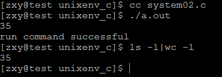

# linux系统编程之进程（七）：system()函数使用


## 一，system()理解
功能：`system()函数调用“/bin/sh -c command”执行特定的命令，阻塞当前进程直到command命令执行完毕`

原型：

int system(const char *command);

返回值：

如果无法启动shell运行命令，system将返回127；出现不能执行system调用的其他错误时返回-1。如果system能够顺利执行，返回那个命令的退出码。

说明：

man帮助：
```c
#include <stdlib.h>

int system(const char *command);
```

```c
DESCRIPTION 
       system()  executes a command specified in command by calling /bin/sh -c 
       command, and returns after the command has been completed.  During exe- 
       cution  of the command, SIGCHLD will be blocked, and SIGINT and SIGQUIT 
       will be ignored.

RETURN VALUE 
       The value returned is -1 on  error  (e.g.   fork(2)  failed),  and  the 
       return  status  of the command otherwise.  This latter return status is 
       in the format specified in wait(2).  Thus, the exit code of the command 
       will  be  WEXITSTATUS(status).   In case /bin/sh could not be executed, 
       the exit status will be that of a command that does exit(127).

       If the value of command is NULL, system() returns non-zero if the shell 
       is available, and zero if not.

       system() does not affect the wait status of any other children.

```

## 二，system()函数原理
system函数执行时，会调用fork、execve、waitpid等函数。

linux版system函数的源码：

```c
int system(const char * cmdstring)
{
    pid_t pid;
    int status;
    if(cmdstring == NULL){        
         return (1);
    }
    if((pid = fork())<0){
            status = -1;
    }
    else if(pid == 0){
        execl("/bin/sh", "sh", "-c", cmdstring, (char *)0);
        _exit(127); //子进程正常执行则不会执行此语句
       }
    else{
            while(waitpid(pid, &status, 0) < 0){
                if(errno != EINTER){
                    status = -1;
                    break;
                }
            }
        }
        return status;
}
```
 
- 函数说明 
    - system()会调用fork()产生子进程，由子进程来调用/bin/sh-c string来执行参数string字符串所代表的命令，此命>令执行完后随即返回原调用的进程。 
    - 在调用system()期间SIGCHLD 信号会被暂时搁置，SIGINT和SIGQUIT 信号则会被忽略。 

- 返回值 
    - =-1:出现错误  
    - =0:调用成功但是没有出现子进程  
    - `>0`:成功退出的子进程的id 
    - 如果system()在调用/bin/sh时失败则返回127，其他失败原因返回-1。若参数string为空指针(NULL)，则返回非零值>。如果system()调用成功则最后会返回 
    - 执行shell命令后的返回值，但是此返回值也有可能为 system()调用/bin/sh失败所返回的127，因此最好能再检查errno 来确认执行成功。 


- 附加说明 
    - 在编写具有SUID/SGID权限的程序时请勿使用system()，system()会继承环境变量，通过环境变量可能会造成系统安全的问题。

- system函数对返回值的处理，涉及3个阶段：
    - 阶段1：创建子进程等准备工作。如果失败，返回-1。 
    - 阶段2：调用/bin/sh拉起shell脚本，如果拉起失败或者shell未正常执行结束（参见备注1），原因值被写入到status的低8~15比特位中。system的man中只说明了会写了127这个值，但实测发现还会写126等值。 
    - 阶段3：如果shell脚本正常执行结束，将shell返回值填到status的低8~15比特位中。 
- 备注1： 
    - 只要能够调用到/bin/sh，并且执行shell过程中没有被其他信号异常中断，都算正常结束。 
    - 比如：不管shell脚本中返回什么原因值，是0还是非0，都算正常执行结束。即使shell脚本不存在或没有执行权限，也都算正常执行结束。 
如果shell脚本执行过程中被强制kill掉等情况则算异常结束。
    - 如何判断阶段2中，shell脚本子进程是否正常执行结束呢？系统提供了宏：WIFEXITED(status)。如果WIFEXITED(status)为真，则说明正常结束。 
    - 如何取得阶段3中的shell返回值？你可以直接通过右移8bit来实现，但安全的做法是使用系统提供的宏：WEXITSTATUS(status)。

由于我们一般在shell脚本中会通过返回值判断本脚本是否正常执行，如果成功返回0，失败返回正数。 
所以综上，判断一个system函数调用shell脚本是否正常结束的方法应该是如下3个条件同时成立： 
- （1）-1 != status 
- （2）WIFEXITED(status)为真 
- （3）0 == WEXITSTATUS(status) 

注意： 
根据以上分析，当shell脚本不存在、没有执行权限等场景下时，以上前2个条件仍会成立，此时WEXITSTATUS(status)为127，126等数值。 
所以，我们在shell脚本中不能将127，126等数值定义为返回值，否则无法区分中是shell的返回值，还是调用shell脚本异常的原因值。shell脚本中的返回值最好多1开始递增。

示例程序：
```c
#include <stdio.h>
#include <unistd.h>
#include <stdlib.h>

#define EXIT_ERR(m) \
do\
{\
    perror(m);\
    exit(EXIT_FAILURE);\
}\
while (0);\

int main(void)
{
    int status ;
    status = system("ls -l|wc -l");

    if(status == -1){
        EXIT_ERR("system error");
    }

    else{
        if(WIFEXITED(status))
        {
            if(WEXITSTATUS(status) == 0)
                printf("run command successful\n");
            else
                printf("run command fail and exit code is %d\n",WEXITSTATUS(status));
        }
        else
            printf("exit status = %d\n",WEXITSTATUS(status));
    }
    return 0;
}
```
结果：

