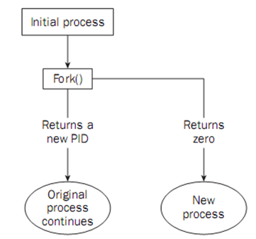
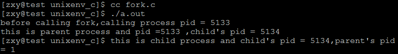
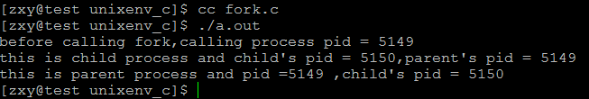
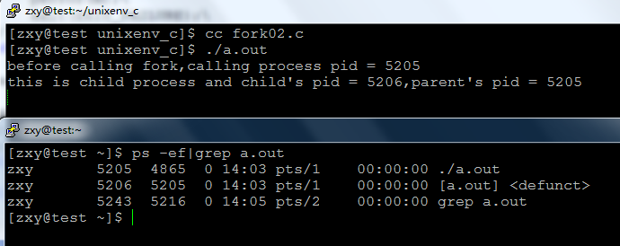
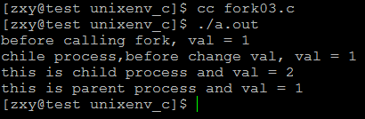
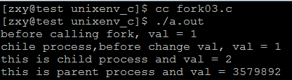
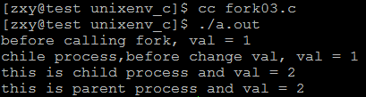
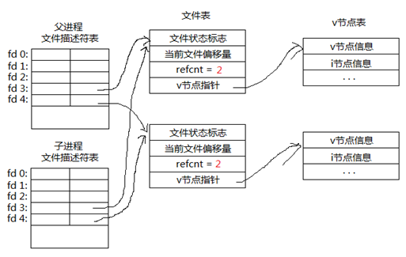
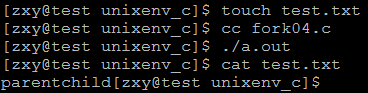

# linux系统编程之进程（三）：进程复制fork，孤儿进程，僵尸进程


- 本节目标：
    - 复制进程映像
    - fork系统调用
    - 孤儿进程、僵尸进程
    - 写时复制


## 一，进程复制（或产生）

使用fork函数得到的子进程从父进程的继承了整个进程的地址空间，包括：进程上下文、进程堆栈、内存信息、打开的文件描述符、信号控制设置、进程优先级、进程组号、当前工作目录、根目录、资源限制、控制终端等。

子进程与父进程的区别在于：
- 父进程设置的锁，子进程不继承（因为如果是排它锁，被继承的话，矛盾了）
- 各自的进程ID和父进程ID不同
- 子进程的未决告警被清除；
- 子进程的未决信号集设置为空集。

## 二，fork系统调用


包含头文件 `<sys/types.h> 和 <unistd.h>`
函数功能:创建一个子进程<br>
函数原型<br>
```c
pid_t fork(void);  //一次调用两次返回值，是在各自的地址空间返回，意味着现在有两个
```
基本一样的进程在执行<br>
参数：无参数。<br>
返回值:<br>
如果成功创建一个子进程，对于父进程来说返回子进程ID<br>
如果成功创建一个子进程，对于子进程来说返回值为0<br>
如果为-1表示创建失败<br>

流程图：



父进程调用fork（）系统调用，然后陷入内核，进行进程复制，如果成功：

1，则对调用进程即父进程来说返回值为刚产生的子进程pid，因为进程PCB没有子进程信息，父进程只能通过这样获得。

2，对子进程（刚产生的新进程），则返回0，

这时就有两个进程在接着向下执行

如果失败，则返回0，调用进程继续向下执行

注：fork英文意思：分支，fork系统调用复制产生的子进程与父进程（调用进程）基本一样：代码段+数据段+堆栈段+PCB，当前的运行环境基本一样，所以子进程在fork之后开始向下执行，而不会从头开始执行。

示例程序：

```c
#include <stdio.h>
#include <unistd.h>
#include <stdlib.h>

#define ERR_EXIT(m) \
    do\
    {\
        perror(m);\
        exit(EXIT_FAILURE);\
    }\
    while (0)\

int main(void)
{
    pid_t pid;
    printf("before calling fork,calling process pid = %d\n",getpid());
    pid = fork();
    if(pid == -1)
        ERR_EXIT("fork error");
    if(pid == 0){
        printf("this is child process and child's pid = %d,parent's pid = %d\n",getpid(),getppid());
    }
    if(pid > 0){
        //sleep(1);
        printf("this is parent process and pid =%d ,child's pid = %d\n",getpid(),pid);
    }

    return 0;
}
```
运行结果：



当没给父进程没加sleep时，由于父进程先执行完，子进程成了孤儿进程，系统将其托孤给了1（init）进程，

所以ppid =1。

当加上sleep后，子进程先执行完：


这次可以正确看到想要的结果。

## 三，孤儿进程、僵尸进程

fork系统调用之后，父子进程将交替执行，执行顺序不定。

如果父进程先退出，子进程还没退出那么子进程的父进程将变为init进程（托孤给了init进程）。（注：任何一个进程都必须有父进程）

如果子进程先退出，父进程还没退出，那么子进程必须等到父进程捕获到了子进程的退出状态才真正结束，否则这个时候子进程就成为僵进程（僵尸进程：只保留一些退出信息供父进程查询）

示例：

```c
#include <stdio.h>
#include <unistd.h>
#include <stdlib.h>

#define ERR_EXIT(m) \
    do\
    {\
        perror(m);\
        exit(EXIT_FAILURE);\
    }\
    while (0)\

int main(void)
{
    pid_t pid;
    printf("before calling fork,calling process pid = %d\n",getpid());
    pid = fork();
    if(pid == -1)
        ERR_EXIT("fork error");
    if(pid == 0){
        printf("this is child process and child's pid = %d,parent's pid = %d\n",getpid(),getppid());
    }
    if(pid > 0){
        sleep(100);
        printf("this is parent process and pid =%d ,child's pid = %d\n",getpid(),pid);
    }

    return 0;
}
```

以上程序跟前面那个基本一致，就是让父进程睡眠100秒，好让子进程先退出

运行结果：



从上可以看到，子进程先退出，但进程列表中还可以查看到子进程，[a.out] `<defunct>`，死的意思，即僵尸进程，如果系统中存在过多的僵尸进程，将会使得新的进程不能产生。<br>

## 四，写时复制

linux系统为了提高系统性能和资源利用率，在fork出一个新进程时，系统并没有真正复制一个副本。

如果多个进程要读取它们自己的那部分资源的副本，那么复制是不必要的。

每个进程只要保存一个指向这个资源的指针就可以了。

如果一个进程要修改自己的那份资源的“副本”，那么就会复制那份资源。这就是写时复制的含义

fork 和vfork：
在fork还没实现copy on write之前。Unix设计者很关心fork之后立刻执行exec所造成的地址空间浪费，所以引入了vfork系统调用。

`vfork有个限制，子进程必须立刻执行_exit或者exec函数。`

即使fork实现了copy on write，效率也没有vfork高，但是我们不推荐使用vfork，因为几乎每一个vfork的实现，都或多或少存在一定的问题

```c
vfork：

Linux Description 
    vfork(), just like fork(2), creates a child process of the calling pro- 
    cess.  For details and return value and errors, see fork(2).

    vfork()  is  a special case of clone(2).  It is used to create new pro- 
    cesses without copying the page tables of the parent process.   It  may 
    be  useful  in performance-sensitive applications where a child will be 
    created which then immediately issues an execve(2).

    vfork() differs from fork(2) in that the parent is suspended until  the 
    child  terminates (either normally, by calling _exit(2), or abnormally, 
    after delivery of a fatal signal), or it makes  a  call  to  execve(2). 
    Until  that point, the child shares all memory with its parent, includ- 
    ing the stack. The child must not return from the current function  or 
    call exit(3), but may call _exit(2).

    Signal  handlers  are inherited, but not shared.  Signals to the parent 
    arrive after the child releases the parent’s memory  (i.e.,  after  the 
    child terminates or calls execve(2)).

```

示例程序：

```c
#include <stdio.h>
#include <unistd.h>
#include <stdlib.h>

#define ERR_EXIT(m) \
    do\
    {\
        perror(m);\
        exit(EXIT_FAILURE);\
    }\
    while (0)\

int main(void)
{
    pid_t pid;
    int val = 1;
    printf("before calling fork, val = %d\n",val);
    
    //pid = fork();
    pid = vfork();
    if(pid == -1)
        ERR_EXIT("fork error");
    if(pid == 0){
        printf("chile process,before change val, val = %d\n",val);
        val++;
        //sleep(1);
        printf("this is child process and val = %d\n",val);
        _exit(0);

    }
    if(pid > 0){
        sleep(1);
        //val++;
        printf("this is parent process and val = %d\n",val);
    }

    return 0;
}
```

当调用fork时:

运行结果：



可知写时复制

当使用vfork但子进程没使用exit退出时：



结果出错了，

使用vfork且exit退出：


结果正常，父子进程共享


`fork之后父子进程共享文件：`




fork产生的子进程与父进程相同的文件文件描述符指向相同的文件表，引用计数增加，共享文件文件偏移指针

示例程序：

```c
#include <stdio.h>
#include <unistd.h>
#include <stdlib.h>
#include <fcntl.h>

#define ERR_EXIT(m) \
    do\
    {\
        perror(m);\
        exit(EXIT_FAILURE);\
    }\
    while (0)\

int main(void)
{
    pid_t pid;
    int fd;
    fd = open("test.txt",O_WRONLY);
    if(fd == -1)
        ERR_EXIT("OPEN ERROR");
    pid = fork();
    if(pid == -1)
        ERR_EXIT("fork error");
    if(pid == 0){
        write(fd,"child",5);
    }
    if(pid > 0){
        //sleep(1);
        write(fd,"parent",6);
    }

    return 0;
}
```




可知父子进程共享文件偏移指针，父进程写完后文件偏移到parent后子进程开始接着写。
