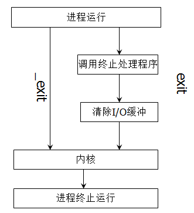
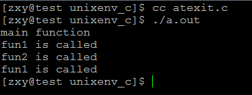
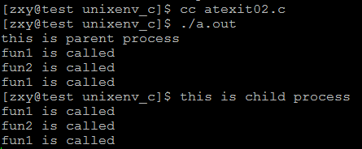
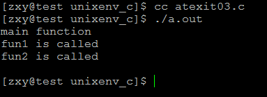

# linux系統編程之進程（四）：進程退出exit，_exit區別即atexit函數


## 一，進程終止有5種方式：

- 正常退出：
    - 從main函數返回
    - 調用exit
    - 調用_exit


- 異常退出：
    - 調用abort
    - 由信號終止

##二，exit和_exit區別：




- 關於_exit()：

```c
       #include <unistd.h>

       void _exit(int status);

       #include <stdlib.h>

       void _Exit(int status);

```
```c
DESCRIPTION 
       The function _exit() terminates the calling process "immediately".  Any 
       open file descriptors belonging to the process are closed; any children 
       of the process are inherited by process 1, init, and the process’s par- 
       ent is sent a SIGCHLD signal.

       The value status is returned to the parent  process  as  the  process’s 
       exit  status,  and  can be collected using one of the wait(2) family of 
       calls.

       The function _Exit() is equivalent to _exit().

```

- 關於exit()：

```c
#include <stdlib.h>

void exit(int status);
```

```c

DESCRIPTION 
       The  exit() function causes normal process termination and the value of 
       status & 0377 is returned to the parent (see wait(2)).

       All functions registered with atexit(3) and on_exit(3) are  called,  in 
       the  reverse  order  of their registration.  (It is possible for one of 
       these functions to use atexit(3) or on_exit(3)  to  register  an  addi- 
       tional  function  to be executed during exit processing; the new regis- 
       tration is added to the front of the list of functions that  remain  to 
       be  called.) If one of these functions does not return (e.g., it calls 
       _exit(2), or kills itself with a signal), then none  of  the  remaining 
       functions is called, and further exit processing (in particular, flush- 
       ing of stdio(3) streams) is abandoned.  If a function has  been  regis- 
       tered  multiple  times using atexit(3) or on_exit(3), then it is called 
       as many times as it was registered.

       All open stdio(3) streams are flushed and  closed.   Files  created  by 
       tmpfile(3) are removed.

       The  C standard specifies two constants, EXIT_SUCCESS and EXIT_FAILURE, 
       that may be passed to exit() to  indicate  successful  or  unsuccessful 
       termination, respectively. 
```

`和exit比較一下，exit()函數定義在stdlib.h中，而_exit()定義在unistd.h中`，

注：exit()就是退出，傳入的參數是程序退出時的狀態碼，0表示正常退出，其他表示非正常退出，一般都用-1或者1，標準C裡有EXIT_SUCCESS和EXIT_FAILURE兩個宏，用exit(EXIT_SUCCESS);

- `_exit()函數的作用最為簡單：直接使進程停止運行，清除其使用的內存空間，並銷燬其在內核中的各種數據結構；exit() 函數則在這些基礎上作了一些包裝，在執行退出之前加了若干道工序。 `


- `exit()函數與_exit()函數最大的區別就在於exit()函數在調用exit系統調用之前要檢查文件的打開情況，把文件緩衝區中的內容寫迴文件，就是"清理I/O緩衝"。`

- exit()在結束調用它的進程之前，要進行如下步驟： 
    - 調用atexit()註冊的函數（出口函數）；按ATEXIT註冊時相反的順序調用所有由它註冊的函數,這使得我們可以指定在程序終止時執行自己的清理動作.例如,保存程序狀態信息於某個文件,解開對共享數據庫上的鎖等.
    - cleanup()；關閉所有打開的流，這將導致寫所有被緩衝的輸出，刪除用TMPFILE函數建立的所有臨時文件.
    - 最後調用_exit()函數終止進程。

- _exit做3件事（man）： 
    - Any  open file descriptors belonging to the process are closed 
    - any children of the process are inherited  by process 1, init 
    - the process's parent is sent a SIGCHLD signal

`exit執行完清理工作後就調用_exit來終止進程。`

## 三，atexit()
atexit可以註冊終止處理程序，ANSI C規定最多可以註冊32個終止處理程序。

終止處理程序的調用與註冊次序相反

```c
#include <stdlib.h>

int atexit(void (*function)(void));
```

```c
DESCRIPTION 
       The atexit() function registers the given function to be called at nor- 
       mal process termination, either via exit(3) or via return from the pro- 
       gram’s main(). Functions so registered are called in the reverse order 
       of their registration; no arguments are passed.

       The  same  function may be registered multiple times: it is called once 
       for each registration.

       POSIX.1-2001 requires that an implementation allow at least  ATEXIT_MAX 
       (32) such functions to be registered.  The actual limit supported by an 
       implementation can be obtained using sysconf(3).

       When a child process is created via fork(2), it inherits copies of  its 
       parent’s  registrations.   Upon a successful call to one of the exec(3) 
       functions, all registrations are removed.

RETURN VALUE 
       The atexit() function returns the value 0 if successful;  otherwise  it 
       returns a non-zero value.
```

示例程序：

```c
#include <stdio.h>
#include <unistd.h>
#include <stdlib.h>

void fun1()
{
    printf("fun1 is called\n");
}

void fun2()
{
    printf("fun2 is called\n");
}

int main(void)
{
    printf("main function\n");
    atexit(fun1);
    atexit(fun2);
    atexit(fun1);
    exit(EXIT_SUCCESS);
}
```
運行結果：



當調用fork時，子進程繼承父進程註冊的atexit：

示例程序：
```c
#include <stdio.h>
#include <unistd.h>
#include <stdlib.h>

#define ERR_EXIT(m) \
    do\
    {\
        perror(m);\
        exit(EXIT_FAILURE);\
    }\
    while (0)\

void fun1()
{
    printf("fun1 is called\n");
}

void fun2()
{
    printf("fun2 is called\n");
}
int main(void)
{
    pid_t pid;
    pid = fork();
    atexit(fun1);
    atexit(fun2);
    atexit(fun1);
    if(pid == -1)
        ERR_EXIT("fork error");
    if(pid == 0){
        printf("this is child process\n");
    }
    if(pid > 0){
        printf("this is parent process\n");
    }

    return 0;
}
```

運行結果：




當atexit註冊的函數中有一個沒有正常返回或被kill，則後續的註冊函數都不會被執行

示例程序：

```c
#include <stdio.h>
#include <unistd.h>
#include <stdlib.h>
#include <signal.h>

void fun1()
{
    printf("fun1 is called\n");
}

void fun2()
{
    printf("fun2 is called\n");
    kill(getpid(),SIGINT);
}

int main(void)
{
    printf("main function\n");
    if(signal(SIGINT,SIG_DFL) == SIG_ERR){
        perror("signal error");
        exit(EXIT_FAILURE);
    }
    atexit(fun1);
    atexit(fun2);
    atexit(fun1);
    exit(EXIT_SUCCESS);
}
```
運行結果：




可見最後那個fun1沒有執行
