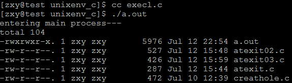
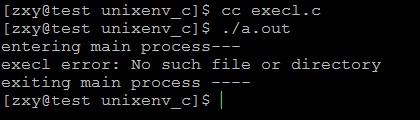
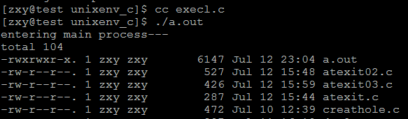
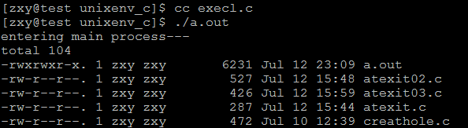
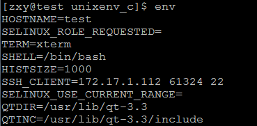
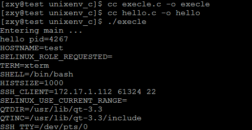
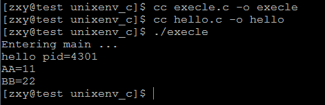
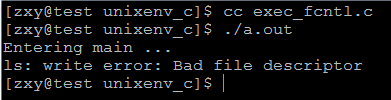

# linux系統編程之進程（五）：exec系列函數（execl,execlp,execle,execv,execvp)使用


- 本節目標：
    - exec替換進程映像
    - exec關聯函數組（execl、execlp、execle、execv、execvp）
    
##一，exec替換進程映像
在進程的創建上Unix採用了一個獨特的方法，它將進程創建與加載一個新進程映象分離。這樣的好處是有更多的餘地對兩種操作進行管理。

當我們創建了一個進程之後，通常將子進程替換成新的進程映象，這可以用exec系列的函數來進行。當然，exec系列的函數也可以將當前進程替換掉。

例如：在shell命令行執行ps命令，實際上是shell進程調用fork複製一個新的子進程，在利用exec系統調用將新產生的子進程完全替換成ps進程。

##二，exec系列函數（execl、execlp、execle、execv、execvp）

```c
包含頭文件<unistd.h>
```
功能：

用exec函數可以把當前進程替換為一個新進程，且新進程與原進程有相同的PID。exec名下是由多個關聯函數組成的一個完整系列，

```c
頭文件<unistd.h>
extern char **environ; 
```

原型：

```c
int execl(const char *path, const char *arg, ...);
int execlp(const char *file, const char *arg, ...);
int execle(const char *path, const char *arg, ..., char * const envp[]);
int execv(const char *path, char *const argv[]);
int execvp(const char *file, char *const argv[]);
```
參數：

path參數表示你要啟動程序的名稱包括路徑名

arg參數表示啟動程序所帶的參數，一般第一個參數為要執行命令名，不是帶路徑且arg必須以NULL結束

返回值:成功返回0,失敗返回-1

注：上述exec系列函數底層都是通過execve系統調用實現：
```c
#include <unistd.h>
int execve(const char *filename, char *const argv[],char *const envp[]);
```
```c
DESCRIPTION： 
       execve() executes the program pointed to by filename.  filename must be 
       either a binary executable, or a script starting with  a  line  of  the form 
```

以上exec系列函數區別：

1，帶l 的exec函數：execl,execlp,execle，表示後邊的參數以可變參數的形式給出且都以一個空指針結束。

示例：

```c
#include <stdio.h>
#include <stdlib.h>
#include <unistd.h>

int main(void)
{
    printf("entering main process---\n");
    execl("/bin/ls","ls","-l",NULL);
    printf("exiting main process ----\n");
    return 0;
}
```



利用execl將當前進程main替換掉，所有最後那條打印語句不會輸出

2，帶 p 的exec函數：execlp,execvp，表示第一個參數path不用輸入完整路徑，只有給出命令名即可，它會在環境變量PATH當中查找命令

示例：

當不帶p但沒給出完整路徑時：

```c
#include <stdio.h>
#include <stdlib.h>
#include <unistd.h>

int main(void)
{
    printf("entering main process---\n");
    execl("/bin/ls","ls","-l",NULL);
    printf("exiting main process ----\n");
    return 0;
}
```
結果：



結果顯示找不到，所有替換不成功，main進程繼續執行

現在帶p：




替換成功

3，不帶 l 的exec函數：execv,execvp表示命令所需的參數以char *arg[]形式給出且arg最後一個元素必須

是NULL

示例：

```c
#include <stdio.h>
#include <stdlib.h>
#include <unistd.h>

int main(void)
{
    printf("entering main process---\n");
    int ret;
    char *argv[] = {"ls","-l",NULL};
    ret = execvp("ls",argv);
    if(ret == -1)
        perror("execl error");
    printf("exiting main process ----\n");
    return 0;
}
```
結果：



進程替換成功

4，帶 e 的exec函數：execle表示，將環境變量傳遞給需要替換的進程

從上述的函數原型中我們發現：

extern char **environ;

此處的environ是一個指針數組，它當中的每一個指針指向的char為“XXX=XXX”

environ保存環境信息的數據可以env命令查看：



它由shell進程傳遞給當前進程，再由當前進程傳遞給替換的新進程

示例：execle.c

```c
#include <stdio.h>
#include <stdlib.h>
#include <unistd.h>

int main(int argc, char *argv[])
{
    //char * const envp[] = {"AA=11", "BB=22", NULL};
    printf("Entering main ...\n");
    int ret;
    ret =execl("./hello", "hello", NULL);
    //execle("./hello", "hello", NULL, envp);
    if(ret == -1)
        perror("execl error");
    printf("Exiting main ...\n");
    return 0;
}
```

- hello.c

```c
#include <unistd.h>
#include <stdio.h>
extern char** environ;

int main(void)
{
    printf("hello pid=%d\n", getpid());
    int i;
    for (i=0; environ[i]!=NULL; ++i)
    {
        printf("%s\n", environ[i]);
    }
    return 0;
}
```
結果：



可知原進程確實將環境變量信息傳遞給了新進程

那麼現在我們可以利用execle函數自己給的需要傳遞的環境變量信息：

示例程序：execle.c
```c
#include <stdio.h>
#include <stdlib.h>
#include <unistd.h>

int main(int argc, char *argv[])
{
    char * const envp[] = {"AA=11", "BB=22", NULL};
    printf("Entering main ...\n");
    int ret;
    //ret =execl("./hello", "hello", NULL);
    ret =execle("./hello", "hello", NULL, envp);
    if(ret == -1)
        perror("execl error");
    printf("Exiting main ...\n");
    return 0;
}
```

- hello.c

```c
#include <unistd.h>
#include <stdio.h>
extern char** environ;

int main(void)
{
    printf("hello pid=%d\n", getpid());
    int i;
    for (i=0; environ[i]!=NULL; ++i)
    {
        printf("%s\n", environ[i]);
    }
    return 0;
}
```
結果：



確實將給定的環境變量傳遞過來了

### 三，fcntl()函數中的FD_CLOEXEC標識在exec系列函數中的作用

```c
#include <unistd.h> 
#include <fcntl.h>

int fcntl(int fd, int cmd, ... /* arg */ );
```

```c
File descriptor flags 
      The following commands manipulate the  flags  associated  with  a  file 
      descriptor.   Currently, only one such flag is defined: FD_CLOEXEC, the 
      close-on-exec flag.  If the FD_CLOEXEC bit is 0,  the  file  descriptor 
      will remain open across an execve(2), otherwise it will be closed.

     //如果FD_CLOEXEC標識位為0，則通過execve調用後fd依然是打開的，否則為關閉的

      F_GETFD (void) 
             Read the file descriptor flags; arg is ignored.

      F_SETFD (long) 
             Set the file descriptor flags to the value specified by arg.

```

如：fcntl(fd, F_SETFD, FD_CLOEXEC);

測試示例：

```c
#include <stdio.h>
#include <stdlib.h>
#include <unistd.h>
#include <fcntl.h>
int main(int argc, char *argv[])
{

    printf("Entering main ...\n");
    int ret = fcntl(1, F_SETFD, FD_CLOEXEC);
    if (ret == -1)
        perror("fcntl error");
    int val;
    val =execlp("ls", "ls","-l", NULL);
    if(val == -1)
        perror("execl error");
    printf("Exiting main ...\n");
    return 0;
}
```

結果：




1關閉（標準輸出關閉）ls -l無法將結果顯示在標準輸出
