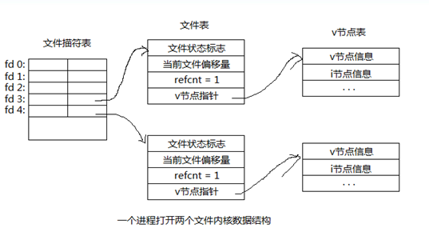
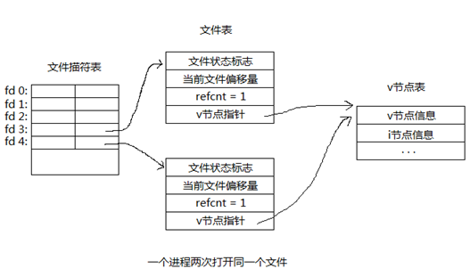
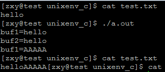
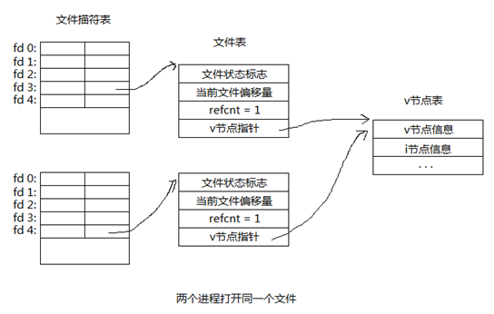
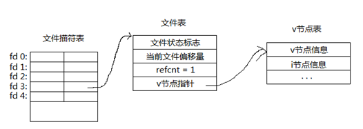
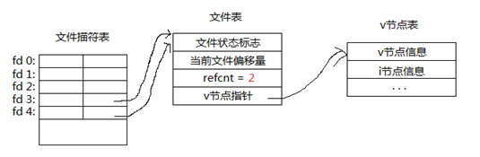
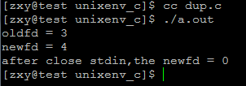
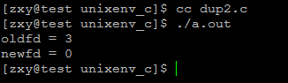
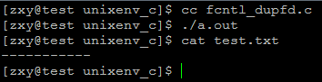

# linux系统编程之文件与IO（八）：文件描述符相关操作-dup,dup2,fcntl


本节目标：

###1,文件共享
- 打开文件内核数据结构
- 一个进程两次打开同一个文件
- 两个进程打开同一个文件

###2,复制文件描述符（dup、dup2、fcntl）

##一，文件共享

1，一个进程打开两个文件内核数据结构



说明：

`文件描述符表`：每个进程都有一张，彼此独立，每个文件描述符表项都指向一个文件表，文件描述符0（STDIN_FILENO）、1（STDOUT_FILENO）、2（STDERR_FILENO）,默认已经打开，分别表示：标准输入，标准输出，标准错误设备。

`文件表`：每打开一个文件就对应一张文件表，文件表可以共享，当多个文件描述符指向同一个文件表时，文件表中的

refcnt字段会相应变化。文件状态标识：文件的打开模式（R,W,RW,APPEND,NOBLOCK,等），当前文件偏移量，refcnt：被引用数量，

`v节点指针`：指向一个v节点表。

v节点表：每个文件对应一个，无论被被多少个进程打开都只有一个，它包括v节点信息（主要是stat结构体中的信息），i节点信息。

每个进程默认只能打开1024个文件描述符，当一个进程打开一个文件时，默认会从0开始查找未被使用的描述符，由于0,1,2默认被占用，所有一般从3开始使用。


2、一个进程两次打开同一个文件



当一个进程多次打开同一个文件时，首先会在描述符表顺序查找未被使用的描述符，然后每打开一次建立一张文件表，但各文件表中的v节点指针都指向同一个v节点表。

示例程序：

```c
#include <unistd.h>
#include <sys/stat.h>
#include <sys/types.h>
#include <sys/stat.h>
#include <fcntl.h>

#include <stdlib.h>
#include <stdio.h>
#include <errno.h>
#include <string.h>


#define ERR_EXIT(m) \
    do \
    { \
        perror(m); \
        exit(EXIT_FAILURE); \
    } while(0)

int main(int argc, char *argv[])
{
    int fd1;
    int fd2;
    char buf1[1024] = {0};
    char buf2[1024] = {0};
    fd1 = open("test.txt", O_RDONLY);
    if (fd1 == -1)
        ERR_EXIT("open error");
    read(fd1, buf1, 5);
    printf("buf1=%s\n", buf1);
    

    fd2 = open("test.txt", O_RDWR);
    if (fd2 == -1)
        ERR_EXIT("open error");

    read(fd2, buf2, 5);
    printf("buf2=%s\n", buf2);
    write(fd2, "AAAAA", 5);

    memset(buf1, 0, sizeof(buf1));
    read(fd1, buf1, 5);
    printf("buf1=%s\n", buf1);
    close(fd1);
    close(fd2);
    return 0;
}
```
运行结果：



说明：先创建test.txt文件写入hello，再同一个进程两次打开该文件，可见每打开一次文件就参数一张文件表，不共享偏移量，都开始位置读取，之后利用第二个文件描述符写入AAAAA，在利用第一个描述符可以读取出，表明都指向同一个v节点表，操作同一个文件。

3，两个不同进程打开同一个文件



当不同进程打开同一个文件时，每个进程首先在它们各自的文件描述符表中顺序查找未被使用的描述符，最终获得的文件描述符可能相同也可能不同，每个fd指向各自的文件表，但同样，每个文件表中的v节点指针都指向同一个v节点表。

##二、复制文件描述符

复制前：




复制后：



复制后，两个文件描述符都指向了同一个文件表，refcnt=2。

复制文件描述符有`三种`方法：

- 1，dup
- 2，dup2
- 3，fcntl

```c
#include <unistd.h>

int dup(int oldfd); 
int dup2(int oldfd, int newfd);
```

```c
DESCRIPTION 
       These system calls create a copy of the file descriptor oldfd.

       dup()  uses  the lowest-numbered unused descriptor for the new descriptor.

       dup2() makes newfd be the copy of oldfd, closing newfd first if  necessary, but note

                  the following:

       *  If  oldfd  is  not a valid file descriptor, then the call fails, and newfd is not closed.

       *  If oldfd is a valid file descriptor, and newfd has the same value as 
          oldfd, then dup2() does nothing, and returns newfd.

       After  a  successful return from one of these system calls, the old and new file descriptors may be used interchangeably.  They  refer  to  the same open file description (see open(2)) and thus share file offset and file status flags; for example, if the file offset is modified by using lseek(2)  on one of the descriptors, the offset is also changed for the other.

RETURN VALUE 
       On success, these system calls return the new descriptor.  On error, -1 is returned, and errno is set appropriately.
```

示例程序：

```c
#include <stdio.h>
#include <unistd.h>
#include <stdlib.h>
#include <fcntl.h>


int main(void)
{
    int fd;
    fd = open("test.txt",O_WRONLY);
    if( fd == -1){
        perror("open error");
        exit(EXIT_FAILURE);
    }
    int fd2;
    fd2 = dup(fd);
    if(fd2 == -1){
        perror("dup error");
        exit(EXIT_FAILURE);
    }
    printf("oldfd = %d\n",fd);
    printf("newfd = %d\n",fd2);
    int fd3;
    close(0); //或者close(STDIN_FILENO)
    fd3 = dup(fd);
    if(fd3 == -1){
        perror("dup error");
        exit(EXIT_FAILURE);
    }
    printf("after close stdin,the newfd = %d\n",fd3); 

    exit(EXIT_SUCCESS);
}
```
运行结果：



用dup进行文件描述符的复制时，顺序查找即从0开始查找可以文件描述符 
示例2：

```c
#include <stdio.h>
#include <unistd.h>
#include <stdlib.h>
#include <fcntl.h>
int main(void)
{
    int fd;
    fd = open("test.txt",O_WRONLY);
    if( fd == -1){
        perror("open error");
        exit(EXIT_FAILURE);
    }
    int fd2;
    fd2 = dup2(fd,0);
    if(fd2 == -1){
        perror("dup error");
        exit(EXIT_FAILURE);
    }
    printf("oldfd = %d\n",fd);
    printf("newfd = %d\n",fd2);
    exit(EXIT_SUCCESS);
}
```
运行结果：




用dup2进行文件描述符复制时，指定需要复制的新的描述符，如果该描述符已经被占用，则先关闭它在重新复制，类似于先调用close再dup

- 3，fcntl
- 
功能：操纵文件描述符，改变已打开的文件的属性

```c
#include <fcntl.h>

int fcntl(int fd, int cmd, ... /* arg */ );
```

```c
DESCRIPTION 
       fcntl() performs one of the operations described below on the open file 
       descriptor fd.  The operation is determined by cmd.

       fcntl() can take an optional third argument.  Whether or not this argu- 
       ment  is  required is determined by cmd.  The required argument type is 
       indicated in parentheses after  each  cmd  name  (in  most  cases,  the 
       required  type  is  long,  and  we identify the argument using the name 
       arg), or void is specified if the argument is not required.

```

由第二个参数指定操作类型，后面点的可变参数指定该命令所需的参数

这里我们进行文件描述符复制，可将cmd 设为： F_DUPFD (long)，该命令表示：

`Find the lowest numbered available file descriptor greater  than 
  or  equal to arg` and make it be a copy of fd.  This is different 
from dup2(2), which uses exactly the descriptor specified.

  On success, the new descriptor is returned.

示例程序：
```c
#include <unistd.h>
#include <sys/stat.h>
#include <sys/types.h>
#include <sys/stat.h>
#include <fcntl.h>

#include <stdlib.h>
#include <stdio.h>
#include <errno.h>
#include <string.h>

#define ERR_EXIT(m) \
    do \
    { \
        perror(m); \
        exit(EXIT_FAILURE); \
    } while(0)

int main(int argc, char *argv[])
{
    int fd;
    fd = open("test.txt", O_WRONLY);
    if (fd == -1)
        ERR_EXIT("open error");

    close(1);
    if (fcntl(fd, F_DUPFD, 0) < 0)
        ERR_EXIT("dup fd error");
    printf("-----------\n");//进行重定向，将不会显示在标准输出，
    return 0;
}
```
运行结果：


