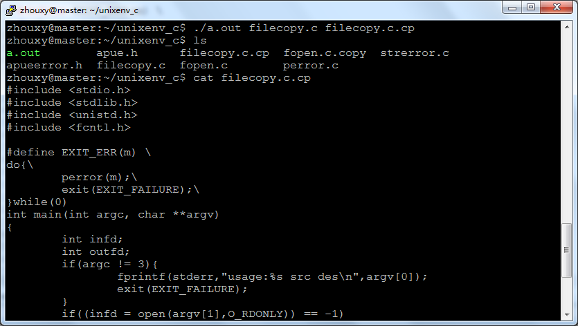

# linux系統編程之文件與IO（二）：系統調用read和write


- read系統調用

一旦有了與一個打開文件描述相連的文件描述符，只要該文件是用O_RDONLY或O_RDWR標誌打開的，就可以用read()系統調用從該文件中讀取字節

函數原型：

```c
#include <unistd.h>

ssize_t read(int fd, void *buf, size_t count);
```

參數

fd ：想要讀的文件的文件描述符

buf ： 指向內存塊的指針，從文件中讀取來的字節放到這個內存塊中

count ： 從該文件複製到buf中的字節個數

返回值

如果出現錯誤，返回-1

讀文件結束，返回0

否則返回從該文件複製到規定的緩衝區中的字節數

否則返回從該文件複製到規定的緩衝區中的字節數


- write系統調用


用write()系統調用將數據寫到一個文件中

函數原型：

```c
#include <unistd.h>

ssize_t write(int fd, const void *buf, size_t count);
```
函數參數：

-fd：要寫入的文件的文件描述符

-buf：指向內存塊的指針，從這個內存塊中讀取數據寫入 到文件中

-count：要寫入文件的字節個數

返回值

如果出現錯誤，返回-1

注:write並非真正寫入磁盤,而是先寫入內存緩衝區,待緩衝區滿或進行刷新操作後才真正寫入磁盤,若想實時寫入磁盤可調用

int fsync(int fd);或在open時flags加上O_SYNC


利用read和write進行文件拷貝

程序代碼:

```c
#include <stdio.h>
#include <stdlib.h>
#include <unistd.h>
#include <fcntl.h>

#define EXIT_ERR(m) \
do{\
    perror(m);\
    exit(EXIT_FAILURE);\
}while(0)
int main(int argc, char **argv)
{
    int infd;
    int outfd;
    if(argc != 3){
        fprintf(stderr,"usage:%s src des\n",argv[0]);
        exit(EXIT_FAILURE);
    }
    if((infd = open(argv[1],O_RDONLY)) == -1)
        EXIT_ERR("open error");
    if((outfd = open(argv[2],O_WRONLY|O_CREAT|O_TRUNC,0644)) == -1)
        EXIT_ERR("OPEN ERROR");
    char buf[1024];
    int n;
    while((n = read(infd, buf, 1024)) > 0 ){
        write(outfd, buf, n);
    }
    close(infd);
    close(outfd);
    return 0;
}
```
測試結果:


