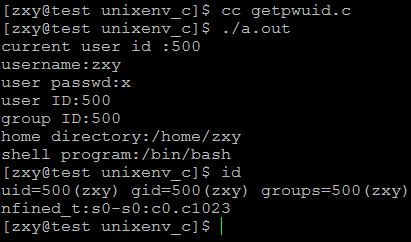
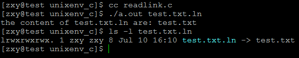
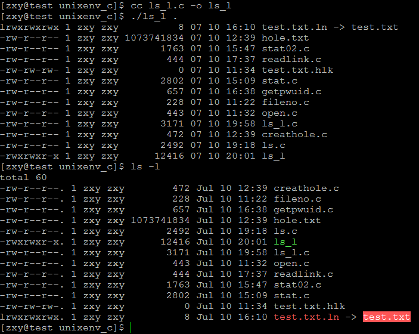

# linux系統編程之文件與IO（六）：實現ls -l功能


本文利用以下系統調用實現ls -l命令的功能：

 

###1，lstat：獲得文件狀態,

###2，getpwuid：

```c
#include <pwd.h>

struct passwd *getpwuid(uid_t uid);
```

描述：

The getpwuid() function returns a pointer to a structure containing the broken-out fields of the record in the password database  that  matches the user ID uid.

返回值： 
```c
The passwd structure is defined in <pwd.h> as follows:

    struct passwd { 
        char   *pw_name;       /* username */ 
        char   *pw_passwd;     /* user password */ 
        uid_t   pw_uid;        /* user ID */ 
        gid_t   pw_gid;        /* group ID */ 
        char   *pw_gecos;      /* real name */ 
        char   *pw_dir;        /* home directory */ 
        char   *pw_shell;      /* shell program */ 
    };
```

示例：


```c
#include <unistd.h>
#include <stdlib.h>
#include <stdio.h>
#include <pwd.h>

#define ERR_EXIT(m) \
    do \
    { \
        perror(m); \
        exit(EXIT_FAILURE); \
    } while(0)

int main(void)
{
    uid_t uid;
    struct passwd *pw;
    uid = getuid();
    printf("current user id :%d\n",uid);
    if((pw = getpwuid(uid)) == NULL)
        ERR_EXIT("getpwuid error");
    printf("username:%s\n",pw->pw_name);
    printf("user passwd:%s\n",pw->pw_passwd);
    printf("user ID:%d\n",pw->pw_uid);
    printf("group ID:%d\n",pw->pw_gid);
    //printf("real name:%s\n",pw->pw_gecos);
    printf("home directory:%s\n",pw->pw_dir);
    printf("shell program:%s\n",pw->pw_shell);
    return 0;
}
```
運行結果：



###3，getgrgid:

```c
#include <grp.h>

struct group *getgrnam(const char *name);//根據組名獲得組信息

struct group *getgrgid(gid_t gid);//根據組ID獲得組信息
```


描述：

The getgrnam() function returns a pointer to a structure containing the broken-out  fields of the record in the group database (e.g., the local group file /etc/group, NIS, and LDAP) that matches the group name name.

The getgrgid() function returns a pointer to a structure containing the broken-out fields of the record in the group database that matches  thegroup ID gid.

返回值：

```c
The group structure is defined in <grp.h> as follows:

    struct group { 
        char   *gr_name;       /* group name */ 
        char   *gr_passwd;     /* group password */ 
        gid_t   gr_gid;        /* group ID */ 
        char  **gr_mem;        /* group members */ 
    };

```

### 4，readlink:讀取軟鏈接文件的內容

```c
#include <unistd.h>

ssize_t readlink(const char *path, char *buf, size_t bufsiz);
```

描述：

```c
DESCRIPTION 
       readlink() places the contents of the symbolic link path in the  buffer 
       buf,  which has size bufsiz.  readlink() does not append a null byte to 
       buf.  It will truncate the contents (to a length of bufsiz characters), 
       in case the buffer is too small to hold all of the contents.

RETURN VALUE 
       On  success,  readlink() returns the number of bytes placed in buf.  On 
       error, -1 is returned and errno is set to indicate the error.

```


示例：

```c
#include <unistd.h>
#include <stdlib.h>
#include <stdio.h>

#define ERR_EXIT(m) \
    do \
    { \
        perror(m); \
        exit(EXIT_FAILURE); \
    } while(0)
int main(int argc,char **argv)
{
    if(argc != 2){
        fprintf(stderr,"usage:%s linkfile", argv[0]);
        exit(EXIT_FAILURE);
    }

    char buf[1024];
    
    if(readlink(argv[1],buf,1024) ==-1)
        ERR_EXIT("readlink error");
    printf("the content of %s are: %s\n",argv[1],buf);
    return 0;
}
```

運行結果：



現在利用相關的系統調用實現ls –l功能：

程序如下：

```c
#include <stdio.h>
#include <unistd.h>
#include <stdlib.h>
#include <dirent.h>
#include <sys/types.h>
#include <sys/stat.h>
#include <string.h>
#include <time.h>
#include <pwd.h> 
#include <grp.h> 
#include <libgen.h>


#define ERR_EXIT(m) \
    do\
    {\
        perror(m);\
        exit(EXIT_FAILURE);\
    }while(0)\

void lsdir(char *dirname);
void lsfile(char *filename);
void lsfile(char *filename);
char getFileType(struct stat *fstat);
void getFilePerm(struct stat *st, char *perm);

int main(int argc,char **argv)
{

    if(argc != 2){
        fprintf(stderr,"usage:%s [filepath]\n",argv[0]);
        exit(EXIT_FAILURE);
    }
    struct stat fstat;
    if(lstat(argv[1],&fstat) == -1)
        ERR_EXIT("STAT ERROR");

    if(S_ISDIR(fstat.st_mode))
    {
        lsdir(argv[1]);
    }
    else{
        lsfile(argv[1]);
    }
    return 0;
}

void lsdir(char *dirname)
{
    DIR *dir;
    char filename[100] = {0};
    dir =opendir(dirname); 
    if(dir == NULL)
        ERR_EXIT("opendir error");
    struct dirent *dentry;
    while((dentry = readdir(dir)) != NULL)
    {
        
        char *fname;
        fname = dentry->d_name;
        if(strncmp(fname,".",1) == 0)
            continue;
        sprintf(filename,"%s/%s",dirname,fname);
        lsfile(filename);
    }

    closedir(dir);

}

//-rw-r--r--.   1            zxy        zxy        2586        Jul 10 17:00    ls.c
//類型及權限  硬鏈接數        擁有者    所屬組    文件大小    創建時間        文件名
void lsfile(char *filename)
{
    struct stat tmpstat;
    if(lstat(filename,&tmpstat) == -1)
        ERR_EXIT("STAT ERROR");
    char buf[11]= {0};
    strcpy(buf,"----------");
    char type;
    type = getFileType(&tmpstat);
    char *bname = basename(filename);
    buf[0] = type;
    if(type == 'l'){
        char content[1024];
        if(readlink(filename,content,1024) == -1)
            ERR_EXIT("readlink error");
        sprintf(bname,"%s -> %s",bname,content);

    }
    getFilePerm(&tmpstat,buf);
    struct tm *ftime;
    ftime = localtime(&tmpstat.st_mtime);
    
    printf("%s %d %s %s %10ld %02d %02d %02d:%02d %s\n",
        buf,tmpstat.st_nlink,
        getpwuid(tmpstat.st_uid)->pw_name,
        getgrgid(tmpstat.st_gid)->gr_name,
        tmpstat.st_size,
        ftime->tm_mon+1,
        ftime->tm_mday,
        ftime->tm_hour,
        ftime->tm_min,
        bname);

}

//獲得文件類型
char getFileType(struct stat *st)
{
    char type = '-';
    switch (st->st_mode  & S_IFMT)
    {
        case S_IFSOCK:
        type = 's';
                break;
        case S_IFLNK:
        type = 'l';
                break;
        case S_IFREG:
        type = '-';
                break;
        case S_IFBLK:
        type = 'b';
                break;
        case S_IFDIR:
        type = 'd';
                break;
        case S_IFCHR:
        type = 'c';
                break;
        case S_IFIFO:
        type = 'p';
                break;
    }
    return type;
}

//獲得文件訪問權限
void getFilePerm(struct stat *st, char *perm)
{
    mode_t mode = st->st_mode;
    if (mode & S_IRUSR)
        perm[1] = 'r';
    if (mode & S_IWUSR)
        perm[2] = 'w';
    if (mode & S_IXUSR)
        perm[3] = 'x';
    if (mode & S_IRGRP)
        perm[4] = 'r';
    if (mode & S_IWGRP)
        perm[5] = 'w';
    if (mode & S_IXGRP)
        perm[6] = 'x';
    if (mode & S_IROTH)
        perm[7] = 'r';
    if (mode & S_IWOTH)
        perm[8] = 'w';
    if (mode & S_IXOTH)
        perm[9] = 'x';
}
```
運行結果：





