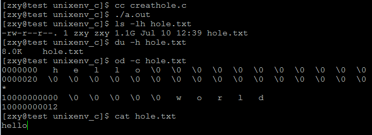

# linux系統編程之文件與IO（三）：利用lseek()創建空洞文件


一、lseek（）系統調用

功能說明：

通過指定相對於開始位置、當前位置或末尾位置的字節數來重定位 curp，這取決於 lseek() 函數中指定的位置

函數原型：
```c
#include <sys/types.h> 
#include <unistd.h>
```

off_t lseek(int fd, off_t offset, int whence);

參數說明：

fd：文件描述符

offset：偏移量，該值可正可負，負值為向前移

whence：搜索的起始位置，有三個選項：

(1).SEEK_SET: 當前位置為文件的開頭，新位置為偏移量大小 
(2).SEEK_CUR: 當前位置為文件指針位置，新位置為當前位置加上偏移量大小 
(3).SEEK_END: 當前位置為文件結尾，新位置為偏移量大小

返回值：文件新的偏移值

二、利用lseek（）產生空洞文件（hole）

說明：

The lseek() function allows the file offset to be set beyond the end of the file (but this does not change the size of the file).  If  data  is later written at this point, subsequent  reads of the data in the gap (a "hole") return null bytes ('\0') until data is  actually  written  into the gap.

程序代碼：

```c
#include <stdio.h>
#include <unistd.h>
#include <fcntl.h>
#include <stdlib.h>

#define ERR_EXIT(m) \
    do \
    { \
        perror(m); \
        exit(EXIT_FAILURE); \
    } while(0)

int main(void)
{
    int fd;
    int ret;
    fd = open("hole.txt",O_WRONLY|O_CREAT|O_TRUNC,0644);
    if(fd == -1)
        ERR_EXIT("open error");
    write(fd,"hello",5);
    ret = lseek(fd,1024*1024*1024,SEEK_CUR);
    if(ret == -1)
        ERR_EXIT("lseek error");
    write(fd,"world",5);
    close(fd);
    return 0;
}
```
測試結果：

