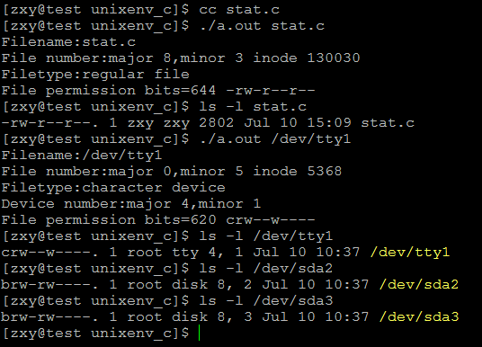

# linux系統編程之文件與IO（五）：stat（）系統調用獲取文件信息


一、stat()獲取文件元數據
```c
stat系統調用原型： 
#include <sys/stat.h>

int stat(const char *path, struct stat *buf); 
int fstat(int fd, struct stat *buf); 
int lstat(const char *path, struct stat *buf);

幫助信息可通過：man 2 stat 查看

DESCRIPTION 
       These  functions  return  information about a file.  No permissions are 
       required on the file itself, but — in the case of stat() and lstat()  — 
       execute  (search)  permission  is required on all of the directories in 
       path that lead to the file.

       stat() stats the file pointed to by path and fills in buf.

       lstat() is identical to stat(), except that if path is a symbolic link, 
       then the link itself is stat-ed, not the file that it refers to.

       fstat()  is  identical to stat(), except that the file to be stat-ed is 
       specified by the file descriptor fd.

       All of these system calls return a stat structure, which  contains  the 
       following fields:


struct stat { 
    dev_t     st_dev;     /* ID of device containing file ：該文件所屬設備的設備號，設備號包括主設備和和次設備號，dev_t是16位整數，高8位表示主設備號，低8位表示次設備號*/ 
    ino_t     st_ino;     /* inode number */ 
    mode_t    st_mode;    /* protection ：包含文件訪問權限信息及文件類型*/ 
    nlink_t   st_nlink;   /* number of hard links */ 
    uid_t     st_uid;     /* user ID of owner */ 
    gid_t     st_gid;     /* group ID of owner */ 
    dev_t     st_rdev;    /* device ID (if special file)：如果該文件是特殊文件即設備文件，則表示設備號 */ 
    off_t     st_size;    /* total size, in bytes */ 
    blksize_t st_blksize; /* blocksize for file system I/O */ 
    blkcnt_t  st_blocks;  /* number of 512B blocks allocated ：分配的塊數量*/ 
    time_t    st_atime;   /* time of last access */ 
    time_t    st_mtime;   /* time of last modification */ 
    time_t    st_ctime;   /* time of last status change：如修改文件的權限 */ 
};

文件類型有兩種方式獲得：

1.通過以下的一些宏進行驗證：m為struct stat中得st_mode字段

    S_ISREG(m)  is it a regular file?

    S_ISDIR(m)  directory?

    S_ISCHR(m)  character device?

    S_ISBLK(m)  block device?

    S_ISFIFO(m) FIFO (named pipe)?

    S_ISLNK(m)  symbolic link? (Not in POSIX.1-1996.)

    S_ISSOCK(m) socket? (Not in POSIX.1-1996.)

2.利用struct stat中得st_mode字段與S_IFMT進行與運算：mode&S_IFMT，然後將得到的結果與下列的常量比較，相等就是

The following flags are defined for the st_mode field:

   S_IFMT     0170000   bit mask for the file type bit fields 
    S_IFSOCK   0140000   socket 
    S_IFLNK    0120000   symbolic link 
    S_IFREG    0100000   regular file 
    S_IFBLK    0060000   block device 
    S_IFDIR    0040000   directory 
    S_IFCHR    0020000   character device 
    S_IFIFO    0010000   FIFO

文件訪問權限獲得：利用struct stat中得st_mode字段與S_IFMT進行與運算：mode&S_IFMT，然後將得到的結果與下列的常量比較，相等就是

S_IFMT     0170000   bit mask for the file type bit fields 

S_ISUID    0004000   set UID bit 
S_ISGID    0002000   set-group-ID bit (see below) 
S_ISVTX    0001000   sticky bit (see below) 
S_IRWXU    00700     mask for file owner permissions 
S_IRUSR    00400     owner has read permission 
S_IWUSR    00200     owner has write permission 
S_IXUSR    00100     owner has execute permission 
S_IRWXG    00070     mask for group permissions 
S_IRGRP    00040     group has read permission 
S_IWGRP    00020     group has write permission 
S_IXGRP    00010     group has execute permission 
S_IRWXO    00007     mask for permissions for others (not in group) 
S_IROTH    00004     others have read permission 
S_IWOTH    00002     others have write permission 
S_IXOTH    00001     others have execute permission
```


示例程序：


```c
#include <unistd.h>
#include <sys/stat.h>
#include <sys/types.h>
#include <sys/stat.h>
#include <fcntl.h>

#include <stdlib.h>
#include <stdio.h>
#include <errno.h>
#include <string.h>


#define ERR_EXIT(m) \
    do \
    { \
        perror(m); \
        exit(EXIT_FAILURE); \
    } while(0)

#define MAJOR(a) (int)((unsigned short)a >> 8) //高8位：主設備號
#define MINOR(a) (int)((unsigned short)a & 0xFF)//低8位：次設備號

int filetype(struct stat *buf);
void fileperm(struct stat *buf, char *perm);

int main(int argc, char *argv[])
{
    if (argc != 2)
    {
        fprintf(stderr, "Usage %s file\n", argv[0]);
        exit(EXIT_FAILURE);
    }

    struct stat sbuf;
    printf("Filename:%s\n", argv[1]);
    if (lstat(argv[1], &sbuf) == -1)
        ERR_EXIT("stat error");

    printf("File number:major %d,minor %d inode %d\n", MAJOR(sbuf.st_dev), MINOR(sbuf.st_dev), (int)sbuf.st_ino);
    if (filetype(&sbuf))
    {
        printf("Device number:major %d,minor %d\n", MAJOR(sbuf.st_rdev), MINOR(sbuf.st_rdev));
    }
    
    char perm[11] = {0};
    fileperm(&sbuf, perm);
    printf("File permission bits=%o %s\n", sbuf.st_mode & 07777, perm);
    

    return 0;
}


int filetype(struct stat *buf)
{
    int flag = 0;
    printf("Filetype:");
    mode_t mode;
    mode = buf->st_mode;
    switch (mode & S_IFMT)
    {
    case S_IFSOCK:
        printf("socket\n");
        break;
    case S_IFLNK:
        printf("symbolic link\n");
        break;
    case S_IFREG:
        printf("regular file\n");
        break;
    case S_IFBLK:
        printf("block device\n");
        flag = 1; //該文件為設備文件
        break;
    case S_IFDIR:
        printf("directory\n");
        break;
    case S_IFCHR:
        printf("character device\n");
        flag = 1;
        break;
    case S_IFIFO:
        printf("FIFO\n");
        break;
    default:
        printf("unknown file type\n");
        break;
    }

    return flag;
}

void fileperm(struct stat *buf, char *perm)
{
    strcpy(perm, "----------");
    perm[0] = '?';
    mode_t mode;
        mode = buf->st_mode;
        switch (mode & S_IFMT)
        {
        case S_IFSOCK:
        perm[0] = 's';
                break;
        case S_IFLNK:
        perm[0] = 'l';
                break;
        case S_IFREG:
        perm[0] = '-';
                break;
        case S_IFBLK:
        perm[0] = 'b';
                break;
        case S_IFDIR:
        perm[0] = 'd';
                break;
        case S_IFCHR:
        perm[0] = 'c';
                break;
        case S_IFIFO:
        perm[0] = 'p';
                break;
    }

    if (mode & S_IRUSR)
        perm[1] = 'r';
    if (mode & S_IWUSR)
        perm[2] = 'w';
    if (mode & S_IXUSR)
        perm[3] = 'x';
    if (mode & S_IRGRP)
        perm[4] = 'r';
    if (mode & S_IWGRP)
        perm[5] = 'w';
    if (mode & S_IXGRP)
        perm[6] = 'x';
    if (mode & S_IROTH)
        perm[7] = 'r';
    if (mode & S_IWOTH)
        perm[8] = 'w';
    if (mode & S_IXOTH)
        perm[9] = 'x';
    perm[10] = '\0';
}
```
運行結果：



