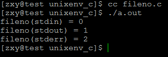
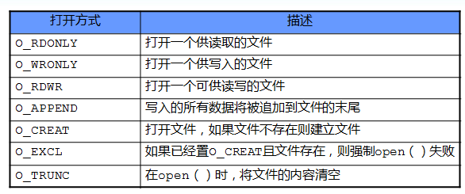
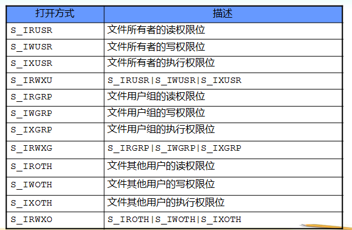
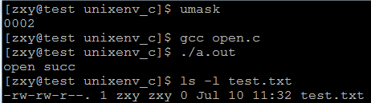
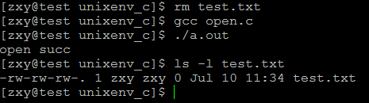

# linux系统编程之文件与IO（一）：文件描述符、open，close


## 1. 什么是IO？
- 输入/输出是主存和外部设备之间拷贝数据的过程
    - 设备->内存（输入操作）
    - 内存->设备（输出操作）

- 高级I/O
    - ANSI C提供的标准I/O库称为高级I/O，通常也称为带缓冲的I/O

- 低级I/O
    - 通常也称为不带缓冲的I/O

## 2. 文件描述符：fd

- 对于Linux而言，所有对设备或文件的操作都是通过文件描述符进行的。
- 当打开或者创建一个文件的时候，内核向进程返回一个文件描述符（非负整数）。后续对文件的操作只需通过该文件描述符，内核记录有关这个打开文件的信息。
- 一个进程启动时，默认打开了3个文件，标准输入、标准输出、标准错误，对应文件描述符是0（STDIN_FILENO）、1（STDOUT_FILENO）、2（STDERR_FILENO）,这些常量定义在unistd.h头文件中。C库函数中与之对应的是：stdin,stdout,stderr,不过这三个是FILE指针类型。

## 3.文件描述符与文件指针相互转换

可以通过以下两个函数实现：

- fileno：将文件指针转换为文件描述符

```c
#include <stdio.h>
int fileno(FILE *stream)
```
测试程序：

```c
#include <stdlib.h>
#include <stdio.h>

int main(void)
{
    printf("fileno(stdin) = %d\n", fileno(stdin));
    printf("fileno(stdout) = %d\n", fileno(stdout));
    printf("fileno(stderr) = %d\n", fileno(stderr));
    return 0;
}
```
测试结果：




- fdopen：将文件描述符转换为文件指针

```c
#include <stdio.h>
FILE *fdopen(int fd, const char *mode)    //mode :r,w,r+,w+,a,a+
``` 


- open系统调用

有几种方法可以获得允许访问文件的文件描述符。最常用的是使用open（）（打开）系统调用

函数原型
```c
#include <sys/types.h> 
#include <sys/stat.h> 
#include <fcntl.h>

int open(const char *pathname, int flags); 
int open(const char *pathname, int flags, mode_t mode);
```
参数

path ：文件的名称，可以包含（绝对和相对）路径

flags：文件打开模式

mode：用来规定对该文件的所有者，文件的用户组及系 统中其他用户的访问权限

返回值

打开成功，返回文件描述符；

打开失败，返回－1

文件打开方式：




O_EXCL表示：当O_EXCL|O_CREAT时，若文件存在，则打开失败，不存在，则打开成功


访问权限：

open系统调用的几点说明：

可以利用按位逻辑加(bitwise-OR)(|)对打开方式的标志值进行组合。

如打开一个新文件：
```c
＃define NEWFILE  (O_WRONLY|O_CREAT|O_TRUNC)
```
对访问权限位进行访问所用到的标识符，均可以通过
```c
＃include <sys/stat.h> 
```

访问到,同样可以通过|运算来对访问权限进行组合也可以直接给出数字表示如0655
```c
#define MODE755 (S_IRWXU|S_IRGRP|S_IXGRP|S_IROTH|S_IXOTH)
```

注：文件的访问权限是根据：umask&~mode得出来的，例如umask=0022,mode = 0655 则访问权限为：644

测试程序：
```c
#include <unistd.h>
#include <sys/types.h>
#include <sys/stat.h>
#include <fcntl.h>
#include <stdlib.h>
#include <stdio.h>
#include <errno.h>
#include <string.h>


#define ERR_EXIT(m) \
    do \
    { \
        perror(m); \
        exit(EXIT_FAILURE); \
    } while(0)

int main(void)
{
    umask(0);
    int fd;
    fd = open("test.txt", O_WRONLY | O_CREAT, 0666);
    if (fd == -1)
        ERR_EXIT("open error");

    printf("open succ\n");
    return 0;
}
```
测试结果一：采用默认的umask值




测试结果二：重新设置umask值



- close系统调用

为了重新利用文件描述符，用close()系统调用释放打开的文件描述符

函数原型：
```c
#include <unistd.h>

int close(int fd);
```

函数参数：

- fd ：要关闭的文件的文件描述符

返回值

如果出现错误，返回-1

调用成功返回0

注：若没有显示调用close（），当程序退出时也会关闭文件

- creat系统调用

为了维持与早期的UNIX系统的向后兼容性，Linux也提供可选的创建文件的系统调用，它称为creat()。现代的linux内核很少采用creat创建文件，因为open可以完成创建功能

函数原型：

```c
int creat(const char *path, mode_t mode)；
```

参数

path ：文件的名称，可以包含（绝对和相对）路径

mode: 用来规定对该文件的所有者，文件的用户组及系 统中其他用户的访问权限

返回值

打开成功，返回文件描述符；

打开失败，返回－1

 

在UNIX的早期版本中，open()系统调用仅仅存在两个参数的形式。如文件不存在，它就不能打开这些文件。文件的创建则由单独的系统调用creat()完成。在Linux及所有UNIX的近代版本中，creat()系统调用是多余的。

creat()调用

```c
fd = creat(file, mode)；
```

完全等价于近代的open()调用

```c
fd = open(file, O_WRONLY | O_CREAT | O_TRUNC, mode)；
```
