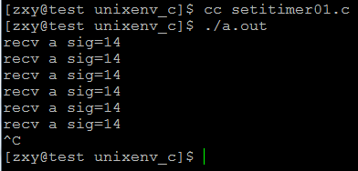
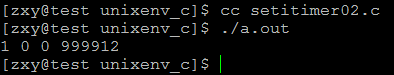
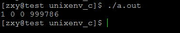
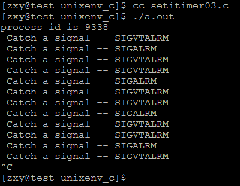

# linux系統編程之信號（八）：三種時間結構及定時器setitimer()詳解


##一，三種時間結構

```c
time_t://seconds

struct timeval {
    long tv_sec; /* seconds */
    long tv_usec; /* microseconds */
};

struct timespec {
    time_t tv_sec; /* seconds */
    long tv_nsec; /* nanoseconds */
};

```

##二，setitimer()

現在的系統中很多程序不再使用alarm調用，而是使用setitimer調用來設置定時器，用getitimer來得到定時器的狀態，

這兩個調用的聲明格式如下：
```c
#include <sys/time.h>

int getitimer(int which, struct itimerval *curr_value); 
int setitimer(int which, const struct itimerval *new_value,struct itimerval *old_value);
```

參數:

- 第一個參數which指定定時器類型
- 第二個參數是結構itimerval的一個實例，結構itimerval形式
- 第三個參數可不做處理。

返回值:成功返回0失敗返回-1

該系統調用給進程提供了三個定時器，它們各自有其獨有的計時域，當其中任何一個到達，就發送一個相應的信號給進程，並使得計時器重新開始。三個計時器由參數which指定，如下所示：

TIMER_REAL：按實際時間計時，計時到達將給進程發送`SIGALRM`信號。

ITIMER_VIRTUAL：僅當進程執行時才進行計時。計時到達將發送`SIGVTALRM`信號給進程。

ITIMER_PROF：當進程執行時和系統為該進程執行動作時都計時。與ITIMER_VIR-TUAL是一對，該定時器經常用來統計進程在用戶態和內核態花費的時間。計時到達將發送`SIGPROF`信號給進程。

定時器中的參數value用來指明定時器的時間，其結構如下：

```c
struct itimerval {
    struct timeval it_interval; /* 第一次之後每隔多長時間 */
    struct timeval it_value; /* 第一次調用要多長時間 */
};
```

該結構中timeval結構定義如下：

```c
truct timeval {
    long tv_sec; /* 秒 */
    long tv_usec; /* 微秒，1秒 = 1000000 微秒*/
};
```

在setitimer 調用中，參數ovalue如果不為空，則其中保留的是上次調用設定的值。定時器將it_value遞減到0時，產生一個信號，並將it_value的值設定為it_interval的值，然後重新開始計時，如此往復。當it_value設定為0時，計時器停止，或者當它計時到期，而it_interval 為0時停止。調用成功時，返回0；錯誤時，返回-1，並設置相應的錯誤代碼errno：

EFAULT：參數value或ovalue是無效的指針。

EINVAL：參數which不是ITIMER_REAL、ITIMER_VIRT或ITIMER_PROF中的一個。

示例一：

```c
#include <unistd.h>
#include <sys/stat.h>
#include <sys/wait.h>
#include <sys/types.h>
#include <fcntl.h>

#include <stdlib.h>
#include <stdio.h>
#include <errno.h>
#include <string.h>
#include <signal.h>
#include <sys/time.h>


#define ERR_EXIT(m) \
    do \
    { \
        perror(m); \
        exit(EXIT_FAILURE); \
    } while(0)

void handler(int sig)
{
    printf("recv a sig=%d\n", sig);
}

int main(int argc, char *argv[])
{
    if (signal(SIGALRM, handler) == SIG_ERR)
        ERR_EXIT("signal error");

    struct timeval tv_interval = {1, 0};
    struct timeval tv_value = {5, 0};
    struct itimerval it;
    it.it_interval = tv_interval;
    it.it_value = tv_value;
    setitimer(ITIMER_REAL, &it, NULL);

    for (;;)
        pause();
    return 0;
}
```

結果：



可以看到第一次發送信號是在5s以後，之後每隔一秒發送一次信號

示例二：獲得產生時鐘信號的剩餘時間


```c
#include <unistd.h>
#include <sys/stat.h>
#include <sys/wait.h>
#include <sys/types.h>
#include <fcntl.h>

#include <stdlib.h>
#include <stdio.h>
#include <errno.h>
#include <string.h>
#include <signal.h>
#include <sys/time.h>


#define ERR_EXIT(m) \
    do \
    { \
        perror(m); \
        exit(EXIT_FAILURE); \
    } while(0)


int main(int argc, char *argv[])
{
    struct timeval tv_interval = {1, 0};
    struct timeval tv_value = {1, 0};
    struct itimerval it;
    it.it_interval = tv_interval;
    it.it_value = tv_value;
    setitimer(ITIMER_REAL, &it, NULL);

    int i;
    for (i=0; i<10000; i++);

//第一種方式獲得剩餘時間
    struct itimerval oit;
    setitimer(ITIMER_REAL, &it, &oit);//利用oit獲得剩餘時間產生時鐘信號
    printf("%d %d %d %d\n", (int)oit.it_interval.tv_sec, (int)oit.it_interval.tv_usec, (int)oit.it_value.tv_sec, (int)oit.it_value.tv_usec);
//第二種方式獲得剩餘時間
    //getitimer(ITIMER_REAL, &it);
    //printf("%d %d %d %d\n", (int)it.it_interval.tv_sec, (int)it.it_interval.tv_usec, (int)it.it_value.tv_sec, (int)it.it_value.tv_usec);

    return 0;
}
```

結果：

用第一種方式：




用第二種方式：利用getitimer在不重新設置時鐘的情況下獲取剩餘時間



剩餘時間是指：距離下一次調用定時器產生信號所需時間，這裡由於for循環不到一秒就執行完，定時器還來不及產生時鐘信號，所以有剩餘時間

示例三：每隔一秒發出一個SIGALRM，每隔0.5秒發出一個SIGVTALRM信號

```c
#include <signal.h>
#include <unistd.h>
#include <stdio.h>
#include <sys/time.h>

void sigroutine(int signo)
{
    switch (signo) {
    case SIGALRM:
        printf("Catch a signal -- SIGALRM\n ");
        break;

    case SIGVTALRM:
        printf("Catch a signal -- SIGVTALRM\n ");
        break;
    }

    return;
}

int main()
{
    struct itimerval value, value2;

    printf("process id is %d\n ", getpid());
    signal(SIGALRM, sigroutine);
    signal(SIGVTALRM, sigroutine);
    value.it_value.tv_sec = 1;
    value.it_value.tv_usec = 0;
    value.it_interval.tv_sec = 1;
    value.it_interval.tv_usec = 0;
    setitimer(ITIMER_REAL, &value, NULL);

    value2.it_value.tv_sec = 0;
    value2.it_value.tv_usec = 500000;
    value2.it_interval.tv_sec = 0;
    value2.it_interval.tv_usec = 500000;
    setitimer(ITIMER_VIRTUAL, &value2, NULL);
    for (;;) ;
}
```

結果：




可知確實是沒兩次SIGVTALRM一次SIGALRM