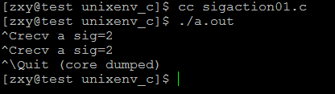
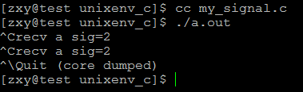
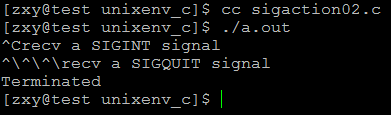
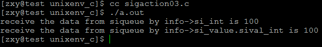
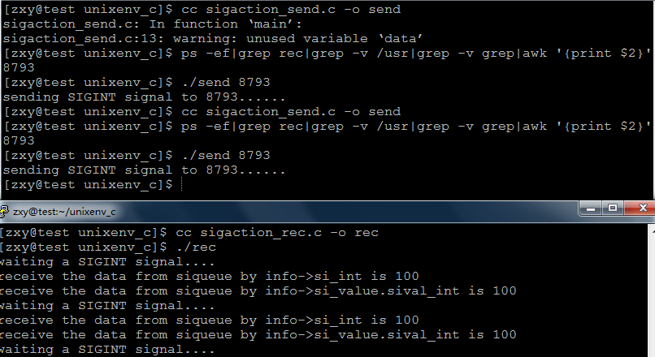

# linux系統編程之信號（六）：信號發送函數sigqueue和信號安裝函數sigaction


## 一，sigaction()

```c
#include <signal.h> 
int sigaction(int signum,const struct sigaction *act,struct sigaction *oldact));
```

sigaction函數用於改變進程接收到特定信號後的行為。該函數的第一個參數為信號的值，可以為除SIGKILL及SIGSTOP外的任何一個特定有效的信號（為這兩個信號定義自己的處理函數，將導致信號安裝錯誤）。第二個參數是指向結構sigaction的一個實例的指針，在結構sigaction的實例中，指定了對特定信號的處理，可以為空，進程會以缺省方式對信號處理；第三個參數oldact指向的對象用來保存原來對相應信號的處理，可指定oldact為NULL。如果把第二、第三個參數都設為NULL，那麼該函數可用於檢查信號的有效性。

第二個參數最為重要，其中包含了對指定信號的處理、信號所傳遞的信息、信號處理函數執行過程中應屏蔽掉哪些函數等等。

sigaction結構定義如下：

```c
struct sigaction {
    union {
        __sighandler_t _sa_handler;
        void (*_sa_sigaction)(int, struct siginfo*, void*)；
    } _u
    sigset_t sa_mask；
    unsigned long sa_flags；
    void (*sa_restorer)(void)；
}
```
其中，sa_restorer，已過時，POSIX不支持它，不應再被使用。

1、聯合數據結構中的兩個元素_sa_handler以及*_sa_sigaction指定信號關聯函數，即用戶指定的信號處理函數。除了可以是用戶自定義的處理函數外，還可以為SIG_DFL(採用缺省的處理方式)，也可以為SIG_IGN（忽略信號）。

2、由_sa_handler指定的處理函數只有一個參數，即信號值，所以信號不能傳遞除信號值之外的任何信息；由_sa_sigaction是指定的信號處理函數帶有三個參數，是為實時信號而設的（當然同樣支持非實時信號），它指定一個3參數信號處理函數。第一個參數為信號值，第三個參數沒有使用（posix沒有規範使用該參數的標準），第二個參數是指向siginfo_t結構的指針，結構中包含信號攜帶的數據值，參數所指向的結構如下：

```c
typedef struct siginfo_t {
    int si_signo;//信號編號
    int si_errno;//如果為非零值則錯誤代碼與之關聯
    int si_code;//說明進程如何接收信號以及從何處收到
    pid_t si_pid;//適用於SIGCHLD，代表被終止進程的PID
    pid_t si_uid;//適用於SIGCHLD,代表被終止進程所擁有進程的UID
    int si_status;//適用於SIGCHLD，代表被終止進程的狀態
    clock_t si_utime;//適用於SIGCHLD，代表被終止進程所消耗的用戶時間
    clock_t si_stime;//適用於SIGCHLD，代表被終止進程所消耗系統的時間
    sigval_t si_value;
    int si_int;
    void* si_ptr;
    void* si_addr;
    int si_band;
    int si_fd;
};
```

siginfo_t結構中的聯合數據成員確保該結構適應所有的信號，比如對於實時信號來說，則實際採用下面的結構形式：

```c
typedef struct {
    int si_signo;
    int si_errno;
    int si_code;
    union sigval si_value;
} siginfo

```

結構的第四個域同樣為一個聯合數據結構：

```c
union sigval {
    int sival_int;
    void* sival_ptr;
}
```
採用聯合數據結構，說明siginfo_t結構中的si_value要麼持有一個4字節的整數值，要麼持有一個指針，這就構成了與信號相關的數據。在信號的處理函數中，包含這樣的信號相關數據指針，但沒有規定具體如何對這些數據進行操作，操作方法應該由程序開發人員根據具體任務事先約定。

sigval結構體：系統調用sigqueue發送信號時，sigqueue的第三個參數就是sigval聯合數據結構，當調用sigqueue時，該數據結構中的數據就將拷貝到信號處理函數的第二個參數中。這樣，在發送信號同時，就可以讓信號傳遞一些附加信息。信號可以傳遞信息對程序開發是非常有意義的。

`siginfo_t.si_value與sigqueue(pid_t pid, int sig, const union sigval val)第三個參數關聯即：`

`所以通過siginfo_t.si_value可以獲得sigqueue(pid_t pid, int sig, const union sigval val)第三個參數傳遞過來的數據。`

`如：siginfo_t.si_value.sival_int或siginfo_t.si_value.sival_ptr`

`其實siginfo_t.si_int直接與sigval.sival_int關聯`

`siginfo_t.si_ptr直接與sigval.sival_ptr關聯，所以也可同這種方式獲得sigqueue發送過來的數據。`


信號參數的傳遞過程可圖示如下：


3、sa_mask指定在信號處理程序執行過程中，哪些信號應當被阻塞。缺省情況下當前信號本身被阻塞，防止信號的嵌套發送，除非指定SA_NODEFER或者SA_NOMASK標誌位，處理程序執行完後，被阻塞的信號開始執行。

注：請注意sa_mask指定的信號阻塞的前提條件，是在由sigaction（）安裝信號的處理函數執行過程中由sa_mask指定的信號才被阻塞。

4、sa_flags中包含了許多標誌位，包括剛剛提到的SA_NODEFER及SA_NOMASK標誌位。另一個比較重要的標誌位是SA_SIGINFO，當設定了該標誌位時，表示信號附帶的參數可以被傳遞到信號處理函數中，因此，應該為sigaction結構中的sa_sigaction指定處理函數，而不應該為sa_handler指定信號處理函數，否則，設置該標誌變得毫無意義。即使為sa_sigaction指定了信號處理函數，如果不設置SA_SIGINFO，信號處理函數同樣不能得到信號傳遞過來的數據，在信號處理函數中對這些信息的訪問都將導致段錯誤（Segmentation fault）。

注：很多文獻在闡述該標誌位時都認為，如果設置了該標誌位，就必須定義三參數信號處理函數。實際不是這樣的，驗證方法很簡單：自己實現一個單一參數信號處理函數，並在程序中設置該標誌位，可以察看程序的運行結果。實際上，可以把該標誌位看成信號是否傳遞參數的開關，如果設置該位，則傳遞參數；否則，不傳遞參數。

##二，sigqueue()

之前學過kill,raise,alarm,abort等功能稍簡單的信號發送函數，現在我們學習一種新的功能比較強大的信號發送函數sigqueue.

```c
#include <sys/types.h>
#include <signal.h>
int sigqueue(pid_t pid, int sig, const union sigval val)
```

調用成功返回 0；否則，返回 -1。

sigqueue()是比較新的發送信號系統調用，主要是針對實時信號提出的（當然也支持前32種），支持信號帶有參數，與函數sigaction()配合使用。

sigqueue的第一個參數是指定接收信號的進程ID，第二個參數確定即將發送的信號，第三個參數是一個聯合數據結構union sigval，指定了信號傳遞的參數，即通常所說的4字節值。

```c
typedef union sigval {
    int  sival_int;
    void* sival_ptr;
} sigval_t;
```

sigqueue()比kill()傳遞了更多的附加信息，但sigqueue()只能向一個進程發送信號，而不能發送信號給一個進程組。如果signo=0，將會執行錯誤檢查，但實際上不發送任何信號，0值信號可用於檢查pid的有效性以及當前進程是否有權限向目標進程發送信號。

在調用sigqueue時，sigval_t指定的信息會拷貝到對應sig 註冊的3參數信號處理函數的siginfo_t結構中，這樣信號處理函數就可以處理這些信息了。由於sigqueue系統調用支持發送帶參數信號，所以比kill()系統調用的功能要靈活和強大得多。

##三，sigqueue與sigaction應用實例
實例一：利用sigaction安裝SIGINT信號

```c
#include <unistd.h>
#include <sys/stat.h>
#include <sys/wait.h>
#include <sys/types.h>
#include <fcntl.h>

#include <stdlib.h>
#include <stdio.h>
#include <errno.h>
#include <string.h>
#include <signal.h>


#define ERR_EXIT(m) \
    do \
    { \
        perror(m); \
        exit(EXIT_FAILURE); \
    } while(0)

void handler(int sig);

int main(int argc, char *argv[])
{
    struct sigaction act;
    act.sa_handler = handler;
    sigemptyset(&act.sa_mask);
    act.sa_flags = 0;
    //因為不關心SIGINT上一次的struct sigaction所以，oact為NULL
    //與signal(handler,SIGINT)相同
    if (sigaction(SIGINT, &act, NULL) < 0)
        ERR_EXIT("sigaction error\n");

    for (;;)
        pause();
    return 0;
}

void handler(int sig)
{
    printf("recv a sig=%d\n", sig);
}
```

結果：



實例二：利用sigaction實現signal，實際上signal底層實現就是利用sigaction

```c
#include <unistd.h>
#include <sys/stat.h>
#include <sys/wait.h>
#include <sys/types.h>
#include <fcntl.h>

#include <stdlib.h>
#include <stdio.h>
#include <errno.h>
#include <string.h>
#include <signal.h>


#define ERR_EXIT(m) \
    do \
    { \
        perror(m); \
        exit(EXIT_FAILURE); \
    } while(0)

void handler(int sig);
__sighandler_t my_signal(int sig, __sighandler_t handler);

int main(int argc, char *argv[])
{
    my_signal(SIGINT, handler);
    for (;;)
        pause();
    return 0;
}

__sighandler_t my_signal(int sig, __sighandler_t handler)
{
    struct sigaction act;
    struct sigaction oldact;
    act.sa_handler = handler;
    sigemptyset(&act.sa_mask);
    act.sa_flags = 0;

    if (sigaction(sig, &act, &oldact) < 0)
        return SIG_ERR;

    return oldact.sa_handler;
}

void handler(int sig)
{
    printf("recv a sig=%d\n", sig);
}
```

結果：




可知my_signal與系統調用signal具有相同的效果

實例三：驗證sigaction.sa_mask效果

```c
#include <unistd.h>
#include <sys/stat.h>
#include <sys/wait.h>
#include <sys/types.h>
#include <fcntl.h>

#include <stdlib.h>
#include <stdio.h>
#include <errno.h>
#include <string.h>
#include <signal.h>


#define ERR_EXIT(m) \
    do \
    { \
        perror(m); \
        exit(EXIT_FAILURE); \
    } while(0)

void handler(int sig);

int main(int argc, char *argv[])
{
    struct sigaction act;
    act.sa_handler = handler;
    sigemptyset(&act.sa_mask);
    sigaddset(&act.sa_mask, SIGQUIT);
    act.sa_flags = 0;

    if (sigaction(SIGINT, &act, NULL) < 0)
        ERR_EXIT("sigaction error");

    struct sigaction act2;
    act2.sa_handler = handler;
    sigemptyset(&act2.sa_mask);
    act2.sa_flags = 0;

    if (sigaction(SIGQUIT, &act2, NULL) < 0)
        ERR_EXIT("sigaction error");

    for (;;)
        pause();
    return 0;
}

void handler(int sig)
{
    if(sig == SIGINT){

        printf("recv a SIGINT signal\n");
        sleep(5);
    }
    if (sig == SIGQUIT)
    {
        printf("recv a SIGQUIT signal\n");
    }
}
```

結果：




可知，安裝信號SIGINT時，將SIGQUIT加入到sa_mask阻塞集中，則當SIGINT信號正在執行處理函數時，SIGQUIT信號將被阻塞，只有當SIGINT信號處理函數執行完後才解除對SIGQUIT信號的阻塞，由於SIGQUIT是不可靠信號，不支持排隊，所以只遞達一次

示例四：給自身發送int型數據

```c
#include <stdio.h>
#include <unistd.h>
#include <signal.h>
#include <stdlib.h>

void sighandler(int signo, siginfo_t *info,void *ctx);
//給自身傳遞信息
int main(void)
{

    struct sigaction act;
    act.sa_sigaction = sighandler;
    sigemptyset(&act.sa_mask);
    act.sa_flags = SA_SIGINFO;//信息傳遞開關
    if(sigaction(SIGINT,&act,NULL) == -1){
        perror("sigaction error");
        exit(EXIT_FAILURE);
    }
    sleep(2);
    union sigval mysigval;
    mysigval.sival_int = 100;
    if(sigqueue(getpid(),SIGINT,mysigval) == -1){
        perror("sigqueue error");
        exit(EXIT_FAILURE);
    }
    return 0;
}

void sighandler(int signo, siginfo_t *info,void *ctx)
{
    //以下兩種方式都能獲得sigqueue發來的數據
    printf("receive the data from siqueue by info->si_int is %d\n",info->si_int);
    printf("receive the data from siqueue by info->si_value.sival_int is %d\n",info->si_value.sival_int);

}
```

結果：



示例五：進程間傳遞數據

接收端：

```c
#include <stdio.h>
#include <unistd.h>
#include <signal.h>
#include <stdlib.h>

void sighandler(int signo, siginfo_t *info,void *ctx);
//給自身傳遞信息
int main(void)
{

    struct sigaction act;
    act.sa_sigaction = sighandler;
    sigemptyset(&act.sa_mask);
    act.sa_flags = SA_SIGINFO;//信息傳遞開關
    if(sigaction(SIGINT,&act,NULL) == -1){
        perror("sigaction error");
        exit(EXIT_FAILURE);
    }
    for(; ;){
        printf("waiting a SIGINT signal....\n");
        pause();
    }
    return 0;
}

void sighandler(int signo, siginfo_t *info,void *ctx)
{
    //以下兩種方式都能獲得sigqueue發來的數據
    printf("receive the data from siqueue by info->si_int is %d\n",info->si_int);
    printf("receive the data from siqueue by info->si_value.sival_int is %d\n",info->si_value.sival_int);

}
```

發送端：

```c
#include <stdio.h>
#include <unistd.h>
#include <signal.h>
#include <stdlib.h>

int main(int argc, char **argv)
{
    if(argc != 2){
        fprintf(stderr,"usage:%s pid\n",argv[0]);
        exit(EXIT_FAILURE);
    }
    pid_t pid = atoi(argv[1]);    
    sleep(2);
    union sigval mysigval;
    mysigval.sival_int = 100;
    printf("sending SIGINT signal to %d......\n",pid);
    if(sigqueue(pid,SIGINT,mysigval) == -1){
        perror("sigqueue error");
        exit(EXIT_FAILURE);
    }
    return 0;
}
```

結果：



由圖可知接收成功