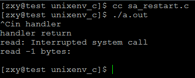
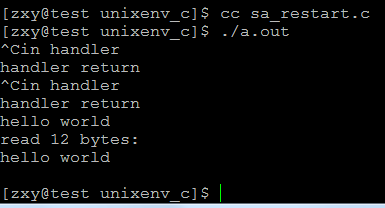

# linux系統編程之信號（七）：被信號中斷的系統調用和庫函數處理方式


 一些IO系統調用執行時, 如 read 等待輸入期間, 如果收到一個信號,系統將中斷read, 轉而執行信號處理函數. 當信號處理返回後, 系統遇到了一個問題: 是重新開始這個系統調用, 還是讓系統調用失敗?早期UNIX系統的做法是, 中斷系統調用, 並讓系統調用失敗, 比如read返回 -1, 同時設置 errno 為 EINTR中斷了的系統調用是沒有完成的調用, 它的失敗是臨時性的, 如果再次調用則可能成功, 這並不是真正的失敗, 所以要對這種情況進行處理, 典型的方式為:
 
 ```c
 while (1)
{
    n = read(fd, buf, BUFSIZ);

    if (n == -1 && errno != EINTR) {
        printf("read error\n");
        break;
    }

    if (n == 0) {
        printf("read done\n");
        break;
    }
}
 ```
 
這樣做邏輯比較繁瑣, 事實上, 我們可以從信號的角度來解決這個問題,  安裝信號的時候, 設置 SA_RESTART屬性, 那麼當信號處理函數返回後, 被該信號中斷的系統調用將自動恢復.

示例程序：

```c
#include <signal.h>
#include <stdio.h>
#include <stdlib.h>
#include <error.h>
#include <string.h>
#include <unistd.h>

void sig_handler(int signum)
{
    printf("in handler\n");
    sleep(1);
    printf("handler return\n");
}

int main(int argc, char **argv)
{
    char buf[100];
    int ret;
    struct sigaction action, old_action;

    action.sa_handler = sig_handler;
    sigemptyset(&action.sa_mask);
    action.sa_flags = 0;
    /* 版本1:不設置SA_RESTART屬性
     * 版本2:設置SA_RESTART屬性 */
    //action.sa_flags |= SA_RESTART;

    sigaction(SIGINT, NULL, &old_action);
    if (old_action.sa_handler != SIG_IGN) {
        sigaction(SIGINT, &action, NULL);
    }

    bzero(buf, 100);

    ret = read(0, buf, 100);
    if (ret == -1) {
        perror("read");
    }

    printf("read %d bytes:\n", ret);
    printf("%s\n", buf);

    return 0;
}
```

當sa_flags不設置：SA_RESTART時：

結果：



設置後：

當被中斷後，重新執行



```c
man幫助說明：

Interruption of system calls and library functions by signal handlers
       If a signal handler is invoked while a system call or library
       function call is blocked, then either:

       * the call is automatically restarted after the signal handler
         returns; or

       * the call fails with the error EINTR.

       Which of these two behaviors occurs depends on the interface and
       whether or not the signal handler was established using the
       SA_RESTART flag (see sigaction(2)).  The details vary across UNIX
       systems; below, the details for Linux.

       If a blocked call to one of the following interfaces is interrupted
       by a signal handler, then the call will be automatically restarted
       after the signal handler returns if the SA_RESTART flag was used;
       otherwise the call will fail with the error EINTR:

           * read(2), readv(2), write(2), writev(2), and ioctl(2) calls on
             "slow" devices.  A "slow" device is one where the I/O call may
             block for an indefinite time, for example, a terminal, pipe, or
             socket.  (A disk is not a slow device according to this
             definition.)  If an I/O call on a slow device has already
             transferred some data by the time it is interrupted by a signal
             handler, then the call will return a success status (normally,
             the number of bytes transferred).

           * open(2), if it can block (e.g., when opening a FIFO; see
             fifo(7)).


           * wait(2), wait3(2), wait4(2), waitid(2), and waitpid(2).

           * Socket interfaces: accept(2), connect(2), recv(2), recvfrom(2),
             recvmsg(2), send(2), sendto(2), and sendmsg(2), unless a
             timeout has been set on the socket (see below).

           * File locking interfaces: flock(2) and fcntl(2) F_SETLKW.

           * POSIX message queue interfaces: mq_receive(3),
             mq_timedreceive(3), mq_send(3), and mq_timedsend(3).

           * futex(2) FUTEX_WAIT (since Linux 2.6.22; beforehand, always
             failed with EINTR).

           * POSIX semaphore interfaces: sem_wait(3) and sem_timedwait(3)
             (since Linux 2.6.22; beforehand, always failed with EINTR).

       The following interfaces are never restarted after being interrupted
       by a signal handler, regardless of the use of SA_RESTART; they always
       fail with the error EINTR when interrupted by a signal handler:

           * Socket interfaces, when a timeout has been set on the socket
             using setsockopt(2): accept(2), recv(2), recvfrom(2), and
             recvmsg(2), if a receive timeout (SO_RCVTIMEO) has been set;
             connect(2), send(2), sendto(2), and sendmsg(2), if a send
             timeout (SO_SNDTIMEO) has been set.
       * Interfaces used to wait for signals: pause(2), sigsuspend(2),
             sigtimedwait(2), and sigwaitinfo(2).

           * File descriptor multiplexing interfaces: epoll_wait(2),
             epoll_pwait(2), poll(2), ppoll(2), select(2), and pselect(2).

           * System V IPC interfaces: msgrcv(2), msgsnd(2), semop(2), and
             semtimedop(2).

           * Sleep interfaces: clock_nanosleep(2), nanosleep(2), and
             usleep(3).

           * read(2) from an inotify(7) file descriptor.

           * io_getevents(2).

       The sleep(3) function is also never restarted if interrupted by a
       handler, but gives a success return: the number of seconds remaining
       to sleep.

```