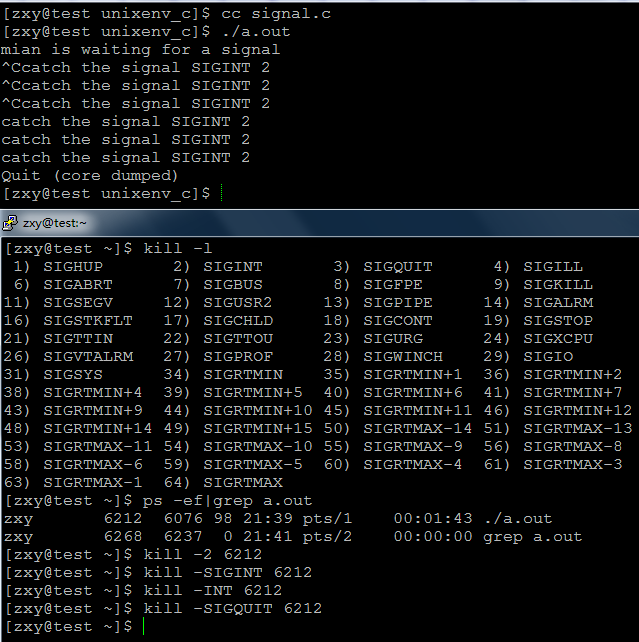
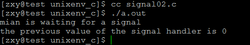
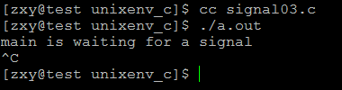
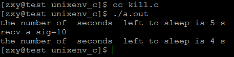
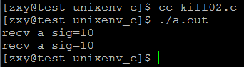
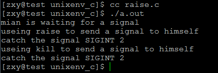

# linux系统编程之信号（三）：信号安装、signal、kill，arise讲解


## 一，信号安装
如果进程要处理某一信号，那么就要在进程中安装该信号。安装信号主要用来确定信号值及进程针对该信号值的动作之间的映射关系，即进程将要处理哪个信号；该信号被传递给进程时，将执行何种操作。

linux主要有两个函数实现信号的安装：signal()、sigaction()。其中signal()只有两个参数，不支持信号传递信息，主要是用于前32种非实时信号的安装；而sigaction()是较新的函数（由两个系统调用实现：sys_signal以及sys_rt_sigaction），有三个参数，支持信号传递信息，主要用来与 sigqueue() 系统调用配合使用，当然，sigaction()同样支持非实时信号的安装。sigaction()优于signal()主要体现在支持信号带有参数。

## 二，signal()用法

```c
#include <signal.h>
typedef void (*__sighandler_t) (int);
#define SIG_ERR ((__sighandler_t) -1)
#define SIG_DFL ((__sighandler_t) 0)
#define SIG_IGN ((__sighandler_t) 1)
void (*signal(int signum, void (*handler))(int)))(int);
```

如果该函数原型不容易理解的话，可以参考下面的分解方式来理解：

```c
typedef void (*sighandler_t)(int)；
sighandler_t signal(int signum, sighandler_t handler));
```

第一个参数指定信号的值，第二个参数指定针对前面信号值的处理，可以忽略该信号（参数设为SIG_IGN）；可以采用系统默认方式处理信号(参数设为SIG_DFL)；也可以自己实现处理方式(参数指定一个函数地址)。

如果signal()调用成功，返回最后一次也就是上一次为安装信号signum而调用signal()时的handler值；失败则返回SIG_ERR。

传递给信号处理例程的整数参数是信号值，这样可以使得一个信号处理例程处理多个信号。

man帮助说明：

```c
DESCRIPTION 
       The behavior of signal() varies across Unix versions, and has also var- 
       ied historically across different versions of Linux.   Avoid  its  use: 
       use sigaction(2) instead.  See Portability below.

       signal() sets the disposition of the signal signum to handler, which is 
       either SIG_IGN, SIG_DFL, or the address of a  programmer-defined  func- 
       tion (a "signal handler").

       If  the signal signum is delivered to the process, then one of the fol- 
       lowing happens:

       *  If the disposition is set to SIG_IGN, then the signal is ignored.

       *  If the disposition is set to SIG_DFL, then the default action  asso- 
          ciated with the signal (see signal(7)) occurs.

       *  If  the disposition is set to a function, then first either the dis- 
          position is reset to SIG_DFL, or the signal is blocked  (see  Porta- 
          bility  below), and then handler is called with argument signum.  If 
          invocation of the handler caused the signal to be blocked, then  the

          signal is unblocked upon return from the handler.

       The signals SIGKILL and SIGSTOP cannot be caught or ignored.

RETURN VALUE 
       signal()  returns  the previous value of the signal handler, or SIG_ERR 
       on error. 
```

示例程序：

```c
#include <stdio.h>
#include <unistd.h>
#include <signal.h>
#include <stdlib.h>

void sig_handler(int signo);
int main(void)
{
    printf("mian is waiting for a signal\n");
    if(signal(SIGINT,sig_handler) == SIG_ERR){
        perror("signal errror");
        exit(EXIT_FAILURE);
    }
    for(; ;);//有时间让我们发送信号


    return 0;
}

void sig_handler(int signo)
{
    printf("catch the signal SIGINT %d\n",signo);
}
```


结果：





可知我们捕获了SIGINT信号，每当我们按下ctrl+c或利用kill发送SIGINT信号时，执行我们安装的信号处理函数，当我们按下：ctrl+\或kill –SIGQUIT pid发送SIGQUIT信号时，程序退出，那是因为进程对SIGQUIT信号的默认处理动作是退出程序。

现在我们来获得进程的最后一次为安装信号时所指定的处理函数：

```c
#include <stdio.h>
#include <unistd.h>
#include <signal.h>
#include <stdlib.h>
#include <sys/types.h>

void sig_handler(int signo);
int main(void)
{
    printf("main is waiting for a signal\n");
    __sighandler_t prehandler;
    prehandler = signal(SIGINT,sig_handler);
    if(prehandler == SIG_ERR){
        perror("signal errror");
        exit(EXIT_FAILURE);
    }

    printf("the previous value of the signal handler is %d\n",(int)prehandler);
    //for(; ;);//有时间让我们发送信号


    return 0;
}

void sig_handler(int signo)
{
    printf("catch the signal SIGINT %d\n",signo);
}
```

结果：




为0，由前面的宏定义：#define SIG_DFL ((__sighandler_t) 0)，可知处理动作为SIG_DFL，而SIGINT默认的处理动作就是终止进程

示例：

```c
#include <stdio.h>
#include <unistd.h>
#include <signal.h>
#include <stdlib.h>
#include <sys/types.h>

void sig_handler(int signo);
int main(void)
{
    printf("main is waiting for a signal\n");
    __sighandler_t prehandler;
    prehandler = signal(SIGINT,SIG_DFL);
    if(prehandler == SIG_ERR){
        perror("signal errror");
        exit(EXIT_FAILURE);
    }

    for(; ;);//有时间让我们发送信号


    return 0;
}
```

结果：




## 三，kill()发送信号
发送信号的主要函数有：kill()、raise()、 sigqueue()、alarm()、setitimer()以及abort()。

这里我们先将kill函数使用：
```c
#include <sys/types.h>
#include <signal.h>
int kill(pid_t pid,int signo)
```

该系统调用可以用来向任何进程或进程组发送任何信号。参数pid的值为信号的接收进程

- pid>0 进程ID为pid的进程
- pid=0 同一个进程组的进程
- pid<0 pid!=-1 进程组ID为 -pid的所有进程
- pid=-1 除发送给每一个调用进程有权限发送的进程除自身及1（init）进程外

Sinno是信号值，当为0时（即空信号），实际不发送任何信号，但照常进行错误检查，因此，可用于检查目标进程是否存在，以及当前进程是否具有向目标发送信号的权限（root权限的进程可以向任何进程发送信号，非root权限的进程只能向属于同一个session或者同一个用户的进程发送信号）。

Kill()最常用于pid>0时的信号发送。该调用执行成功时，返回值为0；错误时，返回-1，并设置相应的错误代码errno。下面是一些可能返回的错误代码：

EINVAL：指定的信号sig无效。

ESRCH：参数pid指定的进程或进程组不存在。注意，在进程表项中存在的进程，可能是一个还没有被wait收回，但已经终止执行的僵死进程。

EPERM： 进程没有权力将这个信号发送到指定接收信号的进程。因为，一个进程被允许将信号发送到进程pid时，必须拥有root权力，或者是发出调用的进程的UID 或EUID与指定接收的进程的UID或保存用户ID（savedset-user-ID）相同。如果参数pid小于-1，即该信号发送给一个组，则该错误表示组中有成员进程不能接收该信号。

man帮助说明：

```c
DESCRIPTION 
       The  kill()  system  call can be used to send any signal to any process 
       group or process.

       If pid is positive, then signal sig is sent to the process with the  ID 
       specified by pid.

       If pid equals 0, then sig is sent to every process in the process group 
       of the calling process.

       If pid equals -1, then sig is sent to every process for which the call- 
       ing  process  has  permission  to  send  signals,  except for process 1 
       (init), but see below.

       If pid is less than -1, then sig is sent to every process in  the  pro- 
       cess group whose ID is -pid.

       If  sig  is 0, then no signal is sent, but error checking is still per- 
       formed; this can be used to check for the existence of a process ID  or 
       process group ID. 

       For  a  process  to  have permission to send a signal it must either be 
       privileged (under Linux: have the CAP_KILL capability), or the real  or 
       effective  user  ID of the sending process must equal the real or saved 
       set-user-ID of the target process.  In the case of SIGCONT it  suffices 
       when the sending and receiving processes belong to the same session.

RETURN VALUE 
       On success (at least one signal was sent), zero is returned.  On error, 
       -1 is returned, and errno is set appropriately.

ERRORS 
       EINVAL An invalid signal was specified.

       EPERM  The process does not have permission to send the signal  to  any 
              of the target processes.

       ESRCH  The  pid or process group does not exist.  Note that an existing 
              process might be a zombie, a  process  which  already  committed 
              termination, but has not yet been wait(2)ed for.

```

示例程序：

```c
#include <unistd.h>
#include <sys/stat.h>
#include <sys/wait.h>
#include <sys/types.h>
#include <fcntl.h>

#include <stdlib.h>
#include <stdio.h>
#include <errno.h>
#include <string.h>
#include <signal.h>


#define ERR_EXIT(m) \
    do \
    { \
        perror(m); \
        exit(EXIT_FAILURE); \
    } while(0)

void handler(int sig);
int main(int argc, char *argv[])
{
    if (signal(SIGUSR1, handler) == SIG_ERR)
        ERR_EXIT("signal error");
    pid_t pid = fork();
    if (pid == -1)
        ERR_EXIT("fork error");

    if (pid == 0)
    {
        sleep(1);
        kill(getppid(), SIGUSR1);
        exit(EXIT_SUCCESS);
    }

    int n = 5;
    do
    {
        printf("the number of  seconds  left to sleep is %d s\n",n);
        n = sleep(n);
    } while (n > 0);
    return 0;
}

void handler(int sig)
{
    printf("recv a sig=%d\n", sig);
}
```



以上程序里有子进程给父进程发送SIGUSR1信号，父进程收到信号后，睡眠被中断，然后去执行信号处理函数，返回后继续睡眠剩余的时间后退出程序。

现在利用kill给与给定pid同组所有进程发送信号：

```c
#include <unistd.h>
#include <sys/stat.h>
#include <sys/wait.h>
#include <sys/types.h>
#include <fcntl.h>

#include <stdlib.h>
#include <stdio.h>
#include <errno.h>
#include <string.h>
#include <signal.h>


#define ERR_EXIT(m) \
    do \
    { \
        perror(m); \
        exit(EXIT_FAILURE); \
    } while(0)

void handler(int sig);
int main(int argc, char *argv[])
{
    if (signal(SIGUSR1, handler) == SIG_ERR)
        ERR_EXIT("signal error");
    pid_t pid = fork();
    if (pid == -1)
        ERR_EXIT("fork error");

    if (pid == 0)
    {
        pid = getpgrp();
        kill(-pid, SIGUSR1);
        //kilpg(getpgrp(), SIGUSR1);
        exit(EXIT_SUCCESS);
    }

    int n = 5;
    do
    {
        n = sleep(n);
    } while (n > 0);
    return 0;
}

void handler(int sig)
{
   printf("recv a sig=%d\n", sig);
}
```
结果：




可知收到进行了两次信号处理函数的执行：因为当前所属组中只有父子两个进程，从上可知有两种方式给组进程发送信号：kill和killpg

## 四，arise函数

```c
#include <signal.h>

int raise(int signo)
```

向进程本身发送信号，参数为即将发送的信号值。调用成功返回 0；否则，返回 -1。

man帮助说明：

```c
DESCRIPTION 
       The  raise()  function sends a signal to the calling process or thread. 
       In a single-threaded program it is equivalent to

           kill(getpid(), sig);

       In a multithreaded program it is equivalent to

           pthread_kill(pthread_self(), sig);

       If the signal causes a handler to be called, raise() will  only  return 
       after the signal handler has returned.

RETURN VALUE 
       raise() returns 0 on success, and non-zero for failure.
```

示例程序：

```c
#include <stdio.h>
#include <unistd.h>
#include <signal.h>
#include <stdlib.h>

void sig_handler(int signo);
int main(void)
{
    printf("mian is waiting for a signal\n");
    if(signal(SIGINT,sig_handler) == SIG_ERR){
        perror("signal errror");
        exit(EXIT_FAILURE);
    }
    printf("useing raise to send a signal to himself\n");
    raise(SIGINT);
    sleep(1);
    printf("useing kill to send a signal to himself\n");
    kill(getpid(),SIGINT);
    
    return 0;
}

void sig_handler(int signo)
{
    printf("catch the signal SIGINT %d\n",signo);
}
```

结果：



可知两种方式都可以给自身发送信号。

