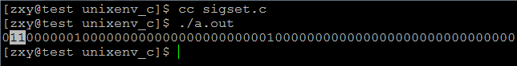
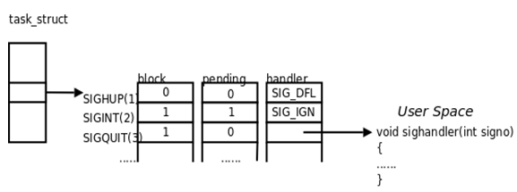
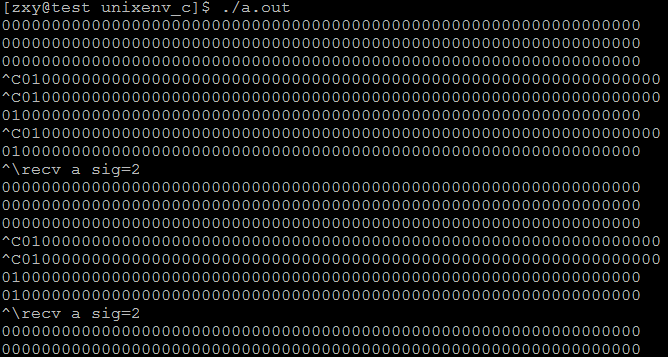
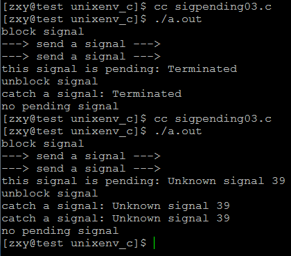

# linux系統編程之信號（五）：信號集操作函數，信號阻塞與未決


## 一，信號集及相關操作函數
信號集被定義為一種數據類型：

```c
typedef struct {
    unsigned long sig[_NSIG_WORDS]；
} sigset_t
```

信號集用來描述信號的集合，每個信號佔用一位（64位）。Linux所支持的所有信號可以全部或部分的出現在信號集中，主要與信號阻塞相關函數配合使用。下面是為信號集操作定義的相關函數：

```c
#include <signal.h>

int sigemptyset(sigset_t *set)；

int sigfillset(sigset_t *set)；

int sigaddset(sigset_t *set, int signum)

int sigdelset(sigset_t *set, int signum)；

int sigismember(const sigset_t *set, int signum)；
```
 
```
sigemptyset(sigset_t *set)初始化由set指定的信號集，信號集裡面的所有信號被清空，相當於64為置0；

sigfillset(sigset_t *set)調用該函數後，set指向的信號集中將包含linux支持的64種信號，相當於64為都置1；

sigaddset(sigset_t *set, int signum)在set指向的信號集中加入signum信號，相當於將給定信號所對應的位置1；

sigdelset(sigset_t *set, int signum)在set指向的信號集中刪除signum信號，相當於將給定信號所對應的位置0；

sigismember(const sigset_t *set, int signum)判定信號signum是否在set指向的信號集中，相當於檢查給定信號所對應的位是0還是1。
```

示例程序：

```c
#include <stdio.h>
#include <unistd.h>
#include <stdlib.h>
#include <signal.h>
#include <sys/types.h>
void print_sigset(sigset_t *set);
int main(void)
{
    sigset_t myset;
    sigemptyset(&myset);
    sigaddset(&myset,SIGINT);
    sigaddset(&myset,SIGQUIT);
    sigaddset(&myset,SIGUSR1);
    sigaddset(&myset,SIGRTMIN);
    print_sigset(&myset);

    return 0;

}
void print_sigset(sigset_t *set)
{
    int i;
    for(i = 1; i < NSIG; ++i){
        if(sigismember(set,i))
            printf("1");
        else
            printf("0");
    }
    putchar('\n');
}
```

結果：



可以看到添加信號的相應位置1.

## 二，信號阻塞與未決

man幫助說明：

```c
Signal mask and pending signals
       A signal may be blocked, which means that it will not be delivered
       until it is later unblocked.  Between the time when it is generated
       and when it is delivered a signal is said to be pending.

       Each thread in a process has an independent signal mask, which
       indicates the set of signals that the thread is currently blocking.
       A thread can manipulate its signal mask using pthread_sigmask(3).  In
       a traditional single-threaded application, sigprocmask(2) can be used
       to manipulate the signal mask.
```

執行信號的處理動作稱為信號遞達（Delivery），信號從產生到遞達之間的狀態，稱為信號未決（Pending）。進程可以選擇阻塞（Block）某個信號。被阻塞的信號產生時將保持在未決狀態，直到進程解除對此信號的阻塞，才執行遞達的動作。注意，阻塞和忽略是不同的，只要信號被阻塞就不會遞達，而忽略是在遞達之後可選的一種處理動作。每個進程都有一個用來描述哪些信號遞送到進程時將被阻塞的信號集，該信號集中的所有信號在遞送到進程後都將被阻塞。
信號在內核中的表示可以看作是這樣的：


看圖說話：
block集（阻塞集、屏蔽集）：一個進程所要屏蔽的信號，在對應要屏蔽的信號位置1
pending集（未決信號集）：如果某個信號在進程的阻塞集中，則也在未決集中對應位置1，表示該信號不能被遞達，不會被處理
handler（信號處理函數集）：表示每個信號所對應的信號處理函數，當信號不在未決集中時，將被調用
 
以下是與信號阻塞及未決相關的函數操作：

```c
#include <signal.h>

int sigprocmask(int  how,  const  sigset_t *set, sigset_t *oldset))；

int sigpending(sigset_t *set));

int sigsuspend(const sigset_t *mask))；
```
 
- sigprocmask()函數能夠根據參數how來實現對信號集的操作，操作主要有三種：
    - SIG_BLOCK 在進程當前阻塞信號集中添加set指向信號集中的信號，相當於：mask=mask|set
    - SIG_UNBLOCK 如果進程阻塞信號集中包含set指向信號集中的信號，則解除對該信號的阻塞，相當於：mask=mask|~set
    - SIG_SETMASK 更新進程阻塞信號集為set指向的信號集，相當於mask=set
    

sigpending(sigset_t *set))獲得當前已遞送到進程，卻被阻塞的所有信號，在set指向的信號集中返回結果。

sigsuspend(const sigset_t *mask))用於在接收到某個信號之前, 臨時用mask替換進程的信號掩碼, 並暫停進程執行，直到收到信號為止。

sigsuspend 返回後將恢復調用之前的信號掩碼。信號處理函數完成後，進程將繼續執行。該系統調用始終返回-1，並將errno設置為EINTR。

示例程序：

```c
#include <unistd.h>
#include <sys/stat.h>
#include <sys/wait.h>
#include <sys/types.h>
#include <fcntl.h>

#include <stdlib.h>
#include <stdio.h>
#include <errno.h>
#include <string.h>
#include <signal.h>


#define ERR_EXIT(m) \
    do \
    { \
        perror(m); \
        exit(EXIT_FAILURE); \
    } while(0)

void handler(int sig);
void printsigset(sigset_t *set)
{
    int i;
    for (i=1; i<NSIG; ++i)
    {
        if (sigismember(set, i))
            putchar('1');
        else
            putchar('0');
    }
    printf("\n");
}

int main(int argc, char *argv[])
{
    sigset_t pset;
    sigset_t bset;
    sigemptyset(&bset);
    sigaddset(&bset, SIGINT);
    if (signal(SIGINT, handler) == SIG_ERR)
        ERR_EXIT("signal error");
    if (signal(SIGQUIT, handler) == SIG_ERR)
        ERR_EXIT("signal error");

    sigprocmask(SIG_BLOCK, &bset, NULL);//將信號加入進程阻塞集中
    for (;;)
    {
        sigpending(&pset);
        printsigset(&pset);
        sleep(1);
    }
    return 0;
}

void handler(int sig)
{
    if (sig == SIGINT)
        printf("recv a sig=%d\n", sig);
    else if (sig == SIGQUIT)
    {
        sigset_t uset;
        sigemptyset(&uset);
        sigaddset(&uset, SIGINT);
        sigprocmask(SIG_UNBLOCK, &uset, NULL);
    }
}
```

結果：




說明：程序首先將SIGINT信號加入進程阻塞集（屏蔽集）中，一開始並沒有發送SIGINT信號，所以進程未決集中沒有處於未決態的信號，當我們連續按下ctrl+c時，向進程發送SIGINT信號，由於SIGINT信號處於進程的阻塞集中，所以發送的SIGINT信號不能遞達，也是就是處於未決狀態，所以當我打印未決集合時發現SIGINT所對應的位為1，現在我們按下ctrl+\，發送SIGQUIT信號，由於此信號並沒被進程阻塞，所以SIGQUIT信號直接遞達，執行對應的處理函數，在該處理函數中解除進程對SIGINT信號的阻塞，所以之前發送的SIGINT信號遞達了，執行對應的處理函數，但由於SIGINT信號是不可靠信號，不支持排隊，所以最終只有一個信號遞達。

```c
#include <signal.h>
#include <stdio.h>
#include <stdlib.h>
#include <error.h>
#include <string.h>
#include <unistd.h>

/* 版本1, 可靠信號將被遞送多次 */
#define MYSIGNAL SIGRTMIN+5
/* 版本2, 不可靠信號只被遞送一次 */
//#define MYSIGNAL SIGTERM

void sig_handler(int signum)
{
    psignal(signum, "catch a signal");
}

int main(int argc, char **argv)
{
    sigset_t block, pending;
    int sig, flag;

    /* 設置信號的handler */
    signal(MYSIGNAL, sig_handler);

    /* 屏蔽此信號 */
    sigemptyset(&block);
    sigaddset(&block, MYSIGNAL);
    printf("block signal\n");
    sigprocmask(SIG_BLOCK, &block, NULL);

    /* 發兩次信號, 看信號將會被觸發多少次 */
    printf("---> send a signal --->\n");
    kill(getpid(), MYSIGNAL);
    printf("---> send a signal --->\n");
    kill(getpid(), MYSIGNAL);

    /* 檢查當前的未決信號 */
    flag = 0;
    sigpending(&pending);
    for (sig = 1; sig < NSIG; sig++) {
        if (sigismember(&pending, sig)) {
            flag = 1;
            psignal(sig, "this signal is pending");
        } 
    }
    if (flag == 0) {
        printf("no pending signal\n");
    }

    /* 解除此信號的屏蔽, 未決信號將被遞送 */
    printf("unblock signal\n");
    sigprocmask(SIG_UNBLOCK, &block, NULL);

    /* 再次檢查未決信號 */
    flag = 0;
    sigpending(&pending);
    for (sig = 1; sig < NSIG; sig++) {
        if (sigismember(&pending, sig)) {
            flag = 1;
            psignal(sig, "a pending signal");
        } 
    }
    if (flag == 0) {
        printf("no pending signal\n");
    }

    return 0;
}
```

結果：




兩次執行結果不同：第一次連續發送兩次不可靠信號，最後解除阻塞時，只有一個遞達，說明不可靠信號不支持排隊。

第二次執行時，連續兩次發送可靠信號，解除阻塞後，都遞達，說明可靠信號支持排隊。

ok，這節就寫到這吧