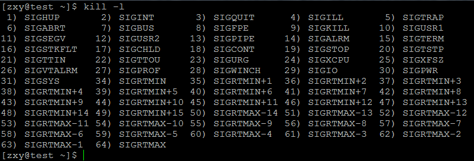
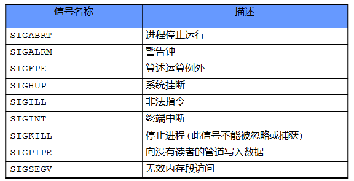
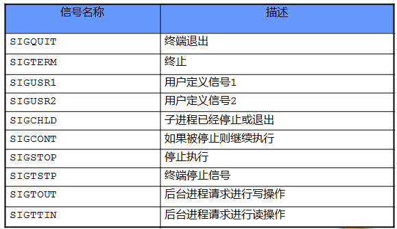

# linux系統編程之信號（一）：中斷與信號


## 一，什麼是中斷？
### 1．中斷的基本概念

中斷是指計算機在執行期間，系統內發生任何非尋常的或非預期的急需處理事件，使得CPU暫時中斷當前正在執行的程序而轉去執行相應的事件處理程序，待處理完畢後又返回原來被中斷處繼續執行或調度新的進程執行的過程。引起中斷髮生的事件被稱為中斷源。中斷源向CPU發出的請求中斷處理信號稱為中斷請求，而CPU收到中斷請求後轉到相應的事件處理程序稱為中斷響應。

在有些情況下，儘管產生了中斷源和發出了中斷請求，但CPU內部的處理器狀態字PSW的中斷允許位已被清除，從而不允許CPU響應中斷。這種情況稱為禁止中斷。CPU禁止中斷後只有等到PSW的中斷允許位被重新設置後才能接收中斷。禁止中斷也稱為關中斷，PSW的中斷允許位的設置也被稱為開中斷。開中斷和關中斷是為了保證某段程序執行的原子性。

還有一個比較常用的概念是中斷屏蔽。中斷屏蔽是指在中斷請求產生之後，系統有選擇地封鎖一部分中斷而允許另一部分中斷仍能得到響應。不過，有些中斷請求是不能屏蔽甚至不能禁止的，也就是說，這些中斷具有最高優先級，只要這些中斷請求一旦提出，CPU必須立即響應。例如，電源掉電事件所引起的中斷就是不可禁止和不可屏蔽的。

### 2．中斷的分類與優先級

根據系統對中斷處理的需要，操作系統一般對中斷進行分類並對不同的中斷賦予不同的處理優先級，以便在不同的中斷同時發生時，按輕重緩急進行處理。

根據中斷源產生的條件，可把中斷分為外中斷和內中斷。外中斷是指來自處理器和內存外部的中斷，包括I／0設備發出的I／O中斷、外部信號中斷(例如用戶鍵人ESC鍵)。各種定時器引起的時鐘中斷以及調試程序中設置的斷點等引起的調試中斷等。外中斷在狹義上一般被稱為中斷。

內中斷主要指在處理器和內存內部產生的中斷。內中斷一般稱為陷阱(trap)或異常。它包括程序運算引起的各種錯誤，如地址非法、校驗錯、頁面失效、存取訪問控制錯、算術操作溢出、數據格式非法、除數為零、非法指令、用戶程序執行特權指令、分時系統中的時間片中斷以及從用戶態到核心態的切換等都是陷阱的例子。

為了按中斷源的輕重緩急處理響應中斷，操作系統為不同的中斷賦予不同的優先級。例如在UNIX系統中，外中斷和陷阱的優先級共分為8級。為了禁止中斷或屏蔽中斷，CPU的處理器狀態字PSW中也設有相應的優先級。如果中斷源的優先級高於PSW的優先級，則CPU響應該中斷源的請求；反之，CPU屏蔽該中斷源的中斷請求。

各中斷源的優先級在系統設計時給定，在系統運行時是固定的。而處理器的優先級則根據執行情況由系統程序動態設定。

除了在優先級的設置方面有區別之外，中斷和陷阱還有如下主要區別：

陷阱通常由處理器正在執行的現行指令引起，而中斷則是由與現行指令無關的中斷源引起的。陷阱處理程序提供的服務為當前進程所用，而中斷處理程序提供的服務則不是為了當前進程的。

CPU執行完一條指令之後，下一條指令開始之前響應中斷，而在一條指令執行中也可以響應陷阱。例如執行指令非法時，儘管被執行的非法指令不能執行結束，但CPU仍可對其進行處理。

### 3．軟中斷

軟中斷的概念主要來源於UNIX系統。軟中斷是對應於硬中斷而言的。通過硬件產生相應的中斷請求，稱為硬中斷。而軟中斷則不然，它是在通信進程之間通過模擬硬中斷而實現的一種通信方式。中斷源發出軟中斷信號後，CPU或者接收進程在“適當的時機”進行中斷處理或者完成軟中斷信號所對應的功能。這裡“適當的時機”，表示接收軟中斷信號的進程須等到該接收進程得到處理器之後才能進行。如果該接收進程是佔據處理器的，那麼，該接收進程在接收到軟中斷信號後將立即轉去執行該軟中斷信號所對應的功能。

### 4．中斷處理過程

一旦CPU響應中斷，轉人中斷處理程序，系統就開始進行中斷處理。下面對中斷處理過程進行詳細說明：

```c
1)CPU檢查響應中斷的條件是否滿足。CPU響應中斷的條件是：有來自於中斷源的中斷請求、CPU允許中斷。如果中斷響應條件不滿足，則中斷處理無法進行。

2)如果CPU響應中斷，則CPU關中斷，使其進入不可再次響應中斷的狀態。

3)保存被中斷進程現場。為了在中斷處理結束後能使進程正確地返回到中斷點，系統必須保存當前處理器狀態字PSW和程序計數器PC等的值。這些值一般保存在特定堆棧或硬件寄存器中。

4)分析中斷原因，調用中斷處理子程序。在多箇中斷請求同時發生時，處理優先級最高的中斷源發出的中斷請求。在系統中，為了處理上的方便，通常都是針對不同的中斷源編制有不同的中斷處理子程序(陷阱處理子程序)。這些子程序的人口地址(或陷阱指令的人口地址)存放在內存的特定單元中。再者，不同的中斷源也對應著不同的處理器狀態字PSW。這些不同的PSW被放在相應的內存單元中，與中斷處理子程序人口地址一起構成中斷向量。顯然，根據中斷或陷阱的種類，系統可由中斷向量表迅速地找到該中斷響應的優先級、中斷處理子程序(或陷阱指令)的入口地址和對應的PSW。

5)執行中斷處理子程序。對陷阱來說，在有些系統中則是通過陷阱指令向當前執行進程發出軟中斷信號後調用對應的處理子程序執行。

6)退出中斷，恢復被中斷進程的現場或調度新進程佔據處理器。

7)開中斷，CPU繼續執行。
```

### 5．設備管理程序與中斷方式

處理器的高速和輸入輸出設備低速之間的矛盾，是設備管理要解決的一個重要問題。為了提高整體效率，減少在程序直接控制方式中的CPU等待時間以及提高系統的並行工作效率，採用中斷方式來控制輸入輸出設備和內存與CPU之間的數據傳送，是很有必要的。

在硬件結構上，這種方式要求CPU與輸入輸出設備(或控制器)之間有相應的中斷請求線，而且在輸入輸出設備控制器的控制狀態寄存器上有相應的中斷允許位。

## 二，什麼是信號？

### 1、信號及信號來源
`信號本質`

信號是在軟件層次上對中斷機制的一種模擬，在原理上，一個進程收到一個信號與處理器收到一箇中斷請求可以說是一樣的。信號是異步的，一個進程不必通過任何操作來等待信號的到達，事實上，進程也不知道信號到底什麼時候到達。

信號是進程間通信機制中唯一的異步通信機制，可以看作是異步通知，通知接收信號的進程有哪些事情發生了。信號機制經過POSIX實時擴展後，功能更加強大，除了基本通知功能外，還可以傳遞附加信息。

`信號來源`

信號事件的發生有兩個來源：硬件來源(比如我們按下了鍵盤或者其它硬件故障)；軟件來源，最常用發送信號的系統函數是kill, raise, alarm和setitimer以及sigqueue函數，軟件來源還包括一些非法運算等操作。

### 2、信號的種類
可以從兩個不同的分類角度對信號進行分類：（1）可靠性方面：可靠信號與不可靠信號；（2）與時間的關係上：實時信號與非實時信號。在《Linux環境進程間通信（一）：管道及有名管道》的附1中列出了系統所支持的所有信號。

`（一）、可靠信號與不可靠信號`

"不可靠信號"

Linux信號機制基本上是從Unix系統中繼承過來的。早期Unix系統中的信號機制比較簡單和原始，後來在實踐中暴露出一些問題，因此，把那些建立在早期機制上的信號叫做"不可靠信號"，信號值小於SIGRTMIN(Red hat 7.2中，SIGRTMIN=32，SIGRTMAX=63)的信號都是不可靠信號。這就是"不可靠信號"的來源。它的主要問題是：

- 進程每次處理信號後，就將對信號的響應設置為默認動作。在某些情況下，將導致對信號的錯誤處理；因此，用戶如果不希望這樣的操作，那麼就要在信號處理函數結尾再一次調用signal()，重新安裝該信號。

- 信號可能丟失，後面將對此詳細闡述。 
因此，早期unix下的不可靠信號主要指的是進程可能對信號做出錯誤的反應以及信號可能丟失。
Linux支持不可靠信號，但是對不可靠信號機制做了改進：在調用完信號處理函數後，不必重新調用該信號的安裝函數（信號安裝函數是在可靠機制上的實現）。因此，Linux下的不可靠信號問題主要指的是信號可能丟失。

"可靠信號"

隨著時間的發展，實踐證明了有必要對信號的原始機制加以改進和擴充。所以，後來出現的各種Unix版本分別在這方面進行了研究，力圖實現"可靠信號"。由於原來定義的信號已有許多應用，不好再做改動，最終只好又新增加了一些信號，並在一開始就把它們定義為可靠信號，這些信號支持排隊，不會丟失。同時，信號的發送和安裝也出現了新版本：信號發送函數sigqueue()及信號安裝函數sigaction()。POSIX.4對可靠信號機制做了標準化。但是，POSIX只對可靠信號機制應具有的功能以及信號機制的對外接口做了標準化，對信號機制的實現沒有作具體的規定。

信號值位於SIGRTMIN和SIGRTMAX之間的信號都是可靠信號，可靠信號克服了信號可能丟失的問題。Linux在支持新版本的信號安裝函數sigation（）以及信號發送函數sigqueue()的同時，仍然支持早期的signal（）信號安裝函數，支持信號發送函數kill()。

注：不要有這樣的誤解：由sigqueue()發送、sigaction安裝的信號就是可靠的。事實上，可靠信號是指後來添加的新信號（信號值位於SIGRTMIN及SIGRTMAX之間）；不可靠信號是信號值小於SIGRTMIN的信號。信號的可靠與不可靠只與信號值有關，與信號的發送及安裝函數無關。目前linux中的signal()是通過sigation()函數實現的，因此，即使通過signal（）安裝的信號，在信號處理函數的結尾也不必再調用一次信號安裝函數。同時，由signal()安裝的實時信號支持排隊，同樣不會丟失。

對於目前linux的兩個信號安裝函數:signal()及sigaction()來說，它們都不能把SIGRTMIN以前的信號變成可靠信號（都不支持排隊，仍有可能丟失，仍然是不可靠信號），而且對SIGRTMIN以後的信號都支持排隊。這兩個函數的最大區別在於，經過sigaction安裝的信號都能傳遞信息給信號處理函數（對所有信號這一點都成立），而經過signal安裝的信號卻不能向信號處理函數傳遞信息。對於信號發送函數來說也是一樣的。

`（二）、實時信號與非實時信號`

早期Unix系統只定義了32種信號，Ret hat7.2支持64種信號，編號0-63(SIGRTMIN=31，SIGRTMAX=63)，將來可能進一步增加，這需要得到內核的支持。前32種信號已經有了預定義值，每個信號有了確定的用途及含義，並且每種信號都有各自的缺省動作。如按鍵盤的CTRL ^C時，會產生SIGINT信號，對該信號的默認反應就是進程終止。後32個信號表示實時信號，等同於前面闡述的可靠信號。這保證了發送的多個實時信號都被接收。實時信號是POSIX標準的一部分，可用於應用進程。

非實時信號都不支持排隊，都是不可靠信號；實時信號都支持排隊，都是可靠信號。

`（三）,信號名稱`

查看linux所支持的信號可用：kill –l

共64種：







### 3、進程對信號的響應
進程可以通過三種方式來響應一個信號：（1）忽略信號，即對信號不做任何處理，其中，有兩個信號不能忽略：SIGKILL及SIGSTOP；（2）捕捉信號。定義信號處理函數，當信號發生時，執行相應的處理函數；（3）執行缺省操作，Linux對每種信號都規定了默認操作，詳細情況請參考[2]以及其它資料。注意，進程對實時信號的缺省反應是進程終止。

Linux究竟採用上述三種方式的哪一個來響應信號，取決於傳遞給相應API函數的參數。

注：本文參考：http://blog.csdn.net/lmh12506/article/details/6681663和

 http://blog.csdn.net/johnny710vip/article/details/6990514
