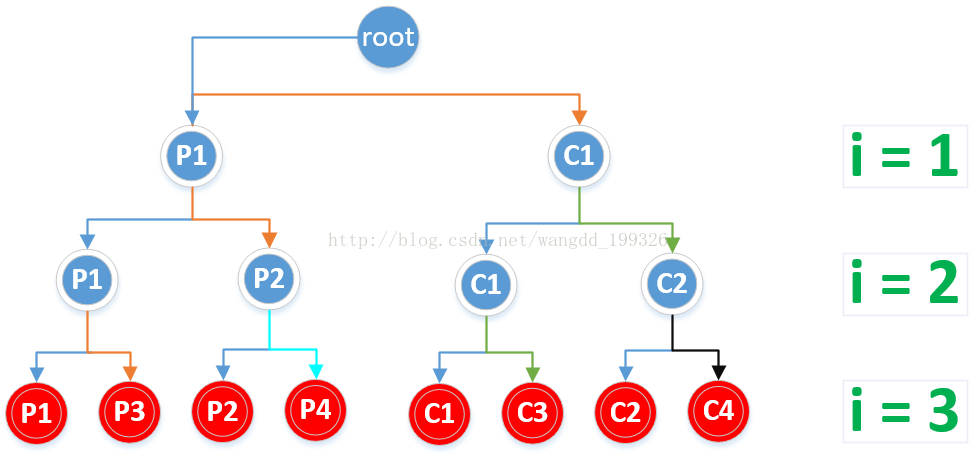

# Linux下fork函数及pthread函数的总结


##fork
Linux多进程编程中的可以使用fork函数来创建子进程。`fork函数定义在头文件unistd.h中（uni表示unix，std当然是标准库，所以很好记），该函数的声明为pid_t fork(void)其中函数的返回值类型为pid_t，`可以理解为一个整型，返回值具体为：

- 在父进程中，fork返回新创建的子进程的进程ID；
- 在子进程中，fork返回0；
- 如果创建子进程失败，则返回一个负值

具体创建的子进程与父进程的关系，很显示fork函数不能接受任何参数，它只简单地将父进程的几乎所有资源全部复制给子进程，然后就相当于父进程的一个副本运行，且无法与父进行共享数据。
具体 来说使用fork函数得到的子进程从父进程继承了整个进程的地址空间，包括：进程上下文、进程堆栈、内存信息、打开的文件描述符、信号控制设置、进程优先级、进程组号、当前工作目录、根目录、资源限制、控制终端等。

## 子进程与父进程的区别在于：

- 父进程设置的锁，子进程不继承（因为如果是排它锁，被继承的话，矛盾了）
- 各自的进程ID和父进程ID不同
- 子进程的未决告警被清除；
- 子进程的未决信号集设置为空集。


当然linux下的头文件sched.h中有一个fork升级版本的进程创建函数clone。clone是fork的升级版本，不仅可以创建进程或者线程，还可以指定创建新的命名空间（namespace）、有选择的继承父进程的内存、甚至可以将创建出来的进程变成父进程的兄弟进程等。clone() 函数则可以将部分父进程的资源通过参数设定有选择地复制给子进程，没有复制的资源可以通过指针共享给子进程

下面主要分析fork函数创建进程数及运行情况
获取进程ID的相关函数有：

- getppid()返回当前进程的父进程ID
- getpid()返回当前进程ID

`这两个函数都在头文件unistd.h中，不接受参数，返回值类型为pid_t`
网上关于fork函数创建多少个子进程的分析有很多，这里说一个简单分析方法，其实fork就是为父进程创建子进程，也就是说一个进程，执行fork之后就会变成2个进程，仅此而已。当执行多次fork函数时与二叉树很像，从根结点往叶子节点，每次一个变2个，可以很好地用二叉树来分析创建的子进程树，以及涉及到循环时，循环执行的次数。首先说一下结论：假定根结点为二叉树的第0层（为了方便后面分析），每执行一次fork，就增加一层，如果使用循环执行n个fork，则共有n层，相应满二叉树的叶子结点数2^n即为总共创建的子进程数（根为第0层），满二叉树除了根结点之外的总结点数2^(n+1)-2就是循环执行的总次数。也就是说 `执行n次fork函数，创建的子进程数为2^n个，用循环创建的fork时，循环执行的总次数为2^(n+1)-2次`
下面使用几个实例分析根据fork的原理和二叉树方法（其实也是根据原理）来分析：


## fork()用法

```cpp
#include <iostream>
#include <unistd.h>
int main(void)
{
    pid_t fpid; //创建一个临时变量用于存放fork的返回值
    int count = 0;
    fpid = fork();  //创建子进程，父进程与子进程将分别执行此后的代码

    if (fpid < 0) { //创建子进程失败时将返回负值
        std::cout << "Error in fork!" << std::endl;
    } else if (fpid ==
               0) { //子进程中fork的返回值为0，所以将由子进程执行该分支
        std::cout << "Child: parent_pid:" << getppid() << " pid:" << getpid() <<
                  " child_pid:" << fpid << std::endl;
        count++;  //子进程复制来的count值为0，++之后将为1
    } else { //父进程中fork的返回值为子进程的pid，所以将由父进程执行该分支
        std::cout << "Parent: parent_pid:" << getppid() << " pid:" << getpid() <<
                  " child_pid:" << fpid << std::endl;
        count++;  //父进程中count为0，父子进程中的变量等数据是完全独立的
    }

    std::cout << "count: " << count <<
              std::endl;  //最后输出count的当前值，显示该句父子进程都要执行
    return 0;
}
```

## 输出结果为：

```sh
Parent: parent_pid:3084 pid:3087 child_pid:3088
count: 1
Child: parent_pid:3087 pid:3088 child_pid:0
count: 1
```

可以看到父进程的中创建的子进程的pid:3088刚好是子进程当前的pid，两个进程输出的count都是1，也就是只进行了一次累加
套用上面关于二叉树方法分析的情况，执行一次fork，即2^1=2两个进程

##通过循环执行多个fork-1
不看输出的话考虑输出结果是什么，会输出多少次

```c
#include <iostream>
#include <unistd.h>
int main(void)
{
    int count = 0;

    for (int i = 1; i < 4; ++i) {  //通过for循环执行3次fork
        fork();
    }

    std::cout << ++count << std::endl;
    return 0;
}
```

输出结果为：

```sh
1
1
1
1
1
1
1
1
```

执行第一个fork时，由原来的1个进程变成2个进程，第二次fork时，由2个变成4个，第三次fork时，由4个变成8个。所以最终共有8个进程。

二叉树法分析：

一共8个1，for循环中执行了3次fork，共创建了2^3=8个子进程，所以共有8个1输出。如下二叉树图中叶子结点所示：



