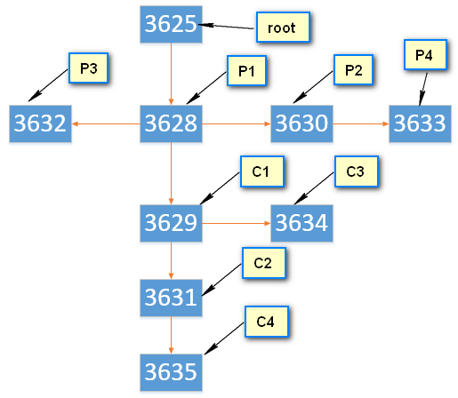
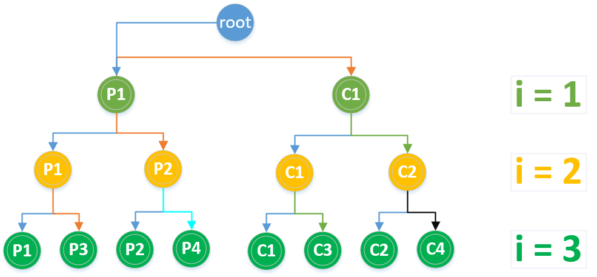
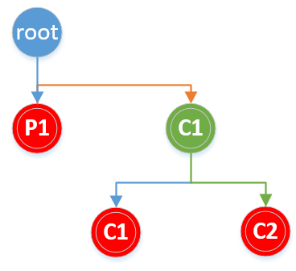
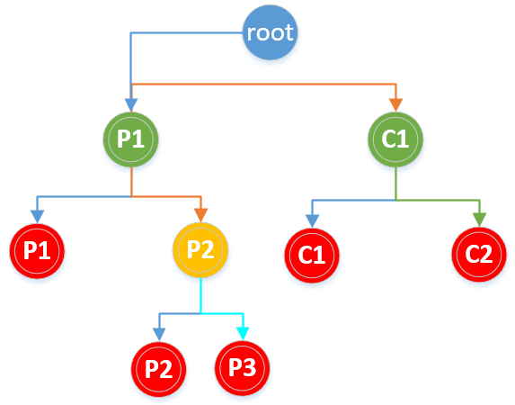

# Linux下fork函數及pthread函數的總結


##fork
Linux多進程編程中的可以使用fork函數來創建子進程。`fork函數定義在頭文件unistd.h中（uni表示unix，std當然是標準庫，所以很好記），該函數的聲明為pid_t fork(void)其中函數的返回值類型為pid_t，`可以理解為一個整型，返回值具體為：

- 在父進程中，fork返回新創建的子進程的進程ID；
- 在子進程中，fork返回0；
- 如果創建子進程失敗，則返回一個負值

具體創建的子進程與父進程的關係，很顯示fork函數不能接受任何參數，它只簡單地將父進程的幾乎所有資源全部複製給子進程，然後就相當於父進程的一個副本運行，且無法與父進行共享數據。
具體 來說使用fork函數得到的子進程從父進程繼承了整個進程的地址空間，包括：進程上下文、進程堆棧、內存信息、打開的文件描述符、信號控制設置、進程優先級、進程組號、當前工作目錄、根目錄、資源限制、控制終端等。

## 子進程與父進程的區別在於：

- 父進程設置的鎖，子進程不繼承（因為如果是排它鎖，被繼承的話，矛盾了）
- 各自的進程ID和父進程ID不同
- 子進程的未決告警被清除；
- 子進程的未決信號集設置為空集。


當然linux下的頭文件sched.h中有一個fork升級版本的進程創建函數clone。clone是fork的升級版本，不僅可以創建進程或者線程，還可以指定創建新的命名空間（namespace）、有選擇的繼承父進程的內存、甚至可以將創建出來的進程變成父進程的兄弟進程等。clone() 函數則可以將部分父進程的資源通過參數設定有選擇地複製給子進程，沒有複製的資源可以通過指針共享給子進程

下面主要分析fork函數創建進程數及運行情況
獲取進程ID的相關函數有：

- getppid()返回當前進程的父進程ID
- getpid()返回當前進程ID

`這兩個函數都在頭文件unistd.h中，不接受參數，返回值類型為pid_t`
網上關於fork函數創建多少個子進程的分析有很多，這裡說一個簡單分析方法，其實fork就是為父進程創建子進程，也就是說一個進程，執行fork之後就會變成2個進程，僅此而已。當執行多次fork函數時與二叉樹很像，從根結點往葉子節點，每次一個變2個，可以很好地用二叉樹來分析創建的子進程樹，以及涉及到循環時，循環執行的次數。首先說一下結論：假定根結點為二叉樹的第0層（為了方便後面分析），每執行一次fork，就增加一層，如果使用循環執行n個fork，則共有n層，相應滿二叉樹的葉子結點數2^n即為總共創建的子進程數（根為第0層），滿二叉樹除了根結點之外的總結點數2^(n+1)-2就是循環執行的總次數。也就是說 `執行n次fork函數，創建的子進程數為2^n個，用循環創建的fork時，循環執行的總次數為2^(n+1)-2次`
下面使用幾個實例分析根據fork的原理和二叉樹方法（其實也是根據原理）來分析：


## fork()用法

```cpp
#include <iostream>
#include <unistd.h>
int main(void)
{
    pid_t fpid; //創建一個臨時變量用於存放fork的返回值
    int count = 0;
    fpid = fork();  //創建子進程，父進程與子進程將分別執行此後的代碼

    if (fpid < 0) { //創建子進程失敗時將返回負值
        std::cout << "Error in fork!" << std::endl;
    } else if (fpid ==
               0) { //子進程中fork的返回值為0，所以將由子進程執行該分支
        std::cout << "Child: parent_pid:" << getppid() << " pid:" << getpid() <<
                  " child_pid:" << fpid << std::endl;
        count++;  //子進程複製來的count值為0，++之後將為1
    } else { //父進程中fork的返回值為子進程的pid，所以將由父進程執行該分支
        std::cout << "Parent: parent_pid:" << getppid() << " pid:" << getpid() <<
                  " child_pid:" << fpid << std::endl;
        count++;  //父進程中count為0，父子進程中的變量等數據是完全獨立的
    }

    std::cout << "count: " << count <<
              std::endl;  //最後輸出count的當前值，顯示該句父子進程都要執行
    return 0;
}
```

## 輸出結果為：

```sh
Parent: parent_pid:3084 pid:3087 child_pid:3088
count: 1
Child: parent_pid:3087 pid:3088 child_pid:0
count: 1
```

可以看到父進程的中創建的子進程的pid:3088剛好是子進程當前的pid，兩個進程輸出的count都是1，也就是隻進行了一次累加
套用上面關於二叉樹方法分析的情況，執行一次fork，即2^1=2兩個進程

##通過循環執行多個fork-1
不看輸出的話考慮輸出結果是什麼，會輸出多少次

```c
#include <iostream>
#include <unistd.h>
int main(void)
{
    int count = 0;

    for (int i = 1; i < 4; ++i) {  //通過for循環執行3次fork
        fork();
    }

    std::cout << ++count << std::endl;
    return 0;
}
```

輸出結果為：

```sh
1
1
1
1
1
1
1
1
```

執行第一個fork時，由原來的1個進程變成2個進程，第二次fork時，由2個變成4個，第三次fork時，由4個變成8個。所以最終共有8個進程。

二叉樹法分析：

一共8個1，for循環中執行了3次fork，共創建了2^3=8個子進程，所以共有8個1輸出。如下二叉樹圖中葉子結點所示：


紅色結點（即葉子結點）為創建的所有子進程

如圖中標識，C1、P2、P3都是P1的子進程，只是它們創建於p1的不同時期，同樣P4是P2的子進程，從C1創建的子進程有C2，C3。其中來自不同顏色的箭頭表示不同的關係，箭頭表示父進程->子進程，相同顏色的線表示來自同一個進程。

可以通過以下代碼來驗證：


```c
#include <iostream>
#include <unistd.h>
int main(void)
{
    int count = 0;

    for (int i = 1; i < 4; ++i) {
        fork();
    }

    //分別輸出各進程的父進程PID:當前進程PID:子進程PID
    std::cout << getppid() << " : " << getpid() << " : " << fpid << std::endl;
    return 0;
}
```

某一次的執行結果為（每次執行的結果都不一樣，因為進程號肯定不同，當然有可能會出現進程號為1的情況，由於當獲取父進程時，如果父進程此時已經執行完成並退出，那麼系統中就不存在此進程，此時就返回其進程號為1）：

```sh
3628 : 3630 : 3633
3630 : 3633 : 0
3629 : 3634 : 0
3628 : 3629 : 3634
3625 : 3628 : 3632
3628 : 3632 : 0
3629 : 3631 : 3635
3631 : 3635 : 0
```

可以根據類似鏈表的關係畫出如下圖：



再根據上圖的分析，很容易推斷出各進程的ID在二叉樹圖上的對應關係

## 通過循環執行多個fork-2

注意下面的代碼與上面fork-1中的唯一區別是將輸出放在了for循環裡面
不看輸出的話考慮輸出結果是什麼，會輸出多少次

```cpp
#include <iostream>
#include <unistd.h>

int main(void)
{
    int count = 0;

    for (int i = 1; i < 4; ++i) {  //通過for循環執行3次fork
        fork();
        std::cout << ++count << std::endl;
    }

    return 0;
}
```

輸出結果為：


```sh
1
1
2
2
2
2
3
3
3
3
3
3
3
3
```


創建的子進程數分析與fork-1中一樣，都是8個子進程。關於for循環中的輸出執行次數，當i=1時，執行一次fork，創建2個子進程，記為p1, c1（px表示父進程，cx表示子進程），進程p1,c1將分別從i=1執行到i=3，在for循環內部共執行23=6次，即這兩個子進程會分別輸出1，2，3各一次。由於這兩個進程在執行for循環時還會繼續創建進程，所以它們的2個1會首先輸出在前面。當i=2時，執行第二次fork，之前的2個進程p1, c1將分別再創建一個進程，記為p2、c2（假設p2來自p1,c2來自c1），p2、c2將從i=2開始執行到i=3，這兩個進程for循環內部共執行22=4次。當前執行到i=2時共有4個進程，分別為p1、c1、p2、c2，它們會分別輸出一次2，共輸出4個2。當i=3時，當前的4個進程將再分別創建一個進程，共創建4個進程，新創建的4個進程將各自執行一次for循環內部，for循環即結束了，共執行4次for循環內部。此時共有8個進程，每個進程都會輸出一次3，共8個3。再綜合各個進程中for循環執行的次數，可知6+4+4=14次，所以共有14個輸出。


二叉樹分析如下圖所示：



從上圖可以看出i的取值為1，2，3階段，各階段執行的進程數分別為2，4，8，雖然一共只有8個進程，但for循環各階段的進程都會進行一次輸出，所以共輸出14次，即為二叉樹除根節點的結點總數2^4-2=14。

##fork()||fork()進程數
分析如下代碼創建的進程數：

```c
#include <iostream>
#include <unistd.h>

int main(void)
{
    int count = 0;
    fork() || fork();
    std::cout << count << std::endl;
    return 0;
}
```

輸出結果為：

```sh
1
1
1
```

由於fork函數在不同進程中的返回值不同，在子進程中返回為0，所以第一個fork執行完之後會有兩個進程，父進程中fork返回值為真，||後面的代碼不會執行，直接返回。子進程中fork()返回值為0，需要繼續執行後面一個fork，再次為子進程創建一個子進程，所以共有3個子進程。
畫二叉樹分析：



圖中葉子節點數即為進程數。

##fork()&&fork()||fork()
分析以下代碼創建的進程數：


```c
#include <iostream>
#include <unistd.h>

int main(void)
{
    int count = 0;
    (fork() && fork()) || fork();
    std::cout << count << std::endl;
    return 0;
}
```

輸出結果為：

```sh
1
1
1
1
1
```

首先第一個fork執行完之後為父進程（記為p1）創建一個子進程，記為c1，由於子進程fork返回值為0，所以子進程中第一個括號&&後面的表達式不需要再執行。父進程p1需要繼續執行第二個fork，再次創建一個子進程p2，父進程p1的fork返回為真，||後面的不需要再執行。第二個子進程p2需要繼續執行第三個fork，再次為第二子進程創建一個子進程p3，同樣由於c1進程fork返回值為0，所以也還需要執行第三個fork，為其創建一個子進程c2，所以一共會創建5個進程。

畫二叉樹分析，如下圖：




對於以下代碼創建的進程數為多少？

```c
#include <iostream>
#include <unistd.h>

int main(void)
{
    int count = 0;
    fork();  //執行完後將有2個進程
    (fork() && fork()) || fork();  //根據上面分析，這部分會創建5個進程，執行完成會有2*5=10個進程
    fork();  //執行完這句進程數會再次翻倍
    std::cout << count << std::endl;
    return 0;
}
```

結果為252=20，自行分析，這類問題只需要分步分析即可，如果涉及到一些輸出的情況，最好畫圖看看

##循環fork，不刷新輸出緩衝區的情況
考慮以下程序會輸出多少個*：


```c
#include <iostream>
#include <unistd.h>

int main(void)
{
    int i;
    for (i = 0; i < 3; i++) { 
        fork(); 
        std::cout << "*"; 
    } 
    return 0; 
}
```

輸出結果為：

```sh
************************
```

按照通常的的想法，比如我們之前的公式，應該輸出2^4-2=14個，實際上輸出結果去是38=24個。

因為std::cout後面沒有輸出\n或者std::endl，也就是說在輸出時沒有刷新輸出緩衝區，會導致父進程中的輸出緩衝區內容依然是上次的內容，子進程在複製時同樣會複製輸出緩衝區中的內容，導致子進程輸出緩衝區的內容實際上與父進程是一樣的。由於第一個父進程的for循環會執行3次，輸出緩衝區中會有3個，雖然有的子進程的循環只能執行2次或1次，但輸出緩衝區中的內容並沒有少，所以同樣最終也都會輸出3個。

一共有8個進程，所以共有38=24個*輸出。

##fork與虛擬地址空間
思考下面這段程序的輸出中父進程與子進程中的num及num地址是否相同：

```c
#include <iostream>
#include <unistd.h>
int main()
{
    int pid;
    int num = 1;
    pid = fork();

    if (pid > 0) {
        num++;
        std::cout << "in parent:num:" << num << " addr:" << &num << std::endl;

    } else if (pid == 0) {
        std::cout << "in child:num:" << num << " addr:" << &num << std::endl;
    }

    return 0;
}
```

輸出結果為：

```sh
in parent:num:2 addr:0x7fffed819768
in child:num:1  addr:0x7fffed819768
```

竟然num的地址為父進程與子進程中是一樣的，但num的值卻是不同的，之所以會出現這種情況是因為linu的虛擬地址空間策略下，所有進程都以為自己獨享整個地址空間，所以每個進程都可以有0x01地址空間，但其實際映射到的真實地址空間並不相同。就像本文剛開始時說的一樣，fork在複製時會繼承父進程的整個地址空間，所以num的輸出地址是一樣的。


## pthread

最後說一下Linux下的pthread函數，該函數屬於POSIX線程（POSIX threads）標準，該標準定義了一套用於線程的API，pthread函數包含在頭文件pthread.h中。


## 線程 VS 進程

線程也稱為輕量級的進程（lightweight process, LWP），在支持線程的系統中，線程是CPU調度和分派的基本單元；傳統操作系統中CPU高度和分派的基本單位是進程，傳統上的進程（相當於只含有一個線程的進程）也被稱為重量級進程（heavyweight process, HWP）。

當一個進程包含多個線程時，相當於將進程的任務劃分成多個子任務，由線程同時執行多個任何。

進程中引入線程後，線程即作為CPU調度和分派的基本單位，而進程則作為資源擁有的基本單位，同一進程中的線程切換不會引起進程切換，可以避免昂貴的系統調用。

因為進程之間可以併發執行，而同一進程中的線程之間也可以併發執行，所以線程提高了操作系統的併發性，能更有效的使用系統資源和提高系統的吞吐量。

線程擁有自己獨立的棧、調度優先級和策略、信號屏蔽字（創建時繼承）、errno變量以及線程私有數據，這些資源相對於進程佔用的資源來說很少。進程的其他地址空間（包含進程的代碼段、數據段以及其他系統資源，如已打開的文件、IO設備等）均被所有線程所共享，因此線程可以訪問進程的全局變量和堆中分配的數據，並通過同步機制保證對數據訪問的一致性。這樣多線程相對於進程可以降低系統開銷。


##pthread線程操作相關的函數或類型
- pthread_t 是pthread的線程ID
- pthread_create()用於創建新的線程
- pthread_equal()用於比較兩個線程id是否相等
- pthread_self() 用於獲取當前線程的id
- pthread_exit() 線程調用該函數主動退出線程
- pthread_join() 用於線程同步，以阻塞的方式等待指定線程結束

##參考：

- http://blog.csdn.net/jason314/article/details/5640969
- man fork
- man pthreads
- 其他網絡搜索


