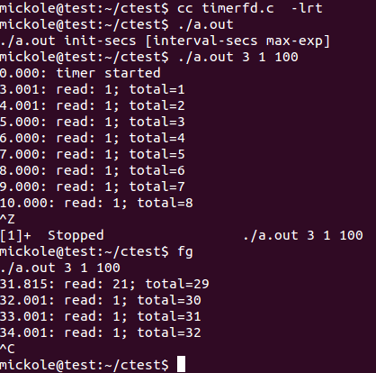

# linux新定時器：timefd及相關操作函數


timerfd是Linux為用戶程序提供的一個定時器接口。這個接口基於文件描述符，通過文件描述符的可讀事件進行超時通知，所以能夠被用於select/poll的應用場景。

##一，相關操作函數

```c
#include <sys/timerfd.h>

int timerfd_create(int clockid, int flags);
int timerfd_settime(int fd, int flags, const struct itimerspec *new_value, struct itimerspec *old_value);
int timerfd_gettime(int fd, struct itimerspec *curr_value);
```

##二，timerfd_create
int timerfd_create(int clockid, int flags);

它是用來創建一個定時器描述符timerfd

第一個參數：clockid指定時間類型，有兩個值：

CLOCK_REALTIME :Systemwide realtime clock. 系統範圍內的實時時鐘

CLOCK_MONOTONIC:以固定的速率運行，從不進行調整和復位 ,它不受任何系統time-of-day時鐘修改的影響

第二個參數：flags可以是0或者O_CLOEXEC/O_NONBLOCK。

返回值：timerfd（文件描述符）

##三，timerfd_settime
在講解該函數前，先理解兩個相關結構體：

```c
struct timespec {
    time_t tv_sec;                /* Seconds */
    long   tv_nsec;               /* Nanoseconds */
};

struct itimerspec {
    struct timespec it_interval;  /* Interval for periodic timer */
    struct timespec it_value;     /* Initial expiration */
};
```

第二個結構體itimerspec就是timerfd要設置的超時結構體，它的成員it_value表示定時器第一次超時時間，it_interval表示之後的超時時間即每隔多長時間超時

```c
int timerfd_settime(int fd, int flags, const struct itimerspec *new_value, struct itimerspec *old_value);
```

作用：用來啟動或關閉有fd指定的定時器

參數：

fd：timerfd，有timerfd_create函數返回

fnew_value:指定新的超時時間，設定new_value.it_value非零則啟動定時器，否則關閉定時器，如果new_value.it_interval為0，則定時器只定時一次，即初始那次，否則之後每隔設定時間超時一次

old_value：不為null，則返回定時器這次設置之前的超時時間

flags：1代表設置的是絕對時間；為0代表相對時間。

## 四，timerfd_gettime

```c
int timerfd_gettime(int fd, struct itimerspec *curr_value);
```

此函數用於獲得定時器距離下次超時還剩下的時間。如果調用時定時器已經到期，並且該定時器處於循環模式（設置超時時間時struct itimerspec::it_interval不為0），那麼調用此函數之後定時器重新開始計時。

The it_value field returns the amount of time until the timer will next expire. If both fields of this structure are zero, then the timer is currently disarmed. This field always contains a relative value, regardless of whether the TFD_TIMER_ABSTIME flag was specified when setting the timer.

The it_interval field returns the interval of the timer. If both fields of this structure are zero, then the timer is set to expire just once, at the time specified by curr_value.it_value.

## 五，read讀取timefd超時事件通知

read(2) If the timer has already expired one or more times since its settings were last modified using `timerfd_settime()`, or since the last successful read(2), then the buffer given to read(2) returns an unsigned 8-byte integer (uint64_t) containing the number of expirations that have occurred. (The returned value is in host byte order, i.e., the native byte order for integers on the host machine.)

If no timer expirations have occurred at the time of the read(2), then the call either blocks until the next timer expiration, or fails with the error `EAGAIN` if the file descriptor has been made nonblocking (via the use of the fcntl(2) F_SETFL operation to set the `O_NONBLOCK` flag).

A read(2) will fail with the error `EINVAL` if the size of the supplied buffer is less than 8 bytes.

當定時器超時，read讀事件發生即可讀，返回超時次數（從上次調用timerfd_settime()啟動開始或上次read成功讀取開始），它是一個8字節的unit64_t類型整數，如果定時器沒有發生超時事件，則read將阻塞若timerfd為阻塞模式，否則返回EAGAIN 錯誤（O_NONBLOCK模式），如果read時提供的緩衝區小於8字節將以EINVAL錯誤返回。


## 六，示例代碼

man手冊中示例：

The following program creates a timer and then monitors its progress. The program accepts up to three command-line arguments. The first argument specifies the number of seconds for the initial expiration of the timer. The second argument specifies the interval for the timer, in seconds. The third argument specifies the number of times the program should allow the timer to expire before terminating. The second and third command-line arguments are optional.


```c
#include <sys/timerfd.h>
#include <time.h>
#include <unistd.h>
#include <stdlib.h>
#include <stdio.h>
#include <stdint.h>        /* Definition of uint64_t */

#define handle_error(msg) \
    do { perror(msg); exit(EXIT_FAILURE); } while (0)

static void
print_elapsed_time(void)
{
    static struct timespec start;
    struct timespec curr;
    static int first_call = 1;
    int secs, nsecs;

    if (first_call) {
        first_call = 0;

        if (clock_gettime(CLOCK_MONOTONIC, &start) == -1) {
            handle_error("clock_gettime");
        }
    }

    if (clock_gettime(CLOCK_MONOTONIC, &curr) == -1) {
        handle_error("clock_gettime");
    }

    secs = curr.tv_sec - start.tv_sec;
    nsecs = curr.tv_nsec - start.tv_nsec;

    if (nsecs < 0) {
        secs--;
        nsecs += 1000000000;
    }

    printf("%d.%03d: ", secs, (nsecs + 500000) / 1000000);
}

int
main(int argc, char* argv[])
{
    struct itimerspec new_value;
    int max_exp, fd;
    struct timespec now;
    uint64_t exp, tot_exp;
    ssize_t s;

    if ((argc != 2) && (argc != 4)) {
        fprintf(stderr, "%s init-secs [interval-secs max-exp]\n",
                argv[0]);
        exit(EXIT_FAILURE);
    }

    if (clock_gettime(CLOCK_REALTIME, &now) == -1) {
        handle_error("clock_gettime");
    }

    /* Create a CLOCK_REALTIME absolute timer with initial
       expiration and interval as specified in command line */

    new_value.it_value.tv_sec = now.tv_sec + atoi(argv[1]);
    new_value.it_value.tv_nsec = now.tv_nsec;

    if (argc == 2) {
        new_value.it_interval.tv_sec = 0;
        max_exp = 1;
    } else {
        new_value.it_interval.tv_sec = atoi(argv[2]);
        max_exp = atoi(argv[3]);
    }

    new_value.it_interval.tv_nsec = 0;

    fd = timerfd_create(CLOCK_REALTIME, 0);

    if (fd == -1) {
        handle_error("timerfd_create");
    }

    if (timerfd_settime(fd, TFD_TIMER_ABSTIME, &new_value, NULL) == -1) {
        handle_error("timerfd_settime");
    }

    print_elapsed_time();
    printf("timer started\n");

    for (tot_exp = 0; tot_exp < max_exp;) {
        s = read(fd, &exp, sizeof(uint64_t));

        if (s != sizeof(uint64_t)) {
            handle_error("read");
        }

        tot_exp += exp;
        print_elapsed_time();
        printf("read: %llu; total=%llu\n",
               (unsigned long long) exp,
               (unsigned long long) tot_exp);
    }

    exit(EXIT_SUCCESS);
}
```

運行結果：

