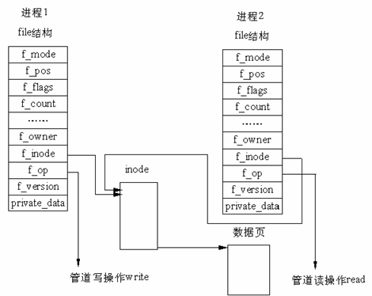

# PIPE


每個進程各自有不同的用戶地址空間，任何一個進程的全局變量在另一個進程中都看不到，所以進程之間要交換數據必須通過`內核`，在內核中開闢一塊緩衝區，進程1把數據從用戶空間拷到內核緩衝區，進程2再從內核緩衝區把數據讀走，內核提供的這種機制稱為進程間通信（IPC，InterProcess Communication）。如下圖所示。


##實現機制：

管道是由內核管理的一個緩衝區，相當於我們放入內存中的一個紙條。管道的一端連接一個進程的輸出。這個進程會向管道中放入信息。管道的另一端連接一個進程的輸入，這個進程取出被放入管道的信息。`一個緩衝區不需要很大，它被設計成為環形的數據結構，以便管道可以被循環利用`。`當管道中沒有信息的話，從管道中讀取的進程會等待，直到另一端的進程放入信息。當管道被放滿信息的時候，嘗試放入信息的進程會等待，直到另一端的進程取出信息。當兩個進程都終結的時候，管道也自動消失`。


實現細節：

在 Linux 中，管道的實現並沒有使用專門的數據結構，而是藉助了文件系統的file結構和VFS的索引節點inode。通過將兩個 file 結構指向同一個臨時的 VFS 索引節點，而這個 VFS 索引節點又指向一個物理頁面而實現的。如下圖





有兩個 file 數據結構，但它們定義文件操作例程地址是不同的，其中一個是向管道中寫入數據的例程地址，而另一個是從管道中讀出數據的例程地址。這樣，用戶程序的系統調用仍然是通常的文件操作，而內核卻利用這種抽象機制實現了管道這一特殊操作。

## 關於管道的讀寫

管道實現的源代碼在fs/pipe.c中，在pipe.c中有很多函數，其中有兩個函數比較重要，即管道讀函數pipe_read()和管道寫函數pipe_wrtie()。管道寫函數通過將字節複製到 VFS 索引節點指向的物理內存而寫入數據，而管道讀函數則通過複製物理內存中的字節而讀出數據。當然，`內核必須利用一定的機制同步對管道的訪問`，為此，`內核使用了鎖、等待隊列和信號`。

當寫進程向管道中寫入時，它利用標準的庫函數write()，系統根據庫函數傳遞的文件描述符，`可找到該文件的 file 結構`。file 結構中指定了用來進行寫操作的函數（即寫入函數）地址，於是，內核調用該函數完成寫操作。寫入函數在向內存中寫入數據之前，必須首先檢查 VFS 索引節點中的信息，同時滿足如下條件時，才能進行實際的內存複製工作：

- `內存中有足夠的空間可容納所有要寫入的數據`
- `內存沒有被讀程序鎖定`。

如果同時滿足上述條件，寫入函數首先鎖定內存，然後從寫進程的地址空間中複製數據到內存。否則，寫入進程就休眠在 VFS 索引節點的等待隊列中，接下來，內核將調用調度程序，而調度程序會選擇其他進程運行。寫入進程實際處於可中斷的等待狀態，當內存中有足夠的空間可以容納寫入數據，或內存被解鎖時，讀取進程會喚醒寫入進程，這時，寫入進程將接收到信號。當數據寫入內存之後，內存被解鎖，而所有休眠在索引節點的讀取進程會被喚醒。

管道的讀取過程和寫入過程類似。但是，進程可以在沒有數據或內存被鎖定時立即返回錯誤信息，而不是阻塞該進程，這依賴於文件或管道的打開模式。反之，進程可以休眠在索引節點的等待隊列中等待寫入進程寫入數據。當所有的進程完成了管道操作之後，管道的索引節點被丟棄，而共享數據頁也被釋放。

##管道

管道是一種最基本的IPC機制，由pipe函數創建：


```c
#include <unistd.h>

int pipe(int filedes[2]);
```
調用pipe函數時在`內核中開闢一塊緩衝區`（稱為管道）用於通信，它有一個讀端一個寫端，然後通過filedes參數傳出給用戶程序兩個文件描述符，filedes[0]指向管道的讀端，filedes[1]指向管道的寫端（很好記，就像0是標準輸入1是標準輸出一樣）。所以管道在用戶程序看起來就像一個打開的文件，通過read(filedes[0]);或者write(filedes[1]);向這個文件讀寫數據其實是在讀寫內核緩衝區。pipe函數調用成功返回0，調用失敗返回-1。

開闢了管道之後如何實現兩個進程間的通信呢？比如可以按下面的步驟通信。


- 父進程調用pipe開闢管道，得到兩個文件描述符指向管道的兩端。

- 父進程調用`fork創建子進程`，那麼`子進程也有兩個文件描述符指向同一管道`。

- 父進程關閉管道讀端，子進程關閉管道寫端。父進程可以往管道里寫，子進程可以從管道里讀，管道是用環形隊列實現的，數據從寫端流入從讀端流出，這樣就實現了進程間通信。`


```c
#include <stdlib.h>
#include <unistd.h>
#define MAXLINE 80

int main(void)
{
    int n;
    int fd[2];
    pid_t pid;
    char line[MAXLINE];

    if (pipe(fd) < 0) {
        perror("pipe");
        exit(1);
    }

    if ((pid = fork()) < 0) {
        perror("fork");
        exit(1);
    }

    if (pid > 0) { /* parent */
        close(fd[0]);
        write(fd[1], "hello world\n", 12);
        wait(NULL);
    } else {       /* child */
        close(fd[1]);
        n = read(fd[0], line, MAXLINE);
        write(STDOUT_FILENO, line, n);
    }

    return 0;
}
```

### 使用管道有一些限制：

兩個進程通過一個管道只能實現`單向`通信，比如上面的例子，父進程寫子進程讀，如果有時候也需要子進程寫父進程讀，`就必須另開一個管道`。請讀者思考，如果只開一個管道，但是父進程不關閉讀端，子進程也不關閉寫端，雙方都有讀端和寫端，為什麼不能實現雙向通信？

管道的讀寫端通過打開的`文件描述符來傳遞`，因此要通信的`兩個進程必須從它們的公共祖先那裡繼承管道文件描述符`。上面的例子是父進程把文件描述符傳給子進程之後父子進程之間通信，也可以父進程fork兩次，把文件描述符傳給兩個子進程，然後兩個子進程之間通信，總之需要通過fork傳遞文件描述符使兩個進程都能訪問`同一管道`，它們才能通信。

使用管道需要注意以下4種特殊情況（假設都是阻塞I/O操作，沒有設置O_NONBLOCK標誌）：

- 如果所有指向管道寫端的文件描述符都關閉了（管道寫端的引用計數等於0），而仍然有進程從管道的讀端讀數據，那麼管道中剩餘的數據都被讀取後，再次read會返回0，就像讀到文件末尾一樣。

- 如果有指向管道寫端的文件描述符沒關閉（管道寫端的引用計數大於0），而持有管道寫端的進程也沒有向管道中寫數據，這時有進程從管道讀端讀數據，那麼管道中剩餘的數據都被讀取後，再次read會阻塞，直到管道中有數據可讀了才讀取數據並返回。

- 如果所有指向管道`讀端`的文件描述符`都關閉了`（管道讀端的引用計數等於0），`這時有進程向管道的寫端write，那麼該進程會收到信號SIGPIPE，通常會導致進程異常終止`。在第 33 章 信號會講到怎樣使SIGPIPE信號不終止進程。

- 如果有指向管道讀端的文件描述符沒關閉（管道讀端的引用計數大於0），而持有管道讀端的進程也沒有從管道中讀數據，這時有進程向管道寫端寫數據，那麼在管道被寫滿時再次write會阻塞，直到管道中有空位置了才寫入數據並返回。

管道的這四種特殊情況具有普遍意義。socket編程要講的TCP socket也具有管道的這些特性。

---

在Unix-like下，會盡量把裝置視為一個`檔案`，也就是說，所有對該裝置的讀取與寫入都可以視為對檔案進行讀取與寫入，`而每個檔案都會有一個編號，也就是file descriptor`，程式在讀取與寫入時指明目標file descriptor後，即可對該檔案進行所需要的操作。 每個程式執行時，Linux核心會自動提供一個file descriptor的table，負責紀錄這些檔案操作的紀錄，一般程式執行時，`預設會開啟三個檔案，stdin,stdout,stderr，程式的標準輸入輸出(scanf / printf cin cout之類的)，實際上就是對stdin,stdout進行讀取與寫入`。當你在`開檔的時候，程式會在file descriptor上面紀錄所需的資料後，將該筆資料的編號回傳給你`，以後就可以對這個編號進行讀取或寫入。而pipe也是如此，呼叫pipe指令時，Linux核心內會建立一個緩衝區，並在file descriptor table 中開啟兩個新的號碼，在這之後就可以利用這兩個號碼對資料進行讀取與寫入，寫入時會寫入到pipe裡的緩衝區，讀取時就是從緩衝區裡面取出資料，`緩衝區的部份由Linux核心提供支援，程式撰寫者並不需要去煩惱該部份的運作`。

###以上段落可以簡化成幾個重點

1.每個程式都有一張表，紀錄許多檔案編號，以及該檔案編號對應的資料，此部份由Linux核心支援，使用者不需要(也沒辦法)去知道該部份的實際運作情形

2.開檔的時候實際上就是在這張表裡面新增一筆資料，在讀寫檔案的時候必須同時提供該筆資料的編號

3.每個程式預設開啟stdin,stdout,stderr這三個檔案，分別置放於這張表的第0,1,2位置

相關的指令有pipe（呼叫system call建立pipe之後回傳file descriptor編號），dup2（複製file desciptor），詳細用法可以google，網路上資料很多

將其他筆檔案描述資料複製到fd_table的第0~2個位置以後，就可以將標準輸入輸出從鍵盤螢幕改到該檔案描述資料上，(例如說：我開了一個檔案編號是3，那我將第三個位置複製到第0個位置之後，所有從鍵盤輸入的資料就會改從由該檔案讀取資料)，利用這個方法來完成shell裡面的資料重新導向，程序之間的溝通之類的玩意。

實做上必須注意以下幾個重點

1.`有複製，就要有關閉，一個dup2搭一個close，保持file descriptor的單純性`
（此為血淚經驗談，自己實做就知道…）

2.fork出去的程式，沒用到的file descriptor一定要記得關
舉例來說，本來shell主程式裡面有一個pipe，若是此時fork出子程序來exec指令，主程序下wait指令等待子程序執行完畢且主程序沒有關閉pipe，則主程序會卡住。因為當fork的時候，一個pipe實際上會變成兩個pipe，當指派子程序接收pipe資料的時候，如果還有其他pipe沒有關閉，則子程序會判定pipe資料流尚未結束，而繼續痴痴等待輸入，`若是主程序有pipe沒關閉的話，結果就是主程序在等子程序結束，子程序又在等待主程序的pipe輸入資料，造成死結`。

--- 


## 實現兩個管道雙向數據流

```c
#include <unistd.h>
#include <sys/types.h>
#include <sys/wait.h>
#include <stdio.h>
#include <stdlib.h>
#include <string.h>
int main()
{
    int fd1[2], fd2[2], cld_pid;
    char buf[200], len;

    if (pipe(fd1) == -1) { // 創建管道1
        printf("creat pipe1 error\n");
        exit(1);
    }

    if (pipe(fd2) == -1) { // 創建管道2
        printf("creat pipe2 error\n");
        exit(1);
    }

    if ((cld_pid = fork()) == 0) { //子進程
        close(fd1[1]); // 子進程關閉管道1的寫入端
        close(fd2[0]); // 子進程關閉管道1的讀出端

        //子進程讀管道1
        len = read(fd1[0], buf, sizeof(buf));
        printf("\n這是在子進程：子進程從管道1中讀出的字符串 -- %s",
               buf);

        //子進程寫管道2
        strcpy(buf, "子進程寫入管道2的字符串");
        write(fd2[1], buf, strlen(buf));
        printf("\n這是在子進程：子進程成功寫入如下語句：%s\n", buf);

        exit(0);
    } else { //父進程
        close(fd1[0]); // 父進程關閉管道1的讀出端
        close(fd2[1]); // 父進程關閉管道2的寫入端

        //父進程寫管道1
        strcpy(buf, "父進程寫入管道1的字符串");
        write(fd1[1], buf, strlen(buf));
        printf("miaojing\n");

        //父進程讀管道2
        len = read(fd2[0], buf, sizeof(buf));
        printf("\n這是在父進程：父進程從管道2中讀出的字符串 -- %s\n",
               buf);
        exit(0);
    }
}
```

---

## 命名管道(named PIPE)

由於基於fork機制，所以管道`只能用於父進程和子進程之間，或者擁有相同祖先的兩個子進程之間 (有親緣關係的進程之間)`。為瞭解決這一問題，Linux提供了FIFO方式連接進程。FIFO又叫做命名管道(named PIPE)。

FIFO (First in, First out)為一種特殊的文件類型，它在文件系統中有對應的路徑。當一個進程以讀(r)的方式打開該文件，而另一個進程以寫(w)的方式打開該文件，那麼內核就會在這兩個進程之間建立管道，所以FIFO實際上也由內核管理，不與硬盤打交道。之所以叫FIFO，是因為管道本質上是一個先進先出的隊列數據結構，最早放入的數據被最先讀出來，從而保證信息交流的順序。FIFO只是借用了文件系統(file system,命名管道是一種特殊類型的文件，因為Linux中所有事物都是文件，它在文件系統中`以文件名的形式存在`。)來為管道命名。寫模式的進程向FIFO文件中寫入，而讀模式的進程從FIFO文件中讀出。當刪除FIFO文件時，管道連接也隨之消失。FIFO的好處在於我們可以通過`文件的路徑來識別管道，從而讓沒有親緣關係的進程之間建立連接`


### 函數原型：

```c
#include <sys/types.h>
#include <sys/stat.h>

int mkfifo(const char *filename, mode_t mode);
int mknode(const char *filename, mode_t mode | S_IFIFO, (dev_t) 0 );
```

其中pathname是被創建的文件名稱，mode表示將在該文件上設置的權限位和將被創建的文件類型(在此情況下為S_IFIFO)，`dev是當創建設備特殊文件時使用的一個值`。因此，對於先進先出文件它的值為0。


```c
#include <stdio.h>  
#include <stdlib.h>  
#include <sys/types.h>  
#include <sys/stat.h>  
      
int main()  
{  
    int res = mkfifo("/tmp/my_fifo", 0777);  
    if (res == 0)  
    {  
        printf("FIFO created/n");  
    }  
    
    exit(EXIT_SUCCESS);  
}  
```


用ls命令查看所創建的管道

```c
$ ls -lF /tmp/my_fifo

prwxr-xr-x 1 root root 0 05-08 20:10 /tmp/my_fifo|
```

注意：ls命令的輸出結果中的第一個字符為p，表示這是一個管道。最後的|符號是由ls命令的-F選項添加的，它也表示是這是一個管道。

## FIFO讀寫規則

1.從FIFO中讀取數據： 約定：如果一個進程為了從FIFO中讀取數據而阻塞打開了FIFO，那麼稱該進程內的讀操作為設置了阻塞標誌的讀操作

2.從FIFO中寫入數據： 約定：如果一個進程為了向FIFO中寫入數據而阻塞打開FIFO，那麼稱該進程內的寫操作為設置了阻塞標誌的寫操作。


## 總結 

匿名通道和具名通道有以下特點

- 通道是特殊類型檔案，在滿足先入先出的原則下可以進行讀寫，但無法定位讀寫位置。
- 通道是`單向`的，若要實現雙向，則需利用兩個通道。匿名通道一般只適用於親屬關係的process之間通訊(非親緣關係的process只能傳遞file descriptor)，而具名通道是以磁碟檔案的方式存在，可以完成本機任意兩個process 之間的通訊。
- 阻塞問題。 匿名通道無須特別開啟，建立時直接返回file descriptor，`而在讀寫錢需先確定對方的存在，亦即阻塞於讀寫位置`。開啟具名通道時也要確定對方的存在，否則阻塞。
- 具名通道跟匿名通道一樣，具名通道是一種特殊類型的檔案，`實質上仍是一段核心的管理
的記憶體空間`。