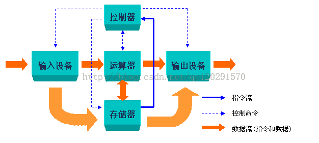
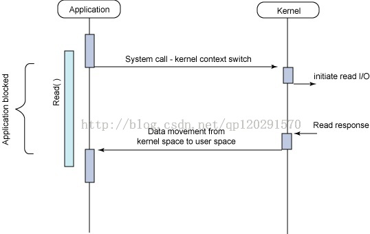

# 破解Linux操作系统的奥秘

## 存储程序计算机的概念

现代计算机的基本结构是由美藉匈牙利科学家冯· 诺依于1946年提出的。迄今为止所有进入实用的电子计算机都是按冯· 诺依曼的提出的结构体系和工作原理设计制造的，故又统称为“冯·诺依曼型计算机”。其要点为：
1.计算机完成任务是由事先编号的程序完成的；

```sh
2.计算机的程序被事先输入到存储器中，程序运算的结果，也被存放在存储器中。
3.计算机能自动连续地完成程序。
4.程序运行的所需要的信息和结果可以通输入\输出设备完成。
5.计算机由运算器、控制器、存储器、输入设备、输出设备所组成；
```

其工作原理如下图：



### 堆栈（函数调用堆栈）机制

CPU通过总线从存储器中读取指令和数据进行处理，采用的主要机制是函数调用推栈机制。在不发生中断、异常以及系统调用的过程中，每个进程的执行都符合函数调用堆栈机制。

在内存中，栈是往低（小）地址方向扩展的，而esp指向当前栈顶处的元素。通过使用push和pop指令我们可以把数据压入栈中或从栈中弹出。对于没有指定初始值的数据所需要的存储空间，我们可以通过把栈指针递减适当的值来做到。类似地，通过增加栈指针值我们可以回收栈中已分配的空间。栈用来传递函数参数、存储返回信息、临时保存寄存器原有值以用于回复以及存储局部数据。栈帧结构的两端由两个指针来指定。寄存器ebp通常用作栈帧的指针、esp用作栈的指针。esp随着数据的入栈和出栈。因此对于函数中大部分数据的访问都是通过基于帧帧指针ebp来实现。函数调用时，调用者首先会将参数以及返回地址（下一条指令的EIP）压入栈中，并将当前EIP修改为被调用函数的起始地址；被调用者开始执行后先将原栈基址EBP保存在栈中，并修改EBP和ESP的值，初始化一个新栈。返回时，被调用者恢复EBP和ESP，并且将EIP修改为栈中存储的返回地址。

### 中断机制

中断是指在CPU正常运行期间，由于内外部事件或由程序预先安排的事件引起的CPU暂时停止正在运行的程序，转而为该内部或外部事件或预先安排的事件服务的程序中去，服务完毕后再返回去继续运行被暂时中断的程序。Linux中通常分为外部中断（又叫硬件中断）和内部中断（又叫异常）。

CPU执行完一条指令后，下一条指令的逻辑地址存放在cs和eip这对寄存器中。在执行新指令前，控制单元会检查在执行前一条指令的过程中是否有中断或异常发生。如果有，控制单元就会抛下指令，进入下面的流程：

```sh
1.确定与中断或异常关联的向量i (0<i<255)
2.寻找向量对应的处理程序
3.保存当前的“工作现场”，执行中断或异常的处理程序
4.处理程序执行完毕后，把控制权交还给控制单元
5.控制单元恢复现场，返回继续执行原程序
```

Linux是个什么玩意？
让我们从一个比较高的高度来审视一下 GNU/Linux 操作系统的体系结构。您可以从两个层次上来考虑操作系统，如图所示：


最上面是用户（或应用程序）空间。这是用户应用程序执行的地方。用户空间之下是内核空间，Linux 内核正是位于这里。
GNU C Library （glibc）也在这里。它提供了连接内核的系统调用接口，还提供了在用户空间应用程序和内核之间进行转换的机制。这点非常重要，因为内核和用户空间的应用程序使用的是不同的保护地址空间。每个用户空间的进程都使用自己的虚拟地址空间，而内核则占用单独的地址空间。

Linux 内核可以进一步划分成 3 层。最上面是系统调用接口，它实现了一些基本的功能，例如 read 和 write。系统调用接口之下是内核代码，可以更精确地定义为独立于体系结构的内核代码。这些代码是 Linux 所支持的所有处理器体系结构所通用的。在这些代码之下是依赖于体系结构的代码，构成了通常称为` BSP（Board Support Package）的部分`。这些代码用作给定体系结构的处理器和特定于平台的代码。

### switch_to宏解析

首先要理解的是进程切换（process switch），作为抢占式多任务OS中重要的一个功能，其实质就是OS内核挂起正在运行的进程A，然后将先前被挂起的另一个进程B恢复运行。

每个进程都有自己的地址空间，但是所有进程在物理上共享着CPU的寄存器，因此，当恢复一个进程执行前，OS内核必须要将挂起该进程时寄存器的值装入CPU寄存器。进程恢复执行前必须装入寄存器的一组数据就叫做“硬件上下文”（hardware context），它是进程执行上下文的子集，后者是进程执行时需要的所有信息（如地址空间中的数据等）。

Linux中，TSS保存着部分的进程的硬件上下文（如ss、esp等寄存器的值），剩余部分保存在内核堆栈中（如eax、ebx等通用数据寄存器的值）。

进程切换只发生在内核态，在进程切换之前，用户态使用的寄存器内容都已保存在内核堆栈上，如ss、esp等。

下面来看一下switch_to 宏的代码，其中，prev是即将要被换出CPU的进程的描述符，next是即将得到CPU的进程的描述符。

```c
#define switch_to(prev,next,last) do {                    \
        unsigned long esi,edi;                        \
        asm volatile("pushfl\n\t"                    \
                     "pushl %%ebp\n\t"                    \
                     "movl %%esp,%0\n\t"    /* save ESP */        \
                     "movl %5,%%esp\n\t"    /* restore ESP */    \
                     "movl $1f,%1\n\t"        /* save EIP */        \
                     "pushl %6\n\t"        /* restore EIP */    \
                     "jmp __switch_to\n"                \
                     "1:\t"                        \
                     "popl %%ebp\n\t"                    \
                     "popfl"                        \
                     :"=m" (prev->thread.esp),"=m" (prev->thread.eip),    \
                     "=a" (last),"=S" (esi),"=D" (edi)            \
                     :"m" (next->thread.esp),"m" (next->thread.eip),    \
                     "2" (prev), "d" (next));                \
    } while (0)
```
该宏的工作步骤大致如下：

prev的值送入eax，next的值送入edx（这里我从代码中没有看出来，原著上如是写，可能是从调用switch_to宏的switch_context或schedule函数中处理的）。

保护prev进程的eflags和ebp寄存器内容，这些内容保存在prev进程的内核堆栈中。
将prev的esp寄存器中的数据保存在prev->thread.esp中，即将prev进程的内核堆栈保存起来。

将next->thread.esp中的数据存入esp寄存器中，这是加载next进程的内核堆栈。
将数值1保存到prev->thread.eip中，该数值1其实就是代码中"1:\t"这行中的1。为了恢复prev进程执行时用。

将next->thread.eip压入next进程的内核堆栈中。这个值往往是数值1。
跳转到__switch_to函数处执行。

执行到这里，prev进程重新获得CPU，恢复prev进程的ebp和eflags内容。
将eax的内容存入last参数（这里我也没看出来，原著上如是写，只是在__switch_to函数中返回prev，该值是放在eax中的）。

##总结：内核的工作机制

通过上面非常重要的三个点的分析：存储式计算机，堆栈机制，中断机制的分析，我们对Linux内核的机制有了一个大致的了解，下面来总结一下。

进程是正在运行的程序的一种抽象，进程工作在从用户态到内核态，从内核态在到用户态之间的转换。用户态的进程不能直接使用硬件资源，通过中断来切换到内核态来完成。内核态通过分析中断请求，确定中断向量表，然后转向相应的中断出俩函数，完成中断服务。然后在转到用户态，继续执行原先程序,以I/O中断为例，如下图：

        
