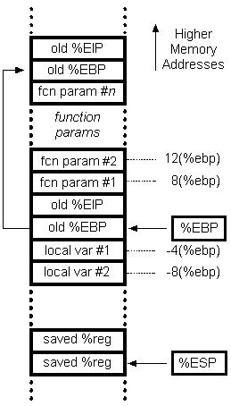

# 如何手工展開函數棧來定位問題


當程序crash的時候，我們可以通過coredump文件，來定位問題。比如使用bt命令可以完整的展開函數的調用棧。但是有些時候，部分棧的數據可能被損壞，導致gdb無法直接顯示函數的調用棧。那麼這時就需要我們手工展開函數棧。

關於x86的函數調用棧的示意圖基本如下圖所示：




關於參數的壓棧順序，上圖為cdecl方式，這個可以通過編譯選項修改。GCC默認使用cdecl。

下面看一下例子：

```c
#include <stdlib.h>
#include <stdio.h>


static int test(int a, int b, int c)
{
    return a+b+c;
}

int main()
{
    int a = 1;
    int b = 2;
    int c = 3;

    int d = test(a, b, c);

    printf("%d\n", d);

    return 0;
}
```

編譯：gcc -g -Wall test.c
進入test，查看函數調用棧：
Breakpoint 1, test (a=1, b=2, c=3) at test.c:7
7 return a+b+c;
Missing separate debuginfos, use: debuginfo-install glibc-2.11-2.i686

```
(gdb) bt
#0 test (a=1, b=2, c=3) at test.c:7
#1 0x08048412 in main () at test.c:16
```

那麼現在查看一下寄存器：

```sh
eax 0x1 1
ecx 0x2c0187d8 738297816
edx 0x1 1
ebx 0x73fff4 7602164
esp 0xbffff048 0xbffff048
ebp 0xbffff048 0xbffff048
esi 0x0 0
edi 0x0 0
eip 0x80483c7 0x80483c7 <test+3>
eflags 0x286 [ PF SF IF ]
cs 0x73 115
ss 0x7b 123
ds 0x7b 123
es 0x7b 123
fs 0x0 0
gs 0x33 51
```

得到`ebp的地址為0xbffff048`，現在檢查這個地址的內存

```sh
(gdb) x /8x 0xbffff048
0xbffff048: 0xbffff078 0x08048412 0x00000001 0x00000002
0xbffff058: 0x00000003 0x0073fff4 0x00000001 0x00000002
```

下面分析一下這些內存的內容：

> 1. 0xbffff078：為test的調用者，即main函數的bp地址；BP地址即為該函數的棧頂指針。
2. 0x08048412：為test的返回地址，與前面的bt的輸出相符；
3. 後面的0x00000001，0x00000002，0x00000003，為傳給test的三個參數，且參數順序為由右向左壓棧——注意這個順序是可以通過改變編譯參數改變的。

回到main中，驗證一下bp寄存器的內容：

```sh
0x08048412 in main () at test.c:16
16 int d = test(a, b, c);
Value returned is $2 = 6
(gdb) info registers
eax 0x6 6
ecx 0x39ff7a48 973044296
edx 0x1 1
ebx 0x73fff4 7602164
esp 0xbffff050 0xbffff050
ebp 0xbffff078 0xbffff078
```

可見BP的地址確實為0xbffff078，與之前的分析相符。

注：關於壓棧順序，參數的傳遞方式等等，都可以通過編譯選項來指定或者禁止的。本文的情況為GCC的默認行為。


