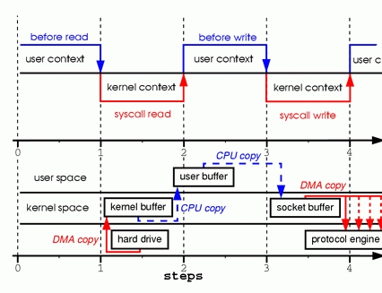
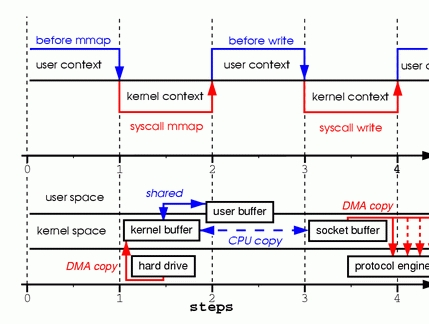
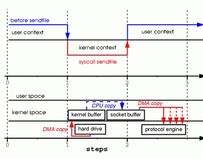
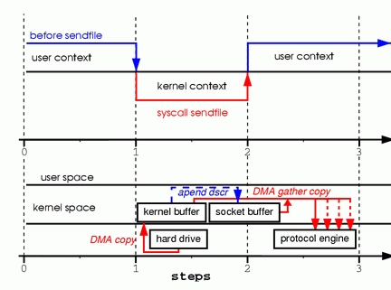

# sendfile:Linux中的"零拷貝"


如今幾乎每個人都聽說過Linux中所謂的"零拷貝"特性，然而我經常碰到沒有充分理解這個問題的人們。因此，我決定寫一些文章略微深入的講述這個問題，希望能將這個有用的特性解釋清楚。在本文中，將從用戶空間應用程序的角度來闡述這個問題，因此有意忽略了複雜的內核實現。

##什麼是」零拷貝」

為了更好的理解問題的解決法，我們首先需要理解問題本身。首先我們以一個網絡服務守護進程為例，考慮它在將存儲在文件中的信息通過網絡傳送給客戶這樣的簡單過程中，所涉及的操作。下面是其中的部分簡單代阿：

```c
read(file, tmp_buf, len);
write(socket, tmp_buf, len);
```
看起來不能更簡單了。你也許認為執行這兩個系統調用並未產生多少開銷。實際上，這簡直錯的一塌糊塗。在執行這兩個系統調用的過程中，目標數據至少被覆制了`4次`，同時發生了同樣多次數的用戶/內核空間的切換(實際上該過程遠比此處描述的要複雜，但是我希望以簡單的方式描述之，以更好的理解本文的主題)。


為了更好的理解這兩句代碼所涉及的操作，請看圖1。圖的上半部展示了上下文切換，而下半部展示了複製操作。





步驟一：系統調用read導致了從用戶空間到內核空間的上下文切換。DMA模塊從磁盤中讀取文件內容，並將其存儲在內核空間的緩衝區內，完成了第1次複製。

步驟二：數據從內核空間緩衝區複製到用戶空間緩衝區，之後系統調用read返回，這導致了從內核空間向用戶空間的上下文切換。此時，需要的數據已存放在指定的用戶空間緩衝區內(參數tmp_buf)，程序可以繼續下面的操作。

步驟三：系統調用write導致從用戶空間到內核空間的上下文切換。數據從用戶空間緩衝區被再次複製到內核空間緩衝區，完成了第3次複製。不過，這次數據存放在內核空間中與使用的socket相關的特定緩衝區中，而不是步驟一中的緩衝區。

步驟四：系統調用返回，導致了第4次上下文切換。第4次複製在DMA模塊將數據從內核空間緩衝區傳遞至協議引擎的時候發生，這與我們的代碼的執行是獨立且異步發生的。你可能會疑惑：「為何要說是獨立、異步？難道不是在write系統調用返回前數據已經被傳送了？write系統調用的返回，並不意味著傳輸成功——它甚至無法保證傳輸的開始。調用的返回，只是表明以太網驅動程序在其傳輸隊列中有空位，並已經接受我們的數據用於傳輸。可能有眾多的數據排在我們的數據之前。除非驅動程序或硬件採用優先級隊列的方法，各組數據是依照FIFO的次序被傳輸的(圖1中叉狀的DMA copy表明這最後一次複製可以被延後)。

正如你所看到的，上面的過程中存在很多的數據冗餘。某些冗餘可以被消除，以減少開銷、提高性能。作為一名驅動程序開發人員，我的工作圍繞著擁有先進特性的硬件展開。某些硬件支持完全繞開內存，將數據直接傳送給其他設備的特性。這一特性消除了系統內存中的數據副本，因此是一種很好的選擇，但並不是所有的硬件都支持。此外，來自於硬盤的數據必須重新打包(地址連續)才能用於網絡傳輸，這也引入了某些複雜性。為了減少開銷，我們可以從消除內核緩衝區與用戶緩衝區之間的複製入手。

消除複製的一種方法是將read系統調用，改為mmap系統調用，例如：

```c
tmp_buf = mmap(file, len);
write(socket, tmp_buf, len);
```
為了更好的理解這其中設計的操作，請看圖2。上下文切換部分與圖1保持一致。




步驟一：mmap系統調用導致文件的內容通過DMA模塊被覆制到內核緩衝區中，該緩衝區之後與用戶進程共享，這樣就內核緩衝區與用戶緩衝區之間的複製就不會發生。

步驟二：write系統調用導致內核將數據從內核緩衝區複製到與socket相關聯的內核緩衝區中。

步驟三：DMA模塊將數據由socket的緩衝區傳遞給協議引擎時，第3次複製發生。

通過調用mmap而不是read，我們已經將內核需要執行的複製操作減半。當有大量數據要進行傳輸是，這將有相當良好的效果。然而，性能的改進需要付出代價的;是用mmap與write這種組合方法，存在著一些隱藏的陷阱。例如，考慮一下在內存中對文件進行映射後調用write，與此同時另外一個進程將同一文件截斷的情形。此時write系統調用會被進程接收到的SIGBUS信號中斷，因為當前進程訪問了非法內存地址。對SIGBUS信號的默認處理是殺死當前進程並生成dump core文件——而這對於網絡服務器程序而言不是最期望的操作。

有兩種方式可用於解決該問題：

第一種方式是為SIGBUS信號設置信號處理程序，並在處理程序中簡單的執行return語句。在這樣處理方式下，write系統調用返回被信號中斷前已寫的字節數，並將errno全局變量設置為成功。必須指出，這並不是個好的解決方式——治標不治本。由於收到SIGBUS信號意味著進程發生了嚴重錯誤，我不鼓勵採取這種解決方式。

第二種方式應用了文件租借（在Microsoft Windows系統中被稱為「機會鎖」)。這才是解勸前面問題的正確方式。通過對文件描述符執行租借，可以同內核就某個特定文件達成租約。從內核可以獲得讀/寫租約。當另外一個進程試圖將你正在傳輸的文件截斷時，內核會向你的進程發送實時信號——RT_SIGNAL_LEASE。該信號通知你的進程，內核即將終止在該文件上你曾獲得的租約。這樣，在write調用訪問非法內存地址、並被隨後接收到的SIGBUS信號殺死之前，write系統調用就被RT_SIGNAL_LEASE信號中斷了。write的返回值是在被中斷前已寫的字節數，全局變量errno設置為成功。下面是一段展示如何從內核獲得租約的示例代碼。


```c
if (fcntl(fd, F_SETSIG, RT_SIGNAL_LEASE) == -1)
{
    perror("kernel lease set signal");
    return -1;
}

/* l_type can be F_RDLCK F_WRLCK */
if (fcntl(fd, F_SETLEASE, l_type))
{
    perror("kernel lease set type");
    return -1;
}
```

##Sendfile

sendfile系統調用在內核版本`2.1`中被引入，目的是簡化通過網絡在兩個本地文件之間進行的數據傳輸過程。sendfile系統調用的引入，不僅減少了數據複製，還減少了上下文切換的次數。使用方法如下：

sendfile(socket, file, len);

為了更好的理解所涉及的操作，請看圖3



步驟一：sendfile系統調用導致文件內容通過DMA模塊被覆制到某個內核緩衝區，之後再被覆制到與socket相關聯的緩衝區內。

步驟二：當DMA模塊將位於socket相關聯緩衝區中的數據傳遞給協議引擎時，執行第3次複製。

你可能會在想，我們在調用sendfile發送數據的期間，如果另外一個進程將文件截斷的話，會發生什麼事情？如果進程沒有為SIGBUS註冊任何信號處理函數的話，sendfile系統調用返回被信號中斷前已發送的字節數，並將全局變量errno置為成功。

然而，如果在調用sendfile之前，從內核獲得了文件租約，那麼類似的，在sendfile調用返回前會收到RT_SIGNAL_LEASE。

到此為止，我們已經能夠避免內核進行多次複製，然而我們還存在一分多餘的副本。這份副本也可以消除嗎？當然，在硬件提供的一些幫助下是可以的。為了消除內核產生的素有數據冗餘，需要網絡適配器支持聚合操作特性。該特性意味著待發送的數據不要求存放在地址連續的內存空間中；相反，可以是分散在各個內存位置。在內核版本`2.4`中，socket緩衝區描述符結構發生了改動，以適應聚合操作的要求——這就是Linux中所謂的"零拷貝「。這種方式不僅減少了多個上下文切換，而且消除了數據冗餘。從用戶層應用程序的角度來開，沒有發生任何改動，所有代碼仍然是類似下面的形式：


```c
sendfile(socket, file, len);
```

為了更好的理解所涉及的操作，請看圖4



步驟一：sendfile系統調用導致文件內容通過DMA模塊被覆制到內核緩衝區中。

步驟二：數據並未被覆制到socket關聯的緩衝區內。取而代之的是，只有記錄數據位置和長度的描述符被加入到socket緩衝區中。DMA模塊將數據直接從內核緩衝區傳遞給協議引擎，從而消除了遺留的最後一次複製。

由於數據實際上仍然由磁盤複製到內存，再由內存複製到發送設備，有人可能會聲稱這並不是真正的"零拷貝"。然而，從操作系統的角度來看，這就是"零拷貝",因為內核空間內不存在冗餘數據。應用"零拷貝"特性，出了避免複製之外，還能獲得其他性能優勢，例如更少的上下文切換，更少的CPU cache污染以及沒有CPU必要計算校驗和。

現在我們明白了什麼是"零拷貝"，讓我們將理論付諸實踐，編寫一些代碼。你可以從www.xalien.org/articles/source/sfl-src.tgz處下載完整的源碼。執行"tar -zxvf sfl-src.tgz"將源碼解壓。運行make命令，編譯源碼，並創建隨機數據文件data.bin

從頭文件開始介紹代碼：


```c
/* sfl.c sendfile example program
Dragan Stancevic <
header name function / variable
-------------------------------------------------*/
#include <stdio.h> /* printf, perror */
#include <fcntl.h> /* open */
#include <unistd.h> /* close */
#include <errno.h> /* errno */
#include <string.h> /* memset */
#include <sys/socket.h> /* socket */
#include <netinet/in.h> /* sockaddr_in */
#include <sys/sendfile.h> /* sendfile */
#include <arpa/inet.h> /* inet_addr */
#define BUFF_SIZE (10*1024) /* size of the tmp buffer */
```

除了基本socket操作所需要的 `<sys/socket.h>` 和`<netinet/in.h>`頭文件外，我們還需要包含sendfile系統調用的原型定義，這可以在`<sys/sendfile.h>`頭文件中找到。

服務器標誌：

```c
/* are we sending or receiving */
if(argv[1][0] == 's') is_server++;
/* open descriptors */
sd = socket(PF_INET, SOCK_STREAM, 0);
if(is_server) fd = open("data.bin", O_RDONLY);
```

該程序既能以服務端/發送方，也能以客戶端/接收方的身份運行。我們需要檢查命令行參數中的一項，然後相應的設置is_server標誌。程序中大開了一個地址族為PF_INET的流套接字；作為服務端運行時需要向客戶發送數據，因此要打開某個數據文件。由於程序中是用sendfile系統調用來發送數據，因此不需要讀取文件內容並存儲在程序的緩衝區內。

接下來是服務器地址:

```c
/* clear the memory */
memset(&sa, 0, sizeof(struct sockaddr_in));
/* initialize structure */
sa.sin_family = PF_INET;
sa.sin_port = htons(1033);
sa.sin_addr.s_addr = inet_addr(argv[2]);
```

將服務端地址結構清零後設置協議族、端口和IP地址。服務端的IP地址作為命令行參數傳遞給程序。端口號硬編碼為1033，選擇該端口是因為它在要求root權限的端口範圍之上。

下面是服務端的分支代碼：

```c

if (is_server)
{
    int client; /* new client socket */
    printf("Server binding to [%s]\n", argv[2]);

    if (bind(sd, (struct sockaddr*)&sa, sizeof(sa)) < 0) {
        perror("bind");
        exit(errno);
    }
}
```
作為服務端，需要為socket描述符分配一個地址，這是通過系統調用bind完成的，它將服務器地址(sa)分配給socket描述符(sd).

```c
if (listen(sd, 1) < 0)
{
    perror("listen");
    exit(errno);
}
```

