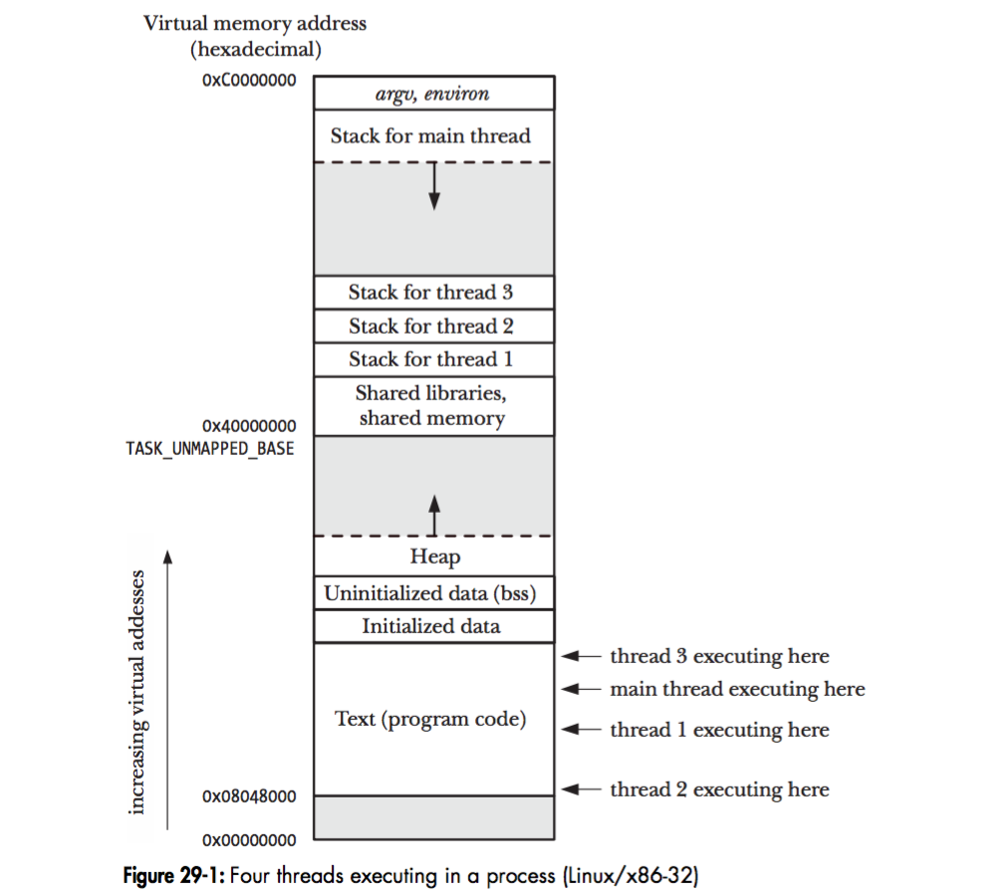

# 深入 Linux 多線程編程


NPTL 線程模型

NPTL，也即 Native POSIX Thread Library，是 Linux 2.6 引入的新的線程庫實現，用來替代舊的 LinuxThreads 線程庫。在 NPTL 實現中，用戶創建的每個線程都對應著一個內核態的線程，內核態線程也是 Linux 的最小調度單元。

在 NPTL 實現中，線程的創建相當於調用clone()，並指定下面的參數：

```sh
CLONE_VM | CLONE_FILES | CLONE_FS | CLONE_SIGHAND | CLONE_THREAD | CLONE_SETTLS | 
CLONE_PARENT_SETTID | CLONE_CHILD_CLEARTID | CLONE_SYSVSEM
```

下面解釋一下這些參數的含義：


- CLONE_VM 所有線程都共享同一個進程地址空間。
- CLONE_FILES 所有線程都共享進程的文件描述符列表 (file descriptor table)。
- CLONE_FS 所有線程都共享同一個文件系統的信息。
- CLONE_SIGHAND 所有線程都共享同一個信號 handler 列表。
- CLONE_THREAD 所有線程都共享同一個進程 ID 以及 父進程 ID。


在 Linux 可以通過下面命令查看線程庫的實現方式：

```sh
$ getconf GNU_LIBPTHREAD_VERSION
NPTL 2.23
```

##線程的棧

在 Linux 中，一個進程可以包含多個線程，這些線程將共享進程的全局變量，以及進程的堆，但每個線程都擁有它自己的棧。正如下圖所示：





在 64 位系統中，除了主線程之外，其它線程的棧默認大小為 8M，而主線程的棧則沒有這個限制，因為主線程的棧可以動態增長。可以用下面的命令查看線程棧的大小：

```sh
$ ulimit -s
8192
```

通常來說，默認的線程棧大小可以滿足大部分程序的需求，然而在一些特殊的場景下，譬如說，子線程需要在棧上分配大量的變量，或者執行深度比較大的遞歸調用，這時候就需要改變線程棧的大小了。下面的代碼展示瞭如何修改線程棧的大小：


```c
#include <pthread.h>
#include <stdio.h>
void *thread_func(void *) {  return NULL;  }
int main(int argc, char *argv[])
{
    size_t size;
    pthread_attr_t attr;
    pthread_attr_init(&attr);
    pthread_attr_getstacksize(&attr, &size);
    printf("Default stack size = %li\n", size);
    size = 32 * 1024 * 1024;
    pthread_attr_setstacksize (&attr, size);
    pthread_t tid;
    pthread_create(&tid, &attr, thread_func, NULL);
    pthread_attr_getstacksize(&attr, &size);
    printf("New stack size = %li\n", size);
    pthread_attr_destroy(&attr);
    pthread_join(tid, NULL);
    return 0;
}
```

運行程序將輸出下面的結果：


```sh
Default stack size = 8388608    # 默認為 8M
New stack size = 33554432       # 改成了 32 M
```

## 線程局部存儲


Linux 提供了__thread關鍵字，用來表示線程局部存儲。下面是__thread的使用規則：

- __thread可以用來修飾全局變量，以及函數內的 static 變量。
- 初始化__thread變量時，只能使用編譯期常量。
- 在 C++ 中，__thread只能用於修飾 POD 類型，而不能用於修飾 class 類型。


當定義了一個__thread變量之後，每個線程都擁有了這個變量的一份副本。由於每個線程都擁有一份副本，所以在多線程中併發地訪問__thread變量是安全的。

__thread可以幫助我們將不是線程安全的函數，改造成線程安全的。譬如說，標準庫的strerror()函數會返回一個指針，指向一個全局變量，所以它不是線程安全的。利用__thread，我們可以實現一個線程安全的strerror()函數：


```cpp
#define _GNU_SOURCE
#include <stdio.h>  // Get '_sys_nerr' and '_sys_errlist' declarations 
#define MAX_ERROR_LEN 256
static __thread char buf[MAX_ERROR_LEN];
char *my_strerror_r( int err )
{
    if (err < 0 || err >= _sys_nerr || _sys_errlist[err] == NULL) 
    {
        snprintf(buf, MAX_ERROR_LEN, "Unknown error %d", err);
    } else {
        strncpy(buf, _sys_errlist[err], MAX_ERROR_LEN - 1);
        buf[MAX_ERROR_LEN - 1] = '\0';
    }
    return buf;
}
```

前面我們說到，__thread不能用於修飾 C++ 中的 class 類型，不過 C++11 提供了thread_local，除了可以修飾 POD 類型外，還可以修飾 class 類型：

```cpp
__thread std::string s1 = "Hello";        // 錯誤，__thread 不能修飾 class 類型
thread_local std::string s2 = "Hello";    // 正確
```

## 單例模式

在多線程編程中，有時候我們需要保證，無論程序創建了多少個線程，某些操作只執行了一次。Linux 提供了pthread_once()系統調用，我們可以藉助pthread_once()實現單例模式：


```cpp
#include <pthread.h>
#include <stdlib.h>
template<typename T>
class Singleton
{
public:
    static T &instance()
    {
        pthread_once(&ponce_, &Singleton::init);
        return *value_;
    }
    // disable the copy operations
    Singleton(const Singleton &) = delete;
    Singleton &operator=(const Singleton &) = delete;
private:
    Singleton();
    ~Singleton();
    static void init()
    {
        value_ = new T();
        ::atexit(destroy);
    }
    static void destroy()
    {
        delete value_;
        value_ = nullptr;
    }
    static pthread_once_t  ponce_;
    static T              *value_;
};
template<typename T>
pthread_once_t Singleton<T>::ponce_ = PTHREAD_ONCE_INIT;
template<typename T>
T *Singleton<T>::value_ = nullptr;
```

##參考資料

- The Native POSIX Thread Library for Linux
- Linux threading models compared: LinuxThreads and NPTL
- POSIX Threads Programming
- The Linux Programming Interface: A Linux and UNIX System Programming Handbook
- Linux多線程服務端編程 - 使用muduo C++網絡庫


