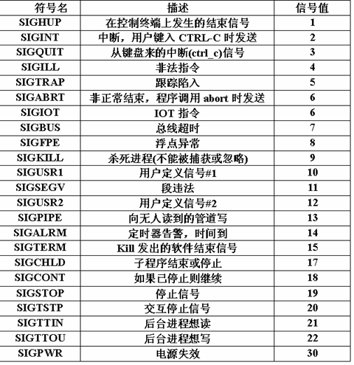

# Signal

信號是比較複雜的通信方式，用於通知接受進程有某種事件發生，除了用於進程間通信外，進程還可以發送信號給進程本身；Linux除了支持Unix早期信號
語義函數sigal外，還支持語義符合Posix.1標準的信號函數sigaction（實際上，該函數是基於BSD的，BSD為了實現可靠信號機制，又
能夠統一對外接口，用sigaction函數重新實現了signal函數）

##信號種類

每種信號類型都有對應的信號處理程序(也叫信號的操作)，就好像每個中斷都有一箇中斷服務例程一樣。大多數信號的默認操作是結束接收信號的進程；然而，一個進程通常可以請求系統採取某些代替的操作，各種代替操作是：

- 忽略信號。隨著這一選項的設置，進程將忽略信號的出現。有兩個信號  不可以被忽略：SIGKILL，它將結束進程；SIGSTOP，它是作業控制機制的一部分，將掛起作業的執行。
- 恢復信號的默認操作。
- 執行一個預先安排的信號處理函數。進程可以登記特殊的信號處理函數。當進程收到信號時，信號處理函數將像中斷服務例程一樣被調用，當從該信號處理函數返回時，控制被返回給主程序，並且繼續正常執行。

但是，信號和中斷有所不同。中斷的響應和處理都發生在內核空間，而信號的響應發生在內核空間，信號處理程序的執行卻發生在用戶空間。

那麼，什麼時候檢測和響應信號呢？通常發生在兩種情況下：

- 當前進程由於系統調用、中斷或異常而進入內核空間以後，從內核空間返回到用戶空間前夕；
- 當前進程在內核中進入睡眠以後剛被喚醒的時候，由於檢測到信號的存在而提前返回到用戶空間。

函數原型等詳見：http://www.cnblogs.com/biyeymyhjob/archive/2012/08/04/2622265.html

##信號本質

信號是在軟件層次上對中斷機制的一種模擬，在原理上，一個進程收到一個信號與處理器收到一箇中斷請求可以說是一樣的。信號是異步的，一個進程不必通過任何操作來等待信號的到達，事實上，進程也不知道信號到底什麼時候到達。

信號是進程間通信機制中`唯一的異步通信機制`，可以看作是異步通知，通知接收信號的進程有哪些事情發生了。信號機制經過POSIX實時擴展後，功能更加強大，除了基本通知功能外，還可以傳遞附加信息。

##信號來源

信號事件的發生有兩個來源：硬件來源(比如我們按下了鍵盤或者其它硬件故障)；軟件來源，最常用發送信號的系統函數是kill, raise, alarm和setitimer以及sigqueue函數，軟件來源還包括一些非法運算等操作。

##關於信號處理機制的原理(內核角度)

內核給一個進程發送軟中斷信號的方法，是在`進程所在的進程表項的信號域設置對應於該信號的位`。這裡要補充的是，如果信號發送給一個正在睡眠的進程，那麼要 看該進程進入睡眠的優先級，如果進程睡眠在可被中斷的優先級上，則喚醒進程；否則僅設置進程表中信號域相應的位，而不喚醒進程。這一點比較重要，因為`進程檢查是否收到信號的時機是：一個進程在即將從內核態返回到用戶態時；或者，在一個進程要進入或離開一個適當的低調度優先級睡眠狀態時`。    

內核處理一個進程收到的信號的時機是在一個進程從內核態返回用戶態時`。所以，當一個`進程在內核態下運`行時，`軟中斷信號並不立即起作用，要等到將返回用戶態時才處理`。進程只有處理完信號才會返回用戶態（上面的例子程序中，在步驟5中，解除阻塞後，先打印caught SIGQUIT，再打印SIGQUIT unblocked，即在sigprocmask返回前，信號處理程序先執行），進程在用戶態下不會有未處理完的信號。    

內核處理一個進程收到的軟中斷信號是在該進程的上下文中，因此，進程必須處於運行狀態。如果進程收到一個要捕捉的信號，那麼進程從內核態返回用戶態時執行`用戶定義的函數`。而且執行用戶定義的函數的方法很巧妙，內核是在`用戶棧上創建一個新的層`，該層中將`返回地址的值設置成用戶定義的處理函數的地址`，這樣進程從內核返回彈出棧頂時就`返回到用戶定義的函數處`，從函數返回再彈出棧頂時，才返回原先進入內核的地方，接著原來的地方繼續運行。這樣做的原因是用戶定義的處理函數`不能且不允許在內核態下執行`（如果用戶定義的函數在內核態下運行的話，用戶就可以獲得任何權限）。

在信號的處理方法中有幾點特別要引起注意。    

第一，在一些系統中，當一個進程處理完中斷信號返回用戶態之前，內核清除用戶區中設定的對該信號的處理例程的地址，`即下一次進程對該信號的處理方法又改為默認值，除非在下一次信號到來之前再次使用signal系統調用`。這可能會使得進程在調用signal之前又得 到該信號而導致退出。在BSD中，內核不再清除該地址。但不清除該地址可能使得進程因為過多過快的得到某個信號而導致堆棧溢出。為了避免出現上述情況。在 BSD系統中，內核模擬了對硬件中斷的處理方法，即在處理某個中斷時，阻止接收新的該類中斷。    

第二個要引起注意的是，如果要捕捉的信號發生於`進程正在一個系統調用中時，並且該進程睡眠在可中斷的優先級上`（若系統調用未睡眠而是在運行，根據上面的分 析，等該系統調用運行完畢後再處理信號），這時該信號引起進程作一次longjmp，跳出睡眠狀態，返回用戶態並執行信號處理例程。當從信號處理例程返回 時，進程就象從系統調用返回一樣，但返回了一個錯誤如－1，並將errno設置為EINTR，指出該次系統調用曾經被中斷。這要注意的是，BSD系統中內 核可以自動地重新開始系統調用，或者手如上面所述手動設置重啟。    

第三個要注意的地方：若進程睡眠在`可中斷的優先級上`，則當`它收到一個要忽略的信號時，該進程被喚醒，但不做longjmp，一般是繼續睡眠`。但用戶感覺不 到進程曾經被喚醒，而是象沒有發生過該信號一樣。所以能夠使pause、sleep等函數從掛起態返回的信號必須要有信號處理函數，如果沒有什麼動作，可 以將處理函數設為空。    

第四個要注意的地方：內核對子進程終止（SIGCLD）信號的處理方法與其他信號有所區別。當進程正常或異常終止時，內核都向其父進程發一個SIGCLD 信號，`預設情況下，父進程忽略該信號`，就象沒有收到該信號似的，如果父進程希望獲得子進程終止的狀態，則應該事先用signal函數為SIGCLD信號設 置信號處理程序，在信號處理程序中調用wait。

SIGCLD信號的作用是喚醒一個睡眠在可被中斷優先級上的進程。如果該進程捕捉了這個信號，就象普通信號處理一樣轉到處理例程。如果進程忽略該信號，則 什麼也不做。其實wait不一定放在信號處理函數中，但這樣的話因為不知道子進程何時終止，在子進程終止前，wait將使父進程掛起休眠。

## 信號生命週期

##參考資料：

http://www.cnblogs.com/vamei/archive/2012/10/10/2715398.html

http://bbs.chinaunix.net/thread-1947211-1-1.html

