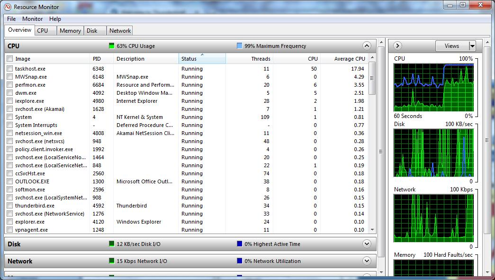

# tutorial-pthreads

原文地址：[https://computing.llnl.gov/tutorials/pthreads/](https://computing.llnl.gov/tutorials/pthreads/ "POSIX Threads Programming")

# POSIX Threads Programming
1. Abstract
2. Pthreads Overview
    1. What is a Thread?
    2. What are Pthreads?
    3. Why Pthreads?
    4. Designing Threaded Programs
3. The Pthreads API
4. Compiling Threaded Programs
5. Thread Management
    1. Creating and Terminating Threads
    2. Passing Arguments to Threads
    3. Joining and Detaching Threads
    4. Stack Management
    5. Miscellaneous Routines
6. Exercise 1
7. Mutex Variables
    1. Mutex Variables Overview
    2. Creating and Destroying Mutexes
    3. Locking and Unlocking Mutexes
8. Condition Variables
    1. Condition Variables Overview
    2. Creating and Destroying Condition Variables
    3. Waiting and Signaling on Condition Variables
9. Monitoring, Debugging and Performance Analysis Tools for Pthreads
10. LLNL Specific Information and Recommendations
11. Topics Not Covered
12. Exercise 2
13. References and More Information
14. Appendix A: Pthread Library Routines Reference

## Abstract
## 摘要
In shared memory multiprocessor architectures, threads can be used to implement parallelism. Historically, hardware vendors have implemented their own proprietary versions of threads, making portability a concern for software developers. For UNIX systems, a standardized C language threads programming interface has been specified by the IEEE POSIX 1003.1c standard. Implementations that adhere to this standard are referred to as POSIX threads, or Pthreads.

在共享內存的多處理器架構中，線程可以被用來實現並行計算。由於歷史原因，硬件供應商實現了他們自己私有版本的線程，這使得軟件開發者不得不考慮可移植性。對於UNIX系統，一種標準的C語言線程編程接口被IEEE POSIX 1003.1c標準所指定。在此所述的對該標準的實現被稱之為POSIX線程，也稱之為Pthreads。

The tutorial begins with an introduction to concepts, motivations, and design considerations for using Pthreads. Each of the three major classes of routines in the Pthreads API are then covered: Thread Management, Mutex Variables, and Condition Variables. Example codes are used throughout to demonstrate how to use most of the Pthreads routines needed by a new Pthreads programmer. The tutorial concludes with a discussion of LLNL specifics and how to mix MPI with pthreads. A lab exercise, with numerous example codes (C Language) is also included.

本教程從對概念、動機、設計考慮的介紹開始。然後覆蓋Pthreads API中三個主要的例程類型：線程管理、互斥變量、條件變量。從頭到尾的示例代碼用來展示一個Pthread新手需要的絕大部分Pthread例程。本教程以對LLNL的細節討論和如何將Pthread與MPI結合作為結束。同時還包含一個擁有大量C語言示例代碼的實驗練習。

Level/Prerequisites: This tutorial is one of the eight tutorials in the 4+ day "Using LLNL's Supercomputers" workshop. It is deal for those who are new to parallel programming with threads. A basic understanding of parallel programming in C is required. For those who are unfamiliar with Parallel Programming in general, the material covered in [EC3500: Introduction To Parallel Computing](https://computing.llnl.gov/tutorials/parallel_comp) would be helpful. 

水平/前置條件：本教程是4+天“使用LLNL的超級計算機”進修班8篇教程中的一篇。它是那些剛剛接觸使用線程進行並行編程的人的理想教程。需要基本理解在C語言中進行並行編程。對於那些連並行編程的大概都不瞭解的人，建議先看看[EC3500: 並行編程簡介](https://computing.llnl.gov/tutorials/parallel_comp)裡提到的資料，應該會有幫助。

## Pthreads Overview
## Pthread概述

### What is a Thread?
### 線程是什麼？

- Technically, a thread is defined as an independent stream of instructions that can be scheduled to run as such by the operating system. But what does this mean?
- 從技術上講，線程被定義為一個獨立的指令流，它能被作系統調度進而運行。但是這是什麼意思？
- To the software developer, the concept of a "procedure" that runs independently from its main program may best describe a thread.
- 對軟件開發者而言，某個“過程”能獨立於主程序運行這樣的概念也許最能描述線程。
- To go one step further, imagine a main program (a.out) that contains a number of procedures. Then imagine all of these procedures being able to be scheduled to run simultaneously and/or independently by the operating system. That would describe a "multi-threaded" program.
- 更進一步，想像一個包含許多過程的主程序（a.out）。然後想像所有這些過程能夠被操作系統調度成獨立或者不獨立地同時執行。這就描述一個“多線程”程序。
- How is this accomplished?
- 這是如何完成的？
- Before understanding a thread, one first needs to understand a UNIX process. A process is created by the operating system, and requires a fair amount of "overhead". Processes contain information about program resources and program execution state, including:
- 在理解線程之前，你需要先理解UNIX的進程。一個進程被操作系統創建，並且請求相當數量的“開銷”。進程包含程序資源與程序執行狀態的信息，包括：

    - Process ID, process group ID, user ID, and group ID
    - 進程ID、進程組ID、用戶ID、組ID
    - Environment
    - 環境變量
    - Working directory
    - 工作目錄
    - Program instructions
    - 程序執令
    - Registers
    - 寄存器
    - Stack
    - 棧
    - Heap
    - 堆
    - File descriptors
    - 文件描述符
    - Signal actions
    - 信號動作
    - Shared libraries
    - 共享庫
    - Inter-process communication tools (such as message queues, pipes, semaphores, or shared memory)
    - 進程間通訊工具（例如消息隊列、管道、信號量以及共享內存）
    - 
    - 
- Threads use and exist within these process resources, yet are able to be scheduled by the operating system and run as independent entities largely because they duplicate only the bare essential resources that enable them to exist as executable code.
- 線程使用進程的資源且位於進程資源內，卻能被操作系統當成獨立實體調度並且獨立執行，這主要是因為它們僅複製了讓它們成為可執行代碼剛剛夠的必須的資源。
- This independent flow of control is accomplished because a thread maintains its own:
- 能做到獨立控制流是因為線程維護著它自己的：
    - Stack pointer
    - 棧指針
    - Registers
    - 寄存器
    - Scheduling properties (such as policy or priority)
    - 調度屬性（例如策略與優先級）
    - Set of pending and blocked signals
    - 一系列等待的與阻塞的信號
    - Thread specific data
    - 線程特有數據
- So, in summary, in the UNIX environment a thread:
- 綜上，在UNIX環境下，一個線程：
    - Exists within a process and uses the process resources
    - 存在於一個進程裡面並且使用該進程的資源
    - Has its own independent flow of control as long as its parent process exists and the OS supports it
    - 擁有它自己獨立的控制流，只要它的父進程存在並且操作系統支持
    - Duplicates only the essential resources it needs to be independently schedulable
    - 僅複製獨立調度所必須的資源
    - May share the process resources with other threads that act equally independently (and dependently)
    - 可能與行為同樣獨立（或者依賴）的其他線程共享進程資源
    - Dies if the parent process dies - or something similar
    - 因父進程掛掉而掛掉——或者其他類似的規則
    - Is "lightweight" because most of the overhead has already been accomplished through the creation of its process
    - 是輕量級的，因為大部分開銷已經在創建進程的時候完成了。
- Because threads within the same process share resources:
- 因為屬於同一個進程線程們共享資源，所以：
    - Changes made by one thread to shared system resources (such as closing a file) will be seen by all other threads.
    - 由某個線程引起的對共享系統資源的變更（比如關閉一個文件）將會被其他所有線程看見。
    - Two pointers having the same value point to the same data.
    - 擁有相同值的兩個指針指向同一塊數據。
    - Reading and writing to the same memory locations is possible, and therefore requires explicit synchronization by the programmer.
    - 同時讀和寫同一個內存地址是可能的，因此需要編程人員作出明確的同步。

### What are Pthreads?
### Pthread是什麼？
- Historically, hardware vendors have implemented their own proprietary versions of threads. These implementations differed substantially from each other making it difficult for programmers to develop portable threaded applications.
- 由於歷史原因，硬件供應商實現了他們自己的專有的線程版本。這些實現相互之間有大量的不同，這使得程序員開發可移植的多線程應用變得很難。
- In order to take full advantage of the capabilities provided by threads, a standardized programming interface was required.
- 為了充分利用線程提供的能力，一個標準化的編程接口不可缺少。
    - For UNIX systems, this interface has been specified by the IEEE POSIX 1003.1c standard (1995).
    - 對UNIX系統而言，這個接口被IEEE POSIX 1003.1c標準所指定。
    - Implementations adhering to this standard are referred to as POSIX threads, or Pthreads.
    - 在這裡所指的對標準的實現稱為POSIX線程，也叫Pthread。
    - Most hardware vendors now offer Pthreads in addition to their proprietary API's.
    - 大多數硬件供應商現在除了他們專有的API之外都提供了Pthread。
- The POSIX standard has continued to evolve and undergo revisions, including the Pthreads specification.
- POSIX標準一直在發展並經受修訂，包括Pthread設計規格。
- Some useful links:
- 一些有用的鏈接：
    - [POSIX 1003.1-2008](http://standards.ieee.org/findstds/standard/1003.1-2008.html)
    - [posix faq](www.opengroup.org/austin/papers/posix_faq.html)
    - [ieee std](www.unix.org/version3/ieee_std.html)
- Pthreads are defined as a set of C language programming types and procedure calls, implemented with a pthread.h header/include file and a thread library - though this library may be part of another library, such as libc, in some implementations.
- Pthread被定義為一系列C語言編程裡的類型和過程調用，隨一個pthread.h頭文件/include文件以及一個線程庫而實現。儘管在某些實現裡，這線程庫是作為另一個庫的一部分而存在，例如libc。

### Why Pthreads?
### 為什麼是Pthread？
#### Light Weight:
#### 輕量：
- When compared to the cost of creating and managing a process, a thread can be created with much less operating system overhead. Managing threads requires fewer system resources than managing processes.
- 與創建和管理一個進程的消耗相比，一個線程能以相當少的操作系統開銷創建出來。管理線程比管理進程所需系統資源更少。
- For example, the following table compares timing results for the fork() subroutine and the pthread_create() subroutine. Timings reflect 50,000 process/thread creations, were performed with the time utility, and units are in seconds, no optimization flags.
- 比如說，下表比較了fork()子例程和pthread_create()子例程在時間上的消耗結果。時間反映了50000個進程/線程的創建，用time工具命令執行，單位為秒，沒有使用優化標記。

Note: don't expect the sytem and user times to add up to real time, because these are SMP systems with multiple CPUs/cores working on the problem at the same time. At best, these are approximations run on local machines, past and present.

注意：不要妄想系統時間加上用戶時間等於實際時間，因為這些是對稱多處理器（SMP）系統，擁有多個CPU/核心同時在問題上工作。充其量，在本地機上運行時它們相近，不管是過去還是當今的機器。

<table>
    <thead>
        <tr>
            <th rowspan="2">Platform</th>
            <th colspan="3">fork()</th>
            <th colspan="3">pthread_create()</th>
        </tr>
        <tr>
            <th>real</th>
            <th>user</th>
            <th>sys</th>
            <th>real</th>
            <th>user</th>
            <th>sys</th>
        </tr>
    </thead>
    <tbody>
        <tr>
            <td>Intel 2.6 GHz Xeon E5-2670 (16 cores/node)</td>
            <td>8.1</td>
            <td>0.1</td>
            <td>2.9</td>
            <td>0.9</td>
            <td>0.2</td>
            <td>0.3</td>
        </tr>
        <tr>
            <td>Intel 2.8 GHz Xeon 5660 (12 cores/node)</td>
            <td>4.4</td>
            <td>0.4</td>
            <td>4.3</td>
            <td>0.7</td>
            <td>0.2</td>
            <td>0.5</td>
        </tr>
        <tr>
            <td>AMD 2.3 GHz Opteron (16 cores/node)</td>
            <td>12.5</td>
            <td>1.0</td>
            <td>12.5</td>
            <td>1.2</td>
            <td>0.2</td>
            <td>1.3</td>
        </tr>
        <tr>
            <td>AMD 2.4 GHz Opteron (8 cores/node)</td>
            <td>17.6</td>
            <td>2.2</td>
            <td>15.7</td>
            <td>1.4</td>
            <td>0.3</td>
            <td>1.3</td>
        </tr>
        <tr>
            <td>IBM 4.0 GHz POWER6 (8 cpus/node)</td>
            <td>9.5</td>
            <td>0.6</td>
            <td>8.8</td>
            <td>1.6</td>
            <td>0.1</td>
            <td>0.4</td>
        </tr>
        <tr>
            <td>IBM 1.9 GHz POWER5 p5-575 (8 cpus/node)</td>
            <td>64.2</td>
            <td>30.7</td>
            <td>27.6</td>
            <td>1.7</td>
            <td>0.6</td>
            <td>1.1</td>
        </tr>
        <tr>
            <td>IBM 1.5 GHz POWER4 (8 cpus/node)</td>
            <td>104.5</td>
            <td>48.6</td>
            <td>47.2</td>
            <td>2.1</td>
            <td>1.0</td>
            <td>1.5</td>
        </tr>
        <tr>
            <td>INTEL 2.4 GHz Xeon (2 cpus/node)</td>
            <td>54.9</td>
            <td>1.5</td>
            <td>20.8</td>
            <td>1.6</td>
            <td>0.7</td>
            <td>0.9</td>
        </tr>
        <tr>
            <td>INTEL 1.4 GHz Itanium2 (4 cpus/node)</td>
            <td>54.5</td>
            <td>1.1</td>
            <td>22.2</td>
            <td>2.0</td>
            <td>1.2</td>
            <td>0.6</td>
        </tr>
    </tbody>
</table>

Source: [fork vs thread](https://computing.llnl.gov/tutorials/pthreads/fork_vs_thread.txt "fork_vs_thread.txt")

#### Efficient communications/Data Exchange:
#### 高效的交流/數據交換：
- The primary motivation for considering the use of Pthreads on a multi-processor architecture is to achieve optimum performance. In particular, if an application is using MPI for on-node communications, there is a potential that performance could be improved by using Pthreads instead.
- 考慮在多處理器架構上用Pthread的主要動機是達到最佳性能。特別是如果一個應用使用MPI做單點交流，那麼有很有可能通過使用Pthread代替MPI讓性能得到提升。
- MPI libraries usually implement on-node task communication via shared memory, which involves at least one memory copy operation (process to process).
- MPI庫通常通過共享內存實現單點任務溝通，這至少牽扯到內存複製操作（進程到進程）。
- For Pthreads there is no intermediate memory copy required because threads share the same address space within a single process. There is no data transfer, per se. It can be as efficient as simply passing a pointer.
- 對Pthread來說不存在中間內存複製的需求，因為在同一個單獨進程裡面線程們共享相同的地址空間。本質上沒有數據傳輸。它可以做到僅僅傳輸一個指針那樣的高效。
- In the worst case scenario, Pthread communications become more of a cache-to-CPU or memory-to-CPU bandwidth issue. These speeds are much higher than MPI shared memory communications.
- 在最糟糕的情況下，Pthread交流更多地成為一個緩存至CPU或者CPU至緩存帶寬問題。它們的速度遠比MPI的內存交流快得多。
- For example: some local comparisons, past and present, are shown below:
- 比如：下面展示了過去與現在的一些本地機器的比較：

<table>
    <thead>
        <tr>
            <th>Platform</th>
            <th>MPI Shared Memory Bandwidth (GB/sec)</th>
            <th>Pthreads Worst Case Memory-to-CPU Bandwidth  (GB/sec)</th>
        </tr>
    </thead>
    <tbody>
        <tr>
            <td>Intel 2.6 GHz Xeon E5-2670</td>
            <td>4.5</td>
            <td>51.2</td>
        </tr>
        <tr>
            <td>Intel 2.8 GHz Xeon 5660</td>
            <td>5.6</td>
            <td>32</td>
        </tr>
        <tr>
            <td>AMD 2.3 GHz Opteron</td>
            <td>1.8</td>
            <td>5.3</td>
        </tr>
        <tr>
            <td>AMD 2.4 GHz Opteron</td>
            <td>1.2</td>
            <td>5.3</td>
        </tr>
        <tr>
            <td>IBM 1.9 GHz POWER5 p5-575</td>
            <td>4.1</td>
            <td>16</td>
        </tr>
        <tr>
            <td>IBM 1.5 GHz POWER4</td>
            <td>2.1</td>
            <td>4</td>
        </tr>
        <tr>
            <td>Intel 2.4 GHz Xeon</td>
            <td>0.3</td>
            <td>4.3</td>
        </tr>
        <tr>
            <td>Intel 1.4 GHz Itanium 2</td>
            <td>1.8</td>
            <td>6.4</td> 
        </tr>
    </tbody>
</table>

#### Other Common Reasons:
#### 其他常見原因：
- Threaded applications offer potential performance gains and practical advantages over non-threaded applications in several other ways:
- 在其他許多方面，多線程應用提供了潛在的性能收益和在非多線程應用之上的實用的優勢：
    - Overlapping CPU work with I/O: For example, a program may have sections where it is performing a long I/O operation. While one thread is waiting for an I/O system call to complete, CPU intensive work can be performed by other threads.
    - 重疊的CPU工作與I/O：例如，一個程序可能擁有某個執行長時間I/O操作的區塊。當其中一個線程在等待I/O系統調用的結束時，CPU密集的工作可以在另一個線程執行。
    - Priority/real-time scheduling: tasks which are more important can be scheduled to supersede or interrupt lower priority tasks.
    - 優先級/實時調度：更重要的任務可以在調度時取代或者中斷低優先級的任務。
    - Asynchronous event handling: tasks which service events of indeterminate frequency and duration can be interleaved. For example, a web server can both transfer data from previous requests and manage the arrival of new requests.
    - 異步的事件處理：服務不確定頻率和持續時間的事件的任務可以交錯進行。例如一個Web服務既可以傳輸先前的請求的數據也可以處理新到來的請求。
- A perfect example is the typical web browser, where many interleaved tasks can be happening at the same time, and where tasks can vary in priority.
- 一個完美的例子是典型的WEB瀏覽器，在這裡許多交錯的任務在同時發生，任務的優先級可以不同。
- Another good example is a modern operating system, which makes extensive use of threads. A screenshot of the MS Windows OS and applications using threads is shown below.
- 另一個好例子是現代操作系統，它廣泛地使用了線程。下面展示了微軟Windows操作系統和應用程序使用的線程的屏幕截圖。

## Pthreads Overview
## Pthread概述
### Designing Threaded Programs
### 設計多線程程序
#### Parallel Programming:
#### 並行編程：

- On modern, multi-core machines, pthreads are ideally suited for parallel programming, and whatever applies to parallel programming in general, applies to parallel pthreads programs.
- 在現代、多核心的機器上，pthread是理想上適合並行編程，同時不管怎樣適用於通用的並行編程，適用於並行的pthread程序。
- There are many considerations for designing parallel programs, such as:
- 設計一個並行程序需要考慮許多，例如：
    - What type of parallel programming model to use?
    - 使用哪種類型的並行編程模型？
    - Problem partitioning
    - 問題分解
    - Load balancing
    - 負載平衡
    - Communications
    - 交流
    - Data dependencies
    - 數據依賴
    - Synchronization and race conditions
    - 同步與競態條件
    - Memory issues
    - 內存問題
    - I/O issues
    - I/O問題
    - Program complexity
    - 程序複雜性
    - Programmer effort/costs/time
    - 編程人員工作量/費用/時間
    - ...
    - ……
- Covering these topics is beyond the scope of this tutorial, however interested readers can obtain a quick overview in the [Introduction to Parallel Computing](https://computing.llnl.gov/tutorials/parallel_comp) tutorial.
- 這些主題已經超出了本教程的範圍，然而對這些感興趣的讀者可以從[並行計算簡介](https://computing.llnl.gov/tutorials/parallel_comp)教程中獲得簡要概述。
- In general though, in order for a program to take advantage of Pthreads, it must be able to be organized into discrete, independent tasks which can execute concurrently. For example, if routine1 and routine2 can be interchanged, interleaved and/or overlapped in real time, they are candidates for threading.
- 但是一般來說，想讓一個程序能利用Pthread的優勢，它必須能夠被組織成離散的獨立的任務，這些任務能同時地執行。例如，例程1和例程2能被實時地交換、交叉或者重疊，那麼它們是多線程的候選人。

- Programs having the following characteristics may be well suited for pthreads:
- 擁有以下特徵的程序可能很適合Pthread：
    - Work that can be executed, or data that can be operated on, by multiple tasks simultaneously:
    - 能夠被多個任務同時地執行工作，或者操作數據：
    - Block for potentially long I/O waits
    - 因為潛在的常時間I/O等待而阻塞
    - Use many CPU cycles in some places but not others
    - 在某些地方使用了許多CPU週期但是其他地方則不是
    - Must respond to asynchronous events
    - 必須響應異步的事件
    - Some work is more important than other work(priority interrupts)
    - 某些工作比其他工作更重要（優先中斷）
- Several common models for threaded programs exist:
- 存在一些常見的多線程程序模型：
    - Manager/worker: a single thread, the manager assigns work to other threads, the workers. Typically, the manager handles all input and parcels out work to the other tasks. At least two forms of the manager/worker model are common: static worker pool and dynamic worker pool.
    - 管理者/工人：一個單獨的線程——管理者——分配工作任務給其他線程——工人們。通常，管理者處理所有輸入並且把工作分配給其他任務。至少存在兩種常用的管理者/工人模型：靜態工人池和動態工人池。
    - Pipeline: a task is broken into a series of suboperations, each of which is handled in series, but concurrently, by a different thread. An automobile assembly line best describes this model.
    - 流水線：一個任務被分解成一系列子操作，每個子操作被不同的線程同時地按順序地接管。汽車裝配線能最好地描述這個模型。
    - Peer: similar to the manager/worker model, but after the main thread creates other threads, it participates in the work.
    - 對等：與管理者/工人模型相似，但是在主線程創建其他線程後，它自己參與進工作當中。

#### Shared Memory Model:
#### 共享內存模型：

- All threads have access to the same global, shared memory
- 所有線程有權訪問同一個全局的共享的內存
- Threads also have their own private data
- 線程也有他們自己的私有數據
- Programmers are responsible for synchronizing access(protecting) globally shared data.
- 編程人員對同步訪問（保護）全局的共享的數據負有責任。

#### Thread-safeness:
#### 線程安全性：

- Thread-safeness: in a nutshell, refers an application's ability to execute multiple threads simulaneously without "clobbering" shared data or creating "race" conditions.
- 線程安全性：簡而言之，指的就是應用程序的同時執行多個線程而不“痛打”共享數據或者產生“競態”條件。
- For example, suppose that your application creates several threads, each of which makes a call to the same library routine:
- 舉個例子，假設你的應用程序創建了許多線程，每個線程都調用了同一個庫函數：
    - This library routine accesses/modifies a global structure or location in memory.
    - 該庫函數訪問/修改一個內存中的全局的結構或者位置。
    - As each thread calls this routine it is possible that they may try to modify this global structure/memory location at the same time.
    - 因為每個線程都調用該函數，所以有可能造成它們嘗試同時修改這個全局的結構或者內存位置。
    - If the routine does not employ some sort of synchronization constructs to prevent data corruption, then it is not thread-safe.
    - 如果函數沒有使用某種同步設計來避免數據損壞，那麼它就不是線程安全的。

- The implication to users of external library routines is that if you aren't 100% certain the routine is thread-safe, then you take your chances with problems that could arise.
- 這暗示著那些使用外部庫函數的用戶，如果你不能100%確定函數是線程安全的，那麼你得自行承擔可能出現的問題的風險。
- Recommendation: Be careful if your application uses libraries or other objects that don't explicitly guarantee thread-safeness. When in doubt, assume that they are not thread-safe until proven otherwise. This can be done by "serializing" the calls to the uncertain routine, etc.
- 建議：如果你的應用程序使用的庫或者其他對象沒有明確地保證線程安全，那麼你要小心了。當你不確定時，假定它們非線程安全直到證明它線程安全。通過對不確定的函數的調用進行“序列化”可以解決這個問題。

#### Thread Limits:
#### 線程限制：

- Although the Pthreads API is an ANSI/IEEE standard, implementations can, and usually do, vary in ways not sepcified by the standard.
- 儘管Pthread API是一種ANSI/IEEE標準，但是通常它的實現卻是多種多樣，因為標準中並沒有指定實現。
- Because of this, a program that runs fine on one platform, may fail or produce wrong results on another platform.
- 正因為如此，所以一個程序在某一個平臺上運行良好卻有可能在另一個平臺上失敗或者產生錯誤的結果。
- For example, the maximum number of threads permitted, and the default thread stack size are two important limits to consider when designing your program.
- 例如，允許的最大線程數量以及默認的線程棧大小是你設計你的程序時需要考慮的兩個重要限制因素。
- Several thread limits are discussed in more detail later in this tutorial.
- 本教程稍後會深入討論許多線程限制。

## The Pthreads API
## Pthread API

- The original Pthreads API was defined in the ANSI/IEEE POSIX 1003.1 - 1995 standard. The POSIX standard has continued to evolve and undergo revisions, including the Pthreads specification.
- Pthread API最早在ANSI/IEEE POSIX 1003.1 - 1995標準裡被定義。POSIX標準在持續發展並經歷修訂，包括其中的Pthread規範。
- Copies of the standard can be purchased from IEEE or downloaded for free from other sites online.
- 標準的副本可以從IEEE購買或者從其他在線網站免費下載得到。
- The subroutines which comprise the Pthreads API can be informally grouped into four major groups:
- 構成Pthread API的子函數可以被非正式地分成主要的四組：
    1. Thread management: Routines that work directly on threads - creating, detaching, joining, etc. They also include functions to set/query thread attributes(joinable, scheduling etc.)
    1. 線程管理：那些直接作用於線程的函數——創建、分離、連接等。它們還包含用於設置/查詢屬性（可連接性、調度等）的函數。
    2. Mutexes: Routines that deal with synchronization, called a "mutex", which is an abbreviation for "mutual exclusion". Mutex functions provide for creating, destroying, locking and unlocking mutexes. These are supplemented by mutex attribute functions that set or modify attributes associated with mutexes.
    2. 互斥體：處理同步的函數，被叫作“mutex”，這個單詞是“mutual exclusion”的縮寫。互斥體函數提供了創建、銷燬、加鎖、解鎖互斥體的功能。輔以互斥體屬性函數，我們可以設置或者修改互斥體所關聯的屬性。
    3. Condition variables: Routines that address communications between threads that share a mutex. Based upon programmer specified conditions. This group includes functions to create, destroy, wait and signal based upon specified variable values. Functions to set/query condition variable attributes are also included.
    3. 條件變量：涉及共享同一個互斥體的線程之間溝通的函數。根據程序員指定的變量。這組API包括依據指定變量值創建、銷燬、等待以及發信號的函數。設置/查詢條件變量的屬性的函數同樣包括在內。
    4. Synchronization: Routines that manage read/write locks and barriers.
    4. 同步：管理讀/寫鎖和屏障的函數。
- Naming conventions: All identifiers in the threads library begin with ** pthread_ **. Some example are shown below.
- 命名規範：線程庫裡的所有標識符都以 ** pthread_ ** 開頭。下面展示了一些例子。

<table>
    <thead>
        <tr>
            <th>函數名前綴</th>
            <th>功能組</th>
        </tr>
    </thead>
    <tbody>
        <tr>
            <td>pthread_</td>
            <td>關於線程自身和其他雜項的子函數</td>
        </tr>
        <tr>
            <td>pthread_attr_</td>
            <td>線程屬性對象</td>
        </tr>
        <tr>
            <td>pthread_mutex_</td>
            <td>互斥體</td>
        </tr>
        <tr>
            <td>pthread_mutexattr_</td>
            <td>互斥體屬性對象</td>
        </tr>
        <tr>
            <td>pthread_cond_</td>
            <td>條件變量</td>
        </tr>
        <tr>
            <td>pthread_condattr_</td>
            <td>條件變量屬性對象</td>
        </tr>
        <tr>
            <td>pthread_key_</td>
            <td>線程專有數據鍵</td>
        </tr>
        <tr>
            <td>pthread_rwlock_</td>
            <td>讀/寫鎖</td>
        </tr>
        <tr>
            <td>pthread_barrier_</td>
            <td>同步屏障</td>
        </tr>
    </tbody>
</table>

- The concept of opaque objects pervades the design of the API. The basic calls work to create or modify opaque objects - the opaque objects can be modified by calls to attribute functions, which deal with opaque attributes.
- API的設計中瀰漫著不透明對象的概念。基本調用作用於創建或者修改不透明對象——該不透明對象能通過調用屬性函數進行修改，這些函數處理不透明的屬性。
- The Pthreads API contains around 100 subroutines. This tutorial will focus on a subset of these - specifically, those which are most likely to be immediately useful to the beginning Pthreads programmer.
- Pthread API包含大約100個子函數。本教程將專注於其中一個子集——特別是那些很可能立馬就能被Pthread編程初學者用到的。
- For portability, the pthread.h header file should be included in each source file using the Pthreads library.
- 為了可移植性，pthread.h頭文件需要被每個使用Pthread庫的源碼文件包含。
- The current POSIX standard is defined only for the C language. Fortran programmers can use wrappers around C function calls. Some Fortran compilers may provide a Fortran pthreads API.
- 當前POSIX標準僅對C語言作了定義。Fortran程序員可以使用C函數調用的包裝。某些Fortran編譯器提供了Fortran Pthread API。
- A number of excellent books about Pthreads are available. Several of these are listed in the [References](https://computing.llnl.gov/tutorials/pthreads/#References) section of this tutorial.
- 大量的優秀關於Pthread的書籍可用。其中的許多列於本教程的[參考文獻](https://computing.llnl.gov/tutorials/pthreads/#References)一節。

## Compiling Threaded Programs
## 編譯多線程程序

- Several examples of compile commands used for pthreads codes are listed in the table below.
- 下表列舉了一些用於編譯Pthread代碼的命令例子。

<table>
    <thead>
        <tr>
            <th>編譯器/平臺</th>
            <th>編譯器命令</th>
            <th>描述</th>
        </tr>
    </thead>
        <tr>
            <td rowspan="2">INTEL Linux</td>
            <td>icc -pthread</td>
            <td>C</td>
        </tr>
        <tr>
            <td>icpc -pthread</td>
            <td>C++</td>
        </tr>
        <tr>
            <td rowspan="2">PGI Linux</td>
            <td>pgcc -lpthread</td>
            <td>C</td>
        </tr>
        <tr>
            <td>pgCC -lpthread</td>
            <td>C++</td>
        </tr>
        <tr>
            <td rowspan="2">GNU Linux, Blue Gene</td>
            <td>gcc -pthread</td>
            <td>GNU C</td>
        </tr>
        <tr>
            <td>g++ -pthread</td>
            <td>GNU C++</td>
        </tr>
        <tr>
            <td rowspan="2">IBM Blue Gene</td>
            <td>bgxlc_r / bgcc_r</td>
            <td>C(ANSI / non-ANSI)</td>
        </tr>
        <tr>
            <td>bgxlC_r, bgxlc++_r</td>
            <td>C++</td>
        </tr>
    <tbody>
    </tbody>
</table>

## Thread Management
## 線程管理

### Creating and Terminating Threads
### 創建和終止線程

#### Routines:
#### 函數：

[pthread_create](https://computing.llnl.gov/tutorials/pthreads/man/pthread_create.txt) (thread,attr,start_routine,arg)

[pthread_exit](https://computing.llnl.gov/tutorials/pthreads/man/pthread_exit.txt) (status)

[pthread_cancel](https://computing.llnl.gov/tutorials/pthreads/man/pthread_cancel.txt) (thread)

[pthread_attr_init](https://computing.llnl.gov/tutorials/pthreads/man/pthread_attr_init.txt) (attr)

[pthread_attr_destroy](https://computing.llnl.gov/tutorials/pthreads/man/pthread_attr_destroy.txt) (attr)

#### Creating Threads:
#### 創建線程：

- Initially, your main() program comprises a single, default thread. All other threads must be explicitly created by the programmer.
- 一開始，你的main()程序包含一個單獨的默認的線程。所有其他線程都必須由程序員明確地創建。
- pthread_create creates a new thread and makes it executable. This routine can be called any number of times from anywhere within your code.
- pthread_create創建一個線程並使它可執行。該函數可以在你代碼中的任何地方被市用任意多次。
- pthread_create arguments:
- pthread_create 參數：
    - thread: An opaque, unique identifier for the new thread returned by the subroutine.
    - thread：一個不透明的獨一無二的標識符，用於標識該子函數返回的新線程。
    - attr: An opaque attribute object that may be used to set thread attributes. You can specify a thread attributes object, or NULL for the default values.
    - attr：一個不透明的屬性對象，可以用於設置線程屬性。你可以指定一個線程屬性對象，或者用NULL保持默認值。
    - start_routine: the C routine that the thread will execute once it is created.
    - start_routine：一個c函數，一旦當線程被創建會立即執行這個函數。
    - arg: A single argument that may be passed to start_routine. It must be passed by reference as a pointer cast of type void. NULL may be used if no argument is to be passed.
    - arg：一個單獨的參數，可以被傳遞給start_routine函數。它必須以引用方式，以一個void*類型的指針進行傳遞。如果沒有需要傳遞的參數，那麼可以用NULL。
- The maximum number of threads that may be created by a process is implementation dependent. Programs that attempt to exceed the limit can fail or produce wrong results.
- 一個進程能夠創建的線程的最大數量是依賴於實現的。程序如果嘗試超出這個限制那麼有可能失敗或者產生錯誤的結果。
- Querying and setting your implementation's thread limit - Linux example shown. Demonstrates querying the default (soft) limits and then setting the maximum number of processes (including threads) to the hard limit. Then verifying that the limit has been overridden.
- 查詢和設置你的實現的線程限制——展示了Linux下的例子。演示裡查詢默認（軟）限制然後設置進程（包括線程）的最大數為硬極限。再然後驗證該限制被成功覆寫。

<table>
    <thead>
        <tr>
            <th>bash/ksh/sh</th>
            <th>tcsh/csh</th>
        </tr>
    </thead>
    <tbody>
        <tr>
            <td><pre>$ ulimit -a
core file size          (blocks, -c) 16
data seg size           (kbytes, -d) unlimited
scheduling priority             (-e) 0
file size               (blocks, -f) unlimited
pending signals                 (-i) 255956
max locked memory       (kbytes, -l) 64
max memory size         (kbytes, -m) unlimited
open files                      (-n) 1024
pipe size            (512 bytes, -p) 8
POSIX message queues     (bytes, -q) 819200
real-time priority              (-r) 0
stack size              (kbytes, -s) unlimited
cpu time               (seconds, -t) unlimited
max user processes              (-u) 1024
virtual memory          (kbytes, -v) unlimited
file locks                      (-x) unlimited

$ ulimit -Hu
7168

$ ulimit -u 7168

$ ulimit -a
core file size          (blocks, -c) 16
data seg size           (kbytes, -d) unlimited
scheduling priority             (-e) 0
file size               (blocks, -f) unlimited
pending signals                 (-i) 255956
max locked memory       (kbytes, -l) 64
max memory size         (kbytes, -m) unlimited
open files                      (-n) 1024
pipe size            (512 bytes, -p) 8
POSIX message queues     (bytes, -q) 819200
real-time priority              (-r) 0
stack size              (kbytes, -s) unlimited
cpu time               (seconds, -t) unlimited
max user processes              (-u) 7168
virtual memory          (kbytes, -v) unlimited
file locks                      (-x) unlimited</pre></td>
            <td><pre>% limit 
cputime      unlimited
filesize     unlimited
datasize     unlimited
stacksize    unlimited
coredumpsize 16 kbytes
memoryuse    unlimited
vmemoryuse   unlimited
descriptors  1024 
memorylocked 64 kbytes
maxproc      1024

% limit maxproc unlimited

% limit
cputime      unlimited
filesize     unlimited
datasize     unlimited
stacksize    unlimited
coredumpsize 16 kbytes
memoryuse    unlimited
vmemoryuse   unlimited
descriptors  1024 
memorylocked 64 kbytes
maxproc      7168</pre></td>
        </tr>
    </tbody>
</table>

- Once created, threads are peers, and may create other threads. There is no implied hierarchy or dependency between threads.
- 一旦創建，線程間就是平輩關係，它們可以創建其他線程。線程之間不存在隱含的層級或者依賴。

#### Thread Attributes:
#### 線程屬性：

- By default, a thread is created with certain attributes. Some of these attributes can be changed by the programmer via the thread attribute object.
- 默認情況下，一個線程以確定的屬性創建。程序員可以通過線程屬性對象修改其中的某些屬性。
- pthread_attr_init and pthread_attr_destroy are used to initialize/destroy the thread attribute object.
- pthread_attr_init 和 pthread_attr_destroy用於初始化/銷燬線程屬性對象。
- Other routines are then used to query/set specific attributes in the thread attribute object. Attributes include:
- 其他一些函數用於查詢/設置線程屬性對象的特定屬性。屬性包括：
    - Detached or joinable state
    - 分離和可連接狀態
    - Scheduling inheritance
    - 調度繼承
    - Scheduling policy
    - 調度策略
    - Scheduling parameters
    - 調度參數
    - Scheduling contention scope
    - 調度競爭範圍
    - Stack size
    - 棧大小
    - Stack address
    - 棧地址
    - Stack guard (overflow) size
    - 棧保護（溢出）大小
- Some of these attributes will be discussed later.
- 其中的一些屬性將會在之後被討論。

#### Thread Binding and Scheduling:
#### 線程綁定和調度：

Question: After a thread has been created, how do you know a)when it will be scheduled to run by the operating system, and b)which processor/core it will run on?

問題：線程創建之後，你如何知道：1.它什麼時候被操作系統調度執行；2.它會在哪個處理器/核心上運行？

Answer: Unless you are using the Pthreads scheduling mechanism, it is up to the implementation and/or operating system to decide where and when threads will execute.  Robust programs should not depend upon threads executing in a specific order or on a specific processor/core.

答案：除非你使用Pthread調度機制，否則它由Pthread實現或者操作系統來決定何處以及何時執行線程。強健的程序應該不依賴於線程以特定順序執行或者在特定處理器/核心上執行。

- The Pthreads API provides several routines that may be used to specify how threads are scheduled for execution. For example, threads can be scheduled to run FIFO (first-in first-out), RR (round-robin) or OTHER (operating system determines). It also provides the ability to set a thread's scheduling priority value.
- Pthread API提供了許多函數用於指定線程如何調度執行。例如，線程可以以FIFO（先進先出）、RR（循環賽）以及其他（操作系統決定）方式運行。API還提供了設置線程調度優先級值的能力。
- These topics are not covered here, however a good overview of "how things work" under Linux can be found in the sched_setscheduler man page.
- 這些主題在本教程不會涉及，但是可以從sched_setscheduler man手冊裡獲得它們在Linux下的“工作原理”。
- The Pthreads API does not provide routines for binding threads to specific cpus/cores. However, local implementations may include this functionality - such as providing the non-standard pthread_setaffinity_np routine. Note that "_np" in the name stands for "non-portable".
- Pthread API未提供函用於綁定線程到指定CPU/核心的函數。但是本地實現有可能包含這個功能——例如提供非標準的pthread_setaffinity_np函數。注意函數名中的“_np”代表的是“不可移植的”(non-portable)。
- Also, the local operating system may provide a way to do this. For example, Linux provides the sched_setaffinity routine.
- 另外，本地操作系統可能提供了這樣做的方法。例如Linux提供了sched_setaffinity函數。

#### Terminating Threads & pthread_exit():
#### 終止線程與pthread_exit()：

- There are several ways in which a thread may be terminated:
- 存在多種方法來終止一個線程：
    - The thread returns normally from its starting routine. It's work is done.
    - 線程從它的開始函數正常返回。它的工作完成了。
    - The thread makes a call to the pthread_exit subroutine - whether its work is done or not.
    - 線程調用pthread_exit子函數——無論它的工作是否完成。
    - The thread is canceled by another thread via the pthread_cancel routine.
    - 線程被其他線程通過pthread_cancel函數取消。
    - The entire process is terminated due to making a call to either the exec() or exit()
    - 整個進程因為調用exec()或者exit()而終止。
    - If main() finishes first, without calling pthread_exit explicitly itself
    - 如果main()先結束，且沒有在結束前明確地調用pthread_exit。
- The pthread_exit() routine allows the programmer to specify an optional termination status parameter. This optional parameter is typically returned to threads "joining" the terminated thread (covered later).
- pthread_exit()函數允許程序員指定一個可選的終止狀態參數。該可選的參數一般上返回給“連接”終止線程的線程（稍後涉及）。
- In subroutines that execute to completion normally, you can often dispense with calling pthread_exit() - unless, of course, you want to pass the optional status code back.
- 在正常執行結束的子函數裡，你通常可能免去調用pthread_exit()——當然，除非你想要傳回可選的狀態碼。
- Cleanup: the pthread_exit() routine does not close files; any files opened inside the thread will remain open after the thread is terminated.
- 清掃工作：pthread_exit()函數不會關閉文件；任何在線程裡打開的文件會在線程結束後保持打開狀態。
- Discussion on calling pthread_exit() from main():
- 討論在main函數中調用pthread_exit：
    - There is a definite problem if main() finishes before the threads it spawned if you don't call pthread_exit() explicitly. All of the threads it created will terminate because main() is done and no longer exists to support the threads.
    - 如果main函數在它創建的線程結束前先結束，並且沒有明確調用pthread_exit函數，那麼這裡肯定存在問題。它創建的所有線程都將會終止，因為main函數完成然後不再存於以維持這些線程。
    - By having main() explicitly call pthread_exit() as the last thing it does, main() will block and be kept alive to support the threads it created until they are done.
    - 通過使main函數明確地調用pthread_exit函數作為它最後做的一件事，main函數將會阻塞並保持存活，以維持它創建的那些線程直至它們完成。

### Example: Pthread Creation and Termination
### 例子：Pthread創建和終止

- This simple example code creates 5 threads with the pthread_create() routine. Each thread prints a "Hello World!" message, and then terminates with a call to pthread_exit().
- 這個簡單的示例代碼用pthread_create函數創建了5個線程。每個線程打印一條“Hello World!”消息，然後以調用pthread_exit函數結束。

---

    #include <pthread.h>
    #include <stdio.h>
    #define NUM_THREADS     5

    void *PrintHello(void *threadid)
    {
        long tid;
        tid = (long)threadid;
        printf("Hello World! It's me, thread #%ld!\n", tid);
        pthread_exit(NULL);
    }

    int main (int argc, char *argv[])
    {
        pthread_t threads[NUM_THREADS];
        int rc;
        long t;
        for(t=0; t<NUM_THREADS; t++){
            printf("In main: creating thread %ld\n", t);
            rc = pthread_create(&threads[t], NULL, PrintHello, (void *)t);
            if (rc){
                printf("ERROR; return code from pthread_create() is %d\n", rc);
                exit(-1);
            }
        }

        /* Last thing that main() should do */
        pthread_exit(NULL);
    }

## Thread Management
## 線程管理

### Passing Arguments to Threads
### 傳遞參數給線程

- The pthread_create() routine permits the programmer to pass one argument to the thread start routine. For cases where multiple arguments must be passed, this limitation is easily overcome by creating a structure which contains all of the arguments, and then passing a pointer to that structure in the pthread_create() routine.
- pthread_create函數允許程序員傳遞1個參數給線程的開始函數。對於需要傳遞多個參數的情況，這個限制是很容易克服的，只需創建一個包括所有參數的結構然後傳遞該結構的指針給pthread_create函數即可。
- All arguments must be passed by reference and cast to (void *).
- 所有的參數必須以引用方式傳遞，並且轉換類型至(void*)。

Question: How can you safely pass data to newly created threads, given their non-deterministic start-up and scheduling?

問題：你如何安全地傳遞數據到新創建的線程，考慮到它們不確定的啟動與調度？

Answer: Make sure that all passed data is thread safe - that it can not be changed by other threads.  The three examples that follow demonstrate what not and what to do.

答案：確保所有創建的數據是線程安全的——即傳遞的數據無法被其他線程更改。下面的三個例子演示了什麼不該做什麼該做。

#### Example 1 - Thread Argument Passing
#### 例子1——線程參數傳遞

This code fragment demonstrates how to pass a simple integer to each thread. The calling thread uses a unique data structure for each thread, insuring that each thread's argument remains intact throughout the program.

這個代碼片段演示瞭如何傳遞一個簡單的整數給每一個線程。調用線程針對每個線程使用了一個獨一無二的數據結構，以確保每個線程的參數在整個程序裡保持原封不動。

    #include <pthread.h>
    #include <stdio.h>
    #include <stdlib.h>
    #define NUM_THREADS 8

    char *messages[NUM_THREADS];

    void *PrintHello(void *threadid)
    {
        int *id_ptr, taskid;

        sleep(1);
        id_ptr = (int *) threadid;
        taskid = *id_ptr;
        printf("Thread %d: %s\n", taskid, messages[taskid]);
        pthread_exit(NULL);
    }

    int main(int argc, char *argv[])
    {
        pthread_t threads[NUM_THREADS];
        int *taskids[NUM_THREADS];
        int rc, t;

        messages[0] = "English: Hello World!";
        messages[1] = "French: Bonjour, le monde!";
        messages[2] = "Spanish: Hola al mundo";
        messages[3] = "Klingon: Nuq neH!";
        messages[4] = "German: Guten Tag, Welt!"; 
        messages[5] = "Russian: Zdravstvytye, mir!";
        messages[6] = "Japan: Sekai e konnichiwa!";
        messages[7] = "Latin: Orbis, te saluto!";

        for(t=0;t<NUM_THREADS;t++) {
            taskids[t] = (int *) malloc(sizeof(int));
            *taskids[t] = t;
            printf("Creating thread %d\n", t);
            rc = pthread_create(&threads[t], NULL, PrintHello, (void *) taskids[t]);
            if (rc) {
                printf("ERROR; return code from pthread_create() is %d\n", rc);
                exit(-1);
            }
        }

        pthread_exit(NULL);
    }

#### Example 2 - Thread Argument Passing
#### 例子2——線程參數傳遞

This example shows how to setup/pass multiple arguments via a structure. Each thread receives a unique instance of the structure.

這個例子展示瞭如何通過結構設置/傳遞多個參數。每個線程接收一個獨一無二的結構實例。

    #include <pthread.h>
    #include <stdio.h>
    #include <stdlib.h>
    #define NUM_THREADS 8

    char *messages[NUM_THREADS];

    struct thread_data
    {
        int thread_id;
        int  sum;
        char *message;
    };

    struct thread_data thread_data_array[NUM_THREADS];

    void *PrintHello(void *threadarg)
    {
        int taskid, sum;
        char *hello_msg;
        struct thread_data *my_data;

        sleep(1);
        my_data = (struct thread_data *) threadarg;
        taskid = my_data->thread_id;
        sum = my_data->sum;
        hello_msg = my_data->message;
        printf("Thread %d: %s  Sum=%d\n", taskid, hello_msg, sum);
        pthread_exit(NULL);
    }

    int main(int argc, char *argv[])
    {
        pthread_t threads[NUM_THREADS];
        int *taskids[NUM_THREADS];
        int rc, t, sum;

        sum=0;
        messages[0] = "English: Hello World!";
        messages[1] = "French: Bonjour, le monde!";
        messages[2] = "Spanish: Hola al mundo";
        messages[3] = "Klingon: Nuq neH!";
        messages[4] = "German: Guten Tag, Welt!"; 
        messages[5] = "Russian: Zdravstvytye, mir!";
        messages[6] = "Japan: Sekai e konnichiwa!";
        messages[7] = "Latin: Orbis, te saluto!";

        for(t=0;t<NUM_THREADS;t++) {
            sum = sum + t;
            thread_data_array[t].thread_id = t;
            thread_data_array[t].sum = sum;
            thread_data_array[t].message = messages[t];
            printf("Creating thread %d\n", t);
            rc = pthread_create(&threads[t], NULL, PrintHello, (void *) 
                &thread_data_array[t]);
            if (rc) {
                printf("ERROR; return code from pthread_create() is %d\n", rc);
                exit(-1);
            }
        }
        pthread_exit(NULL);
    }

#### Example 3 - Thread Argument Passing (Incorrect)
#### 例子3——線程參數傳遞（不正確）

This example performs argument passing incorrectly. It passes the address of variable t, which is shared memory space and visible to all threads. As the loop iterates, the value of this memory location changes, possibly before the created threads can access it.

這個例子不正確地執行了參數傳遞。它傳遞了變量t的地址，該地址是共享內存空間並且對所有線程可見。隨著循環的迭代，該內存地址的值不斷變更，很有可能在創建的線程訪問它之前發生變更。

    #include <pthread.h>
    #include <stdio.h>
    #include <stdlib.h>
    #define NUM_THREADS     8

    void *PrintHello(void *threadid)
    {
        long taskid;
        sleep(1);
        taskid = *(long *)threadid;
        printf("Hello from thread %ld\n", taskid);
        pthread_exit(NULL);
    }

    int main(int argc, char *argv[])
    {
        pthread_t threads[NUM_THREADS];
        int rc;
        long t;

        for(t=0;t<NUM_THREADS;t++) {
            printf("Creating thread %ld\n", t);
            rc = pthread_create(&threads[t], NULL, PrintHello, (void *) &t);
            if (rc) {
                printf("ERROR; return code from pthread_create() is %d\n", rc);
                exit(-1);
            }
        }

        pthread_exit(NULL);
    }

## Thread Management
## 線程管理

### Joining and Detaching Threads
### 連接和分離線程

#### Routines:
#### 函數：

[pthread_join](https://computing.llnl.gov/tutorials/pthreads/man/pthread_join.txt) (threadid,status)

[pthread_detach](https://computing.llnl.gov/tutorials/pthreads/man/pthread_detach.txt) (threadid)

[pthread_attr_setdetachstate](https://computing.llnl.gov/tutorials/pthreads/man/pthread_attr_setdetachstate.txt) (attr,detachstate)

[pthread_attr_getdetachstate](https://computing.llnl.gov/tutorials/pthreads/man/pthread_attr_getdetachstate.txt) (attr,detachstate) 

#### Joining:
#### 連接：

- "Joining" is one way to accomplish synchronization between threads. For example:
- “連接”是一種完成線程之間同步的方式。例如：

- The pthread_join() subroutine blocks the calling thread until the specified threadid thread terminates.
- pthread_join子函數會阻塞調用線程直至指定id的線程終止。
- The programmer is able to obtain the target thread's termination return status if it was specified in the target thread's call to pthread_exit().
- 程序員能夠獲取目標線程的終止返回狀態，如果目標線程在調用pthread_exit時指定了返回狀態。
- A joining thread can match one pthread_join() call. It is a logical error to attempt multiple joins on the same thread.
- 一個連接線程能夠匹配一個pthread_join調用。嘗試在同一個線程上進行多次連接是一個邏輯錯誤。
- Two other synchronization methods, mutexes and condition variables, will be discussed later.
- 另外兩種同步方法——互斥體與條件變量——將會在稍後討論。

#### Joinable or Not?
#### 可連接還是不可連接？

- When a thread is created, one of its attributes defines whether it is joinable or detached. Only threads that are created as joinable can be joined. If a thread is created as detached, it can never be joined.
- 當一個線程被創建時，它的屬性中的某一項定義了它是可連接還是已分離。只有那些創建時設定為可連接的線程才能被連接。如果一個線程創建時設定為已分離，那麼它永遠不可能被連接。
- The final draft of the POSIX standard specifies that threads should be created as joinable.
- POSIX標準的最終草稿規定，線程被創建時應該設定為可連接。
- To explicitly create a thread as joinable or detached, the attr argument in the pthread_create() routine is used. The typical 4 step process is:
- 為了明確地創建一個可連接或者已分離的線程，需要用到pthread_create函數的attr參數。典型的4步為：
    1. Declare a pthread attribute variable of the pthread_attr_t data type
    1. 聲明一個數據類型為pthread_attr_t的線程屬性變量
    2. Initialize the attribute variable with pthread_attr_init()
    2. 用pthread_attr_init函數來初始化這個屬性變量
    3. Set the attribute detached status with pthread_attr_setdetachstate()
    3. 用pthread_attr_setdetachstate函數設置屬性的分離狀態
    4. When done, free library resources used by the attribute with pthread_attr_destroy()
    4. 使用完畢時，用pthread_attr_destroy函數釋放屬性使用的庫資源

#### Detaching:
#### 分離：

- The pthread_detach() routine can be used to explicitly detach a thread even though it was created as joinable.
- pthread_detach函數可以被用來明確地分離一個即使創建時設定為可連接的線程。
- There is no converse routine.
- 不存在反向的函數。

#### Recommendations:
#### 建議：

- If a thread requires joining, consider explicitly creating it as joinable. This provides portability as not all implementations may create threads as joinable by default.
- 如果一個線程需要連接，考慮明確地創建成可連接的。這樣子提供了可移植性，因為不是所有實現都默認創建可連接的線程。
- If you know in advance that a thread will never need to join with another thread, consider creating it in a detached state. Some system resources may be able to be freed.
- 如果你預先知道一個線程將永遠不會需要與其他線程連接，考慮以分離狀態創建它。某些系統資源就可能被釋放。

### Example: Pthread Joining
### 例子：Pthread連接

#### Example Code - Pthread Joining
#### 示例代碼——Pthread連接

This example demonstrates how to "wait" for thread completions by using the Pthread join routine. Since some implementations of Pthreads may not create threads in a joinable state, the threads in this example are explicitly created in a joinable state so that they can be joined later.

這個例子展示瞭如何使用Pthread的join函數來“等待”線程完成。由於某些Pthread實現可能不是以可連接狀態創建線程，故本例子裡的線程明確地以可連接狀態創建，這樣一來之後它們就能被連接。

    #include <pthread.h>
    #include <stdio.h>
    #include <stdlib.h>
    #include <math.h>
    #define NUM_THREADS 4

    void *BusyWork(void *t)
    {
        int i;
        long tid;
        double result=0.0;
        tid = (long)t;
        printf("Thread %ld starting...\n",tid);
        for (i=0; i<1000000; i++)
        {
            result = result + sin(i) * tan(i);
        }
        printf("Thread %ld done. Result = %e\n",tid, result);
        pthread_exit((void*) t);
    }

    int main (int argc, char *argv[])
    {
        pthread_t thread[NUM_THREADS];
        pthread_attr_t attr;
        int rc;
        long t;
        void *status;

        /* Initialize and set thread detached attribute */
        pthread_attr_init(&attr);
        pthread_attr_setdetachstate(&attr, PTHREAD_CREATE_JOINABLE);

        for(t=0; t<NUM_THREADS; t++) {
            printf("Main: creating thread %ld\n", t);
            rc = pthread_create(&thread[t], &attr, BusyWork, (void *)t); 
            if (rc) {
                printf("ERROR; return code from pthread_create() is %d\n", rc);
                exit(-1);
            }
        }

        /* Free attribute and wait for the other threads */
        pthread_attr_destroy(&attr);
        for(t=0; t<NUM_THREADS; t++) {
            rc = pthread_join(thread[t], &status);
            if (rc) {
                printf("ERROR; return code from pthread_join() is %d\n", rc);
                exit(-1);
            }
            printf("Main: completed join with thread %ld having a status of %ld\n",t,(long)status);
        }

        printf("Main: program completed. Exiting.\n");
        pthread_exit(NULL);
    }

## Thread Management
## 線程管理

### Stack Management
### 棧管理

#### Routines:
#### 函數：

[pthread_attr_getstacksize](https://computing.llnl.gov/tutorials/pthreads/man/pthread_attr_getstacksize.txt) (attr, stacksize)

[pthread_attr_setstacksize](https://computing.llnl.gov/tutorials/pthreads/man/pthread_attr_setstacksize.txt) (attr, stacksize)

[pthread_attr_getstackaddr](https://computing.llnl.gov/tutorials/pthreads/man/pthread_attr_getstackaddr.txt) (attr, stackaddr)

[pthread_attr_setstackaddr](https://computing.llnl.gov/tutorials/pthreads/man/pthread_attr_setstackaddr.txt) (attr, stackaddr) 

#### Preventing Stack Problems:
#### 避免棧問題：

- The POSIX standard does not dictate the size of a thread's stack. This is implementation dependent and varies.
- POSIX標準沒有指示一個線程的棧的大小。這依賴於實現，因而可變。
- Exceeding the default stack limit is often very easy to do, with the usual results: program termination and/or corrupted data.
- 超出默認的棧界限通常很容易就辦到了，它的通常結果是程序終止或者損壞的數據。
- Safe and portable programs do not depend upon the default stack limit, but instead, explicitly allocate enough stack for each thread by using the pthread_attr_setstacksize routine.
- 安全並且可移植的程序不依賴於默認的棧界限，取而代之的是使用pthread_attr_setstacksize函數明確地為每個線程分配足夠的棧空間。
- The pthread_attr_getstackaddr and pthread_attr_setstackaddr routines can be used by applications in an environment where the stack for a thread must be placed in some particular region of memory.
- 當應用的環境要求一個線程的棧必須位於某個特定內存範圍時，應用可以使用pthread_attr_getstackaddr和pthread_attr_setstackaddr函數。

#### Some Practical Examples at LC:
#### 在LC上的一些實用例子：

- Default thread stack size varies greatly. The maximum size that can be obtained also varies greatly, and may depend upon the number of threads per node.
- 默認的線程棧大小差異巨大。可以獲取的最大大小同樣差異巨大，而且有可以依賴於每個節點上的線程數。
- Both past and present architectures are shown to demonstrate the wide variation in default thread stack size.
- 下表中包含過去和現在的架構被用來展示默認線程棧大小的巨大差異。

<table>
    <thead>
        <tr>
            <th>節點架構</th>
            <th>CPU數量</th>
            <th>內存（GB）</th>
            <th>默認大小（bytes）</th>
        </tr>
    </thead>
        <tr>
            <td>Intel Xeon E5-2670</td>
            <td>16</td>
            <td>32</td>
            <td>2,097,152</td>
        </tr>
        <tr>
            <td>Intel Xeon 5660</td>
            <td>12</td>
            <td>24</td>
            <td>2,097,152</td>
        </tr>
        <tr>
            <td>AMD Opteron</td>
            <td>8</td>
            <td>16</td>
            <td>2,097,152</td>
        </tr>
        <tr>
            <td>Intel IA64</td>
            <td>4</td>
            <td>8</td>
            <td>33,554,432</td>
        </tr>
        <tr>
            <td>Intel IA32</td>
            <td>2</td>
            <td>4</td>
            <td>2,097,152</td>
        </tr>
        <tr>
            <td>IBM Power5</td>
            <td>8</td>
            <td>32</td>
            <td>196,608</td>
        </tr>
        <tr>
            <td>IBM Power4</td>
            <td>8</td>
            <td>16</td>
            <td>196,608</td>
        </tr>
        <tr>
            <td>IBM Power3</td>
            <td>16</td>
            <td>16</td>
            <td>98,304</td>
        </tr>
    <tbody>
    </tbody>
</table>

### Example: Stack Management
### 例子：棧管理

#### Example Code - Stack Management
#### 示例代碼——棧管理

This example demonstrates how to query and set a thread's stack size.

這個例子展示瞭如何查詢和設置一個線程的棧大小。

    #include <pthread.h>
    #include <stdio.h>
    #define NTHREADS 4
    #define N 1000
    #define MEGEXTRA 1000000

    pthread_attr_t attr;

    void *dowork(void *threadid)
    {
        double A[N][N];
        int i,j;
        long tid;
        size_t mystacksize;

        tid = (long)threadid;
        pthread_attr_getstacksize (&attr, &mystacksize);
        printf("Thread %ld: stack size = %li bytes \n", tid, mystacksize);
        for (i=0; i<N; i++)
            for (j=0; j<N; j++)
                A[i][j] = ((i*j)/3.452) + (N-i);
        pthread_exit(NULL);
    }

    int main(int argc, char *argv[])
    {
        pthread_t threads[NTHREADS];
        size_t stacksize;
        int rc;
        long t;

        pthread_attr_init(&attr);
        pthread_attr_getstacksize (&attr, &stacksize);
        printf("Default stack size = %li\n", stacksize);
        stacksize = sizeof(double)*N*N+MEGEXTRA;
        printf("Amount of stack needed per thread = %li\n",stacksize);
        pthread_attr_setstacksize (&attr, stacksize);
        printf("Creating threads with stack size = %li bytes\n",stacksize);
        for(t=0; t<NTHREADS; t++){
            rc = pthread_create(&threads[t], &attr, dowork, (void *)t);
            if (rc){
                printf("ERROR; return code from pthread_create() is %d\n", rc);
                exit(-1);
            }
        }
        printf("Created %ld threads.\n", t);
        pthread_exit(NULL);
    }

## Thread Management
## 線程管理

### Miscellaneous Routines
### 雜項函數

[pthread_self](https://computing.llnl.gov/tutorials/pthreads/man/pthread_self.txt) ()

[pthread_equal](https://computing.llnl.gov/tutorials/pthreads/man/pthread_equal.txt) (thread1,thread2) 

- pthread_self returns the unique, system assigned thread ID of the calling thread.
- pthread_self返回調用函數自身的一個獨一無二的、系統賦予的線程ID。
- pthread_equal compares two thread IDs. If the two IDs are different 0 is returned, otherwise a non-zero value is returned.
- pthread_equal 比較兩個線程ID。如果這兩個ID不相同那麼返回0，否則返回一個非0值。
- Note that for both of these routines, the thread identifier objects are opaque and can not be easily inspected. Because thread IDs are opaque objects, the C language equivalence operator == should not be used to compare two thread IDs against each other, or to compare a single thread ID against another value.
- 注意：對於這兩個函數，線程標識符對象是不透明的，無法輕易地檢查。因為線程ID是不透明對象，不應該使用C語言中的相等操作符==來比較兩個線程ID。

[pthread_once](https://computing.llnl.gov/tutorials/pthreads/man/pthread_once.txt) (once_control, init_routine) 

- pthread_once executes the init_routine exactly once in a process. The first call to this routine by any thread in the process executes the given init_routine, without parameters. Any subsequent call will have no effect.
- 在一個進程中，pthread_once 恰好執行init_routine一次。由進程中的任何線程引起的對這個函數的第一次調用會無參地執行給定的init_routine。任何隨後的調用都將不會起作用。
- The init_routine routine is typically an initialization routine.
- init_routine函數一般是一個初始化函數。
- The once_control parameter is a synchronization control structure that requires initialization prior to calling pthread_once. For example:
- once_control參數是一個同步控制結構，在調用pthread_once之前需要初始化。例如：

    pthread_once_t once_control = PTHREAD_ONCE_INIT;

## Pthread Exercise 1
## pthread練習1

### Getting Started and Thread Management Routines
### 準備開始以及線程管理函數

#### Overview:
#### 概覽：

- Login to an LC cluster using your workshop username and OTP token
- 使用你的講習班用戶名和OTP令牌登錄一臺LC集群
- Copy the exercise files to your home directory
- 複製練習文件到你的家目錄
- Familiarize yourself with LC's Pthreads environment
- 讓你自己熟悉LC的pthread環境
- Write a simple "Hello World" Pthreads program 
- 編寫一個簡單的“Hello World”pthread程序
- Successfully compile your program
- 成功地編譯你的程序
- Successfully run your program - several different ways 
- 成功地運行你的程序——以多種不同的方式
- Review, compile, run and/or debug some related Pthreads programs (provided) 
- 檢查、編譯、運行以及調試一些相關的Pthread程序（已提供）

[GO TO THE EXERCISE HERE](https://computing.llnl.gov/tutorials/pthreads/exercise.html#Exercise1)

[點擊此處跳轉到練習](https://computing.llnl.gov/tutorials/pthreads/exercise.html#Exercise1)

## Mutex Variables
## 互斥體變量

### Overview
### 概述

- Mutex is an abbreviation for "mutual exclusion". Mutex variables are one of the primary means of implementing thread synchronization and for protecting shared data when multiple writes occur.
- Mutex是“mutual exclusion”的縮寫。互斥體變量是實現線程同步以及當多次寫入時保護共享數據的基本方法中的一種。
- A mutex variable acts like a "lock" protecting access to a shared data resource. The basic concept of a mutex as used in Pthreads is that only one thread can lock (or own) a mutex variable at any given time. Thus, even if several threads try to lock a mutex only one thread will be successful. No other thread can own that mutex until the owning thread unlocks that mutex. Threads must "take turns" accessing protected data. 
- 一個互斥體變量就像一個“鎖”保護對共享數據資源的訪問。Pthread中使用的基本的互斥體概念就是在任意時刻只有一個線程能鎖住（或者擁有）一個互斥體變量。因此，儘管有許多線程嘗試鎖住一個互斥體，只有一個線程會成功。沒有其他任何線程能擁有那個互斥體，直到持有線程解鎖那個互斥體。線程必須“輪流”地訪問被保護的數據。
- Mutexes can be used to prevent "race" conditions. An example of a race condition involving a bank transaction is shown below: 
- 互斥體可被用於阻止“競態”條件。下面展示了一個涉及銀行事務往來的競態條件的例子：

<table>
    <thead>
        <tr>
            <th>線程1</th>
            <th>線程2</th>
            <th>餘額</th>
        </tr>
    </thead>
    <tbody>
        <tr>
            <td>讀取餘額：1000美元</td>
            <td></td>
            <td>1000美元</td>
        </tr>
        <tr>
            <td></td>
            <td>讀取餘額：1000美元</td>
            <td>1000美元</td>
        </tr>
        <tr>
            <td></td>
            <td>存入200美元</td>
            <td>1000美元</td>
        </tr>
        <tr>
            <td>存入200美元</td>
            <td></td>
            <td>1000美元</td>
        </tr>
        <tr>
            <td>更新餘額1000美元+200美元</td>
            <td></td>
            <td>1200美元</td>
        </tr>
        <tr>
            <td></td>
            <td>更新餘額1000美元+200美元</td>
            <td>1200美元</td>
        </tr>
    </tbody>
</table>

- In the above example, a mutex should be used to lock the "Balance" while a thread is using this shared data resource.
- 在上面的例子中，當一個線程正在使用這個共享數據資源時，必須得使用一個互斥體來鎖住“餘額”。
- Very often the action performed by a thread owning a mutex is the updating of global variables. This is a safe way to ensure that when several threads update the same variable, the final value is the same as what it would be if only one thread performed the update. The variables being updated belong to a "critical section".
- 一個擁有互斥體的線程經常乾的事情就是更新全局變量。這是一種安全的方式來確保當有多個線程更新同一個變量時，最終值就像只有一個線程幹了全部的更新操作。這個變量更新操作屬於一個“臨界區”。
- A typical sequence in the use of a mutex is as follows:
- 使用互斥體的一個典型操作序列就像下面這樣：
    - Create and initialize a mutex variable
    - 創建並且初始化一個互斥體變量
    - Several threads attempt to lock the mutex
    - 多個線程試圖鎖定這個互斥體
    - Only one succeeds and that thread owns the mutex 
    - 只有一個線程成功並且擁有這個互斥體
    - The owner thread performs some set of actions 
    - 這個擁有者線程執行一系列動作
    - The owner unlocks the mutex
    - 這個擁有者線程解鎖這個互斥體
    - Another thread acquires the mutex and repeats the process 
    - 其他線程獲得這個互斥體然後重複這個過程
    - Finally the mutex is destroyed 
    - 最終這個互斥體被銷燬
- When several threads compete for a mutex, the losers block at that call - an unblocking call is available with "trylock" instead of the "lock" call. 
- 當有多個線程為一個互斥體競爭時，競爭失敗者被阻塞在那個調用上——存在非阻塞調用“trylock”,可用來代替“lock”。
- When protecting shared data, it is the programmer's responsibility to make sure every thread that needs to use a mutex does so. For example, if 4 threads are updating the same data, but only one uses a mutex, the data can still be corrupted.
- 當保護共享數據時，編程人員有責任去確保每個需要使用互斥體的線程這樣做。例如，如果有4個線程正在更新同一個數據，但是隻有一個使用了互斥體，那麼數據依然可能被損壞。

## Mutex Variables
## 互斥體變量

### Creating and Destroying Mutexes
### 創建和銷燬互斥體

#### Routines:
#### 函數：

[pthread_mutex_init](https://computing.llnl.gov/tutorials/pthreads/man/pthread_mutex_init.txt) (mutex,attr)

[pthread_mutex_destroy](https://computing.llnl.gov/tutorials/pthreads/man/pthread_mutex_destroy.txt) (mutex)

[pthread_mutexattr_init](https://computing.llnl.gov/tutorials/pthreads/man/pthread_mutexattr_init.txt) (attr)

[pthread_mutexattr_destroy](https://computing.llnl.gov/tutorials/pthreads/man/pthread_mutexattr_destroy.txt) (attr) 

#### Usage:
#### 用法：

- Mutex variables must be declared with type pthread_mutex_t, and must be initialized before they can be used. There are two ways to initialize a mutex variable:
- 互斥體變量必須以pthread_mutex_t類型來聲明，而且在使用之前必須被初始化。有兩種方式初始化一個互斥體變量：
    1. Statically, when it is declared. For example: `pthread_mutex_t mymutex = PTHREAD_MUTEX_INITIALIZER;`
    1. 靜態地，當它聲明時。示例：`pthread_mutex_t mymutex = PTHREAD_MUTEX_INITIALIZER;`
    2. Dynamically, with the pthread_mutex_init() routine. This method permits setting mutex object attributes, attr. 
    2. 動態地，通過pthread_mutex_init函數。這種方法允許設置互斥體對象屬性——attr。

The mutex is initially unlocked. 

互斥體被初始化為未鎖定。

- The attr object is used to establish properties for the mutex object, and must be of type pthread_mutexattr_t if used (may be specified as NULL to accept defaults). The Pthreads standard defines three optional mutex attributes:
- attr對象用於設置mutex對象的屬性，並且如果有用到則必須是pthread_mutexattr_t類型（亦可置為NULL以接受默認值）。Pthread標準定義了3個可選的互斥體屬性：
    - Protocol: Specifies the protocol used to prevent priority inversions for a mutex. 
    - 協議：指定互斥體的用於避免優先級反轉的協議。
    - Prioceiling: Specifies the priority ceiling of a mutex. 
    - 優先級封頂：指定互斥體的優先級封頂。
    - Process-shared: Specifies the process sharing of a mutex. 
    - 進程共享：指定互斥體的進程共享。

Note that not all implementations may provide the three optional mutex attributes. 

注意：不是所有實現都會提供這三個可選的互斥體屬性。

- The pthread_mutexattr_init() and pthread_mutexattr_destroy() routines are used to create and destroy mutex attribute objects respectively. 
- pthread_mutexattr_init和pthread_mutexattr_destroy函數分別用於創建和銷燬互斥體屬性對象。
- pthread_mutex_destroy() should be used to free a mutex object which is no longer needed. 
- 應該用pthread_mutex_destroy函數來釋放一個不再需要的互斥體對象。

## Mutex Variables
## 互斥體變量

### Locking and Unlocking Mutexes
### 鎖定與解鎖互斥體

#### Routines:
#### 函數：

[pthread_mutex_lock](https://computing.llnl.gov/tutorials/pthreads/man/pthread_mutex_lock.txt) (mutex)

[pthread_mutex_trylock](https://computing.llnl.gov/tutorials/pthreads/man/pthread_mutex_trylock.txt) (mutex)

[pthread_mutex_unlock](https://computing.llnl.gov/tutorials/pthreads/man/pthread_mutex_unlock.txt) (mutex) 

#### Usage:
#### 用法：

- The pthread_mutex_lock() routine is used by a thread to acquire a lock on the specified mutex variable. If the mutex is already locked by another thread, this call will block the calling thread until the mutex is unlocked. 
- pthread_mutex_lock函數用於讓一個線程在指定的互斥體變量上獲得鎖。如果這個互斥體已經被其他線程鎖定，該調用將會阻塞調用線程直至這個互斥體被解鎖。
- pthread_mutex_trylock() will attempt to lock a mutex. However, if the mutex is already locked, the routine will return immediately with a "busy" error code. This routine may be useful in preventing deadlock conditions, as in a priority-inversion situation. 
- pthread_mutex_trylock函數將會試圖去鎖定一個互斥體。然而，如果該互斥體已經被鎖定，這個函數將會立即返回一個指示“忙”的錯誤碼。在一個優先級反轉的情況下，這個函數可能有助於預防死鎖條件。
- pthread_mutex_unlock() will unlock a mutex if called by the owning thread. Calling this routine is required after a thread has completed its use of protected data if other threads are to acquire the mutex for their work with the protected data. An error will be returned if:
- pthread_mutex_unlock函數將會解鎖一個互斥體，如果被鎖擁有者線程調用。在一個線程完成保護數據的使用之後，如果其他線程將要獲取這個互斥體以完成涉級保護數據的工作，那麼需要調用這個函數。如下情況將會返回一個錯誤：
    - If the mutex was already unlocked
    - 如果互斥體已經被解鎖
    - If the mutex is owned by another thread
    - 如果互斥體被其他線程擁有
- There is nothing "magical" about mutexes...in fact they are akin to a "gentlemen's agreement" between participating threads. It is up to the code writer to insure that the necessary threads all make the the mutex lock and unlock calls correctly. The following scenario demonstrates a logical error: 
- 關於互斥體不存在“魔法”。事實上它們類型於參與線程之間的“君子協定”。這取決於代碼編寫者保證必要的線程都正確地調用互斥體加鎖、解鎖函數。下面的場景展示了一個邏輯錯誤：

 

    Thread 1     Thread 2     Thread 3
    Lock         Lock         
    A = 2        A = A+1      A = A*B
    Unlock       Unlock    

Question: When more than one thread is waiting for a locked mutex, which thread will be granted the lock first after it is released? 

問題：當超過1個以上的線程等待一個鎖定的互斥體時，哪個線程將會在互斥體解鎖後被授予這個鎖？

Answer: Unless thread priority scheduling (not covered) is used, the assignment will be left to the native system scheduler and may appear to be more or less random.

答案：除非使用了線程優先級調度（未涉及），賦予操作將會留給本地系統調度者，看似或多或少是隨機的。

### Example: Using Mutexes
### 例子：使用互斥體

#### Example Code - Using Mutexes
#### 示例代碼——使用互斥體

This example program illustrates the use of mutex variables in a threads program that performs a dot product. The main data is made available to all threads through a globally accessible structure. Each thread works on a different part of the data. The main thread waits for all the threads to complete their computations, and then it prints the resulting sum. 

這個示例程序說明瞭在一個求點積的多線程程序中互斥體變量的用法。主要數據通過一個全局可訪問結構使得所有線程都可使用。每個線程工作於數據的不同部分。主線程等待所有線程完成它們的計算，然後打印作為結果的總和。

    #include <pthread.h>
    #include <stdio.h>
    #include <stdlib.h>

    /*   
    The following structure contains the necessary information  
    to allow the function "dotprod" to access its input data and 
    place its output into the structure.  
    */

    typedef struct 
    {
        double      *a;
        double      *b;
        double     sum; 
        int     veclen; 
    } DOTDATA;

    /* Define globally accessible variables and a mutex */

    #define NUMTHRDS 4
    #define VECLEN 100
    DOTDATA dotstr; 
    pthread_t callThd[NUMTHRDS];
    pthread_mutex_t mutexsum;

    /*
    The function dotprod is activated when the thread is created.
    All input to this routine is obtained from a structure 
    of type DOTDATA and all output from this function is written into
    this structure. The benefit of this approach is apparent for the 
    multi-threaded program: when a thread is created we pass a single
    argument to the activated function - typically this argument
    is a thread number. All  the other information required by the 
    function is accessed from the globally accessible structure. 
    */

    void *dotprod(void *arg)
    {

        /* Define and use local variables for convenience */

        int i, start, end, len ;
        long offset;
        double mysum, *x, *y;
        offset = (long)arg;

        len = dotstr.veclen;
        start = offset*len;
        end   = start + len;
        x = dotstr.a;
        y = dotstr.b;

        /*
        Perform the dot product and assign result
        to the appropriate variable in the structure. 
        */

        mysum = 0;
        for (i=start; i<end ; i++) 
        {
            mysum += (x[i] * y[i]);
        }

        /*
        Lock a mutex prior to updating the value in the shared
        structure, and unlock it upon updating.
        */
        pthread_mutex_lock (&mutexsum);
        dotstr.sum += mysum;
        pthread_mutex_unlock (&mutexsum);

        pthread_exit((void*) 0);
    }

    /* 
    The main program creates threads which do all the work and then 
    print out result upon completion. Before creating the threads,
    the input data is created. Since all threads update a shared structure, 
    we need a mutex for mutual exclusion. The main thread needs to wait for
    all threads to complete, it waits for each one of the threads. We specify
    a thread attribute value that allow the main thread to join with the
    threads it creates. Note also that we free up handles when they are
    no longer needed.
    */

    int main (int argc, char *argv[])
    {
        long i;
        double *a, *b;
        void *status;
        pthread_attr_t attr;

        /* Assign storage and initialize values */
        a = (double*) malloc (NUMTHRDS*VECLEN*sizeof(double));
        b = (double*) malloc (NUMTHRDS*VECLEN*sizeof(double));

        for (i=0; i<VECLEN*NUMTHRDS; i++)
        {
            a[i]=1.0;
            b[i]=a[i];
        }

        dotstr.veclen = VECLEN; 
        dotstr.a = a; 
        dotstr.b = b; 
        dotstr.sum=0;

        pthread_mutex_init(&mutexsum, NULL);

        /* Create threads to perform the dotproduct  */
        pthread_attr_init(&attr);
        pthread_attr_setdetachstate(&attr, PTHREAD_CREATE_JOINABLE);

        for(i=0; i<NUMTHRDS; i++)
        {
            /* 
            Each thread works on a different set of data.
            The offset is specified by 'i'. The size of
            the data for each thread is indicated by VECLEN.
            */
            pthread_create(&callThd[i], &attr, dotprod, (void *)i);
        }

        pthread_attr_destroy(&attr);

        /* Wait on the other threads */
        for(i=0; i<NUMTHRDS; i++)
        {
            pthread_join(callThd[i], &status);
        }

        /* After joining, print out the results and cleanup */
        printf ("Sum =  %f \n", dotstr.sum);
        free (a);
        free (b);
        pthread_mutex_destroy(&mutexsum);
        pthread_exit(NULL);
    }

## Condition Variables
## 條件變量

### Overview
### 概述

- Condition variables provide yet another way for threads to synchronize. While mutexes implement synchronization by controlling thread access to data, condition variables allow threads to synchronize based upon the actual value of data. 
- 條件變量給線程同步提供了另一種方法。雖然互斥體通過控制線程訪問數據來實現同步，但是條件變量允許線程依據數據的實際值來同步。
- Without condition variables, the programmer would need to have threads continually polling (possibly in a critical section), to check if the condition is met. This can be very resource consuming since the thread would be continuously busy in this activity. A condition variable is a way to achieve the same goal without polling. 
- 如果沒有條件變量，那麼程序員需要讓線程持續地輪詢（很可能位於一個臨界區裡），來檢查條件是否滿足。這將會是非常消耗資源的，因為線程將會忙於這個輪詢活動。條件變量是一種達到相同目的卻無需輪詢的方法。
- A condition variable is always used in conjunction with a mutex lock. 
- 條件變量總是結合互斥鎖一起使用。
- A representative sequence for using condition variables is shown below. 
- 一個典型的使用條件變量操作序列顯示如下。

<table width="100%">
    <tbody>
        <tr>
            <td colspan="2">
                <h3>Main Thread</h3>
                <ul>
                    <li>Declare and initialize global data/variables which require synchronization (such as "count") </li>
                    <li>聲明和初始化需要同步的全局數據/變量（例如“count”）</li>
                    <li>Declare and initialize a condition variable object </li>
                    <li>聲明和初始化一個條件變量對象</li>
                    <li>Declare and initialize an associated mutex</li>
                    <li>聲明和初始化一個關聯的互斥體</li>
                    <li>Create threads A and B to do work</li>
                    <li>創建線程A和線程B去做苦工</li>
                </ul>
            </td>
        </tr>
        <tr>
            <td>
                <h3>Thread A</h3>
                <ul>
                    <li>Do work up to the point where a certain condition must occur (such as "count" must reach a specified value) </li>
                    <li>做苦工直到一個特定的條件出現（例如“count”必須達到一個指定值）</li>
                    <li>Lock associated mutex and check value of a global variable</li>
                    <li>鎖定相關聯的互斥體並且檢查全局的變量的值</li>
                    <li>Call pthread_cond_wait() to perform a blocking wait for signal from Thread-B. Note that a call to pthread_cond_wait() automatically and atomically unlocks the associated mutex variable so that it can be used by Thread-B. </li>
                    <li>調用pthread_cond_wait函數以執行一個阻塞的等待，等待來自Thread-B的信號。注意：對pthread_cond_wait的調用會自動地、原子地解鎖相關聯的互斥體變量，這樣一來Thread-B就能使用它。</li>
                    <li>When signalled, wake up. Mutex is automatically and atomically locked. </li>
                    <li>當收到信號時，醒過來。互斥體被自動地、原子地鎖定。</li>
                    <li>Explicitly unlock mutex</li>
                    <li>明確地解鎖互斥體</li>
                    <li>Continue</li>
                    <li>繼續</li>
                </ul>
            </td>
            <td>
                <h3>Thread B</h3>
                <ul>
                    <li>Do work </li>
                    <li>做工作</li>
                    <li>Lock associated mutex </li>
                    <li>鎖定相關聯的互斥體</li>
                    <li>Change the value of the global variable that Thread-A is waiting upon.</li>
                    <li>改變線程A正在等待的全局變量</li>
                    <li>Check value of the global Thread-A wait variable. If it fulfills the desired condition, signal Thread-A. </li>
                    <li>檢查線程A等待的全局變量的值。如果它滿足所需條件，發信號給線程A。</li>
                    <li>Unlock mutex.</li>
                    <li>解鎖互斥體</li>
                    <li>Continue</li>
                    <li>繼續</li>
                </ul>
            </td>
        </tr>
        <tr>
            <td colspan="2">
                <h3>Main Thread</h3>
                <ul>
                    <li>Join / Continue </li>
                    <li>連接/繼續</li>
                </ul>
            </td>
        </tr>
    </tbody>
</table>

## Condition Variables
## 條件變量

### Creating and Destroying Condition Variables
### 創建和銷燬條件變量

#### Routines:
#### 函數：

[pthread_cond_init](https://computing.llnl.gov/tutorials/pthreads/man/pthread_cond_init.txt) (condition,attr)

[pthread_cond_destroy](https://computing.llnl.gov/tutorials/pthreads/man/pthread_cond_destroy.txt) (condition)

[pthread_condattr_init](https://computing.llnl.gov/tutorials/pthreads/man/pthread_condattr_init.txt) (attr)

[pthread_condattr_destroy](https://computing.llnl.gov/tutorials/pthreads/man/pthread_condattr_destroy.txt) (attr) 

#### Usage:
#### 用法：

- Condition variables must be declared with type pthread_cond_t, and must be initialized before they can be used. There are two ways to initialize a condition variable: 
- 條件變量必須以pthread_cond_t類型聲明，而且必須在使用之前初始化。有兩種方法初始化一個條件變量：
    1. Statically, when it is declared. For example: `pthread_cond_t myconvar = PTHREAD_COND_INITIALIZER;`
    1. 靜態地，當它被聲明時。例如：`pthread_cond_t myconvar = PTHREAD_COND_INITIALIZER;`
    2. Dynamically, with the pthread_cond_init() routine. The ID of the created condition variable is returned to the calling thread through the condition parameter. This method permits setting condition variable object attributes, attr. 
    2. 動態地，利用pthread_cond_init函數。被創建的條件變量的ID通過condition參數被返回調用線程。這個方法允許設置條件變量的屬性，attr。
- The optional attr object is used to set condition variable attributes. There is only one attribute defined for condition variables: process-shared, which allows the condition variable to be seen by threads in other processes. The attribute object, if used, must be of type pthread_condattr_t (may be specified as NULL to accept defaults). 
- 可選的attr對象用於設置條件變量屬性。只存在一個條件變量屬性：process-shared，該屬性允許條件變量能被其他進程中的線程看到。如果用到屬性對象，那麼它必須是pthread_condattr_t類型（也可以置為NULL來接受默認值）。

Note that not all implementations may provide the process-shared attribute.

注意：不是所有實現都提供了process-shared屬性。

- The pthread_condattr_init() and pthread_condattr_destroy() routines are used to create and destroy condition variable attribute objects. 
- pthread_condattr_init和pthread_condattr_destroy函數用於創建和銷燬條件變量屬性對象。
- pthread_cond_destroy() should be used to free a condition variable that is no longer needed.
- 當一個條件變量不再需要時，應該使用pthread_cond_destroy函數銷燬它。

## Condition Variables
## 條件變量

### Waiting and Signaling on Condition Variables
### 在條件變量上等待和發信號

#### Routines:
#### 函數：

[pthread_cond_wait](https://computing.llnl.gov/tutorials/pthreads/man/pthread_cond_wait.txt) (condition,mutex)

[pthread_cond_signal](https://computing.llnl.gov/tutorials/pthreads/man/pthread_cond_signal.txt) (condition)

[pthread_cond_broadcast](https://computing.llnl.gov/tutorials/pthreads/man/pthread_cond_broadcast.txt) (condition) 

#### Usage:
#### 用法：

- pthread_cond_wait() blocks the calling thread until the specified condition is signalled. This routine should be called while mutex is locked, and it will automatically release the mutex while it waits. After signal is received and thread is awakened, mutex will be automatically locked for use by the thread. The programmer is then responsible for unlocking mutex when the thread is finished with it. 
- pthread_cond_wait函數會阻塞調用線程直到指定的condition收到信號。這個函數應該在mutex是已鎖定的情況下調用，當函數等待時它將會自動地解鎖這個mutex。收到信號之後線程被喚醒，mutex將會被自動地上鎖以供線程使用。程序員負責在線程使用完之後解鎖mutex。

Recommendation: Using a WHILE loop instead of an IF statement (see watch_count routine in example below) to check the waited for condition can help deal with several potential problems, such as: 

建議：使用WHILE環境代替IF語句（見下面例子中的watch_count函數）來檢查等待條件，這能幫助處理許多潛在的問題，例如：

- 
    - If several threads are waiting for the same wake up signal, they will take turns acquiring the mutex, and any one of them can then modify the condition they all waited for. 
    - 如果多個線程正在等待同一個喚醒信號，那麼它們將會依次取得互斥體，然後它們中的任意一個能修改它們都在等待的條件。
    - If the thread received the signal in error due to a program bug 
    - 如果由於程序bug，線程錯誤地收到信號
    - The Pthreads library is permitted to issue spurious wake ups to a waiting thread without violating the standard. 
    - 在不違背標準的條件下，Pthread庫是允許發出虛假的喚醒信號給一個正在等待的線程。
- The pthread_cond_signal() routine is used to signal (or wake up) another thread which is waiting on the condition variable. It should be called after mutex is locked, and must unlock mutex in order for pthread_cond_wait() routine to complete. 
- pthread_cond_signal函數用於發信號（或者說喚醒）其他正在等待這個條件變量的線程。該函數應該在mutex鎖定後才能調用，並且必須解鎖mutex以使pthread_cond_wait函數完成。
- The pthread_cond_broadcast() routine should be used instead of pthread_cond_signal() if more than one thread is in a blocking wait state. 
- 如果超過1個以上的線程正處於阻塞狀態，那麼應該使用pthread_cond_broadcast函數代替pthread_cond_signal函數。
- It is a logical error to call pthread_cond_signal() before calling pthread_cond_wait().
- 在調用pthread_cond_wait之前調用pthread_cond_signal是一個邏輯錯誤。

Proper locking and unlocking of the associated mutex variable is essential when using these routines. For example: 

使用這些函數時，正確地上鎖和解鎖相關聯的互斥體變量是必要的。例如：

- Failing to lock the mutex before calling pthread_cond_wait() may cause it NOT to block. 
- 在調用pthread_cond_wait之前沒能鎖定互斥體可能會導致它不能阻塞。
- Failing to unlock the mutex after calling pthread_cond_signal() may not allow a matching pthread_cond_wait() routine to complete (it will remain blocked).
- 在調用pthread_cond_signal函數之後沒能解鎖互斥體有可能導致配對的pthread_cond_wait函數不能完成（它將會保持阻塞）。

### Example: Using Condition Variables
### 示例：使用條件變量

#### Example Code - Using Condition Variables
#### 示例代碼——使用條件變量

This simple example code demonstrates the use of several Pthread condition variable routines. The main routine creates three threads. Two of the threads perform work and update a "count" variable. The third thread waits until the count variable reaches a specified value. 

這個簡單的例子展示了多個Pthread條件變量函數的使用。主函數創建了3個線程。其中的2個執行苦工並且更新一個名叫“count”的變量。第三個線程等待count變量達到一個指定的值。

    #include <pthread.h>
    #include <stdio.h>
    #include <stdlib.h>

    #define NUM_THREADS  3
    #define TCOUNT 10
    #define COUNT_LIMIT 12

    int     count = 0;
    int     thread_ids[3] = {0,1,2};
    pthread_mutex_t count_mutex;
    pthread_cond_t count_threshold_cv;

    void *inc_count(void *t) 
    {
        int i;
        long my_id = (long)t;

        for (i=0; i<TCOUNT; i++) {
            pthread_mutex_lock(&count_mutex);
            count++;

            /* 
            Check the value of count and signal waiting thread when condition is
            reached.  Note that this occurs while mutex is locked. 
            */
            if (count == COUNT_LIMIT) {
                pthread_cond_signal(&count_threshold_cv);
                printf("inc_count(): thread %ld, count = %d  Threshold reached.\n", my_id, count);
            }
            printf("inc_count(): thread %ld, count = %d, unlocking mutex\n", my_id, count);
            pthread_mutex_unlock(&count_mutex);

            /* Do some "work" so threads can alternate on mutex lock */
            sleep(1);
        }
        pthread_exit(NULL);
    }

    void *watch_count(void *t) 
    {
        long my_id = (long)t;

        printf("Starting watch_count(): thread %ld\n", my_id);

        /*
        Lock mutex and wait for signal.  Note that the pthread_cond_wait 
        routine will automatically and atomically unlock mutex while it waits. 
        Also, note that if COUNT_LIMIT is reached before this routine is run by
        the waiting thread, the loop will be skipped to prevent pthread_cond_wait
        from never returning. 
        */
        pthread_mutex_lock(&count_mutex);
        while (count<COUNT_LIMIT) {
            pthread_cond_wait(&count_threshold_cv, &count_mutex);
            printf("watch_count(): thread %ld Condition signal received.\n", my_id);
            count += 125;
            printf("watch_count(): thread %ld count now = %d.\n", my_id, count);
        }
        pthread_mutex_unlock(&count_mutex);
        pthread_exit(NULL);
    }

    int main (int argc, char *argv[])
    {
        int i;
        long t1=1, t2=2, t3=3;
        pthread_t threads[3];
        pthread_attr_t attr;

        /* Initialize mutex and condition variable objects */
        pthread_mutex_init(&count_mutex, NULL);
        pthread_cond_init (&count_threshold_cv, NULL);

        /* For portability, explicitly create threads in a joinable state */
        pthread_attr_init(&attr);
        pthread_attr_setdetachstate(&attr, PTHREAD_CREATE_JOINABLE);
        pthread_create(&threads[0], &attr, watch_count, (void *)t1);
        pthread_create(&threads[1], &attr, inc_count, (void *)t2);
        pthread_create(&threads[2], &attr, inc_count, (void *)t3);

        /* Wait for all threads to complete */
        for (i=0; i<NUM_THREADS; i++) {
            pthread_join(threads[i], NULL);
        }
        printf ("Main(): Waited on %d  threads. Done.\n", NUM_THREADS);

        /* Clean up and exit */
        pthread_attr_destroy(&attr);
        pthread_mutex_destroy(&count_mutex);
        pthread_cond_destroy(&count_threshold_cv);
        pthread_exit(NULL);
    }

## Monitoring, Debugging and Performance Analysis Tools for Pthreads
## Pthread的監視、調試以及性能分析工具

### Monitoring and Debugging Pthreads:
### 監視和調試Pthread：

- Debuggers vary in their ability to handle Pthreads. The TotalView debugger is LC's recommended debugger for parallel programs. It is well suited for both monitoring and debugging threaded programs. 
- 不同的調試器處理Pthread的能力有差異。LC推薦TotalView調試器調試並行程序。它非常合適於監視多線程程序也非常合適於調試多線程程序。
- An example screenshot from a TotalView session using a threaded code is shown below.
- 下面展示了TotalView使用一個多線程代碼會話的屏幕截圖。
    1. Stack Trace Pane: Displays the call stack of routines that the selected thread is executing. 
    1. 堆棧蹤跡窗格：顯示了選中的正在執行的線程的函數調用棧。
    2. Status Bars: Show status information for the selected thread and its associated process. 
    2. 狀態欄：顯示選中的線程以及相關聯的進程的狀態信息。
    3. Stack Frame Pane: Shows a selected thread's stack variables, registers, etc. 
    3. 棧幀窗格：顯示選中的線程的棧變量、寄存器等。
    4. Source Pane: Shows the source code for the selected thread.
    4. 源碼窗格：顯示選中線程的源代碼。
    5. Root Window showing all threads 
    5. 根窗口顯示了所有線程
    6. Threads Pane: Shows threads associated with the selected process 
    6. 線程窗格：顯示與選中的進程關聯的線程

 

- See the [TotalView Debugger tutorial](https://computing.llnl.gov/tutorials/totalview/index.html) for details. 
- 詳細請看[TotalView調試器教程](https://computing.llnl.gov/tutorials/totalview/index.html)。
- The Linux ps command provides several flags for viewing thread information. Some examples are shown below. See the man page for details. 
- Linux的ps命令提供了許多用於查看線程信息的標誌。下面顯示了一例子。查看[man手冊](https://computing.llnl.gov/tutorials/pthreads/man/ps.txt)以獲取詳細信息。

 

    % ps -Lf 
    UID        PID  PPID   LWP  C NLWP STIME TTY          TIME CMD
    blaise   22529 28240 22529  0    5 11:31 pts/53   00:00:00 a.out
    blaise   22529 28240 22530 99    5 11:31 pts/53   00:01:24 a.out
    blaise   22529 28240 22531 99    5 11:31 pts/53   00:01:24 a.out
    blaise   22529 28240 22532 99    5 11:31 pts/53   00:01:24 a.out
    blaise   22529 28240 22533 99    5 11:31 pts/53   00:01:24 a.out

    % ps -T 
      PID  SPID TTY          TIME CMD
    22529 22529 pts/53   00:00:00 a.out
    22529 22530 pts/53   00:01:49 a.out
    22529 22531 pts/53   00:01:49 a.out
    22529 22532 pts/53   00:01:49 a.out
    22529 22533 pts/53   00:01:49 a.out

    % ps -Lm 
      PID   LWP TTY          TIME CMD
    22529     - pts/53   00:18:56 a.out
        - 22529 -        00:00:00 -
        - 22530 -        00:04:44 -
        - 22531 -        00:04:44 -
        - 22532 -        00:04:44 -
        - 22533 -        00:04:44 -

- LC's Linux clusters also provide the top command to monitor processes on a node. If used with the -H flag, the threads contained within a process will be visible. An example of the top -H command is shown below. The parent process is PID 18010 which spawned three threads, shown as PIDs 18012, 18013 and 18014. 
- LC的Linux集群也提供了top命令來監視節點上的進程。如果使用-H標識，包括於進程中的線程將會可見。一個top -H命令例子結果如下所示。父進程的PID為18010，它繁衍出了三個線程，顯示為PID18012、PID18013、PID18014.

#### Performance Analysis Tools:
#### 性能分析工具：

- There are a variety of performance analysis tools that can be used with threaded programs. Searching the web will turn up a wealth of information. 
- 有許多性能分析工具可被用於多線程程序。搜索網絡將會出現大量的信息。
- At LC, the list of supported computing tools can be found at: [computing.llnl.gov/code/content/software_tools.php](https://computing.llnl.gov/code/content/software_tools.php). 
- 在LC，受支持的計算機工具清單可在這裡找到：[computing.llnl.gov/code/content/software_tools.php](https://computing.llnl.gov/code/content/software_tools.php)
- These tools vary significantly in their complexity, functionality and learning curve. Covering them in detail is beyond the scope of this tutorial. 
- 這些工具在它們的複雜性、功能性和學習曲線上差異巨大。詳細涵蓋它們超出了本教程的範圍。
- Some tools worth investigating, specifically for threaded codes, include: 
- 一些工具值得研究，特別是那些針對多線程代碼的，包括：
    - Open|SpeedShop
    - TAU
    - PAPI 
    - Intel VTune Amplifier
    - ThreadSpotter 

## LLNL Specific Information and Recommendations
## LLNL實驗室特有的信息和建議

This section describes details specific to Livermore Computing's systems. 

本節描述Livermore計算機系統的詳細特徵。

#### Implementations:
#### 實現：

- All LC production systems include a Pthreads implementation that follows draft 10 (final) of the POSIX standard. This is the preferred implementation. 
- 所有的LC產品系統都包含一個遵循POSIX draft 10（最終版）標準的Pthread實現。這是首選的實現。
- Implementations differ in the maximum number of threads that a process may create. They also differ in the default amount of thread stack space. 
- 不同的實現在進程能夠創建的線程的最大數量上有差異。同樣在默認的線程棧空間大小上有差異。

#### Compiling:
#### 編譯：

- LC maintains a number of compilers, and usually several different versions of each - see the LC's [Supported Compilers](https://computing.llnl.gov/code/compilers.html) web page. 
- LC維護了大量的編譯器，而且通常是每種編譯器的不同版本——見LC的[受支持的編譯器](https://computing.llnl.gov/code/compilers.html)網頁。
- The compiler commands described in the [Compiling Threaded Programs](https://computing.llnl.gov/tutorials/pthreads/#Compiling) section apply to LC systems.
- 在[編譯多線程程序](https://computing.llnl.gov/tutorials/pthreads/#Compiling)一節講到的編譯器命令適用於LC系統。

#### Mixing MPI with Pthreads:
#### 混合MPI與Pthread：

- This is the primary motivation for using Pthreads at LC. 
- 這是在LC使用Pthread的原始動機。
- Design: 
- 設計：
    - Each MPI process typically creates and then manages N threads, where N makes the best use of the available cores/node. 
    - 每個MPI進程典型地創建和管理N個線程，這N個線程使得最佳地利用可用的核心/結點。
    - Finding the best value for N will vary with the platform and your application's characteristics. 
    - 找尋這個最佳N值將會因平臺和你的應用程序的特點而有所變化。
    - In general, there may be problems if multiple threads make MPI calls. The program may fail or behave unexpectedly. If MPI calls must be made from within a thread, they should be made only by one thread. 
    - 一般來說，如果多個線程進行MPI調用將會有問題。程序可能會失敗或者出現未預期的行為。如果MPI調有必須在線程裡調用，那麼只能被一個線程調用。
- Compiling: 
- 編譯：
    - Use the appropriate MPI compile command for the platform and language of choice 
    - 針對平臺和語言選擇合適的MPI編譯命令
    - Be sure to include the required Pthreads flag as shown in the Compiling Threaded Programs section. 
    - 確認包含了如編譯多線程程序一節中所示的需要的Pthread標識。
- An example code that uses both MPI and Pthreads is available below. The serial, threads-only, MPI-only and MPI-with-threads versions demonstrate one possible progression. 
- 下面有可用的同時使用了MPI和Pthread的示例代碼。串行、僅線程、僅MPI、MPI與線程混合這四個版展示了一個可能的演進。
    - [Serial](https://computing.llnl.gov/tutorials/pthreads/samples/mpithreads_serial.c)
    - [Pthreads only](https://computing.llnl.gov/tutorials/pthreads/samples/mpithreads_threads.c)
    - [MPI only](https://computing.llnl.gov/tutorials/pthreads/samples/mpithreads_mpi.c)
    - [MPI with pthreads](https://computing.llnl.gov/tutorials/pthreads/samples/mpithreads_both.c)
    - [makefile](https://computing.llnl.gov/tutorials/pthreads/samples/mpithreads.makefile)

## Topics Not Covered
## 未涉及的主題

Several features of the Pthreads API are not covered in this tutorial. These are listed below. See the [Pthread Library Routines Reference](https://computing.llnl.gov/tutorials/pthreads/#AppendixA) section for more information. 

本教程沒有涉及Pthread API的許多特性。這些特性羅列如下。詳見[Pthread庫函數參考](https://computing.llnl.gov/tutorials/pthreads/#AppendixA)一節。

- Thread Scheduling
- 線程調度
    - Implementations will differ on how threads are scheduled to run. In most cases, the default mechanism is adequate. 
    - 不同的實現在線程如何調度運行上有差別。絕大部分情況下，默認的機制是足夠的。
    - The Pthreads API provides routines to explicitly set thread scheduling policies and priorities which may override the default mechanisms. 
    - Pthread API提供了函數來明確地設定線程調度策略以及優先級以覆蓋默認的機制。
    - The API does not require implementations to support these features. 
    - API沒有要求Pthread實現支持這些特性。
- Keys: Thread-Specific Data 
- 鑰匙：線程專有數據
    - As threads call and return from different routines, the local data on a thread's stack comes and goes. 
    - 隨著線程調用並從不同的函數返回，位於線程的棧上的本地數據來了又走了。
    - To preserve stack data you can usually pass it as an argument from one routine to the next, or else store the data in a global variable associated with a thread. 
    - 為了保留棧上數據你通常可以以傳遞參數形式從一個函數到下一個函數，或者存儲數據於一個與線程關聯的全局變量。
    - Pthreads provides another, possibly more convenient and versatile, way of accomplishing this through keys. 
    - Pthread提供了另外一個種——可能更加方便和通用的——方法來完成它，藉助鑰匙。
- Mutex Protocol Attributes and Mutex Priority Management for the handling of "priority inversion" problems. 
- 互斥體協議屬性和針對“優先級反轉”問題的互斥體優先級管理。
- Condition Variable Sharing - across processes
- 條件變量的共享——跨進程
- Thread Cancellation 
- 線程取消
- Threads and Signals 
- 線程與信號
- Synchronization constructs - barriers and locks 
- 同步概念——籬笆牆和鎖

## Pthread Exercise 2
## Pthread練習2

### Mutexes, Condition Variables and Hybrid MPI with Pthreads

### 互斥體、條件變量以及MPI與Pthread的結合

Overview:

概覽：

- Login to the LC workshop cluster, if you are not already logged in 
- 如果你還沒有登錄，那麼登錄到LC的講習班集群
- Mutexes: review and run the provided example codes 
- 互斥體：檢查並運行提供的示例代碼
- Condition variables: review and run the provided example codes 
- 條件變量：檢查並運行提供的示例代碼
- Hybrid MPI with Pthreads: review and run the provided example codes 
- MPI與Pthread的結合：檢查並運行提供的示例代碼

[GO TO THE EXERCISE HERE](https://computing.llnl.gov/tutorials/pthreads/exercise.html#Exercise2)

[點擊此處跳轉到練習](https://computing.llnl.gov/tutorials/pthreads/exercise.html#Exercise2)

This completes the tutorial.

本教程結束。

[Evaluation Form](https://computing.llnl.gov/tutorials/evaluation/index.html)

Please complete the online evaluation form - unless you are doing the exercise, in which case please complete it at the end of the exercise.

請完成這個在線的評價問卷——除非你正在做練習，若是的話請在完成練習後完成這個評價問卷。

Where would you like to go now?

現在你想去哪裡？

- [Exercise](https://computing.llnl.gov/tutorials/pthreads/exercise.html)
- [練習](https://computing.llnl.gov/tutorials/pthreads/exercise.html)
- [Agenda](https://computing.llnl.gov/tutorials/agenda/index.html)
- [日程按排](https://computing.llnl.gov/tutorials/agenda/index.html)
- [Back to the top](https://computing.llnl.gov/tutorials/pthreads/#top)
- [回到頂部](https://computing.llnl.gov/tutorials/pthreads/#top)

## References and More Information
## 參考以及更多信息

- Author: Blaise Barney, Livermore Computing. 
- 作者：Blaise Barney，Livermore Computing。
- POSIX Standard: [www.unix.org/version3/ieee_std.html](http://www.unix.org/version3/ieee_std.html)
- POSIX標準：[www.unix.org/version3/ieee_std.html](http://www.unix.org/version3/ieee_std.html)
- "Pthreads Programming". B. Nichols et al. O'Reilly and Associates. 
- "Threads Primer". B. Lewis and D. Berg. Prentice Hall 
- "Programming With POSIX Threads". D. Butenhof. Addison Wesley 
- "Programming With Threads". S. Kleiman et al. Prentice Hall 

## Appendix A: Pthread Library Routines Reference
## 附錄A：Pthread庫函數參考

For convenience, an alphabetical list of Pthread routines, linked to their corresponding man page, is provided below. 

為了方便，下面提供了按照字母表排序的鏈接到相應man手冊的Pthread函數清單。

- [pthread_atfork](https://computing.llnl.gov/tutorials/pthreads/man/pthread_atfork.txt)
- [pthread_attr_destroy](https://computing.llnl.gov/tutorials/pthreads/man/pthread_attr_destroy.txt)
- [pthread_attr_getdetachstate](https://computing.llnl.gov/tutorials/pthreads/man/pthread_attr_getdetachstate.txt)
- [pthread_attr_getguardsize](https://computing.llnl.gov/tutorials/pthreads/man/pthread_attr_getguardsize.txt)
- [pthread_attr_getinheritsched](https://computing.llnl.gov/tutorials/pthreads/man/pthread_attr_getinheritsched.txt)
- [pthread_attr_getschedparam](https://computing.llnl.gov/tutorials/pthreads/man/pthread_attr_getschedparam.txt)
- [pthread_attr_getschedpolicy](https://computing.llnl.gov/tutorials/pthreads/man/pthread_attr_getschedpolicy.txt)
- [pthread_attr_getscope](https://computing.llnl.gov/tutorials/pthreads/man/pthread_attr_getscope.txt)
- [pthread_attr_getstack](https://computing.llnl.gov/tutorials/pthreads/man/pthread_attr_getstack.txt)
- [pthread_attr_getstackaddr](https://computing.llnl.gov/tutorials/pthreads/man/pthread_attr_getstackaddr.txt)
- [pthread_attr_getstacksize](https://computing.llnl.gov/tutorials/pthreads/man/pthread_attr_getstacksize.txt)
- [pthread_attr_init](https://computing.llnl.gov/tutorials/pthreads/man/pthread_attr_init.txt)
- [pthread_attr_setdetachstate](https://computing.llnl.gov/tutorials/pthreads/man/pthread_attr_setdetachstate.txt)
- [pthread_attr_setguardsize](https://computing.llnl.gov/tutorials/pthreads/man/pthread_attr_setguardsize.txt)
- [pthread_attr_setinheritsched](https://computing.llnl.gov/tutorials/pthreads/man/pthread_attr_setinheritsched.txt)
- [pthread_attr_setschedparam](https://computing.llnl.gov/tutorials/pthreads/man/pthread_attr_setschedparam.txt)
- [pthread_attr_setschedpolicy](https://computing.llnl.gov/tutorials/pthreads/man/pthread_attr_setschedpolicy.txt)
- [pthread_attr_setscope](https://computing.llnl.gov/tutorials/pthreads/man/pthread_attr_setscope.txt)
- [pthread_attr_setstack](https://computing.llnl.gov/tutorials/pthreads/man/pthread_attr_setstack.txt)
- [pthread_attr_setstackaddr](https://computing.llnl.gov/tutorials/pthreads/man/pthread_attr_setstackaddr.txt)
- [pthread_attr_setstacksize](https://computing.llnl.gov/tutorials/pthreads/man/pthread_attr_setstacksize.txt)
- [pthread_barrier_destroy](https://computing.llnl.gov/tutorials/pthreads/man/pthread_barrier_destroy.txt)
- [pthread_barrier_init](https://computing.llnl.gov/tutorials/pthreads/man/pthread_barrier_init.txt)
- [pthread_barrier_wait](https://computing.llnl.gov/tutorials/pthreads/man/pthread_barrier_wait.txt)
- [pthread_barrierattr_destroy](https://computing.llnl.gov/tutorials/pthreads/man/pthread_barrierattr_destroy.txt)
- [pthread_barrierattr_getpshared](https://computing.llnl.gov/tutorials/pthreads/man/pthread_barrierattr_getpshared.txt)
- [pthread_barrierattr_init](https://computing.llnl.gov/tutorials/pthreads/man/pthread_barrierattr_init.txt)
- [pthread_barrierattr_setpshared](https://computing.llnl.gov/tutorials/pthreads/man/pthread_barrierattr_setpshared.txt)
- [pthread_cancel](https://computing.llnl.gov/tutorials/pthreads/man/pthread_cancel.txt)
- [pthread_cleanup_pop](https://computing.llnl.gov/tutorials/pthreads/man/pthread_cleanup_pop.txt)
- [pthread_cleanup_push](https://computing.llnl.gov/tutorials/pthreads/man/pthread_cleanup_push.txt)
- [pthread_cond_broadcast](https://computing.llnl.gov/tutorials/pthreads/man/pthread_cond_broadcast.txt)
- [pthread_cond_destroy](https://computing.llnl.gov/tutorials/pthreads/man/pthread_cond_destroy.txt)
- [pthread_cond_init](https://computing.llnl.gov/tutorials/pthreads/man/pthread_cond_init.txt)
- [pthread_cond_signal](https://computing.llnl.gov/tutorials/pthreads/man/pthread_cond_signal.txt)
- [pthread_cond_timedwait](https://computing.llnl.gov/tutorials/pthreads/man/pthread_cond_timedwait.txt)
- [pthread_cond_wait](https://computing.llnl.gov/tutorials/pthreads/man/pthread_cond_wait.txt)
- [pthread_condattr_destroy](https://computing.llnl.gov/tutorials/pthreads/man/pthread_condattr_destroy.txt)
- [pthread_condattr_getclock](https://computing.llnl.gov/tutorials/pthreads/man/pthread_condattr_getclock.txt)
- [pthread_condattr_getpshared](https://computing.llnl.gov/tutorials/pthreads/man/pthread_condattr_getpshared.txt)
- [pthread_condattr_init](https://computing.llnl.gov/tutorials/pthreads/man/pthread_condattr_init.txt)
- [pthread_condattr_setclock](https://computing.llnl.gov/tutorials/pthreads/man/pthread_condattr_setclock.txt)
- [pthread_condattr_setpshared](https://computing.llnl.gov/tutorials/pthreads/man/pthread_condattr_setpshared.txt)
- [pthread_create](https://computing.llnl.gov/tutorials/pthreads/man/pthread_create.txt)
- [pthread_detach](https://computing.llnl.gov/tutorials/pthreads/man/pthread_detach.txt)
- [pthread_equal](https://computing.llnl.gov/tutorials/pthreads/man/pthread_equal.txt)
- [pthread_exit](https://computing.llnl.gov/tutorials/pthreads/man/pthread_exit.txt)
- [pthread_getconcurrency](https://computing.llnl.gov/tutorials/pthreads/man/pthread_getconcurrency.txt)
- [pthread_getcpuclockid](https://computing.llnl.gov/tutorials/pthreads/man/pthread_getcpuclockid.txt)
- [pthread_getschedparam](https://computing.llnl.gov/tutorials/pthreads/man/pthread_getschedparam.txt)
- [pthread_getspecific](https://computing.llnl.gov/tutorials/pthreads/man/pthread_getspecific.txt)
- [pthread_join](https://computing.llnl.gov/tutorials/pthreads/man/pthread_join.txt)
- [pthread_key_create](https://computing.llnl.gov/tutorials/pthreads/man/pthread_key_create.txt)
- [pthread_key_delete](https://computing.llnl.gov/tutorials/pthreads/man/pthread_key_delete.txt)
- [pthread_kill](https://computing.llnl.gov/tutorials/pthreads/man/pthread_kill.txt)
- [pthread_mutex_destroy](https://computing.llnl.gov/tutorials/pthreads/man/pthread_mutex_destroy.txt)
- [pthread_mutex_getprioceiling](https://computing.llnl.gov/tutorials/pthreads/man/pthread_mutex_getprioceiling.txt)
- [pthread_mutex_init](https://computing.llnl.gov/tutorials/pthreads/man/pthread_mutex_init.txt)
- [pthread_mutex_lock](https://computing.llnl.gov/tutorials/pthreads/man/pthread_mutex_lock.txt)
- [pthread_mutex_setprioceiling](https://computing.llnl.gov/tutorials/pthreads/man/pthread_mutex_setprioceiling.txt)
- [pthread_mutex_timedlock](https://computing.llnl.gov/tutorials/pthreads/man/pthread_mutex_timedlock.txt)
- [pthread_mutex_trylock](https://computing.llnl.gov/tutorials/pthreads/man/pthread_mutex_trylock.txt)
- [pthread_mutex_unlock](https://computing.llnl.gov/tutorials/pthreads/man/pthread_mutex_unlock.txt)
- [pthread_mutexattr_destroy](https://computing.llnl.gov/tutorials/pthreads/man/pthread_mutexattr_destroy.txt)
- [pthread_mutexattr_getprioceiling](https://computing.llnl.gov/tutorials/pthreads/man/pthread_mutexattr_getprioceiling.txt)
- [pthread_mutexattr_getprotocol](https://computing.llnl.gov/tutorials/pthreads/man/pthread_mutexattr_getprotocol.txt)
- [pthread_mutexattr_getpshared](https://computing.llnl.gov/tutorials/pthreads/man/pthread_mutexattr_getpshared.txt)
- [pthread_mutexattr_gettype](https://computing.llnl.gov/tutorials/pthreads/man/pthread_mutexattr_gettype.txt)
- [pthread_mutexattr_init](https://computing.llnl.gov/tutorials/pthreads/man/pthread_mutexattr_init.txt)
- [pthread_mutexattr_setprioceiling](https://computing.llnl.gov/tutorials/pthreads/man/pthread_mutexattr_setprioceiling.txt)
- [pthread_mutexattr_setprotocol](https://computing.llnl.gov/tutorials/pthreads/man/pthread_mutexattr_setprotocol.txt)
- [pthread_mutexattr_setpshared](https://computing.llnl.gov/tutorials/pthreads/man/pthread_mutexattr_setpshared.txt)
- [pthread_mutexattr_settype](https://computing.llnl.gov/tutorials/pthreads/man/pthread_mutexattr_settype.txt)
- [pthread_once](https://computing.llnl.gov/tutorials/pthreads/man/pthread_once.txt)
- [pthread_rwlock_destroy](https://computing.llnl.gov/tutorials/pthreads/man/pthread_rwlock_destroy.txt)
- [pthread_rwlock_init](https://computing.llnl.gov/tutorials/pthreads/man/pthread_rwlock_init.txt)
- [pthread_rwlock_rdlock](https://computing.llnl.gov/tutorials/pthreads/man/pthread_rwlock_rdlock.txt)
- [pthread_rwlock_timedrdlock](https://computing.llnl.gov/tutorials/pthreads/man/pthread_rwlock_timedrdlock.txt)
- [pthread_rwlock_timedwrlock](https://computing.llnl.gov/tutorials/pthreads/man/pthread_rwlock_timedwrlock.txt)
- [pthread_rwlock_tryrdlock](https://computing.llnl.gov/tutorials/pthreads/man/pthread_rwlock_tryrdlock.txt)
- [pthread_rwlock_trywrlock](https://computing.llnl.gov/tutorials/pthreads/man/pthread_rwlock_trywrlock.txt)
- [pthread_rwlock_unlock](https://computing.llnl.gov/tutorials/pthreads/man/pthread_rwlock_unlock.txt)
- [pthread_rwlock_wrlock](https://computing.llnl.gov/tutorials/pthreads/man/pthread_rwlock_wrlock.txt)
- [pthread_rwlockattr_destroy](https://computing.llnl.gov/tutorials/pthreads/man/pthread_rwlockattr_destroy.txt)
- [pthread_rwlockattr_getpshared](https://computing.llnl.gov/tutorials/pthreads/man/pthread_rwlockattr_getpshared.txt)
- [pthread_rwlockattr_init](https://computing.llnl.gov/tutorials/pthreads/man/pthread_rwlockattr_init.txt)
- [pthread_rwlockattr_setpshared](https://computing.llnl.gov/tutorials/pthreads/man/pthread_rwlockattr_setpshared.txt)
- [pthread_self](https://computing.llnl.gov/tutorials/pthreads/man/pthread_self.txt)
- [pthread_setcancelstate](https://computing.llnl.gov/tutorials/pthreads/man/pthread_setcancelstate.txt)
- [pthread_setcanceltype](https://computing.llnl.gov/tutorials/pthreads/man/pthread_setcanceltype.txt)
- [pthread_setconcurrency](https://computing.llnl.gov/tutorials/pthreads/man/pthread_setconcurrency.txt)
- [pthread_setschedparam](https://computing.llnl.gov/tutorials/pthreads/man/pthread_setschedparam.txt)
- [pthread_setschedprio](https://computing.llnl.gov/tutorials/pthreads/man/pthread_setschedprio.txt)
- [pthread_setspecific](https://computing.llnl.gov/tutorials/pthreads/man/pthread_setspecific.txt)
- [pthread_sigmask](https://computing.llnl.gov/tutorials/pthreads/man/pthread_sigmask.txt)
- [pthread_spin_destroy](https://computing.llnl.gov/tutorials/pthreads/man/pthread_spin_destroy.txt)
- [pthread_spin_init](https://computing.llnl.gov/tutorials/pthreads/man/pthread_spin_init.txt)
- [pthread_spin_lock](https://computing.llnl.gov/tutorials/pthreads/man/pthread_spin_lock.txt)
- [pthread_spin_trylock](https://computing.llnl.gov/tutorials/pthreads/man/pthread_spin_trylock.txt)
- [pthread_spin_unlock](https://computing.llnl.gov/tutorials/pthreads/man/pthread_spin_unlock.txt)
- [pthread_testcancel](https://computing.llnl.gov/tutorials/pthreads/man/pthread_testcancel.txt)

----

https://computing.llnl.gov/tutorials/pthreads/

Last Modified: 07/25/2014 03:56:40 blaiseb@llnl.gov

UCRL-MI-133316
