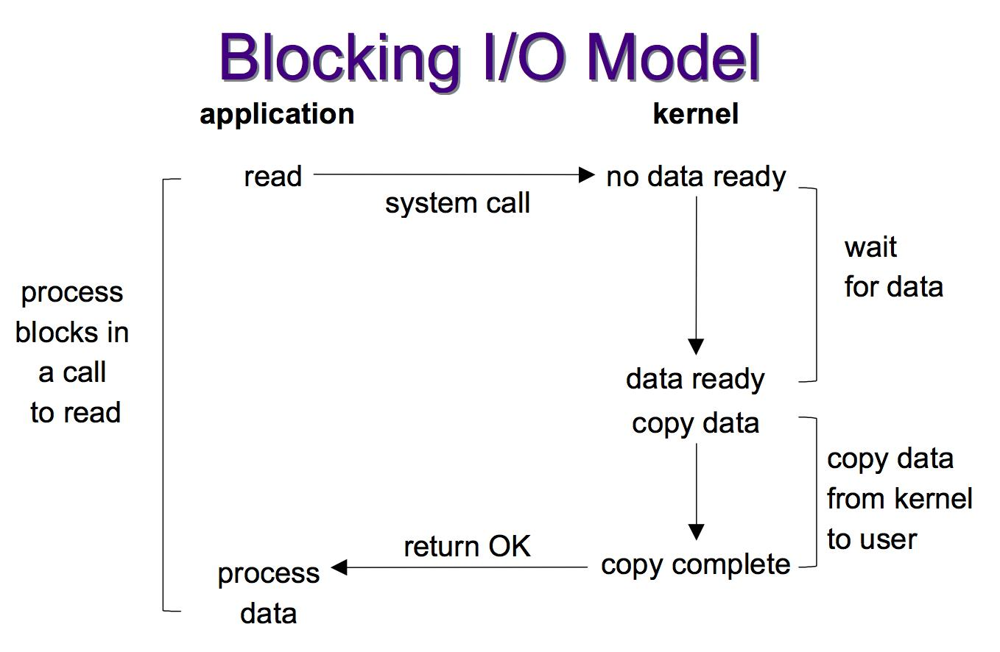
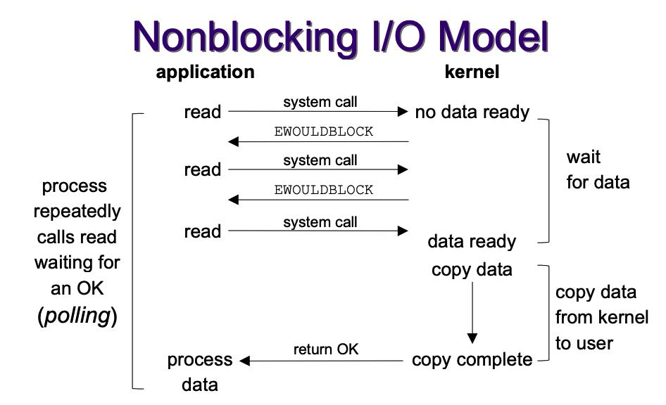
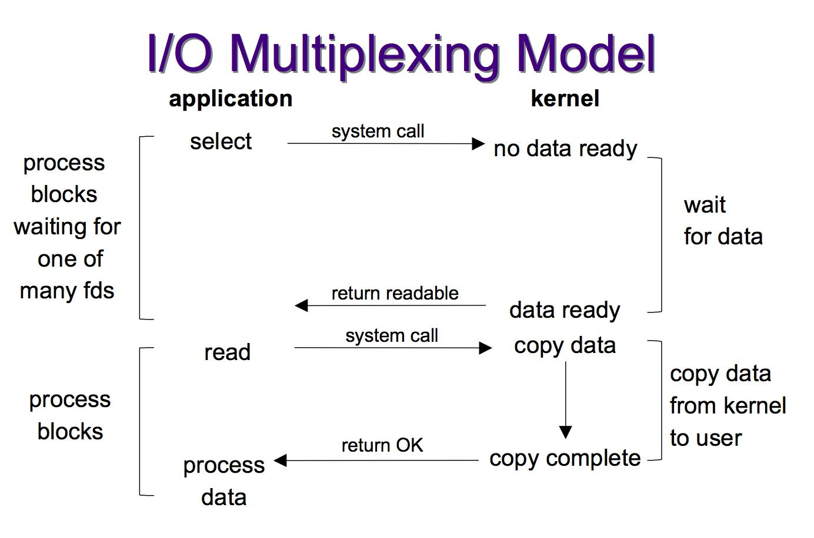
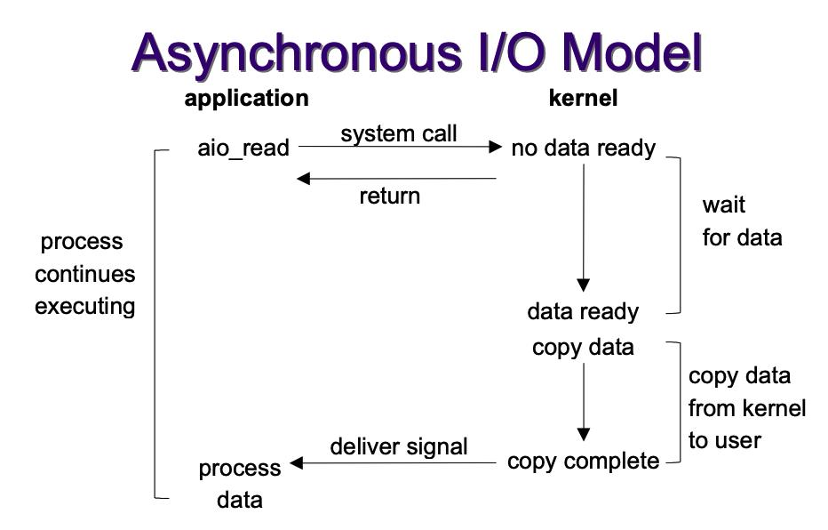
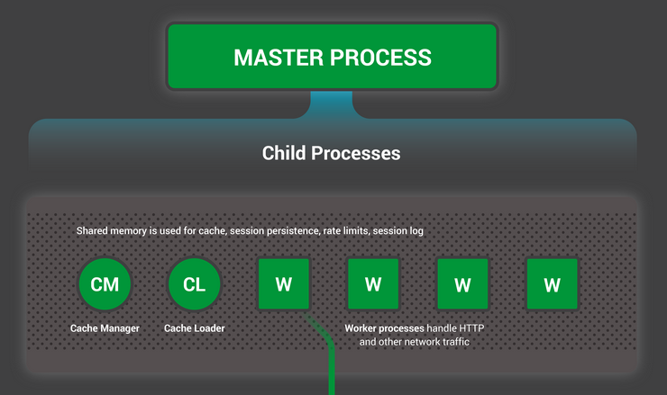
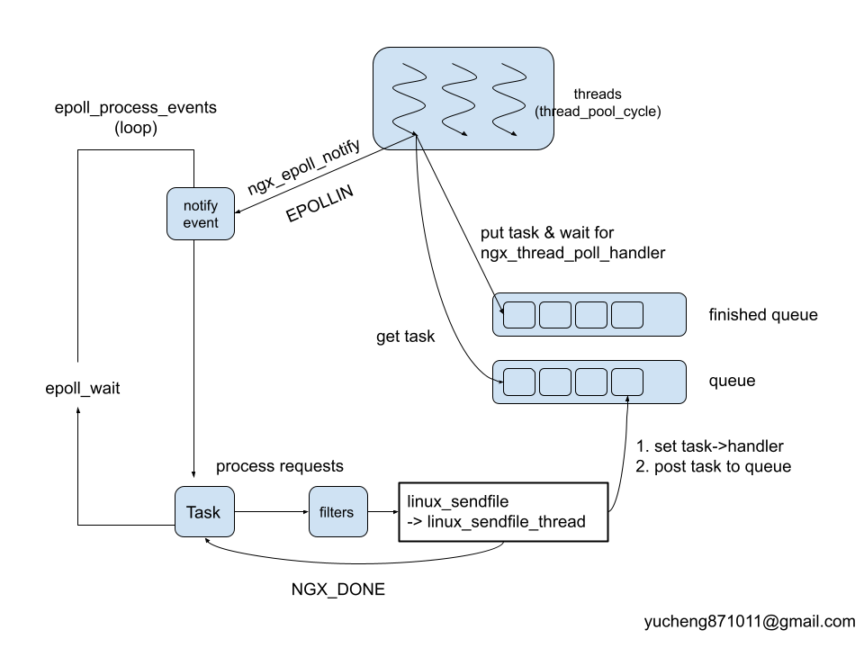

## 事件驅動伺服器：原理和實例


## I/O Model

在討論伺服器前，應先理解 I/O Model，後者不僅會影響著應用程式的行為，更直接影響其 I/O 存取速度。本文介紹常見的 I/O Model，如

- Blocking I/O
- Non blocking I/o
- I/O multiplexing
- Asynchronous I/O

### Blocking I/O



當行程在使用者層級呼叫 `read` 系統呼叫後，經過 mode transition，進入核心等待資料準備，當需要資料還沒抵達緩衝區 (buffer)，行程會持續待在核心空間。從使用者層級的角度來說，就是 blocking 在一個系統呼叫，自然無法繼續執行程式:

```c
read(fd, buf, size);
/* reach here until get "size" bytes data */
do_something();
...
```

由於 blocking (阻塞) 的特性，高效的網頁伺服器實作中，會避免只用此 I/O Model。

### 


當行程呼叫 `read` 後，經過 mode transition，進入核心等待資料準備，若核心的資料尚未準備好，會馬上返回使用者模式的行程，避開阻塞。所以從使用者層級的角度來看，不再因資料尚未準備好，而阻塞於系統呼叫。

可藉由 `fcntl` 系統改變 file descriptor 的屬性 (即 `O_NONBLOCK`)，通知核心 fd 應看作 non-blocking 來處理。

實際案例可見高效伺服器的實作 [lwan]，在 [lwan-readahead.c](https://github.com/lpereira/lwan/blob/f51cd6cc6f929107c283ec3dfda9bab431a14d87/src/lib/lwan-readahead.c#L120) 中前見運用 non-blocking IO 的實例:

```c
while (true) {
    struct lwan_readahead_cmd cmd[16];
    ssize_t n_bytes = read(readahead_pipe_fd[0], cmd, sizeof(cmd));
    ssize_t cmds;

    if (UNLIKELY(n_bytes < 0)) {
        if (errno == EAGAIN || errno == EINTR)
            continue;
        lwan_status_perror("Ignoring error while reading from pipe (%d)",
                           readahead_pipe_fd[0]);
        continue;
#if PIPE_DIRECT_FLAG
    } else if (UNLIKELY(n_bytes % (ssize_t)sizeof(cmd[0]))) {
        lwan_status_warning("Ignoring readahead packet read of %zd bytes",
                            n_bytes);
        continue;
#endif
    }
```

此時的 `read` 已設定為 non-blocking，因此即使資料尚未準備好，都會馬上返回。接著要判斷自核心返回使用者層級的原因，若只是單純資料沒準備好，收到的回傳值就是 `EAGAIN`，剩下的工作就是找機會再次呼叫 `read`。

### I/O multiplexing



簡單來說，I/O multiplexing 就是 [select](https://man7.org/linux/man-pages/man2/select.2.html) / [epoll](https://man7.org/linux/man-pages/man7/epoll.7.html) 的行為，雖說二者仍有差別 (`epoll` 有別於 `select`，沒有監聽數量的限制，且在找尋是透過紅黑樹，找尋的複雜度是 O(logN)O(logN)，而 `select` 是 O(N)O(N) )，但行為可歸納為一類。

以 `epoll` 的例子來說，當行程呼叫 `epoll_wait` 後，經過 mode transition，開始核心監聽 (監聽的時間根據傳入的 `timeout` 決定)，時間到後切回使用者層級，回傳的數值代表剛監聽到的事件數量，根據數量來做對應的處理 (利用 callback)。

epoll 操作的架構很固定，大致如下:

```c
nfds = epoll_wait(epollfd, events, MAX_EVENTS, -1);
...
for (n = 0; n < nfds; ++n) {
   if (events[n].data.fd == listen_sock) {
    /* do connection */
   } else {
    /* do request */
       do_use_fd(events[n].data.fd);
   }
}
```

I/O multiplexing 的好處是，只用單一執行緒即可「同時處理」多個網路連接的 I/O，這裡的「同時處理」是巨觀，而非微觀表現。但只有單一執行緒的話，用 event-driven 來描述較恰當，也就是所謂的事件觸發，當有事件 (無論是 connection, reading requests 或 write requests) 來臨/完成，才做對應的處理，而不是一直卡在那裡等結果，浪費 CPU 資源。

注意: `epoll_wait` 本質上還是 blocking 操作。

### Asynchronous I/O



倘若 I/O multiplexing 已讓人拍案叫絕，Asynchronous I/O 就更玄妙，可想像為 non-blocking I/O 的加強版：呼叫 `read` 後切換至核心空間時，此時**即使資料已就緒**，仍會馬上返回使用者層級，讓原本的程式碼得以繼續執行，而方才的工作留在核心，轉交其他核心執行緒 (kernel thread) 來完成。當完成後，核心會藉由 signal 等方式通知使用者模式的行程。

```c
aio_read(fd, buf, size);  -----   // do read in background (kernel)
/* return immediately */      |
do_something_else();          |  
                              |
wait_complete();         <-----     
```

這種模式乍聽之下的確無懈可擊，[POSIX asynchronous I/O (AIO)](https://man7.org/linux/man-pages/man7/aio.7.html) 也很早就納入 `POSIX.1` 規範，但 AIO 實作和應用上卻都有很大的挑戰，不論是 glibc POSIX AIO 甚至是 Linux native AIO。所以目前主流的高效伺服器通常都以 I/O multiplexing 為主。

> [非同步 I/O – POSIX AIO 從入門到放棄](http://blog.litexavier.me/aio/posix_aio/2020/03/09/aio-01.html)

## Event-driven Server

Event-driven 是種概念，沒有明確的科學定義，但要了解 event-driven 的行為不難，參考〈[如何向你阿嬤解釋 “Event-Driven” Web Servers](https://daverecycles.tumblr.com/post/3104767110/explain-event-driven-web-servers-to-your-grandma)〉:

### 傳統網頁伺服器

想像有個 pizza 店，只雇用一個店員，當有客戶打電話進來訂餐時，店員收到訂單後不會掛斷電話，直到 pizza 做好後，店員通知客戶可以來拿後，再掛斷電話。

這種模式很明顯的缺點是，在服務某客戶期間，無法接洽其他客戶，直接影響著用戶體驗 (latency) 與單位時間的服務量 (throughput)。

### 事件驅動的網頁伺服器

這個 pizza 店同樣只雇用一個店員，當有客戶打電話進來訂餐時，店員收到訂單後會馬上掛斷電話，然後等到 pizza 製作完畢，再打電話通知客戶可以來拿取。期間因為電話已掛斷，所以仍可持續收到更多的訂單。當然可請更多員工 (worker thread in thread pool) 在廚房烤 pizza 來增加單位時間的服務量 (throughput)。不過一旦員工數量持續增長，pizza 店的容量反而是限制 (capacity)。

## 案例探討: [NGINX](https://nginx.org/)

### Design



NGINX 的組成為一個 Master 行程，負責做初始化相關的工作，例如組態設定, 建立 worker, 管理 worker (接收來自外界的 signal，向各 worker 發送 signal，監控 worker 的運行狀態)。至於 Worker 就是專門來處理客戶端的請求 (一般是網頁瀏覽器)，NGINX 的 worker 會對 CPU 設定 [affinity](https://linux.die.net/man/2/sched_getaffinity)，因此可降低 thread (worker) 間的 context switch 數量，抑制其引起效能低落的可能性。

為了確保 worker 各自處理獨立的連線，worker 間會嘗試獲取 accept lock 來決定連線。每個 worker 使用 asynchronous & non-blocking 的方式，達到高並行程度的監聽事件(非處理事件，因為一個 worker 在一個時間最多只能處理一個事件)。

### Event loop

每個採用事件驅動模型開發的網頁伺服器，大多會有一個主要的迴圈 (main loop，若有多個 worker 則有多個迴圈)，後者負責的工作，以核心空間 (涉及系統呼叫的內部行為) 來說，包含接收新的連線、接收請求、回應請求等等。以使用者層級來說，則包含封包過濾、內容壓縮等操作。

NGINX 針對 Linux 的實作中，worker 的 main loop 可參考 [ngx_epoll_module.c](https://github.com/nginx/nginx/blob/a64190933e06758d50eea926e6a55974645096fd/src/event/modules/ngx_epoll_module.c) 中的 `ngx_epoll_process_events`:

```c
static ngx_int_t
ngx_epoll_process_events(ngx_cycle_t *cycle, ngx_msec_t timer, ngx_uint_t flags)
{
    ...
    events = epoll_wait(ep, event_list, (int) nevents, timer);
    ...
    for (i = 0; i < events; i++) {
        c = event_list[i].data.ptr;
        ...
        revents = event_list[i].events;
        ...
        if ((revents & EPOLLIN) && rev->active) {
        ...
        }

        wev = c->write;

        if ((revents & EPOLLOUT) && wev->active) {
            ...
        }
    }

    return NGX_OK;
}
```

可見到，雖然 NGINX 的 main loop 超過 200 行，但其骨架還是照著 `epoll` 常見的應用案例。先用 `epoll_wait` 監聽準備好的 events，再逐一處理。

### 單一連線請求的流程

NGINX 完成一次連線請求的流程非常複雜，包含大量的使用者層級封包處理邏輯，本文不會細究。以下提供上至 main loop 內呼叫 `rev->handler` (連線請求)，下至底層系統呼叫 `sendfile` 的流程:

- `ngx_http_wait_request_handler` →→ `ngx_http_process_request_line`
- `ngx_http_process_request_line` →→ `ngx_http_process_request_headers`

…

- `ngx_http_write_filter` →→ `c->send_chain`
- `c->send_chain` === `ngx_send_chain`
- `ngx_send_chain` === `ngx_io.send_chain` (`event/ngx_event.h`)
- `ngx_io` === `ngx_os_io` (`event/modules/ngx_epoll_module.c`)
- `ngx_os_io` === `ngx_linux_io` (`os/unix/ngx_linux_init.c`)
- `static ngx_os_io_t ngx_linux_io = {..ngx_linux_sendfile_chain}` (`os/unix/ngx_linux_init.c`)
- `sendfile64`

[註1] filter module 由眾多 filters 組成，主要是負責對輸出的內容進行處理，可對輸出進行修改。所有的 filter 模組都被組織成一條 list，輸出會依次穿越所有的 filter。`ngx_http_write_filter` 為最後一個 filter，將最後過濾好的資訊傳送出去。

[註2] filter 的順序很重要，在編譯的時候就決定好，可見 [auto/modules](https://github.com/nginx/nginx/blob/a64190933e06758d50eea926e6a55974645096fd/auto/modules)。

[註3] 可透過 GDB 的命令 `catch syscall SYSCALL_NUMBER`, `set follow-fork-mode child`, `r`, 再 `where`，用以觀察 NGINX 處理請求的流程。

### Thread pool

#### 為何要有 thread pool?

依據《[NGINX Development guide](http://nginx.org/en/docs/dev/development_guide.html#threads)》

> Keep in mind that the threads interface is a helper for the existing asynchronous approach to processing client connections, and by no means intended as a replacement.

因為 Linux 本身沒有提供完整 AIO 介面 (但 FreeBSD 有)，因此沒辦法完整的使用 NGINX 的高度並行設計 (thread pool 支援)。

但在 Linux 上的某些特殊情境仍有使用 thread pool 的好處，可參考 [Thread Pools in NGINX Boost Performance 9x!](https://www.nginx.com/blog/thread-pools-boost-performance-9x/)。說明在傳輸極大檔案時，可藉由透過 thread pool 來增加 throughput。

#### 機制

NGINX 實作 thread pool 的原理/流程: worker process 拿到任務後會把 task 丟到 thread pool，然後 worker process **就假設成功，接續處理下一個 task**。

#### 程式碼

以下追蹤程式碼，應證上述總結:

```c
ngx_linux_sendfile(ngx_connection_t *c, ngx_buf_t *file, size_t size)
{
...
#if (NGX_THREADS)

    if (file->file->thread_handler) {
        return ngx_linux_sendfile_thread(c, file, size);
    }

#endif
```

回到無 thread pool 的 NGINX 處理連線請求時，`sendfile` 的所在處 `ngx_linux_sendfile`，當設定 thread 版本 (by `--with-thread`) 即啟用 `NGX_THREADS`，所以真正負責任務的函式為 `ngx_linux_sendfile_thread`。

```c
static ssize_t
ngx_linux_sendfile_thread(ngx_connection_t *c, ngx_buf_t *file, size_t size)
{
    ...
    task = c->sendfile_task;

    if (task == NULL) {
        task = ngx_thread_task_alloc(c->pool, sizeof(ngx_linux_sendfile_ctx_t));
        if (task == NULL) {
            return NGX_ERROR;
        }

        task->handler = ngx_linux_sendfile_thread_handler;

        c->sendfile_task = task;
    }
    ...

    if (file->file->thread_handler(task, file->file) != NGX_OK) {
        return NGX_ERROR;
    }

    return NGX_DONE;
}
```

這裡有三件事需要注意:

1. `task->handler` 是用來記錄稍後 thread 需要做的工作內容，因此這裡很明顯，給 thread 做的事為 `ngx_linux_sendfile_thread_handler`
2. `file->thread_handler` 負責把至此設定好的 task meta data (如 handler 等…) 置入 thread pool (藉由 `ngx_thread_task_post`)
3. 最後直接回傳 `NGX_DONE`，事實上任務可能尚未執行完畢。

延續 (1):

```c
static void
ngx_linux_sendfile_thread_handler(void *data, ngx_log_t *log)
{
    ...
    file = ctx->file;
    offset = file->file_pos;
again:
    n = sendfile(ctx->socket, file->file->fd, &offset, ctx->size);
    if (n == -1) {
        ctx->err = ngx_errno;
    } else {
        ctx->sent = n;
        ctx->err = 0;
    }
    ...

    if (ctx->err == NGX_EINTR) {
        goto again;
    }
}
```

thread 真正做的任務為 `ngx_linux_sendfile_thread_handler`，此 handler 就是負責 `sendfile` 並試到其成功為止。

而此 handler 真正被呼叫的地方在 thread 的 loop 中:

```c
static void *
ngx_thread_pool_cycle(void *data)
{
    ...
    for ( ;; ) {
        ...
        task->handler(task->ctx, tp->log);
        ...
}
```

`ngx_thread_pool_cycle` 基本上就是 consumer，負責:

1. 上鎖後搶任務
2. 執行任務
3. 把任務置入 finish list
4. notify。

舉 `epoll` 系列來說，notify 的實作存於 `ngx_epoll_module_ctx` 中的成員 `ngx_epoll_notify`。

```c
static void
ngx_epoll_notify_handler(ngx_event_t *ev)
{
    ...
    n = read(notify_fd, &count, sizeof(uint64_t));
```

notify_handler 的 `read` 會觸發 `EPOLLIN` 信號。因為已將 `notify_fd` 透過 `epoll_ctl` (於 `ngx_epoll_notify_init`) 加入 `ep` 作為感興趣的執行案例 (instance)， 所以可由 `ep` (`epoll` file descriptor) 感知 (透過 `ngx_epoll_process_events` 中的 `epoll_wait`)。

延續 (2):

`thread_handler` 可能指向 `ngx_http_cache_thread_handler`, `ngx_http_upstream_thread_handler` 等等，但函式內都含 `ngx_thread_task_post`，負責把任務移到丟到 queue 上。

#### Thread pool 與 epoll loop 的關係

統整上述討論和程式碼行為，展示如下圖:



補充一些細節:

1. 在 epoll_module 內會初始化與 notify 的資料，包含:

    - 建立 `notify_fd` 供 epoll loop 與 thread 間溝通
    - 設定 `notify_event` 並加入 `epoll` interested list (藉由 `epoll_ctl`)

2. 當有 notify 事件產生 (`ngx_epoll_notify` 產生的 `EPOLLIN` 訊號)，`epoll_wait` 收到後，擷取 event 內的處理函式 (`rev->handler`)。此 handler 即 `ngx_epoll_notify_handler`，於 `epoll_notify_init` 內設定的。

3. ```
    ngx_epoll_notify_handler
    ```

     

    是會在 epoll main loop 中呼叫，其內容包含:

    - `read`: 銜接 thread 中 `ngx_notify` 產生的 `write`
    - 呼叫 handler，此 handler 為呼叫 `ngx_notify` 的參數，舉例來說: `ngx_thread_poll_handler`