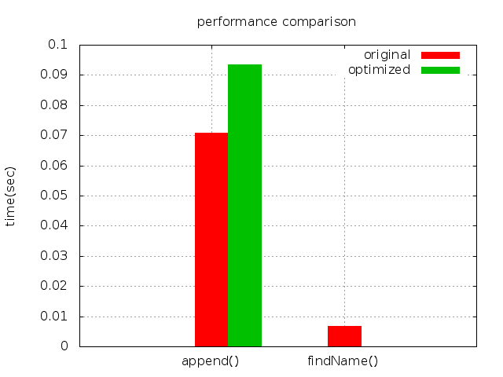
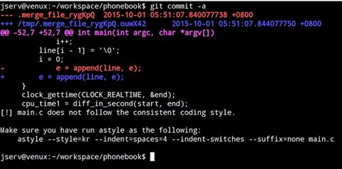

# Linux 效能分析工具: Perf - NCKU 2016


- 準備 GNU/Linux 開發工具
- 學習使用 Git 與 GitHub
- 學習效能分析工具
- 研究軟體最佳化

標注須知

下方只要是 $ 開頭，就表示在 GNU/Linux 的終端機裡面輸入的指令，比方說 $ 

`sudo apt-get update`，就表示要輸入 sudo apt-get update。

預先準備動作

安裝 GNU/Linux，建議安裝 Lubuntu 15.10 (64-bit)
注意: 不要透過虛擬機器，而是用多重開機直接裝在實體機器的硬碟中，記得先切割好硬碟
安裝相關開發工具

```sh
$ sudo apt-get update
$ sudo apt-get install build-essential
$ sudo apt-get install linux-tools-common linux-tools-generic
$ sudo apt-get install astyle colordiff gnuplot
```

關於 GNU/Linux 指令，請參閱 鳥哥的 Linux 私房菜
本系列課程全程使用 GNU/Linux，全世界有十幾億台裝置內建 Linux 系統，學習 Linux 是相當划算的投資！
- [熟悉 Git 和 GitHub 操作](http://wiki.csie.ncku.edu.tw/github)
    - 30 天精通 Git 版本控管


##Linux 效能分析工具: Perf

Perf 全名是 Performance Event，是在 Linux 2.6.31 以後內建的系統效能分析工具，它隨著核心一併釋出。藉由 perf，應用程式可以利用 PMU (Performance Monitoring Unit), tracepoint 和核心內部的特殊計數器 (counter) 來進行統計，另外還能同時分析運行中的核心程式碼，從而更全面了解應用程式中的效能瓶頸
詳細閱讀 [Linux 效能分析工具](http://wiki.csie.ncku.edu.tw/embedded/perf-tutorial): Perf 並在自己的 Linux 開發環境實驗


## 案例探討：電話簿搜尋

- 詳細閱讀 案例分析: [Phone Book](https://embedded2016.hackpad.com/ep/pad/static/1vvUk25C0fI)，研究降低 cache miss 的方法
- 雖然這是探討 cache miss 和效能議題，其實是帶著同學重新複習 C 語言和資料結構。以前大家只是「背誦心法」，從來就不會去理解個別資料結構對整體的衝擊。
- 抓取和測試程式
    - 自 GitHub 取得作業程式碼 (基礎)
    ```sh
    $ git clone https://github.com/embedded2016/phonebook
    $ cd phonebook
    ```
    - 編譯
    ```sh
    make
    ```
    - 測試。當看到 [sudo] password for 字樣時，輸入自己的 Linux 使用帳號密碼
    ```sh
    $ make run
    ```
    - 參考輸出： (按下 Ctrl-C 可以離開畫面)
    ```sh
    size of entry : 136 bytes
    execution time of append() : 0.043859 sec
    execution time of findName() : 0.004776 sec
    ```
- 透過 gnuplot 建立執行時間的圖表 (保持耐心等待，中間過程不要切換視窗)
```sh
$ make plot
```
    - 正確執行後，目錄裡頭會有個名為 runtime.png，可用 eog runtime.png 命令來觀看
    
## 善用 gnuplot 來製圖

- 從今天起忘記 Microsoft Excel，因為 gnuplot 可以給你更專業的圖表，而且能夠批次產生
- 先啟動 gnuplot:

```sh
$ gnuplot
```

- gnuplot 啟動後，需要做一些必要設定，例如設定圖片名稱，XY軸的資訊等等:

```sh
> set title 'my plot'           ＠設定圖片名稱
> set xlabel 'x axis'           ＠設定XY軸座標名稱
> set ylabel 'y axis'
> set terminal png              ＠設定輸出格式為 .png
> set output 'output_plot.png'  ＠設定輸出檔名
> plot [1:10][0:1] sin(x)       ＠畫出 sin(x) 函式，x軸座標範圍1 ~ 10, y軸座標範圍0 ~ 1
```

- 可以將這些設定另外存成一個檔案，作為 gnuplot 的腳本。假設上述指令存在一個名為 plot 的檔案裡面，以後只要輸入 `gnuplot plot` 即可畫出我們想要的圖表。




## 使用 astyle + Git 實做自動程式碼排版檢查
- 使用一致的 coding style 很重要，我們可透過 astyle 這個工具來協助。調整作業程式要求的風格為以下:
```sh
$ astyle --style=kr --indent=spaces=4 --indent-switches --suffix=none *.[ch]
```
    - 你可以想像 Apple 和 Google 的工程師隨便安置程式碼，然後不用管合作的議題嗎？
    - 即便一個人寫作業，其實是三人的參與：過去的你、現在的你，以及未來的你
- 安裝 Git pre-commit hook 可在每次 git commit 時，檢查 C/C++ 原始程式碼的風格是否一致:
```sh
$ ln -sf ../../scripts/pre-commit.hook .git/hooks/pre-commit
```
    - 我們介紹 Git hooks 是為了日後銜接 Continuous integration (CI)，專業程式設計必備的準備工作
    - 任何人都可以寫出機器看得懂的程式碼 (在檔案總管裡面對 EXE 檔複製貼上即可)，但我們之所以到資訊工程系接受訓練，為了寫出人看得懂、可持續維護和改進的程式

- 下圖展示 Git pre-commit hook 偵測到開發者的修改並未遵守一致的 coding style，主動回報並提醒開發者: 




##作業要求

- 在 GitHub 上 fork phonebook，然後適度修改 phonebook_opt.c 和 phonebook_opt.h 兩個檔案，使得這兩者執行時期的 cache miss 降低。請用 perf 驗證，而且改進的過程中，不能有功能方面的減損。
    - phonebook_orig.[ch] 不需要修改，我們關注的是 phonebook_opt.[ch]，當然要修改 main.c 也是允許的
    - findName() 的時間必須原本的時間更短
    - append() 的時間可以比原始版本稍久，但不應該增加太多
    - main.c 應該只有一份，不要建立新的 main()，善用 Makefile 定義對應的 CFLAGS
    - 在執行程式(phonebook_orig 和 phonebook_opt) 前，先清空 cache:
    ```sh
    $ echo 1 | sudo tee /proc/sys/vm/drop_caches
    ```

- 除了修改程式，也要編輯 Hackpad 下方「作業區」，增添開發紀錄和 GitHub 連結
    - 至少要列出效能分析，以及充份說明你如何改善效能

- 更新 Hackpad 後，還要寄信通知授課教師和助教
    - 寄件到 embedded.master2015@gmail.com
    - 標題: “[NCKU/embedded]” 開頭，後面加學號與姓名 ([NCKU/embedded], 學號, - 姓名之間要有空白)
    - 內容：(回答以下問題)
        - GitHub 帳號, wiki 帳號 (註冊本站)
        - 關於 fork 出來的 repository 修改描述
        - 附上一份自我介紹和對課程的期許
- 務必使用 astyle 來對程式碼進行排版，詳細使用方式見 README.md
- 可能的效能改進方向：
    - 改寫 struct __PHONE_BOOK_ENTRY 的成員，搬動到新的結構中
    - 使用 hash function 來加速查詢
    - 既然 first name, last name, address 都是合法的英文 (可假設成立)，使用字串壓縮的演算法，降低資料表示的成本
    - 使用 binary search tree 改寫演算法
- 截止日期：
    - Mar 6, 2016 (含) 之前
    - 越早在 GitHub 上有動態、越早接受 code review，評分越高

##挑戰題

- 除了降低 findName() 的 cache miss 與執行成本，append() 也該想辦法縮減時間
    - 建立 phone book 時，既然 lastName 是索引值，可以優先建立搜尋表格，其他資料可稍後再補上
    - 用 PThread 建立 manager/worker thread model
- 支援 fuzzy search，允許搜尋 lastName 時，不用精準打出正確的寫法
    - 比方說電話簿有一筆資料是 McDonald，但若使用者輸入 MacDonald 或 McDonalds，也一併檢索出來
    - 延伸閱讀: Levenshtein Distance (編輯距離)
- 改善電話簿的效能分析，透過大量的重複執行，找出 95% - 信賴區間，而且允許動態新增資料 (較符合現實) 和查詢
以 gnuplot 繪製效能分析圖表

##參考資料

[Makefile 語法簡介](http://tetralet.luna.com.tw/?op=ViewArticle&articleId=185)<br>
[Gnuplot 純畫圖](http://user.frdm.info/ckhung/b/ma/gnuplot.php)
