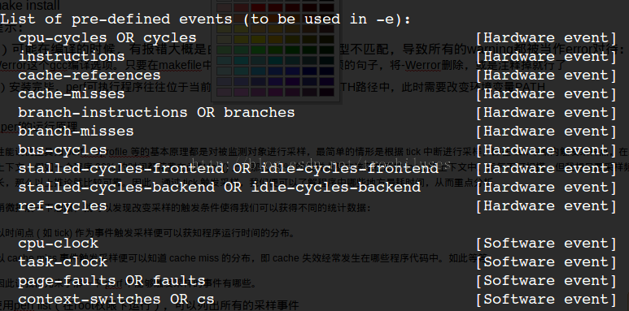

# linux下的内核测试工具——perf使用简介


Perf是Linux kernel自带的系统性能优化工具。Perf的优势在于与Linux Kernel的紧密结合，它可以最先应用到加入Kernel的new feature。pef可以用于查看热点函数，查看cashe miss的比率，从而帮助开发者来优化程序性能。

## 1.perf的安装

由于我们经常是在自己编译的内核上进行开发工作，这里需要有包含调式信息的内核启动镜像文件vmlinux，在自定义内核的基础之上，进入linux内核源码，linux/tools/perf

```sh
make
make install
```


提示：

1）可能在编译的时候，有报错大概是由于平台问题，数据类型不匹配，导致所有的warning都被当作error对待：出现这问题的原因是-Werror这个gcc编译选项。只要在makefile中找到包含这个-Werror选项的句子，将-Werror删除，或是注释掉就行了

2）安装完毕，perf可执行程序往往位于当前目录，可能不在系统的PATH路径中，此时需要改变环境变量PATH

## 2.perf的运行原理

性能调优工具如 perf，Oprofile 等的基本原理都是对被监测对象进行采样，最简单的情形是根据 tick 中断进行采样，即在 tick 中断内触发采样点，在采样点里判断程序当时的上下文。假如一个程序 90% 的时间都花费在函数 foo() 上，那么 90% 的采样点都应该落在函数 foo() 的上下文中。运气不可捉摸，但我想只要采样频率足够高，采样时间足够长，那么以上推论就比较可靠。因此，通过 tick 触发采样，我们便可以了解程序中哪些地方最耗时间，从而重点分析。 


稍微扩展一下思路，就可以发现改变采样的触发条件使得我们可以获得不同的统计数据：
以时间点 ( 如 tick) 作为事件触发采样便可以获知程序运行时间的分布。
以 cache miss 事件触发采样便可以知道 cache miss 的分布，即 cache 失效经常发生在哪些程序代码中。如此等等。
因此让我们先来了解一下 perf 中能够触发采样的事件有哪些。
使用`perf list`（在root权限下运行），可以列出所有的采样事件





