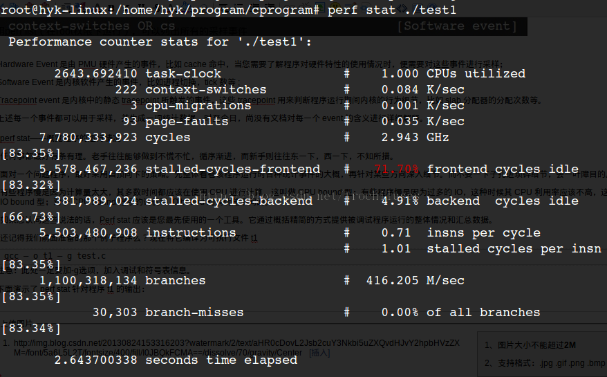
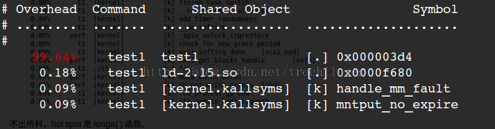
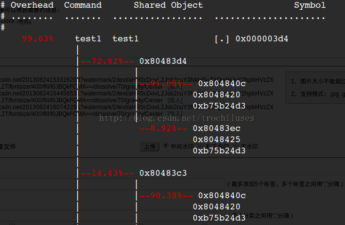

# linux下的內核測試工具——perf使用簡介


Perf是Linux kernel自帶的系統性能優化工具。Perf的優勢在於與Linux Kernel的緊密結合，它可以最先應用到加入Kernel的new feature。pef可以用於查看熱點函數，查看cashe miss的比率，從而幫助開發者來優化程序性能。

## 1.perf的安裝

由於我們經常是在自己編譯的內核上進行開發工作，這裡需要有包含調式信息的內核啟動鏡像文件vmlinux，在自定義內核的基礎之上，進入linux內核源碼，linux/tools/perf

```sh
make
make install
```


提示：

1）可能在編譯的時候，有報錯大概是由於平臺問題，數據類型不匹配，導致所有的warning都被當作error對待：出現這問題的原因是-Werror這個gcc編譯選項。只要在makefile中找到包含這個-Werror選項的句子，將-Werror刪除，或是註釋掉就行了

2）安裝完畢，perf可執行程序往往位於當前目錄，可能不在系統的PATH路徑中，此時需要改變環境變量PATH

## 2.perf的運行原理

性能調優工具如 perf，Oprofile 等的基本原理都是對被監測對象進行採樣，最簡單的情形是根據 tick 中斷進行採樣，即在 tick 中斷內觸發採樣點，在採樣點裡判斷程序當時的上下文。假如一個程序 90% 的時間都花費在函數 foo() 上，那麼 90% 的採樣點都應該落在函數 foo() 的上下文中。運氣不可捉摸，但我想只要採樣頻率足夠高，採樣時間足夠長，那麼以上推論就比較可靠。因此，通過 tick 觸發採樣，我們便可以瞭解程序中哪些地方最耗時間，從而重點分析。 


稍微擴展一下思路，就可以發現改變採樣的觸發條件使得我們可以獲得不同的統計數據：
以時間點 ( 如 tick) 作為事件觸發採樣便可以獲知程序運行時間的分佈。
以 cache miss 事件觸發採樣便可以知道 cache miss 的分佈，即 cache 失效經常發生在哪些程序代碼中。如此等等。
因此讓我們先來了解一下 perf 中能夠觸發採樣的事件有哪些。
使用`perf list`（在root權限下運行），可以列出所有的採樣事件


事件分為以下三種：

```sh
1）Hardware Event 是由 PMU 硬件產生的事件，比如 cache 命中，當您需要了解程序對硬件特性的使用情況時，便需要對這些事件進行採樣；
2）Software Event 是內核軟件產生的事件，比如進程切換，tick 數等 ;
3）Tracepoint event 是內核中的靜態 tracepoint 所觸發的事件，這些 tracepoint 用來判斷程序運行期間內核的行為細節，比如 slab 分配器的分配次數等。
```

上述每一個事件都可以用於採樣，並生成一項統計數據，時至今日，尚沒有文檔對每一個 event 的含義進行詳細解釋。


## 3. perf stat——概覽程序的運行情況


面對一個問題程序，最好採用自頂向下的策略。先整體看看該程序運行時各種統計事件的大概，再針對某些方向深入細節。而不要一下子扎進瑣碎細節，會一葉障目的。


有些程序慢是因為計算量太大，其多數時間都應該在使用 CPU 進行計算，這叫做 CPU bound 型；有些程序慢是因為過多的 IO，這種時候其 CPU 利用率應該不高，這叫做 IO bound 型；對於 CPU bound 程序的調優和 IO bound 的調優是不同的。

如果您認同這些說法的話，Perf stat 應該是您最先使用的一個工具。它通過概括精簡的方式提供被調試程序運行的整體情況和彙總數據。   

本篇中，我們將在以後使用這個例子test1.c：
測試用例：test1

```c
//test.c
void longa()
{
    int i, j;

    for (i = 0; i < 1000000; i++) {
        j = i;    //am I silly or crazy? I feel boring and desperate.
    }
}

void foo2()
{
    int i;

    for (i = 0 ; i < 10; i++) {
        longa();
    }
}

void foo1()
{
    int i;

    for (i = 0; i < 100; i++) {
        longa();
    }
}

int main(void)
{
    foo1();
    foo2();
}
```

將它編譯為可執行文件 test1
```sh
gcc – o test1 – g test.c 
```

注意：此處一定要加-g選項，加入調試和符號表信息。
下面演示了 perf stat 針對程序 test1 的輸出：



##結果分析：
對 test1進行調優應該要找到熱點 ( 即最耗時的代碼片段 )，再看看是否能夠提高熱點代碼的效率。

缺省情況下，除了 task-clock-msecs 之外，perf stat 還給出了其他幾個最常用的統計信息：

- Task-clock-msecs：CPU 利用率，該值高，說明程序的多數時間花費在 CPU 計算上而非 IO。
- Context-switches：進程切換次數，記錄了程序運行過程中發生了多少次進程切換，頻繁的進程切換是應該避免的。
- Cache-misses：程序運行過程中總體的 cache 利用情況，如果該值過高，說明程序的 cache 利用不好
- CPU-migrations：表示進程 t1 運行過程中發生了多少次 CPU 遷移，即被調度器從一個 CPU 轉移到另外一個 CPU 上運行。
- Cycles：處理器時鐘，一條機器指令可能需要多個 cycles，
Instructions: 機器指令數目。
- IPC：是 Instructions/Cycles 的比值，該值越大越好，說明程序充分利用了處理器的特性。
- Cache-references: cache 命中的次數
- Cache-misses: cache 失效的次數。


##4.精確制導——定位程序瓶頸perf record && perf report

###4.1查找時間上的熱點函數
```sh
perf record – e cpu-clock ./test1 
perf report 
```



3個問題：

- 1）perf未能定位本地符號表對應的symbol和地址的對應關係：0x000003d4對應的什麼函數？
- 2）採樣頻率不夠高，失去了一些函數的信息：顯然一些內核函數沒有顯示在上面的結果中，因為採樣頻率如果不夠高，那麼勢必會有一些函數中的採樣點沒有/
- 3）如何克服採樣的隨機性帶來的問題：為了在測量更加逼近正確值，我們採用多次重複取平均值的方法來逼近真實值。（這裡可以用-r來指定重複次數）

對於問題2），我們可以用perf record -F count 來指定採樣頻率加以解決：

```sh
root@hyk-linux:/home/hyk/program/cprogram# perf record -F 50000 -e cpu-clock ./test1
```

```sh
[ perf record: Woken up 3 times to write data ]  
[ perf record: Captured and wrote 0.532 MB perf.data (~23245 samples) ]  
```

```sh
root@hyk-linux:/home/hyk/program/cprogram# perf report  
```
```sh
# ========  
# captured on: Mon Aug 26 09:54:45 2013  
# hostname : hyk-linux  
# os release : 3.10.9  
# perf version : 3.10.9  
# arch : i686  
# nrcpus online : 4  
# nrcpus avail : 4  
# cpudesc : Intel(R) Core(TM) i5-2430M CPU @ 2.40GHz  
# cpuid : GenuineIntel,6,42,7  
# total memory : 4084184 kB  
# cmdline : /media/usr/src/linux-3.10.9/tools/perf/perf record -F 50000 -e cpu-c  
# event : name = cpu-clock, type = 1, config = 0x0, config1 = 0x0, config2 = 0x0  
# HEADER_CPU_TOPOLOGY info available, use -I to display  
# pmu mappings: cpu = 4, software = 1, tracepoint = 2, uncore_cbox_0 = 6, uncore  
# ========  
#  
# Samples: 13K of event 'cpu-clock'  
# Event count (approx.): 273580000  
#  
# Overhead  Command      Shared Object                           Symbol  
# ........  .......  .................  ...............................  
#  
    99.77%    test1  test1              [.] 0x000003c3                   
     0.07%    test1  ld-2.15.so         [.] 0x00004c99                   
     0.02%    test1  [kernel.kallsyms]  [k] __wake_up_bit                
     0.01%    test1  [kernel.kallsyms]  [k] __kunmap_atomic              
     0.01%    test1  [kernel.kallsyms]  [k] load_elf_binary              
     0.01%    test1  [kernel.kallsyms]  [k] _raw_spin_unlock_irqrestore  
     0.01%    test1  libc-2.15.so       [.] 0x00097d8e                   
     0.01%    test1  [kernel.kallsyms]  [k] exit_itimers                 
     0.01%    test1  [kernel.kallsyms]  [k] profile_munmap               
     0.01%    test1  [kernel.kallsyms]  [k] get_page_from_freelist       
     0.01%    test1  [kernel.kallsyms]  [k] vma_interval_tree_remove     
     0.01%    test1  [kernel.kallsyms]  [k] change_protection            
     0.01%    test1  [kernel.kallsyms]  [k] link_path_walk               
     0.01%    test1  [kernel.kallsyms]  [k] prepend_path                 
     0.01%    test1  [kernel.kallsyms]  [k] __inode_wait_for_writeback   
     0.01%    test1  [kernel.kallsyms]  [k] aa_free_task_context         
     0.01%    test1  [kernel.kallsyms]  [k] radix_tree_lookup_element    
     0.01%    test1  [kernel.kallsyms]  [k] _raw_spin_lock
```

結果解釋：


The column 'Overhead' indicates the percentage of the overall samples collected in the corresponding function. The second column reports the process from which the samples were collected. In per-thread/per-process mode, this is always the name of the monitored command. But in cpu-wide mode, the command can vary. The third column shows the name of the ELF image where the samples came from. If a program is dynamically linked, then this may show the name of a shared library. When the samples come from the kernel, then the pseudo ELF image name [kernel.kallsyms] is used. The fourth column indicates the privilege level at which the sample was taken, i.e. when the program was running when it was interrupted:

```sh
[.] : user level
[k]: kernel level
[g]: guest kernel level (virtualization)
[u]: guest os user space
[H]: hypervisor
```

The final column shows the symbol name.

代碼是非常複雜難說的，t1 程序中的 foo1() 也是一個潛在的調優對象，為什麼要調用 100 次那個無聊的 longa() 函數呢？但我們在上圖中無法發現 foo1 和 foo2，更無法瞭解他們的區別了。
我曾發現自己寫的一個程序居然有近一半的時間花費在 string 類的幾個方法上，string 是 C++ 標準，我絕不可能寫出比 STL 更好的代碼了。因此我只有找到自己程序中過多使用 string 的地方。因此我很需要按照調用關係進行顯示的統計信息。
使用 perf 的 -g 選項便可以得到需要的信息：

```sh
perf record -g -e cpu-clock ./test1
perf report
```




當然，這裡符號表沒有定位的問題有依然沒有解決！

perf record的其他參數：
```sh
-f：強制覆蓋產生的.data數據
-c：事件每發生count次採樣一次
-p：指定進程
-t：指定線程
```

###4.2 perf report的相關參數：

```sh
-k：指定未經壓縮的內核鏡像文件，從而獲得內核相關信息
--report：cpu按照cpu列出負載
```

## 5.使用tracepoint

當perf 根據 tick 時間點進行採樣後，人們便能夠得到內核代碼中的hotspot。那什麼時候需要使用 tracepoint 來採樣呢？


我想人們使用 tracepoint的基本需求是對內核的運行時行為的關心，如前所述，有些內核開發人員需要專注於特定的子系統，比如內存管理模塊。這便需要統計相關內核函數的運行情況。另外，內核行為對應用程序性能的影響也是不容忽視的：

以之前的遺憾為例，假如時光倒流，我想我要做的是統計該應用程序運行期間究竟發生了多少次系統調用。在哪裡發生的？

下面我用 ls 命令來演示 sys_enter 這個 tracepoint 的使用：

```sh
[root@ovispoly /]# perf stat -e raw_syscalls:sys_enter ls 
 bin dbg etc  lib  media opt root 
				 selinux sys usr 
 boot dev home lost+found mnt proc sbin srv 
				 tmp var 

  Performance counter stats for 'ls': 

 101 raw_syscalls:sys_enter 

  0.003434730 seconds time elapsed 


 [root@ovispoly /]# perf record -e raw_syscalls:sys_enter ls 

 [root@ovispoly /]# perf report 
 Failed to open .lib/ld-2.12.so, continuing without symbols 
 # Samples: 70 
 # 
 # Overhead Command Shared Object Symbol 
 # ........ ............... ............... ...... 
 # 
 97.14% ls ld-2.12.so [.] 0x0000000001629d 
 2.86% ls [vdso] [.] 0x00000000421424 
 # 
 # (For a higher level overview, try: perf report --sort comm,dso) 
 # 
 ```
 

這個報告詳細說明了在 ls 運行期間發生了多少次系統調用 ( 上例中有 `101` 次 )，多數系統調用都發生在哪些地方 (97% 都發生在 ld-2.12.so 中 )。  


有了這個報告，或許我能夠發現更多可以調優的地方。比如函數foo()中發生了過多的系統調用，那麼我就可以思考是否有辦法減少其中有些不必要的系統調用。

您可能會說 strace 也可以做同樣事情啊，的確，統計系統調用這件事完全可以用strace完成，但 perf 還可以幹些別的，您所需要的就是修改 -e 選項後的字符串。

羅列 tracepoint 實在是不太地道，本文當然不會這麼做。但學習每一個tracepoint是有意義的，類似背單詞之於學習英語一樣，是一項緩慢痛苦卻不得不做的事情。

### 5.2同樣，我們跟蹤一下wirteback子系統的相關情況：


```sh
root@hyk-linux:/home/hyk/program/cprogram# perf record -e writeback:* lsa.out        cscope.po.out  perf.data.old  t2.c  test1     testperf  
cscope.in.out  malloc.c       t1         tags  test1s    testperf.c  
cscope.out     perf.data      t2         test  test.img  
```


```sh
[ perf record: Woken up 1 times to write data ]  
[ perf record: Captured and wrote 0.013 MB perf.data (~548 samples) ] 
```

```sh
root@hyk-linux:/home/hyk/program/cprogram# perf report  
```


```sh
# ========  
# captured on: Mon Aug 26 08:59:58 2013  
# hostname : hyk-linux  
# os release : 3.10.9  
# perf version : 3.10.9  
# arch : i686  
# nrcpus online : 4  
# nrcpus avail : 4  
# cpudesc : Intel(R) Core(TM) i5-2430M CPU @ 2.40GHz  
# cpuid : GenuineIntel,6,42,7  
# total memory : 4084184 kB  
# cmdline : /media/usr/src/linux-3.10.9/tools/perf/perf record -e writeback:* ls  
# event : name = writeback:writeback_dirty_page, type = 2, config = 0x291, confi  
# event : name = writeback:writeback_dirty_inode_start, type = 2, config = 0x290  
# event : name = writeback:writeback_dirty_inode, type = 2, config = 0x28f, conf  
# event : name = writeback:writeback_write_inode_start, type = 2, config = 0x28e  
# event : name = writeback:writeback_write_inode, type = 2, config = 0x28d, conf  
# event : name = writeback:writeback_queue, type = 2, config = 0x28c, config1 =   
# event : name = writeback:writeback_exec, type = 2, config = 0x28b, config1 = 0  
# event : name = writeback:writeback_start, type = 2, config = 0x28a, config1 =   
# event : name = writeback:writeback_written, type = 2, config = 0x289, config1   
# event : name = writeback:writeback_wait, type = 2, config = 0x288, config1 = 0  
# event : name = writeback:writeback_pages_written, type = 2, config = 0x287, co  
# event : name = writeback:writeback_nowork, type = 2, config = 0x286, config1 =  
# event : name = writeback:writeback_wake_background, type = 2, config = 0x285,   
# event : name = writeback:writeback_bdi_register, type = 2, config = 0x284, con  
# event : name = writeback:writeback_bdi_unregister, type = 2, config = 0x283, c  
# event : name = writeback:wbc_writepage, type = 2, config = 0x282, config1 = 0x  
# event : name = writeback:writeback_queue_io, type = 2, config = 0x281, config1  
# event : name = writeback:global_dirty_state, type = 2, config = 0x280, config1  
# event : name = writeback:bdi_dirty_ratelimit, type = 2, config = 0x27f, config  
# event : name = writeback:balance_dirty_pages, type = 2, config = 0x27e, config  
# event : name = writeback:writeback_sb_inodes_requeue, type = 2, config = 0x27d  
# event : name = writeback:writeback_congestion_wait, type = 2, config = 0x27c,   
# event : name = writeback:writeback_wait_iff_congested, type = 2, config = 0x27  
# event : name = writeback:writeback_single_inode_start, type = 2, config = 0x27  
# event : name = writeback:writeback_single_inode, type = 2, config = 0x279, con  
# HEADER_CPU_TOPOLOGY info available, use -I to display  
# pmu mappings: cpu = 4, software = 1, tracepoint = 2, uncore_cbox_0 = 6, uncore  
# ========  
#  
# Samples: 0  of event 'writeback:writeback_dirty_page'  
# Event count (approx.): 0  
#  
# Overhead  Command  Shared Object  Symbol  
# ........  .......  .............  ......  
#  
  
  
# Samples: 1  of event 'writeback:writeback_dirty_inode_start'  
# Event count (approx.): 1  
#  
# Overhead  Command      Shared Object                  Symbol  
# ........  .......  .................  ......................  
#  
   100.00%       ls  [kernel.kallsyms]  [k] __mark_inode_dirty  
  
  
# Samples: 1  of event 'writeback:writeback_dirty_inode'  
# Event count (approx.): 1  
#  
# Overhead  Command      Shared Object                  Symbol  
# ........  .......  .................  ......................  
#  
   100.00%       ls  [kernel.kallsyms]  [k] __mark_inode_dirty  
  
  
# Samples: 0  of event 'writeback:writeback_write_inode_start'  
# Event count (approx.): 0  
#  
# Overhead  Command  Shared Object  Symbol  
# ........  .......  .............  ......  
#  
  
  
# Samples: 0  of event 'writeback:writeback_write_inode'  
# Event count (approx.): 0  
#  
# Overhead  Command  Shared Object  Symbol  
# ........  .......  .............  ......  
#  
  
  
# Samples: 0  of event 'writeback:writeback_queue'  
# Event count (approx.): 0  
#  
# Overhead  Command  Shared Object  Symbol  
# ........  .......  .............  ......  
#  
  
  
# Samples: 0  of event 'writeback:writeback_exec'  
# Event count (approx.): 0  
#  
# Overhead  Command  Shared Object  Symbol  
# ........  .......  .............  ......  
#  
  
  
# Samples: 0  of event 'writeback:writeback_start'  
# Event count (approx.): 0  
#  
# Overhead  Command  Shared Object  Symbol  
# ........  .......  .............  ......  
#  
  
  
# Samples: 0  of event 'writeback:writeback_written'  
# Event count (approx.): 0  
#  
# Overhead  Command  Shared Object  Symbol  
# ........  .......  .............  ......  
#  
  
  
# Samples: 0  of event 'writeback:writeback_wait'  
# Event count (approx.): 0  
#  
# Overhead  Command  Shared Object  Symbol  
# ........  .......  .............  ......  
#  
  
  
# Samples: 0  of event 'writeback:writeback_pages_written'  
# Event count (approx.): 0  
#  
# Overhead  Command  Shared Object  Symbol  
# ........  .......  .............  ......  
#  
  
  
# Samples: 0  of event 'writeback:writeback_nowork'  
# Event count (approx.): 0  
#  
# Overhead  Command  Shared Object  Symbol  
# ........  .......  .............  ......  
#  
  
  
# Samples: 0  of event 'writeback:writeback_wake_background'  
# Event count (approx.): 0  
#  
# Overhead  Command  Shared Object  Symbol  
# ........  .......  .............  ......  
#  
  
  
# Samples: 0  of event 'writeback:writeback_bdi_register'  
# Event count (approx.): 0  
#  
# Overhead  Command  Shared Object  Symbol  
# ........  .......  .............  ......  
#  
  
  
# Samples: 0  of event 'writeback:writeback_bdi_unregister'  
# Event count (approx.): 0  
#  
# Overhead  Command  Shared Object  Symbol  
# ........  .......  .............  ......  
#  
  
  
# Samples: 0  of event 'writeback:wbc_writepage'  
# Event count (approx.): 0  
#  
# Overhead  Command  Shared Object  Symbol  
# ........  .......  .............  ......  
#  
  
  
# Samples: 0  of event 'writeback:writeback_queue_io'  
# Event count (approx.): 0  
#  
# Overhead  Command  Shared Object  Symbol  
# ........  .......  .............  ......  
#  
  
  
# Samples: 0  of event 'writeback:global_dirty_state'  
# Event count (approx.): 0  
#  
# Overhead  Command  Shared Object  Symbol  
# ........  .......  .............  ......  
#  
  
  
# Samples: 0  of event 'writeback:bdi_dirty_ratelimit'  
# Event count (approx.): 0  
#  
# Overhead  Command  Shared Object  Symbol  
# ........  .......  .............  ......  
#  
  
  
# Samples: 0  of event 'writeback:balance_dirty_pages'  
# Event count (approx.): 0  
#  
# Overhead  Command  Shared Object  Symbol  
# ........  .......  .............  ......  
#  
  
  
# Samples: 0  of event 'writeback:writeback_sb_inodes_requeue'  
# Event count (approx.): 0  
#  
# Overhead  Command  Shared Object  Symbol  
# ........  .......  .............  ......  
#  
  
  
# Samples: 0  of event 'writeback:writeback_congestion_wait'  
# Event count (approx.): 0  
#  
# Overhead  Command  Shared Object  Symbol  
```