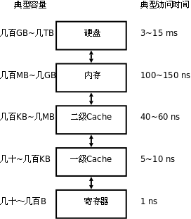

# perf 性能分析實例——使用perf優化cache利用率


##1.程序局部性

一個編寫良好的計算機程序通常具有程序的局部性，它更傾向於引用最近引用過的數據項，或者這個數據周圍的數據——前者是時間局部性，後者是空間局部性。現代操作系統的設計，從硬件到操作系統再到應用程序都利用了程序的局部性原理：硬件層，通過cache來緩存剛剛使用過的指令或者數據，來提交對內存的訪問效率。在操作系統級別，操作系統利用主存來緩存剛剛訪問過的磁盤塊；在應用層，web瀏覽器將最近引用過的文檔放在磁盤上，大量的web服務器將最近訪問的文檔放在前端磁盤上，這些緩存能夠滿足很多請求而不需要服務器的幹預。本文主要將的是硬件層次的程序局部性。

##2.處理器存儲體系

計算機體系的儲存層次從內到外依次是寄存器、cache（從一級、二級到三級）、主存、磁盤、遠程文件系統；從內到外，訪問速度依次降低，存儲容量依次增大。這個層次關係，可以用下面這張圖來表示：





程序在執行過程中，數據最先在磁盤上，然後被取到內存之中，最後如果經過cache（也可以不經過cache）被CPU使用。如果數據不再cache之中，需要CPU到主存中存取數據，那麼這就是cache miss，這將帶來相當大的時間開銷。


##3.perf原理與使用簡介

Perf是Linux kernel自帶的系統性能優化工具。Perf的優勢在於與Linux Kernel的緊密結合，它可以最先應用到加入Kernel的new feature。perf可以用於查看熱點函數，查看cashe miss的比率，從而幫助開發者來優化程序性能。
性能調優工具如 perf，Oprofile 等的基本原理都是對被監測對象進行採樣，最簡單的情形是根據 tick 中斷進行採樣，即在 tick 中斷內觸發採樣點，在採樣點裡判斷程序當時的上下文。假如一個程序 90% 的時間都花費在函數 foo() 上，那麼 90% 的採樣點都應該落在函數 foo() 的上下文中。運氣不可捉摸，但我想只要採樣頻率足夠高，採樣時間足夠長，那麼以上推論就比較可靠。因此，通過 tick 觸發採樣，我們便可以瞭解程序中哪些地方最耗時間，從而重點分析。
本文，我們主要關心的是cache miss事件，那麼我們只需要統計程序cache miss的次數即可。使用perf 來檢測程序執行期間由此造成的cache miss的命令是perf stat -e cache-misses ./exefilename，另外，檢測cache miss事件需要取消內核指針的禁用（/proc/sys/kernel/kptr_restrict設置為0）。

##4.cache 優化實例

###4.1數據合併
有兩個數據A和B，訪問的時候經常是一起訪問的，總是會先訪問A再訪問B。這樣A[i]和B[i]就距離很遠，如果A、B是兩個長度很大的數組，那麼可能A[i]和B[i]無法同時存在cache之中。為了增加程序訪問的局部性，需要將A[i]和B[i]儘量存放在一起。為此，我們可以定義一個結構體，包含A和B的元素各一個。這樣的兩個程序對比如下：

- test.c

```c
#include <stdio.h>

#define NUM 39216

int add(int* a, int* b, int num);

int main()
{
    int a[NUM], b[NUM];
    int i;

    for (i = 0; i < 1000; i++) {
        add(a, b, NUM);
    }

    return 0;
}

int add(int* a, int* b, int num)
{
    int i = 0;

    for (i = 0; i < num; i++) {
        *a = *a + *b;
        a++;
        b++;
    }

    return 0;
}
```
- test2.c


```c
#include <stdio.h>
#define NUM 39216

typedef struct _Array Array;
struct _Array {
    float a;
    float b;
};

int add(Array* myarray, int num);

int main()
{
    Array myarray[NUM];
    int j = 0;

    for (j = 0; j < 1000; j++) {
        add(myarray, NUM);
    }

    return 0;
}

int add(Array* myarray, int num)
{
    int i = 0;

    for (i = 0; i < num; i++) {
        myarray->a = myarray->a + myarray->b;
        myarray++;
    }

    return 0;
}
```

注：我們設置數組大小NUM為39216，因為cache大小是3072KB，這樣設定可以讓A數組填滿cache，方便對比。
對比二者的cache miss數量：
test

```sh
[huangyk@huangyk test]$ perf stat -e cache-misses ./test  
  
  
 Performance counter stats for './test':  
  
  
           530,787 cache-misses                                                  
  
  
       2.372003220 seconds time elapsed  
```

test2

```sh
[huangyk@huangyk test]$ perf stat -e cache-misses ./test2  
  
Performance counter stats for './test2':  
  
            11,636 cache-misses                                                  
  
       0.233570690 seconds time elapsed  
```

可以看到，後者的cache miss數量相對前者有很大的下降，耗費的時間大概是前者的十分之一左右。

進一步，可以查看觸發cach-miss的函數：
test程序的結果：

```sh
[huangyk@huangyk test]$ perf record -e cache-misses ./test  
[huangyk@huangyk test]$ perf report  
Samples: 7K of event 'cache-misses', Event count (approx.): 3393820  
 45.88%  test  test               [.] sub  
 44.74%  test  test               [.] add  
  0.71%  test  [kernel.kallsyms]  [k] clear_page_c  
  0.70%  test  [kernel.kallsyms]  [k] _spin_lock  
  0.43%  test  [kernel.kallsyms]  [k] run_timer_softirq  
  0.41%  test  [kernel.kallsyms]  [k] account_user_time  
  0.34%  test  [kernel.kallsyms]  [k] hrtimer_interrupt  
  0.30%  test  [kernel.kallsyms]  [k] run_posix_cpu_timers  
  0.29%  test  [kernel.kallsyms]  [k] _cond_resched  
  0.24%  test  [kernel.kallsyms]  [k] update_curr  
  0.23%  test  [kernel.kallsyms]  [k] x86_pmu_disable  
  0.22%  test  [kernel.kallsyms]  [k] __rcu_pending  
  0.20%  test  [kernel.kallsyms]  [k] task_tick_fair  
  0.19%  test  [kernel.kallsyms]  [k] account_process_tick  
  0.17%  test  [kernel.kallsyms]  [k] scheduler_tick  
  0.16%  test  [kernel.kallsyms]  [k] __perf_event_task_sched_out  

````

從perf輸出的結果可以看出，程序cache miss主要是由sub和add觸發的。
test2程序的結果：

```sh
perf record -e cache-misses ./test2  
perf report  
Samples: 51  of event 'cache-misses', Event count (approx.): 17438  
 39.78%  test2  [kernel.kallsyms]  [k] clear_page_c  
 15.68%  test2  [kernel.kallsyms]  [k] mem_cgroup_uncharge_start  
  7.94%  test2  [kernel.kallsyms]  [k] __alloc_pages_nodemask  
  7.28%  test2  [kernel.kallsyms]  [k] init_fpu  
  6.50%  test2  test2              [.] add  
  3.19%  test2  [kernel.kallsyms]  [k] arp_process  
  2.76%  test2  [kernel.kallsyms]  [k] account_user_time  
  2.73%  test2  [kernel.kallsyms]  [k] perf_event_mmap  
  2.02%  test2  [kernel.kallsyms]  [k] filemap_fault  
  1.62%  test2  [kernel.kallsyms]  [k] kfree  
  1.50%  test2  [kernel.kallsyms]  [k] 0xffffffffa04334b8  
  1.06%  test2  [kernel.kallsyms]  [k] _spin_lock  
  1.06%  test2  [kernel.kallsyms]  [k] raise_softirq  
  1.00%  test2  [kernel.kallsyms]  [k] acct_update_integrals  
  0.96%  test2  [kernel.kallsyms]  [k] __do_softirq  
  0.67%  test2  [kernel.kallsyms]  [k] handle_edge_irq  
  0.56%  test2  [kernel.kallsyms]  [k] __rcu_pending  
  0.40%  test2  [kernel.kallsyms]  [k] enqueue_hrtimer  
  0.39%  test2  test2              [.] sub  
  0.38%  test2  [kernel.kallsyms]  [k] _spin_lock_irq  
  0.36%  test2  [kernel.kallsyms]  [k] tick_sched_timer  

```

從perf輸出的結果可以看出，add和sub觸發的perf miss已經佔了很小的一部分。


###4.2循環交換
C語言中，對於二維數組，同一行的數據是相鄰的，同一列的數據是不相鄰的。如果在循環中，讓依次訪問的數據儘量處在內存中相鄰的位置，那麼程序的局部性將會得到很大的提高。
觀察下面矩陣相乘的幾個函數：

- test_ijk.c

```c
void Muti(double A[][NUM], double B[][NUM], double C[][NUM], int n)
{
    int i, j, k;
    double sum = 0;

    for (i = 0; i < n; i++)
        for (j = 0; j < n; j++) {
            sum = 0.0;

            for (k = 0; k < n; k++) {
                sum += A[i][k] * B[k][j];
            }

            C[i][j] += sum;
        }
}
```

- test_jki.c

```c
void Muti(double A[][NUM], double B[][NUM], double C[][NUM], int n)
{
    int i, j, k;
    double sum = 0;

    for (j = 0; j < n; j++)
        for (k = 0; k < n; k++) {
            sum = B[k][j];

            for (i = 0; i < n; i++) {
                C[i][j] += A[i][k] * sum;
            }
        }
}
```
- test_kij.c

```c
void Muti(double A[][NUM], double B[][NUM], double C[][NUM], int n)
{
    int i, j, k;
    double sum = 0;

    for (k = 0; k < n; k++)
        for (i = 0; i < n; i++) {
            sum = A[i][k];

            for (j = 0; j < n; j++) {
                C[i][j] += B[k][j] * sum;
            }
        }
}
```

考察內層循環，可以發現，不同的循環模式，導致的cache失效比例依次是kij、ijk、jki遞增。


###4.3循環合併


在很多情況下，我們可能使用兩個獨立的循環來訪問數組a和c。由於數組很大，在第二個循環訪問數組中元素的時候，第一個循環取進cache中的數據已經被替換出去，從而導致cache失效。如此情況下，可以將兩個循環合併在一起。合併以後，每個數組元組在同一個循環體中被訪問了兩次，從而提高了程序的局部性。

##5.後記


實際情況下，一個程序的cache失效比例往往並不像我們從理論上預測的那麼簡單。影響cache失效比例的因素主要有：數組大小，cache映射策略，二級cache大小，Victim Cache等，同時由於cache的不同寫回策略，我們也很難從理論上預估一個程序由於cache miss而導致的時間耗費。真正在進行程序設計的時候，我們在進行理論上的分析之後，只有使用perf等性能調優工具，才能更真實地觀察到程序對cache的利用情況。