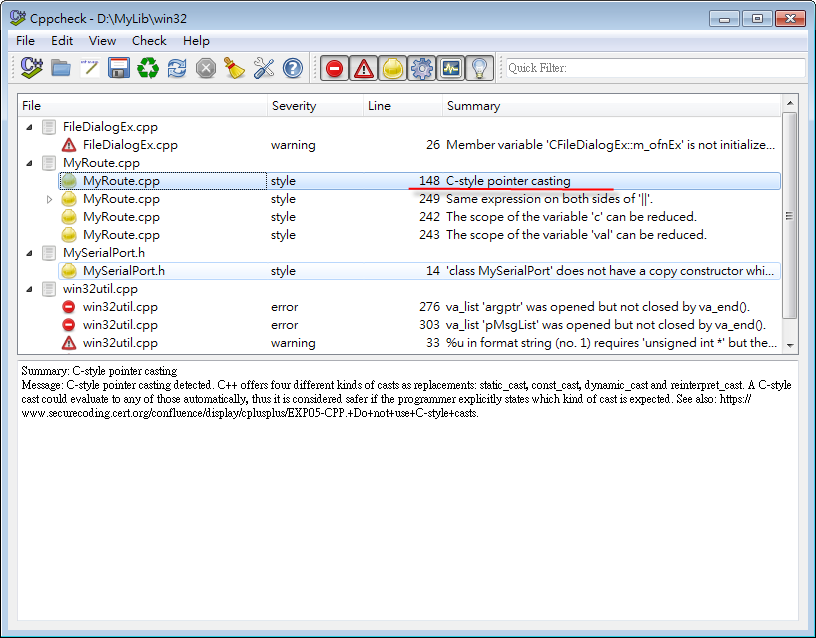
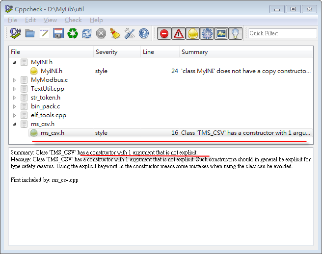
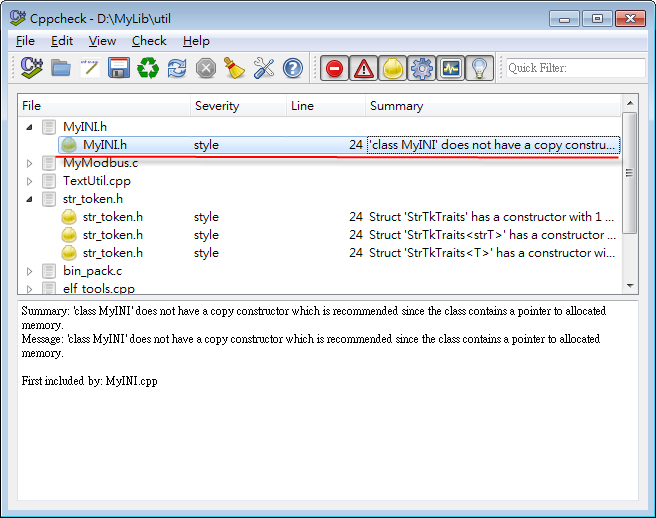
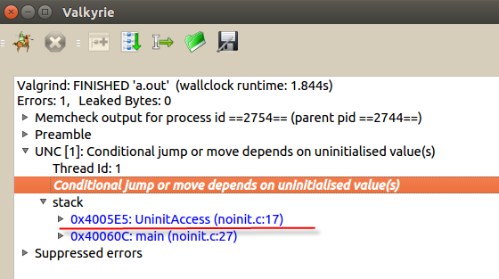
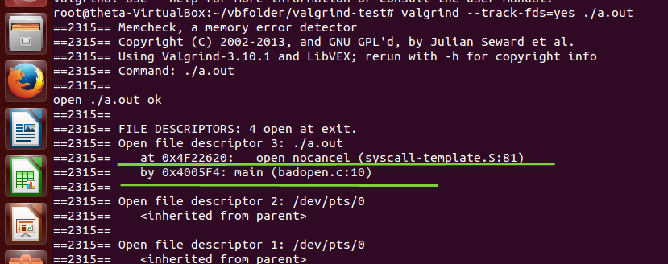

# 有病治病，沒病強身: Cppcheck + Valgrind


## Cppcheck

簡單來說這是一套靜態 C/C++ 靜態分析工具，什麼是靜態分析？就是程式尚未編譯執行前，直接對原始碼分析，看有沒有 bug 或值得改進之處。

就小弟所知，過去這個行業最有名的工具大概就是 PC-lint，不過他是商業軟體，價格不是一般人負擔得起。所以很多書就教大家一個替代方案，把 compiler warning message 開到最大。以 gcc 來說就是加上 -Wall，這的確很有用，你也該這麼做。

Cppcheck 可以補足 compiler warning message 的不足，達到「吾一日三省吾身」，馬上拿來檢查小弟過去寫的一些老程式，看看有沒有什麼新發現？

##C-style pointer casting




很多 C++ 進階書籍如 Effective C++、C++ Common Knowledge 都告訴你別再用 (T*) 的方式做轉型了，早期小弟也覺得這條好囉唆， static_cast，dynamic_cast，reinterpret_cast 身邊人有幾個分得清楚？而且要打這麼多字...0rz

但現在的局勢是你不這樣做會出大麻煩，原因在於 64bit 應用已經是必然的趨勢，如果你執著於舊式語法，在升級時你要找到這些問題的關鍵 - 指標，會是一件麻煩的工作(就算如小弟號稱 Regex 寶橋路最強也覺得很棘手)，但如果你在程式中使用 C++ style casting 就會變成一件很簡單的事，簡單的文字搜尋就辦得到。再說現在最弱的文字編輯器也有 Auto Complete 的功能，並不會增加你太多負擔

## Explicit constructor/conversion



簡單來說，下面的風格是被認為不好的(取自 C++ Gotchas #37)： 

```cpp
class String{
public:
    String(const char *);
    operator const char*()const;
    //...
};
 
 
String name1("Fred"); //direct init
name = "Joe"; //implicit conversion
const char *cname = name1; //implicit conversion
String name2 = cname; //implicit conversion
```
以現代的眼光來看，就是有點想模仿 Script 語言常見的 duck type，但又沒辦法做的很到位。在 Google C++ Style 裡還直接列為禁止事項，而且以程式「被讀的次數會比被修改的次數多」來看，比起上面的風格，var.c_str()，var.toInt() 清楚明瞭，搜尋原始碼也輕鬆許多。

詳細解釋請參考 C++ Gotchas #37。


## Copy constructor


上面的錯誤訊息說你需要一個 copy constructor，因為你的 class 有配置記憶體的行為，這個問題在 Effective C++ 從第一版到最新版快被講爛了，意思就是預設的 copy constructor 並沒有幫你作 deep copy，這對物件複製來說是個大問題，但往往很多時候是根本不需要「複製」這個行為，你應該把 operator= 放到 private: 明白拒絕他。正如同無論你的駕駛技術再好，也不該拆掉安全氣囊一樣。

其實 Cppcheck 能檢查的東西非常多，這邊就不一一介紹了。強烈建議你在 commit 任何程式碼之前用 Cppcheck 檢查一遍。


## Valgrind

這其實也不是什麼新玩意了，但小弟就跟很多 C++ 程式員一樣，過度自信，覺得自己 C++ 耍得好，哪有機會用到這工具。再來就是覺得這就是一個 memory leak checker 嘛...我的程式可是用了 RAII 與 Smart Pointer，而且沒用到 exception...怎麼可能有這種事呢？

但因為最近某大客戶抱怨軟體會在執行到一半時當掉，想當然爾身為通訊組件負責人的我，一定是第一個被懷疑的現象，與其被抓到還不如先自首，先用 Cppcheck 驗證過一次接著就是 Valgrind 出馬了， valgrind 果然沒有辜負我的期望，抓到了一些我意想不到的 bug。

我們先來杜撰一個程式，看能收到怎樣的效果(用 gcc -g xxx.c 編譯)


```cpp
struct Foo{
    char c;
    int a, b;  
};
 
void UninitAccess()
{
    struct Foo *f = (struct Foo*)malloc(sizeof(struct Foo));
    if(f == NULL)
    {
        return;
    }
     
    if(f->a > 0)
    {
        printf("do something\n");
    }
     
    free(f);
}
 
int main()
{
    UninitAccess();
    return 0;
}
```

我們用視覺化版本的 valkyrie，看看有什麼錯誤發生


從上圖的錯誤訊息可以得知，noinit.c: 17 (範例 Line#14)依賴了一個未初始化的變數，當然上面的例子很簡單，一眼就能看出錯誤。但在複雜的 struct 與 class 中，這是很容易犯的錯誤，也可以看出來  valgrind 絕不是只有檢查 malloc/free 與 new/delete 有沒有匹配這麼簡單的功能。

再看一個例子

```cpp
int main(int argc, char** argv)
{
    int fd = open(argv[0], O_RDONLY);

    if (fd < 0) {
        printf("open %s fail: errno = %d\n", argv[0], errno);
        return;
    } else {
        printf("open %s ok\n", argv[0]);
    }

    return 0;
}
```

用命令 valgrind --track-fds=yes program 執行的結果如下: 




可以看到 valgrind 發現了有 open 卻未 close 的 file descriptor (範例 Line#3)，由此可見 valgrind 對遺失資源的檢測不只是記憶體而已，檔案也行。國外有位網友寫了一篇 Valgrind is *NOT* a leak checker，足可見證 valgrind 的瑞士刀特性，而現在各大 Linux distribution 都已把此列為標準配備，已經是居家出門必備良藥。有些軟件甚至打著 valgrind 認證的旗號，足可見此軟體的權威性。

另外最近有一本書 21 世紀 C 語言(21st Century C)，也花了一些篇幅介紹 valgrind，其實從這本書可以看出來，現代 C/C++ 程式設計早已不是單純依靠智力的活動，而是大量依賴各式工具與 open source libraries，並且觀察這 10 年來程式語言的發展，新進榜的的程式語言沒有不支援自動記憶體管理的，但在嵌入式系統的戰場上 C/C++ 仍是要角，有了這些工具，我們就沒有理由因為自己使用的語言不夠時髦而沒辦法把事情做好，不是嗎？