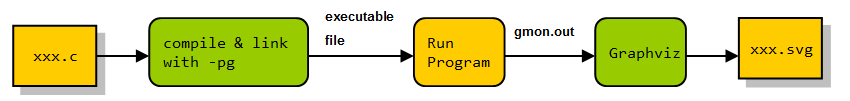
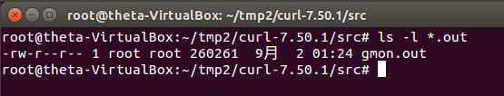
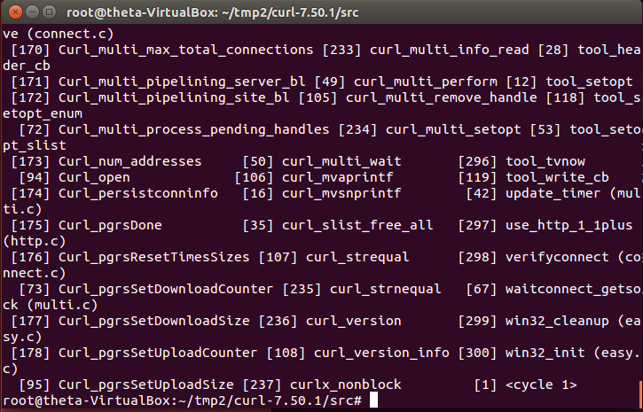
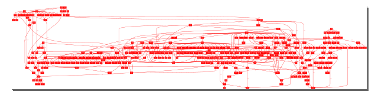
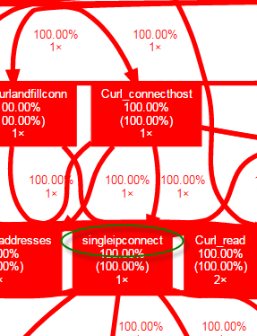
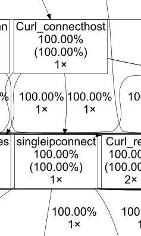
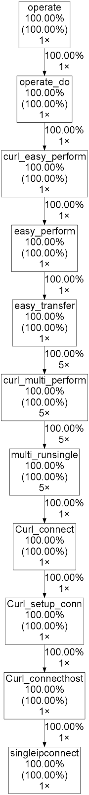

# 運用 gprof + graphviz 學習 Open Source

有時我們想了解一個 Open Source 軟體是如何運作的，可能是為了除錯，也可能是想了解心中的一些議題在這個軟體中是如何運作的。舉例來說，如果你正在用 socket 開發軟體，想要知道如何正確使用 socket API，找一個很受歡迎，很多人使用的 Open Source 軟體打開研究，比起只看文檔或書上的範例，抓頭騷耳老半天要來的快速有效。

又或者有一種可能，你正在為一個 Open Source 程式庫編寫練習程式，可能這個程式庫比較小眾缺乏足夠的參考資料，你不知道你做的對不對，你想知道你的程式有沒有經過正確的路徑。例如你寫的程式屬於 even driven，你想知道你的 callback function 是何時何地為何被呼叫，如果能知道 `call graph`，用起就更有信心也更不容易犯錯。


##如何產生 Call Graph？


一些軟體，如 Source Insight、Doxygen，可以靜態分析 Source Code，產生 Call Graph，但以 80/20 法則來看，一隻程式在實際運行中，大部分時間只有用到 20% 的程式碼。所以我們應集中心力去了解這 20%，這是靜態分析幫不上忙的。

這邊我們要採用的工具是 GNU gprof，原本是用於分析程式效能的工具，他會找出各個函數被呼叫的頻率，也因此他有能力在運行時找出 Call Graph。

但 gprof 產生的報告並非視覺化的產物，所以需要再轉換成圖形，最好還可以以 function name 搜尋節點，這裡我們要利用 Graphviz 來協助我們產生 SVG。

以資料流程圖表示：



接下來，我們來看一個實際的例子。

##curl


curl 是一個號稱有百萬使用者的命令列工具與程式庫，支援 http, smtp, ftp...多種協議，我們今天就來看看，curl 在抓取一個網頁的過程中，會呼叫哪些函數，會經過了哪些路徑，從中可以學習到什麼？

請以以下步驟編譯 curl：

```sh
wget https://curl.haxx.se/download/curl-7.50.1.tar.gz
tar -zxvf curl-7.50.1.tar.gz
./configure LDFLAGS=-static
make CFLAGS='-pg -g -O0 -Wall' LDLIBS+=' -pg'
```

因為 gprof 只支援靜態連結，所以必須以環境變數告訴 configure 我們要採用靜態編譯的方式編譯 curl，否則我們就看不到 libcurl.so 中的 call graph，目前查到可以用 sprof 來處理 .so，不過小弟還沒實驗過。

上面也提過編譯跟連結時都要加上 -pg 旗標，加上 -g 是盡量保留除錯資訊，讓 gprof 可以檢索到正確的 function name，-O0 則是希望 gcc 編譯時不要最佳化，讓我們盡量看到程式的原始風貌。

進入目錄 /src ，輸入命令：`./curl http://www.google.com.tw`

接著你應該會在目錄下看到多出了一個 gmon.out



輸入 gprof -q curl，你會看到 gprof 的確已經取得本次執行的 call graph 了：



但 Graphviz 無法直接解析這些資訊，因為 Grpahviz 本身自有一套繪圖語言 - dot，在實驗了多個轉換工具後 gprof2dot 算是其中最穩定的。接著以 pipe 結合各個工具：

```sh
gprof -q curl | ./gprof2dot.py | dot -Tsvg -o curltest.svg
```

用 InkScape 打開 curltest.svg 瞧瞧：




gprof2dot 會以顏色來標記函數被呼叫次數的比例，因為 curl 不屬於 CPU bound 的程式，所以會出現一片大紅色。

這樣的圖似乎大到不知道怎麼看，gprof2dot 提供了相當多剪裁的方法，小弟用的方法是直接看有興趣的函數，比方說我想知道是在哪裡建立連接的。於是我搜尋 connect() 這個 socket API，找到了 singleipconnect() 這個嫌疑犯，我們在圖中搜尋 singleipconnect 看看：




圖形似乎太密集了，而且線太粗了，大紅色也太嚇人，用下面的命令不顯示顏色，而且把線的寬度改為最小：

```sh
gprof -q curl | ./gprof2dot.py -c print  | perl -pe 's/,\s+penwidth="[\d.]+"//g' | dot -Tsvg -o curltest.svg
```



因為我們只對 singleipconnect 有興趣，透過再一次剪裁

```sh
gprof -q curl | ./gprof2dot.py -l singleipconnect -c print  | perl -pe 's/,\s+penwidth="[\d.]+"//g' | dot -Tsvg -o curltest.svg
```

結果宛如水晶一樣透明：


