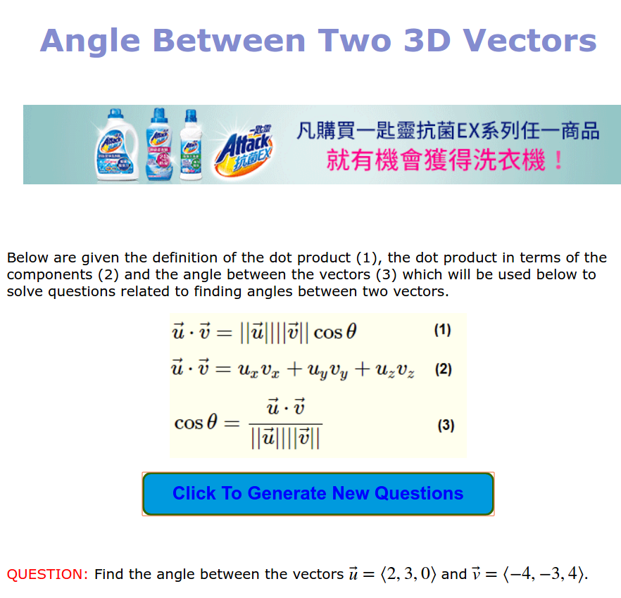
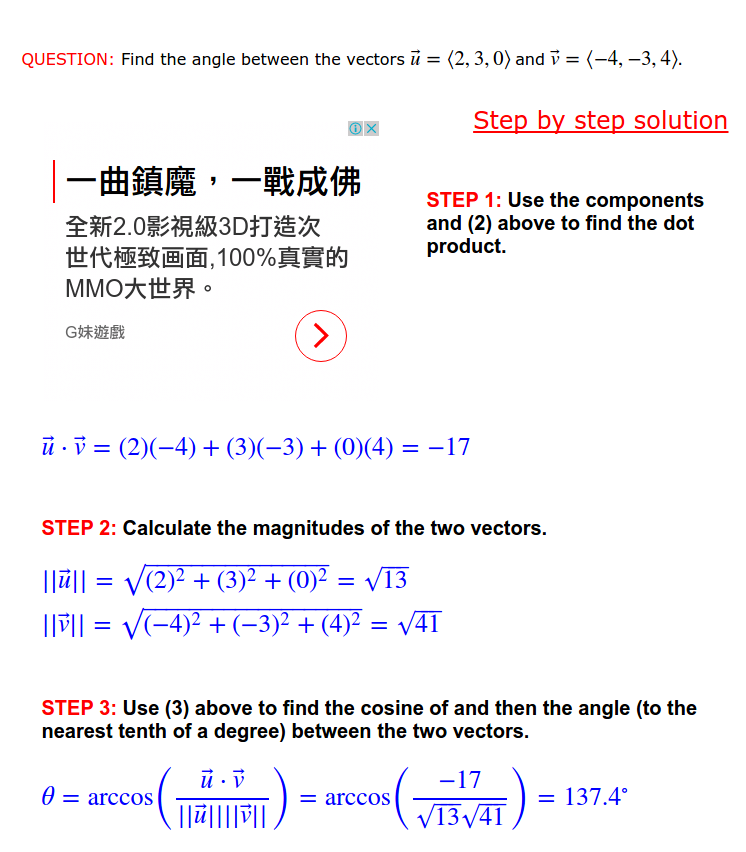

# Angle Between Two 3D Vectors






```py
import math

def dotproduct(v1, v2):
  return sum((a*b) for a, b in zip(v1, v2))

def length(v):
  return math.sqrt(dotproduct(v, v))

def angle(v1, v2):
  return math.acos(dotproduct(v1, v2) / (length(v1) * length(v2)))

if __name__ == '__main__':
    v = [2,3,0]
    u = [-4,-3,4]
    angle_ = angle(v,u)
    print math.degrees(angle_)
    
```

