# OpenGL Angles to Axes


<div style="float:right">
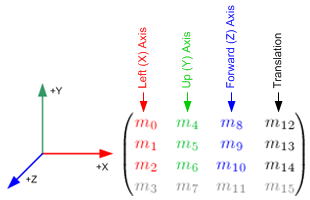
</div>
<p>
The rotation angles directly affects the first 3 columns of OpenGL <strong>GL_MODELVIEW</strong> matrix, precisely <em>left</em>, <em>up</em> and <em>forward</em> axis elements. For example, if a unit vector along X axis, (1, 0, 0) is multiplied by an arbitrary 3x3 rotation matrix, then the result of the vector after rotation is;
<br>
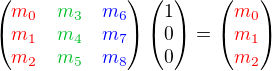
<br>
It means the first column (m<sub>0</sub>, m<sub>1</sub>, m<sub>2</sub>) of the rotation matrix represents the coordinates of the <em>left</em> axis after rotated. Similarly, the second column is the <em>up</em> axis and the third column is the <em>forward</em> axis.
</p>
<p>
This article describes how to contruct GL_MODELVIEW matrix with rotation angles.
</p>

<h3 id="axisrotation" style="clear:both">Axis Rotations</h3>
<p>
First, we look at a rotation around each axis; +X, +Y and +Z. We project three axes onto a plane in 3 different ways, so the axis that we want to rotate is facing toward you. The positive rotation direction becomes counter clockwise (right hand rule).
</p>

<h4>Rotation about Left(X) Axis (Pitch)</h4>
<div style="float:left; margin-left:30px; text-align:center">
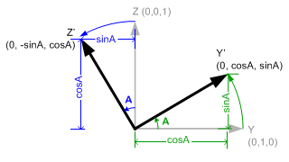
<br>
<span class="caption">Rotation about Left(X) Axis</span>
</div>
<p>
Initial value of up(Y) and forward(Z) axes are (0, 1, 0) and (0, 0, 1). If left(X) axis rotates A degree, then new up(Y') axis becomes (0, cosA, sinA) and forward(Z') becomes (0, -sinA, cosA). The new axes are inserted as column components of the 3x3 rotation matrix. Then, the rotation matrix becomes;
</p>
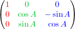

<h4 style="clear:both">Rotation about Up(Y) Axis (Yaw, Heading)</h4>
<div style="float:left; margin-left:30px; text-align:center">
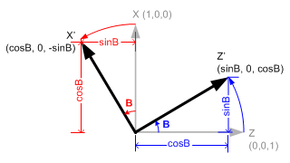
<br>
<span class="caption">Rotation about Up(Y) Axis</span>
</div>
<p>
Now, we rotate around up vector, which is facing toward you, with B angle . Left(X) axis is transformed from (1, 0, 0) to X' (cosB, 0, -sinB). And forward(Z) axis is from (0, 0, 1) to Z' (sinB, 0, cosB).
</p>
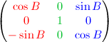

<h4 style="clear:both">Rotation about Forward(Z) Axis (Roll)</h4>
<div style="float:left; margin-left:30px; text-align:center">
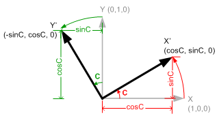
<br>
<span class="caption">Rotation about Forward(Z) Axis</span>
</div>
<p>
If we rotate forward(Z) axis with angle C degree, the original left(X) (1, 0, 0) axis becomes X' (cosC, sinC, 0), and up(Y) (0, 1, 0) axis becomes Y' (-sinC, cosC, 0).
</p>
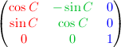

<h3 id="anglestoaxes" style="clear:both">Angles To Axes</h3>
<p>
We can combine these separate axis rotations into one matrix by multiplying above 3 matrices together. Note that multiplication of matrices is not commutative, so a different order of matrix multiplication results in a different outcome. There are 6 different combinations are possible; R<sub>x</sub>R<sub>y</sub>R<sub>z</sub>, R<sub>x</sub>R<sub>z</sub>R<sub>y</sub>, R<sub>y</sub>R<sub>x</sub>R<sub>z</sub>, R<sub>y</sub>R<sub>z</sub>R<sub>x</sub>, R<sub>z</sub>R<sub>x</sub>R<sub>y</sub> and R<sub>z</sub>R<sub>y</sub>R<sub>x</sub>.
</p>
<p>
The left column of the combined rotation matrix is the <em>left</em> axis after rotated, the middle column is the <em>up</em> axis, and the right column is the <em>forward</em> axis.
</p>

<h4>&nbsp;</h4>
<p style="margin-left:30px">
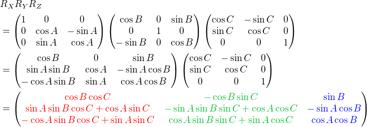
</p>

<h4>&nbsp;</h4>
<div style="margin-left:30px">
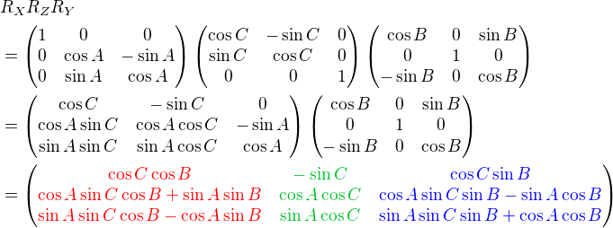
</div>

<h4>&nbsp;</h4>
<div style="margin-left:30px">
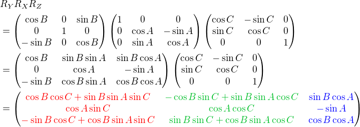
</div>

<h4>&nbsp;</h4>
<div style="margin-left:30px">
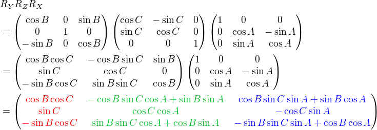
</div>

<h4>&nbsp;</h4>
<div style="margin-left:30px">
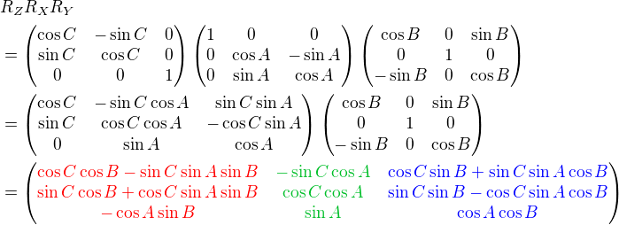
</div>

<h4>&nbsp;</h4>
<div style="margin-left:30px">
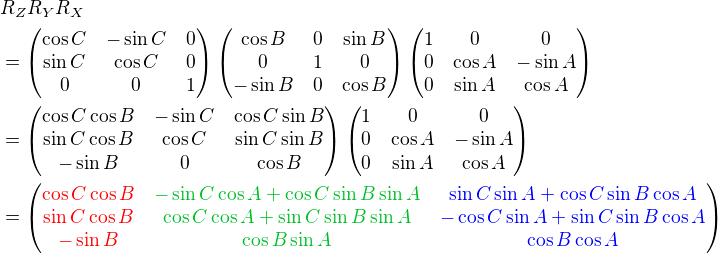
</div>
<p>
<br>
Here is a C++ example code for R<sub>x</sub>R<sub>y</sub>R<sub>z</sub> combination. It performs 3 rotations in order of R<sub>z</sub> (roll), R<sub>y</sub> (yaw) then R<sub>x</sub> (pitch). The results of <em>left</em>, <em>up</em> and <em>forward</em> axis can be used to construct GL_MODELVIEW matrix.
</p>


</div>


```cpp
struct Vector3
{
    float x;
    float y;
    float z;
    Vector3() : x(0), y(0), z(0) {}; <span class="comment">// initialze when created</span>
};


<span class="comment">///////////////////////////////////////////////////////////////////////////////
// convert Euler angles(x,y,z) to axes(left, up, forward)
// Each column of the rotation matrix represents left, up and forward axis.
// The order of rotation is Roll-&gt;Yaw-&gt;Pitch (Rx*Ry*Rz)
// Rx: rotation about X-axis, pitch
// Ry: rotation about Y-axis, yaw(heading)
// Rz: rotation about Z-axis, roll
//    Rx           Ry          Rz
// |1  0   0| | Cy  0 Sy| |Cz -Sz 0|   | CyCz        -CySz         Sy  |
// |0 Cx -Sx|*|  0  1  0|*|Sz  Cz 0| = | SxSyCz+CxSz -SxSySz+CxCz -SxCy|
// |0 Sx  Cx| |-Sy  0 Cy| | 0   0 1|   |-CxSyCz+SxSz  CxSySz+SxCz  CxCy|
///////////////////////////////////////////////////////////////////////////////</span>
void anglesToAxes(const Vector3 angles, Vector3&amp; left, Vector3&amp; up, Vector3&amp; forward)
{
    const float DEG2RAD = 3.141593f / 180;
    float sx, sy, sz, cx, cy, cz, theta;

    <span class="comment">// rotation angle about X-axis (pitch)</span>
    theta = angles.x * DEG2RAD;
    sx = sinf(theta);
    cx = cosf(theta);

    <span class="comment">// rotation angle about Y-axis (yaw)</span>
    theta = angles.y * DEG2RAD;
    sy = sinf(theta);
    cy = cosf(theta);

    <span class="comment">// rotation angle about Z-axis (roll)</span>
    theta = angles.z * DEG2RAD;
    sz = sinf(theta);
    cz = cosf(theta);

    <span class="comment">// determine left axis</span>
    left.x = cy*cz;
    left.y = sx*sy*cz + cx*sz;
    left.z = -cx*sy*cz + sx*sz;

    <span class="comment">// determine up axis</span>
    up.x = -cy*sz;
    up.y = -sx*sy*sz + cx*cz;
    up.z = cx*sy*sz + sx*cz;

    <span class="comment">// determine forward axis</span>
    forward.x = sy;
    forward.y = -sx*cy;
    forward.z = cx*cy;
}

```


