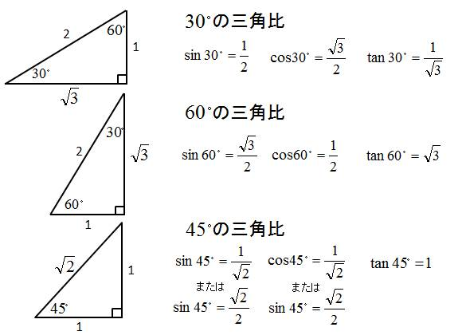
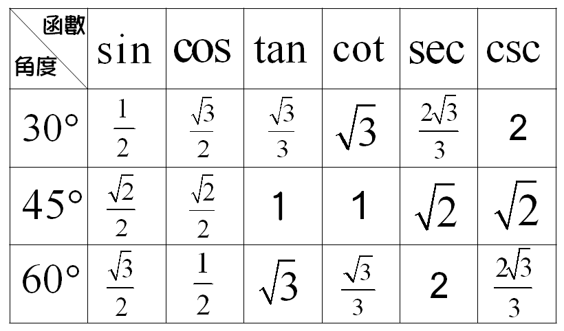
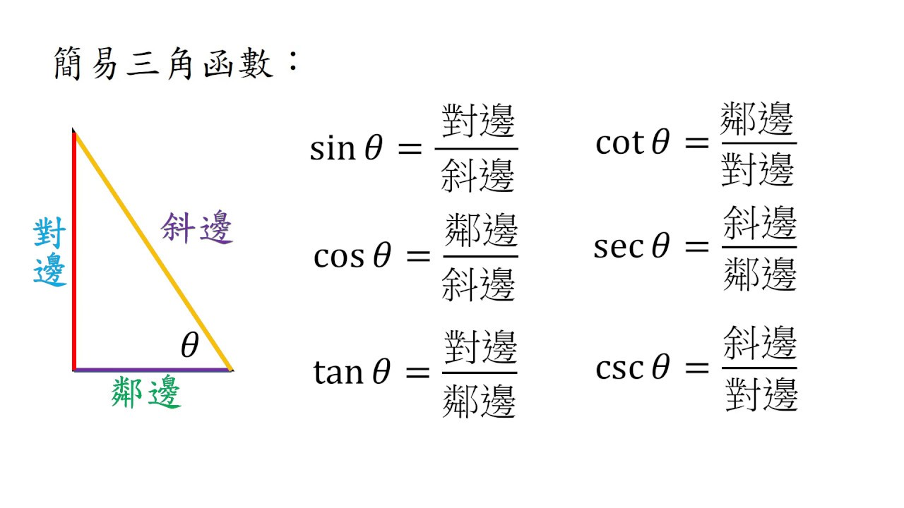

# 三角函數









---

### python

- sin：求正弦；傳入弧度值
- cos：求餘弦；傳入弧度值
- tan：求正切；傳入弧度值


```py
import math
 
a = math.pi/6   # math.pi = 3.141592653589793
 
math.sin(a)   # 0.49999999999999994
math.cos(a)   # 0.8660254037844387
math.tan(a)   # 0.5773502691896256
```

hypot(a,b)：a,b是直角三角形的兩個對角邊，求斜邊長；使用勾股定理，等同於sqrt(a*a + b*b)


```py
math.hypot(3,4)      # 5.0
math.sqrt(3*3 + 4*4) # 5.0
```

- degrees：把弧度值轉換為角度
- radians：把角度值轉換為弧度


```py
math.degrees(math.pi/6)  # 29.999999999999996
math.radians(30)         # 0.5235987755982988
```


```py
# coding=UTF-8
import math

def get_angle(a, b, c):
    #return round(math.degrees(math.acos((a ** 2 + b ** 2 - c ** 2) / (2 * a * b))))
    return math.degrees(math.acos((a ** 2 + b ** 2 - c ** 2) / (2 * a * b)))

a = math.pi/6   # math.pi = 3.141592653589793
#print math.sin(a)   # 0.49999999999999994
#print math.cos(a)   # 0.8660254037844387
#print math.tan(a)   # 0.5773502691896256

print math.sin(math.radians(30))   # 1/2 
print math.sin(math.radians(45))   # 1 / math.sqrt(2) = 0.7071067811865475 
print math.sin(math.radians(60))   # math.sqrt(3) / 2.0 = 0.8660254037844386 

# degrees：把弧度值轉換為角度
# radians：把角度值轉換為弧度
print math.degrees(math.pi/6)  # 29.999999999999996
print math.radians(30)         # 0.5235987755982988

# 已經三邊余玄定理求夾角
print get_angle(2,math.sqrt(3), 1)
print get_angle(2,math.sqrt(3), 1)
print get_angle(1, math.sqrt(3),2)


print get_angle(4,2.83, 6.32) 
print get_angle(2.83, 6.32,4)
print get_angle(6.32, 4,2.83)

## 直角三角形一邊一夾角算長度, 
print math.sin(math.radians(18.5490227452)) * 6.32 # 對/斜   
print math.cos(math.radians(18.5490227452)) * 6.32 # 鄰/斜

```
