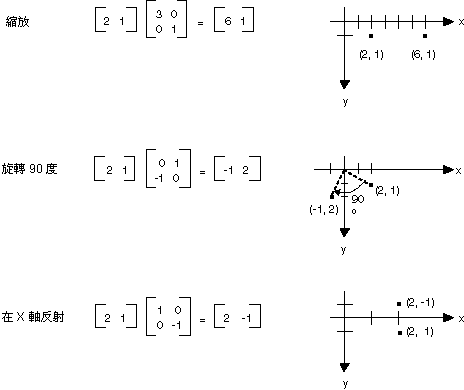
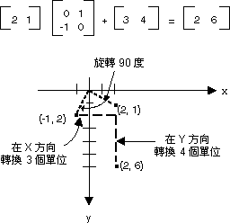
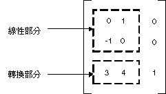

# 以矩陣來表示轉換

 
m×n 矩陣是按照 m 資料列和 n 資料行排列的一組數字。 下圖將顯示幾種矩陣。


您可以利用增加個別項目來加入兩個大小相同的矩陣。 下圖將顯示兩個矩陣加法範例。


m×n 矩陣可乘以 n×p 矩陣，其產生的結果便為 m×p 矩陣。 第一個矩陣的資料行數目必須和第二個矩陣的資料列數目相同。 例如，4×2 矩陣可乘以 2×3 矩陣以產生 4×3 矩陣。
平面上的點和矩陣的資料列和資料行都可視為向量。 例如，(2, 5) 是具有兩個元件的向量，而 (3, 7, 1) 是具有三個元件的向量。 這兩種向量所產生的點的定義如下：

(a, b)•(c, d) = ac + bd<br>
(a, b, c)‧(d, e, f) = ad + be + cf<br>

例如，(2, 3) 和 (5, 4) 產生的點是 (2)(5) + (3)(4) = 22。 (2, 5, 1) 和 (4, 3, 1) 產生的點是 (2)(4) + (5)(3) + (1)(1) = 24。 請注意，這兩種向量所產生的點是數字，而非另一個向量。 此外，只有當這兩個向量擁有相同的元件數目時，您才可以計算產生的點數目。

假設 A(i, j) 是矩陣 A 第 i 個資料列和第 j 個資料行中的項目。 例如 A(3, 2) 是矩陣 A 第 3 個資料列和第 2 個資料行中的項目。 假設 A、B 和 C 都是矩陣，而 AB = C。 C 項目的計算結果如下：
C(i, j) = (A 的第 i 個資料列)‧(B 的第 j 個資料行)
下圖將顯示數個矩陣乘法的範例。


如果將平面中的點視為 1×2 矩陣，您可以將該矩陣乘以 2×2 矩陣以進行轉換。 下圖將說明數個套用到點 (2, 1) 的轉換。



上圖所顯示的所有變換皆為線性變換。其他特定變換是非線性的，例如轉換，而且無法乘以 2×2 矩陣來表示。假設您想要以點 (2, 1) 作為開始、將它旋轉 90 度、在 X 方向轉換 3 個單位和在 Y 方向轉換 4 個單位。您可以使用矩陣加法之後的矩陣乘法來完成這項作業。




轉換 (加上 1×2 矩陣) 之後的線性變換 (乘以 2×2 矩陣) 稱為仿射變換。另一種將仿射變換儲存為矩陣組 (其中一個作為線性部分，另一個作為轉換部分) 的方法是將整個變換儲存在 3×3 矩陣中。要有效完成這項工作，平面的其中一點必須儲存為虛設 3rd 座標中的 1×3 矩陣。常用的技巧是將所有 3rd 座標變成 1，例如，點 (2, 1) 便以矩陣 [2 1 1] 來表示。下圖將顯示仿射變換 (旋轉 90 度；在 X 方向變換 3 個單位、在 Y 方向轉換 4 個單位) 將乘以 3×3 矩陣來表示。


上例中，點 (2, 1) 將對應到點 (2, 6)。請注意：3×3 矩陣的第三個資料行包含數字 0、0 和 1。仿射變換的 3×3 矩陣一律都是這樣。資料行 1 和 2 中的六個數字非常重要。矩陣的左上 2×2 部份代表變換的線性部分，而第三個資料列的前兩個項目則代表轉換。



在 GDI+ 中，您可以將仿射變換儲存在 Matrix 物件中。由於用來表示仿射變換的矩陣第三個資料行一律為 (0, 0, 1)，因此在建立 Matrix 物件時，您只能指定前兩個資料行中的六個數字。陳述式 (Statement) Matrix myMatrix = new Matrix(0, 1, -1, 0, 3, 4) 將建立上圖所顯示的矩陣。

##複合變換


<div class="contentTableWrapper"><table class="dtTABLE" summary="table"> <tbody><tr valign="top"> <td width="18%">矩陣 A</td> <td width="82%">旋轉 90 度</td> </tr> <tr valign="top"> <td width="18%">矩陣 B</td> <td width="82%">在 X 方向縮放 2 個係數</td> </tr> <tr valign="top"> <td width="18%">矩陣 C</td> <td width="82%">在 Y 方向轉換 3 個單位</td> </tr> </tbody></table></div>


如果我們從點 (2, 1) 開始— 由矩陣 [2 1 1] 代表 — 並且乘以 A，然後乘以 B，然後再乘以 C，點 (2, 1) 將會在列出的順序中經歷三種變換。

[2 1 1]ABC = [-2 5 1]

如果您不想將複合變換的三個部分儲存在三個個別的矩陣中，您可以同時乘以 A、B 和 C 以取得儲存整個複合變換的單一 3×3 矩陣。假設 ABC = D。則任何一個點乘以 D 所得的結果都等於任何一個點乘以 A、然後 B、然後 C。

[2 1 1]D = [-2 5 1]
下圖將顯示矩陣 A、B、C 和 D。


複合變換是由變換序列組成，其中序列會緊跟著另一個序列。舉下表的矩陣和變換為例：


複合變換的矩陣的形成可藉由乘以單獨變換矩陣便可達成，這表示仿射變換的任何序列都可以儲存在單一 Matrix 物件中。
警告 複合變換的順序非常重要。通常，旋轉、然後縮放、然後轉換與縮放、然後旋轉、然後在轉換並不相同。同樣的，矩陣乘法的順序也很重要。一般而言，ABC 與 BAC 並不相同。
Matrix 類別提供了幾個方法，用來建置 (Build) 複合變換：Multiply、Rotate、RotateAt、Scale、Shear 和 Translate。下列範例建立複合變換矩陣，它會先旋轉 30 度、然後在 Y 方向縮放 2 個係數，然後在 X 方向轉換 5 個單位：

- VB

```java
Dim myMatrix As New Matrix()
myMatrix.Rotate(30)
myMatrix.Scale(1, 2, MatrixOrder.Append)
myMatrix.Translate(5, 0, MatrixOrder.Append)
[C#]
Matrix myMatrix = new Matrix();
myMatrix.Rotate(30);
myMatrix.Scale(1, 2, MatrixOrder.Append);
myMatrix.Translate(5, 0, MatrixOrder.Append);
```

下列圖示將顯示該矩陣。

