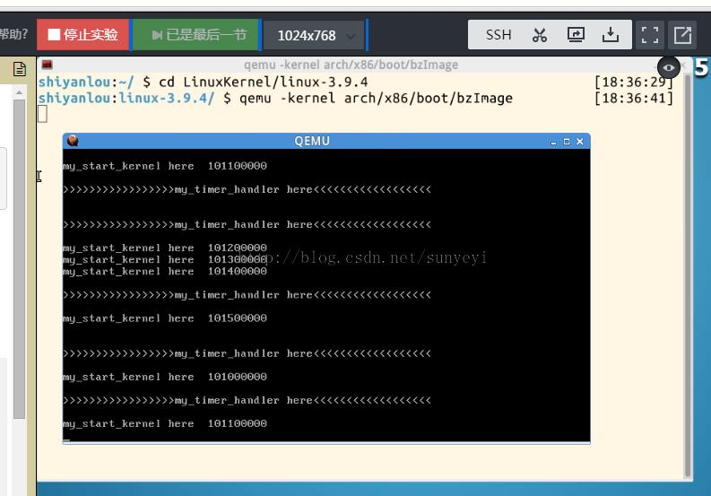
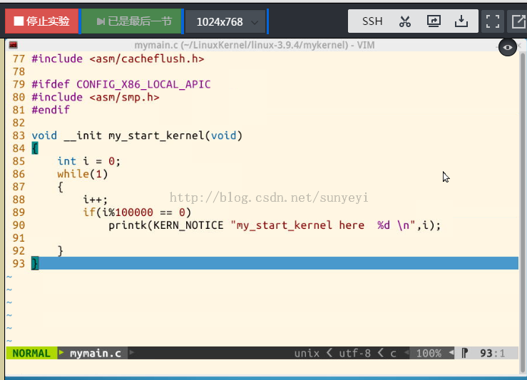
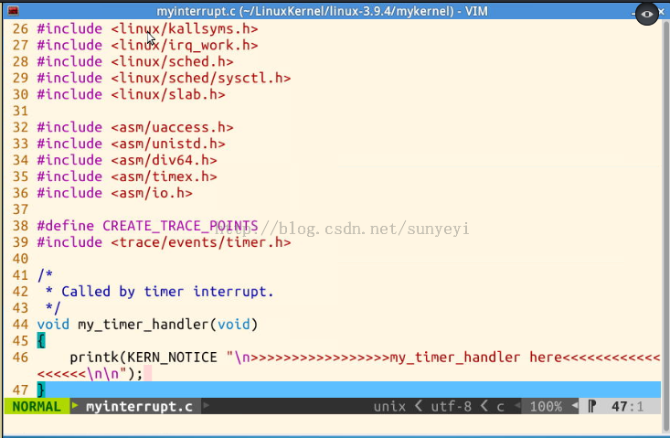
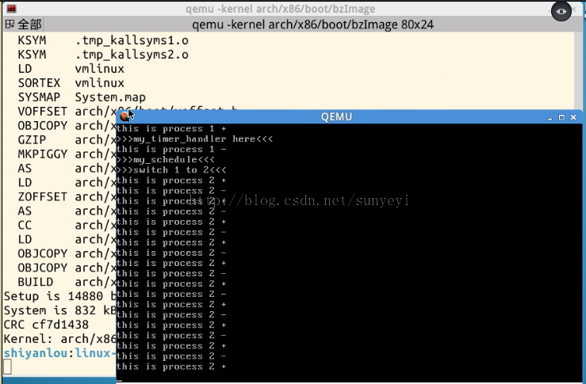

# 基於mykernel的一個簡單的時間片輪轉多道程序內核代碼分析

《Linux內核分析》MOOC課程：http://mooc.study.163.com/course/USTC-1000029000

第二講 操作系統是如何工作的？

@2015.03

---

### 1. mykernel簡介

這個是由孟老師建立的一個用於開發您自己的操作系統內核的平臺，它基於Linux Kernel 3.9.4 source code. 您可以在這裡找到mykernel的源代碼 https://github.com/mengning/mykernel 並按照上面的指南部屬到您的系統上。您也可以使用實驗樓http://www.shiyanlou.com/courses/195提供的虛擬機，它上面已經部屬好了這個平臺，按照實驗2的步驟即可找到並運行這個平臺框架。本文的實驗就是在實驗樓完成的。

使用實驗樓的虛擬機打開shell，輸入下面的兩條命令，即可以啟動mykernel，
```
cd LinuxKernel/linux-3.9.4
qemu -kernel arch/x86/boot/bzImage
```
這是運行截圖：




在QEMU窗口，我們可以看到一個簡單的操作系統已經跑起來了，當然這個系統很簡單，只是不停的輸出一些字符串：>>>>>my_timer_handler here <<<<< 和 my_start_kernel here 。

然後關閉qemu窗口，cd mykernel ，我們可以找到輸出這些字符串的源代碼mymain.c和myinterrupt.c

打開這兩個文件，我們可以看到，在mymain.c的my_start_kernel函數中



有一個循環，不停的輸出 my_start_kernel here.

在myinterrupt.c中，可以看到一個會被時鐘中斷週期調用的函數my_timer_handler ，在這個函數裡，會輸出類似>>>>>my_timer_handler here <<<<< 的字符串。





這兩個函數的輸出，就是前面我們這QEMU窗口中看到的內容。

通過這個實驗我們可以知道，mykernel系統啟動後，會

調用my_start_kernel函數
週期性的調用my_timer_handler函數
我們只要編寫這兩個函數，完成系統進程的初始化和進程的輪轉調度，就可以寫出一個簡單的操作系統了！

### 2. 一個簡單的時間片輪轉多道程序

通過上面的分析，我們再來看一個稍微複雜一點的實驗，這個實驗也就是擴展了my_start_kernel和my_timer_handler函數，模擬了一個基於時間片輪轉的多道程序。

我們先做實驗，再來分析代碼。

（1）從這裡獲取實驗用的源代碼，https://github.com/mengning/mykernel ，主要就這三個文件：mypcb.h，myinterrupt.c和mymain.c

（2）在實驗樓的虛擬機環境中，將這三個文件拷貝到mykernel平臺中，即要覆蓋前文所述的mykernel文件夾下mymain.c和myinterrupt.c，並新增mypcb.h

（3）回到 LinuxKernel/linux-3.9.4文件夾，使用下面的命令編譯、運行
```
make allnoconfig
make
qemu -kernel arch/x86/boot/bzImage
```

效果如下：



從QEMU的圖中可以看出，系統從執行process1切換到process2的過程。


（4）源代碼分析

這裡主要分析上面實驗中改寫的三個文件，其作用簡述如下，

- mypcb.h ： 進程控制塊PCB結構體定義。
- mymain.c： 初始化各個進程並啟動0號進程。
- myinterrupt.c：時鐘中斷處理和進程調度算法。

詳細分析：首先打開mypcb.h，
```cpp
/*
 *  linux/mykernel/mypcb.h
 *
 *  Kernel internal PCB types
 *
 *  Copyright (C) 2013  Mengning
 *
 */

#define MAX_TASK_NUM        4
#define KERNEL_STACK_SIZE   1024*8

/* CPU-specific state of this task */
struct Thread {
    unsigned long		ip;
    unsigned long		sp;
};

typedef struct PCB{
    int pid;
    volatile long state;	/* -1 unrunnable, 0 runnable, >0 stopped */
    char stack[KERNEL_STACK_SIZE];
    /* CPU-specific state of this task */
    struct Thread thread;
    unsigned long	task_entry;
    struct PCB *next;
}tPCB;

void my_schedule(void);
```

在這個文件裡，定義了 Thread 結構體，用於存儲當前進程中正在執行的線程的ip和sp，PCB結構體中的各個字段含義如下
pid：進程號

state：進程狀態，在模擬系統中，所有進程控制塊信息都會被創建出來，其初始化值就是-1，如果被調度運行起來，其值就會變成0

stack：進程使用的堆棧

thread：當前正在執行的線程信息

task_entry：進程入口函數

next：指向下一個PCB，模擬系統中所有的PCB是以鏈表的形式組織起來的。


這裡還有一個函數的聲明 my_schedule，它的實現在my_interrupt.c中，在mymain.c中的各個進程函數會根據一個全局變量的狀態來決定是否調用它，從而實現主動調度。


再來看看文件 mymain.c ,

```cpp
/*
 *  linux/mykernel/mymain.c
 *
 *  Kernel internal my_start_kernel
 *
 *  Copyright (C) 2013  Mengning
 *
 */
#include <linux/types.h>
#include <linux/string.h>
#include <linux/ctype.h>
#include <linux/tty.h>
#include <linux/vmalloc.h>


#include "mypcb.h"

tPCB task[MAX_TASK_NUM];
tPCB * my_current_task = NULL;
volatile int my_need_sched = 0;

void my_process(void);


void __init my_start_kernel(void)
{
	int pid = 0;
	int i;
	/* Initialize process 0*/
	task[pid].pid = pid;
	task[pid].state = 0;/* -1 unrunnable, 0 runnable, >0 stopped */
	task[pid].task_entry = task[pid].thread.ip = (unsigned long)my_process;
	task[pid].thread.sp = (unsigned long)&task[pid].stack[KERNEL_STACK_SIZE-1];
	task[pid].next = &task[pid];
	/*fork more process */
	for(i=1;i<MAX_TASK_NUM;i++)
	{
		memcpy(&task[i],&task[0],sizeof(tPCB));
		task[i].pid = i;
		task[i].state = -1;
		task[i].thread.sp = (unsigned long)&task[i].stack[KERNEL_STACK_SIZE-1];
		task[i].next = task[i-1].next;
		task[i-1].next = &task[i];
	}
	/* start process 0 by task[0] */
	pid = 0;
	my_current_task = &task[pid];
	asm volatile(
		"movl %1,%%esp\n\t" 	/* set task[pid].thread.sp to esp */
		"pushl %1\n\t" 	        /* push ebp */
		"pushl %0\n\t" 	        /* push task[pid].thread.ip */
		"ret\n\t" 	            /* pop task[pid].thread.ip to eip */
		"popl %%ebp\n\t"
		:
		: "c" (task[pid].thread.ip),"d" (task[pid].thread.sp)	/* input c or d mean %ecx/%edx*/
	);
}
void my_process(void)
{
	int i = 0;
	while(1)
	{
		i++;
		if(i%10000000 == 0)
		{
			printk(KERN_NOTICE "this is process %d -\n",my_current_task->pid);
			if(my_need_sched == 1)
			{
				my_need_sched = 0;
				my_schedule();
			}
			printk(KERN_NOTICE "this is process %d +\n",my_current_task->pid);
		}
	}
}
```

正如前文所述，這裡的函數 my_start_kernel 是系統啟動後，最先調用的函數，在這個函數裡完成了0號進程的初始化和啟動，並創建了其它的進程PCB，以方便後面的調度。

在模擬系統裡，每個進程的函數代碼都是一樣的，即 my_process 函數，my_process 在執行的時候，會打印出當前進程的 id，從而使得我們能夠看到當前哪個進程正在執行。

另外，在 my_process 也會檢查一個全局標誌變量 my_need_sched，一旦發現其值為 1 ，就調用 my_schedule 完成進程的調度。


0號線程的啟動，採用了內聯彙編代碼完成，詳細參見源碼中的註釋。


再來看看最後一個文件，myinterrupt.c
```cpp
/*
 *  linux/mykernel/myinterrupt.c
 *
 *  Kernel internal my_timer_handler
 *
 *  Copyright (C) 2013  Mengning
 *
 */
#include <linux/types.h>
#include <linux/string.h>
#include <linux/ctype.h>
#include <linux/tty.h>
#include <linux/vmalloc.h>

#include "mypcb.h"

extern tPCB task[MAX_TASK_NUM];
extern tPCB * my_current_task;
extern volatile int my_need_sched;
volatile int time_count = 0;

/*
 * Called by timer interrupt.
 * it runs in the name of current running process,
 * so it use kernel stack of current running process
 */
void my_timer_handler(void)
{
#if 1
    if(time_count%1000 == 0 && my_need_sched != 1)
    {
        printk(KERN_NOTICE ">>>my_timer_handler here<<<\n");
        my_need_sched = 1;
    }
    time_count ++ ;
#endif
    return;
}

void my_schedule(void)
{
    tPCB * next;
    tPCB * prev;

    if(my_current_task == NULL
        || my_current_task->next == NULL)
    {
    	return;
    }
    printk(KERN_NOTICE ">>>my_schedule<<<\n");
    /* schedule */
    next = my_current_task->next;
    prev = my_current_task;
    if(next->state == 0)/* -1 unrunnable, 0 runnable, >0 stopped */
    {
    	/* switch to next process */
    	asm volatile(
        	"pushl %%ebp\n\t" 	    /* save ebp */
        	"movl %%esp,%0\n\t" 	/* save esp */
        	"movl %2,%%esp\n\t"     /* restore  esp */
        	"movl $1f,%1\n\t"       /* save eip */
        	"pushl %3\n\t"
        	"ret\n\t" 	            /* restore  eip */
        	"1:\t"                  /* next process start here */
        	"popl %%ebp\n\t"
        	: "=m" (prev->thread.sp),"=m" (prev->thread.ip)
        	: "m" (next->thread.sp),"m" (next->thread.ip)
    	);
    	my_current_task = next;
    	printk(KERN_NOTICE ">>>switch %d to %d<<<\n",prev->pid,next->pid);
    }
    else
    {
        next->state = 0;
        my_current_task = next;
        printk(KERN_NOTICE ">>>switch %d to %d<<<\n",prev->pid,next->pid);
    	/* switch to new process */
    	asm volatile(
        	"pushl %%ebp\n\t" 	    /* save ebp */
        	"movl %%esp,%0\n\t" 	/* save esp */
        	"movl %2,%%esp\n\t"     /* restore  esp */
        	"movl %2,%%ebp\n\t"     /* restore  ebp */
        	"movl $1f,%1\n\t"       /* save eip */
        	"pushl %3\n\t"
        	"ret\n\t" 	            /* restore  eip */
        	: "=m" (prev->thread.sp),"=m" (prev->thread.ip)
        	: "m" (next->thread.sp),"m" (next->thread.ip)
    	);
    }
    return;
}
```
這裡 my_timer_handler 函數會被內核週期性的調用，每調用1000次，就去將全局變量my_need_sched的值修改為1，通知正在執行的進程執行調度程序my_schedule。

在my_schedule函數中，完成進程的切換。進程的切換分兩種情況，一種情況是下一個進程沒有被調度過，另外一種情況是下一個進程被調度過，可以通過下一個進程的state知道其狀態。

進程切換依然是通過內聯彙編代碼實現，無非是保存舊進程的eip和堆棧，將新進程的eip和堆棧的值存入對應的寄存器中，詳見代碼中的註釋。

3.總結

通過本講的學習和實驗，我們知道操作系統的核心功能就是：進程調度和中斷機制，通過與硬件的配合實現多任務處理，再加上上層應用軟件的支持，最終變成可以使用戶可以很容易操作的計算機系統。
