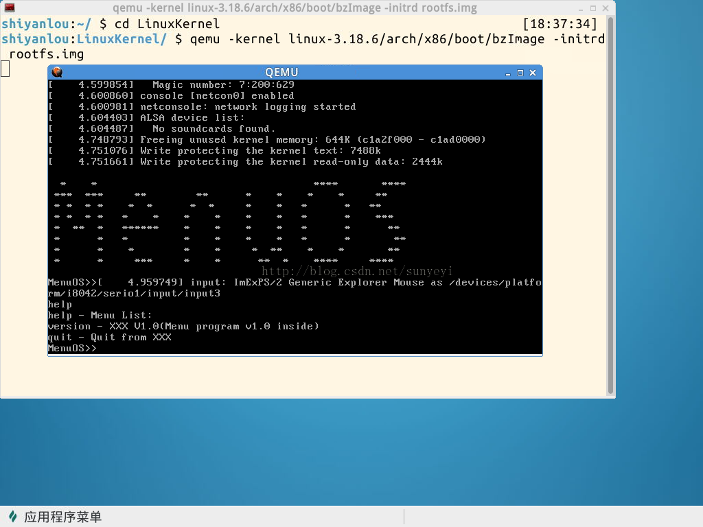
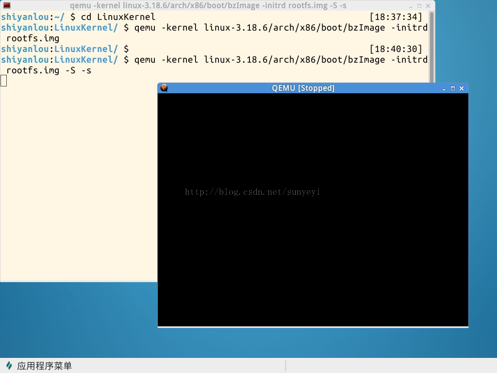
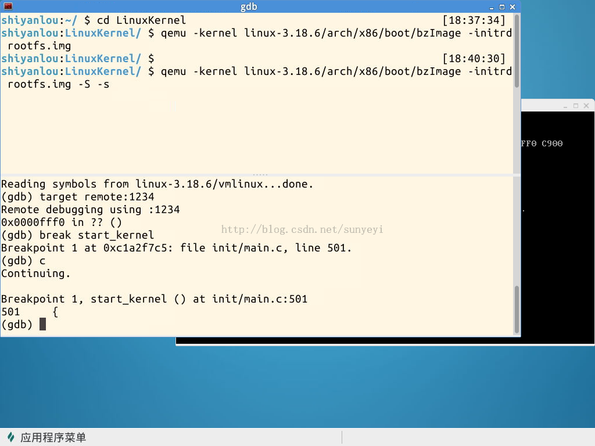
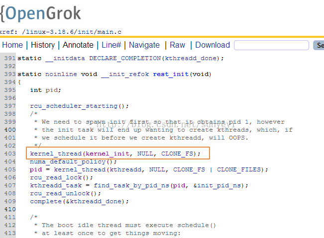

# 使用gdb跟蹤Linux內核啟動過程

《Linux內核分析》MOOC課程：http://mooc.study.163.com/course/USTC-1000029000

第三講 構造一個簡單的Linux系統MenuOS

@2015.03

## 1. 背景介紹

這節課的實驗是使用gdb調試運行一個簡單的Linxu系統，使用的實驗樓提供的虛擬機環境（http://www.shiyanlou.com/courses/running/725），點擊鏈接打開，登錄後，可以看到其詳細的實驗步驟在左側給出。


## 2. 實驗過程

### 2.1 運行MenuOS系統

在實驗樓的虛擬機環境裡，打擊打開shell，使用下面的命令
```
cd LinuxKernel/
qemu -kernel linux-3.18.6/arch/x86/boot/bzImage -initrd rootfs.img
```
即可啟動這個用於實驗的Linux系統MenuOS，實際上就是一個在Linux內核的基礎上，再運行一個簡單菜單命令行程序。我們可在MenuOS>的提示符下輸入help，看到其全部支持的命令，運行截圖如下：




### 2.2 調試運行
### 1）使用帶參數命令啟動MenuOS
```
qemu -kernel linux-3.18.6/arch/x86/boot/bzImage -initrd rootfs.img -s -S #
```

關於-s和-S選項的說明：
```
-S freeze CPU at startup (use ’c’ to start execution)
-s shorthand for -gdb tcp::1234 若不想使用1234端口，則可以使用-gdb tcp:xxxx來取代-s選項
```

也就是在啟動MenuOS系統的時候，添加了-S和-s這兩個參數，這樣可以使得系統在剛剛啟動的時候，暫停執行。以便等待我們調試器跟蹤執行。



### 2）啟動gdb，設置斷點，運行

在shell窗口上，右鍵單擊，選擇水平分割，在分割出的新的窗口中，輸入gdb，在出現gdb提示符後，加載符號文件
```
（gdb）file linux-3.18.6/vmlinux
建立和被調試程序的連接
（gdb）target remote:1234
在start_kernel函數入口處設置斷點
（gdb）break start_kernel

繼續輸入c，使得系統運行到start_kernel處停住
（gdb）c
```

此時系統截圖如下：



在gdb下，我們也可以使用list，列出斷點附近的源代碼，使用n，單步執行等命令，從而可以詳細的跟蹤到Linux系統啟動的過程。
```
gdb調試常用參數
r(run)            :    開始運行程序;
c(continue)  :    繼續運行一直到斷點停止
b(break)       :   設置程序斷點;
p(print)         :    打印出變量值;如 p var，會把var變量的值輸出
s(step)         :    單步跟蹤，會進入函數內部
n(next)         :    單步跟蹤，不進入函數
finish           :     跳出函數調試，並打印返回時的信息
u(until)        :     跳出循環體
q(quit)         :     退出gdb
l(list)            :     顯示當前行後面的源程序
bt (backtrace)   :     查看堆棧信息
info              :      查看各類gdb信息以及環境信息，比如：info break 可以查看斷點信息
clear            :       清除全部已定義的斷點
delete         :       刪除指點的斷點號，後面接斷點號
```
### 3. 總結


**start_kernel()**是內核的彙編與Ｃ語言的交接點，在該函數以前，內核的代碼都是用匯編寫的，完成一些最基本的初始化與環境設置工作。start_kernel就像是c代碼中的main函數。

不管你關注Linux的內核模塊，總是離不開start_kernel函數的，因為大部分模塊的初始化工作都是在start_kernel中完成的。在start_kernel()中Linux將完成整個系統的內核初始化，因此start_kernel函數也比較複雜，好在我們只需要關注自己感興趣的部分即可。
內核初始化的最後一步就是啟動init進程這個所有進程的祖先。

在start_kernel的最後，是調用rest_init函數，在rest_init函數，內核將使用下面的代碼產生第一個真正的進程，即pid=1的1號進程，




而init_task是靜態製造出來的，pid=0，我們可以在start_kernel函數的開始處，看到其被初始化的代碼


它試圖將從最早的彙編代碼一直到start_kernel的執行都納入到init_task進程上下文中，在其初始化工作完成後，就會成為系統的idle進程。事實上在更早前的sched_init函數中，通過init_idle(current, smp_processor_id())函數的調用就已經把init_task初始化成了一個idle task，init_idle函數的第一個參數current就是&init_task，在init_idle中將會把init_task加入到cpu的運行隊列中，這樣當運行隊列中沒有別的就緒進程時，init_task（也就是idle task)將會被調用，它的核心是一個while(1)循環，在循環中它將會調用schedule函數以便在運行隊列中有新進程加入時切換到該新進程上。
