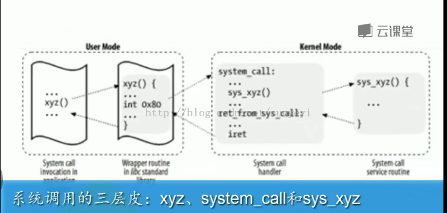
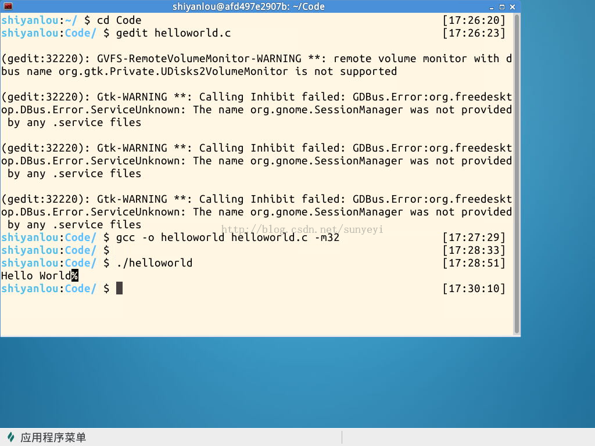
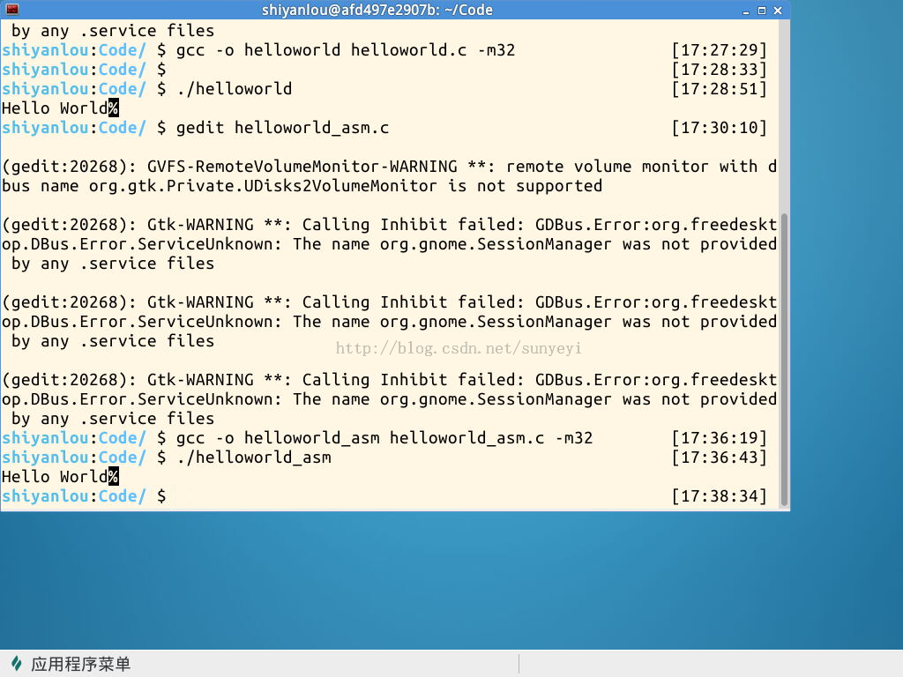

# 使用庫函數API和C代碼中嵌入彙編代碼兩種方式使用同一個系統調用


《Linux內核分析》MOOC課程：http://mooc.study.163.com/course/USTC-1000029000

第四講 扒開系統調用的三層皮（上）

@2015.03

### 一、理論知識


所謂的系統調用三層皮，結合下圖解釋如下：




- API：第一層是指Libc中定義的API，這些API封裝了系統調用，使用int 0x80觸發一個系統調用中斷；當然，並非所有的API都使用了系統調用，如完成數學加減運算的API就沒有使用系統調用；也有可能某個API使用了多個系統調用；這一層存在的價值就是為應用程序員提供易於使用的API來調用系統調用；

- system_call：運行於內核態。system_call是所有系統調用在內核的入口點，在其中的開始處保護用戶態程序執行上下文，結束處恢復用戶態程序執行上下文，在中間根據傳入的系統調用號對應的中斷服務程序；

- sys_xyz 系統調用封裝例程：執行具體的系統調用操作，完成用戶的系統調用請求；每個系統調用都對應一個封裝例程；

由上面的分析可以知道，理論上要請求一個系統調用，我們即可以使用Libc提供的API，也可以直接在C中內嵌彙編代碼觸發0x80中斷來完成，這次實驗，我們就用實際的例子來演示這兩種方法使用同一個系統的調用。我們選擇的是比較簡單的系統調用sys_write，這屏幕上打印輸出“hello world”，對應的API就是printf。

實驗環境：實驗樓（http://www.shiyanlou.com/courses/195）


### 二、方法一：使用API在屏幕上顯示“hello world”

這個其實也是C語言經典的入門程序，源代碼如下

```cpp
#include "stdio.h"
#include "string.h"

int main()
{
    char* msg = "Hello World";
    printf("%s", msg);
	return 0;
}
```
不解釋了，大家主要用來和下面的內嵌彙編代碼做個比較就好！
在實驗樓中，打開此次實驗鏈接（http://www.shiyanlou.com/courses/running/731），雙擊Xfce終端，cd Code目錄下，gedit helloworld.c，新建並打開helloworld.c文件，在其中輸入上面的代碼，保存退出；

然後使用下面的指令編譯鏈接程序：
```
gcc -o helloworld helloworld.c -m32
```
接著，運行編譯好的程序，
```
./helloworld
```
效果如下：



### 三、方法二：使用C內嵌彙編代碼在屏幕上輸出helloworld

Linux中內嵌彙編代碼的語法，視頻中有詳細介紹，這裡略去，直接給出代碼和註釋如下：

```cpp
int main()
{
    char* msg = "Hello World";
	int len = 11;
	int result = 0;

    __asm__ __volatile__("movl %2, %%edx;\n\r" /*傳入參數：要顯示的字符串長度*/
             "movl %1, %%ecx;\n\r" /*傳入參賽：文件描述符（stdout）*/
			 "movl $1, %%ebx;\n\r" /*傳入參數：要顯示的字符串*/
			 "movl $4, %%eax;\n\r" /*系統調用號：4 sys_write*/
			 "int  $0x80" /*觸發系統調用中斷*/
             :"=m"(result) /*輸出部分：本例並未使用*/
             :"m"(msg),"r"(len)  /*輸入部分：綁定字符串和字符串長度變量*/
             :"%eax");

	return 0;
}
```

使用gedit helloworld_asm.c新建文件，並輸入上面的代碼，使用下面的命令編譯
```
gcc -o helloworld_asm helloworld_asm.c -m32
```
使用下面的命令運行
```
./helloworld_asm
```
運行效果如下




### 四、總結


即便是最簡單的程序，也難免要用到諸如輸入、輸出以及退出等操作，而要進行這些操作則需要調用操作系統所提供的服務，也就是系統調用。除非你的程序只完成加減乘除等數學運算，否則將很難避免使用系統調用。在 Linux 平臺下有兩種方式來使用系統調用：利用封裝後的 C 庫（libc）或者通過彙編直接調用。

Linux 下的系統調用是通過中斷（int 0x80）來實現的。在執行 int 80 指令時，寄存器 eax 中存放的是系統調用的功能號，而傳給系統調用的參數則必須按順序放到寄存器 ebx，ecx，edx，esi，edi 中，當系統調用完成之後，返回值可以在寄存器 eax 中獲得。

所有的系統調用功能號都可以在文件 /usr/include/bits/syscall.h 中找到，為了便於使用，它們是用 SYS_<name> 這樣的宏來定義的，如 SYS_write、SYS_exit 等。例如，經常用到的 write 函數是如下定義的：
ssize_t write(int fd, const void *buf, size_t count);
該函數的功能最終是通過 SYS_write 這一系統調用來實現的。根據上面的約定，參數 fb、buf 和 count 分別存在寄存器 ebx、ecx 和 edx 中，而系統調用號 SYS_write 則放在寄存器 eax 中，當 int 0x80 指令執行完畢後，返回值可以從寄存器 eax 中獲得。

或許你已經發現，在進行系統調用時至多隻有 5 個寄存器能夠用來保存參數，難道所有系統調用的參數個數都不超過 5 嗎？當然不是，例如 mmap 函數就有 6 個參數，這些參數最後都需要傳遞給系統調用 SYS_mmap：
void  *  mmap(void *start, size_t length, int prot , int flags, int fd, off_t offset);
當一個系統調用所需的參數個數大於 5 時，執行int 0x80 指令時仍需將系統調用功能號保存在寄存器 eax 中，所不同的只是全部參數應該依次放在一塊連續的內存區域裡，同時在寄存器 ebx 中保存指向該內存區域的指針。系統調用完成之後，返回值仍將保存在寄存器 eax 中。

由於只是需要一塊連續的內存區域來保存系統調用的參數，因此完全可以像普通的函數調用一樣使用棧(stack)來傳遞系統調用所需的參數。但要注意一點，Linux 採用的是 C 語言的調用模式，這就意味著所有參數必須以相反的順序進棧，即最後一個參數先入棧，而第一個參數則最後入棧。如果採用棧來傳遞系統調用所需的參數，在執行int 0x80 指令時還應該將棧指針的當前值複製到寄存器 ebx中。
