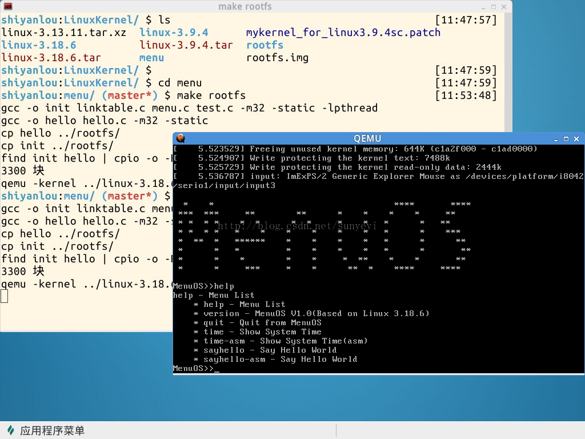
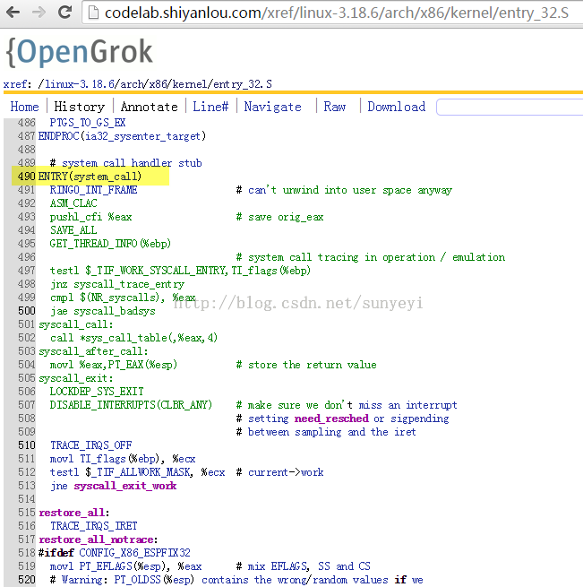
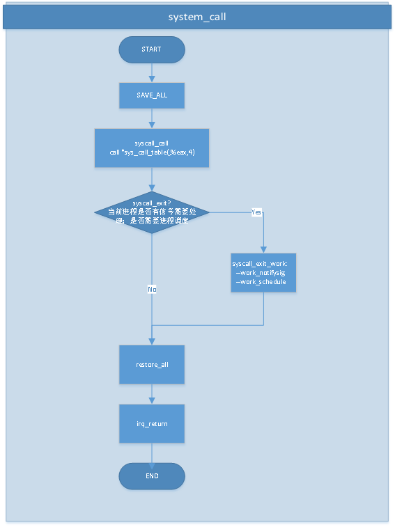

# 分析system_call中斷處裡過程

《Linux內核分析》MOOC課程：http://mooc.study.163.com/course/USTC-1000029000

第五講 扒開系統調用的三層皮（下）

@2015.04

## 一、理論知識

通過gdb我們可以給系統調用內核處里程序如sys_write, sys_time設置斷點，並讓程序停在斷點處，進行斷點跟蹤系統調用處裡過程。由於system_call是完全用匯編寫就一個的函數，雖然我們也可以在system_call處設置斷點，但卻無法讓系統停在system_call處，所以也無法通過單步跟蹤學習其處裡流程。但system_call是所有系統調用的入口，也是程序由用戶態轉入內核態執行時無法越過的一個函數，其重要性不言而喻，所以我們跟隨老師簡化的彙編代碼以及源代碼學習其主要的流程。

## 二、實驗過程

實驗環境是使用本課程配備的實驗樓虛擬機環境，打開命令行客戶端，cd LinuxKernel目錄，使用命令rm -rf menu刪除原來的代碼，使用git clone https://github.com/mengning/menu.git獲取menu的最新代碼，然後 cd menu 進入menu子文件夾，使用gedti test.c打開文件，講我上週實驗的代碼拷貝改寫成為menu的兩個菜單項，主要代碼部分如下：

```cpp
int SayHello(int argc, char *argv[])
{
        char* msg = "Hello World";
        printf("%s", msg);

        printf("\n");

        return 0;
}

int SayHelloAsm(int argc, char *argv[])
{
        char* msg = "Hello World";
        int len = 11;
        int result = 0;

        __asm__ __volatile__("movl %2, %%edx;\n\r"
                "movl %1, %%ecx;\n\r"
                 "movl $1, %%ebx;\n\r"
                 "movl $4, %%eax;\n\r"
                  "int  $0x80"
                :"=m"(result)
                :"m"(msg),"r"(len)
                :"%eax");

        printf("\n");

        return 0;
}

int main()
{
    PrintMenuOS();
    SetPrompt("MenuOS>>");
    MenuConfig("version","MenuOS V1.0(Based on Linux 3.18.6)",NULL);
    MenuConfig("quit","Quit from MenuOS",Quit);
    MenuConfig("time","Show System Time",Time);
    MenuConfig("time-asm","Show System Time(asm)",TimeAsm);
<strong>    MenuConfig("sayhello","Say Hello World",SayHello);
    MenuConfig("sayhello-asm","Say Hello World",SayHelloAsm);</strong>
    ExecuteMenu();
}
```

這裡主要就是加了兩個菜單項 sayhello 和 sayhello-asm 及其對應的實現函數，保存 test.c 函數，使用 make rootfs 編譯運行 menuos 系統，輸入help 可以看到我們新加入的菜單：



使用 gdb 跟蹤相關的函數過程，在我前述的博客中有筆記詳細的描述，有興趣的可以參考下：http://blog.csdn.net/sunyeyi/article/details/44517109，這裡主要就是說明下，我們可以在 gdb 裡使用 b system_call 設置斷點，但是卻無法讓程序停在這個地方。當然網上也有資料提供了其他技術來跟蹤這個函數，由於個人時間能力所限，沒有去研究！


## 三、通過源代碼分析 system_call 處理流程

先看下系統調用機制的初始化，在start_kernel函數中，trap_init函數就是完成系統調用初始化的。

/init/main.c start_kernel

```
trap_init();
```

在trap_init()函數中，關鍵代碼如下，通過中斷向量，將system_call函數和0x80綁定：
/arch/x86/kernel/traps.c

```cpp
#ifdef CONFIG_X86_32
    set_system_trap_gate(SYSCALL_VECTOR, &system_call);
    set_bit(SYSCALL_VECTOR, used_vectors);
#endif
```

據此，用戶態代碼只要執行 int 0x80 中斷，就會由 system_call 函數來處裡。
再來看看system_call源代碼，http://codelab.shiyanlou.com/xref/linux-3.18.6/arch/x86/kernel/entry_32.S，490行處。



根據這段源代碼，參考老師在視頻中的講述，我們可以得到system_call的簡化流程圖如下：



這裡我們需要特別注意的就是，在系統調用system_call返回之前，會檢查當前進程是否需要執行syscall_exit_work，如果不需要就restore_all，然後中斷返回了；如果需要處裡，那麼就在syscall_exit_work流程中查看是否有進程信號需要處理，若有就處裡，是否需要進程調度，若有就調用schedule，切換到其他進程執行；然後才restore_all，中斷返回。


## 四、總結

通過中斷向量表，int 0x80和system_call關聯起來；system_call又是通過系統調用號，將每一個系統調用和特定的系統調用服務例程關聯起來；在system_call返回用戶態之前，會執行syscall_exit_work，work_notifysig,schedule等函數以應對可能的進程信號處理和進程調度。
