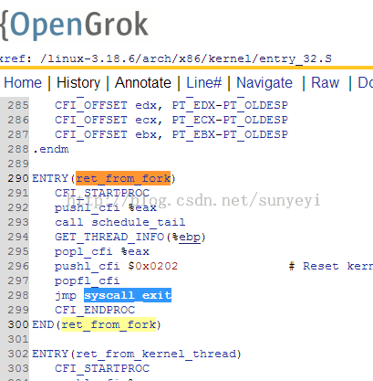
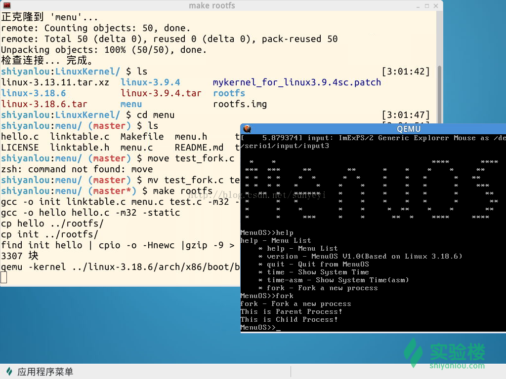

# 初學Linux進程的描述和進程的創建

第六講 進程的描述和進程的創建

@2015.04

## 一、理論知識

### 1. 進程描述符 task_struct

為了管理進程，內核必須對每個進程進行清晰的描述，進程描述符提供了內核所需瞭解的進程信息。進程描述符task_struct的源碼鏈接：http://codelab.shiyanlou.com/xref/linux-3.18.6/include/linux/sched.h#1235。其結構很龐大，初次接觸我們只關注與進程創建與管理密切相關的一些字段。如：

- 進程的標識 pid
- 所有進程鏈表 struct list_head tasks;
- 程序創建的進程具有父子關係，在編程時往往需要引用這樣的父子關係。進程描述符中有幾個域用來表示這樣的關係
- Linux為每個進程分配一個8KB大小的內存區域，用於存放該進程兩個不同的數據結構：Thread_info和進程的內核堆棧
- struct thread_struct thread; //CPU-specific state of this task

關於task_struct的詳細描述，可參見task_struct結構描述
當然除了應該瞭解task_struct中存儲了哪些信息以外，還應該學習這些信息是如何組織的。比如所有的進程描述符是如何通過其內的一個數據成員 struct list_head tasks雙向鏈接起來的，詳見網上的一篇文章：linux 內核 task_struct 結構體字段分析

### 2. 進程的創建

在Linux應用程序的開發中，可以通過fork、vfork和clone等API來創建一個子進程，它們在Linux內核中對應的系統調用分別為sys_fork、sys_vfork和sys_clone函數，而這些函數最終都會調用do_fork完成子進程的創建。do_fork主要是複製了父進程的task_struct，然後修改必要的信息，從而得到子進程的task_struct。主要修改了以下信息：

pid
進程鏈表
給新進程分配一個新的內核堆棧
修改子進程的IP為ret_from_fork，當子進程獲得調度時就是從這裡開始執行的
其它眾多零碎字段的初始化，如運行時間設為0等
等等吧；
### 3. 子進程的執行
剛fork出來的子進程是從ret_from_fork開始執行的，然後跳轉到syscall_exit（http://codelab.shiyanlou.com/xref/linux-3.18.6/arch/x86/kernel/entry_32.S#290），從系統調用中返回。看下面的源代碼截圖：



從用戶態代碼來看，fork()函數返回了兩次，即在父子進程中各返回一次！但是子進程的返回值是0，從返回值我們就可以判斷出返回後接下來要執行的代碼是中父進程還是子進程中。
## 二、實驗過程

實驗仍然中實驗樓的虛擬機裡做，這真的是學習的一個好地方，不信，你來http://www.shiyanlou.com/courses/195。

### 1. 進入虛擬機，打開終端，這命令行依次敲入以下命令
```
cd LinuxKernel
rm menu -rf
git clone https://github.com/mengning/menu.git
cd menu
mv test_fork.c test.c
make rootfs
```
一切正常的話，這時候我們簡易的內核系統就啟動起來了，這menuos種，輸入help，就可以看到新添加的命令fork，輸入fork，看看效果吧，有圖為證：



### 2. gdb上述的fork命令

關閉QEMU窗口，中命令行中輸入：
```
qemu -kernel ../linux-3.18.6/arch/x86/boot/bzImage -initrd ../rootfs.img -s -S
```
再次啟動MenuOS，並暫停等待gdb調試。

然後水平分割命令行窗口，這新窗口中依次輸入以下命令，啟動調試：
```
gdb
file linux-3.18.6/vmlinux
target remote:1234
然後再設置以下斷點：
b sys_clone
b do_fork
b dup_task_struct
b copy_process
b copy_thread
b ret_from_fork
```
好了，繼續運行程序吧，你會發現程序調試過程中，會停在這些斷點處，然後你可以單步跟蹤一些感興趣的代碼，從而驗證我們剛剛學習到的Linux進程的創建過程！Enjoy it！
