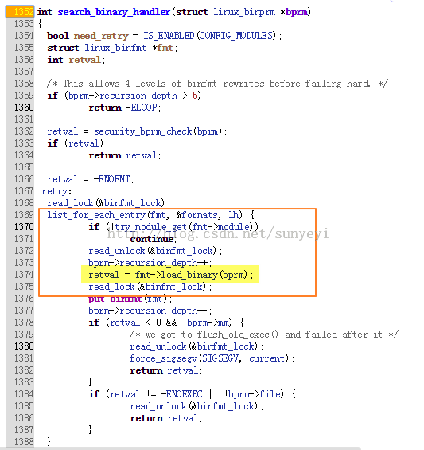
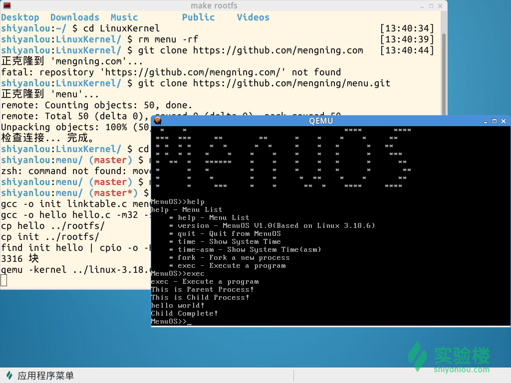
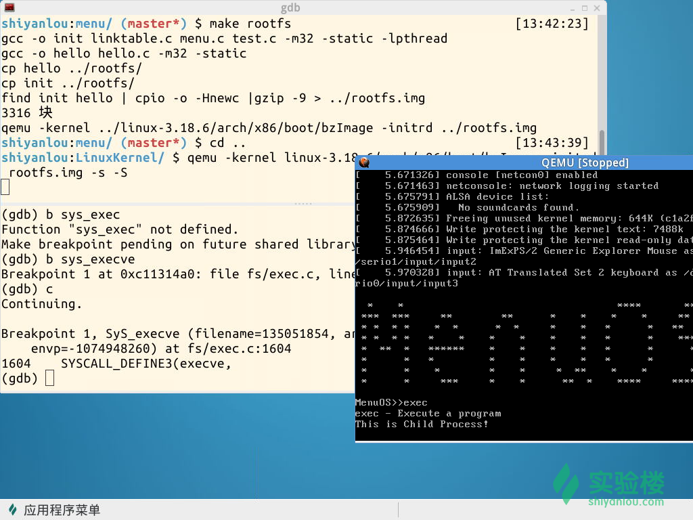

# 初學《Linux內核如何裝載和啟動一個可執行程序》

第七講 可執行程序的裝載

@2015.04

## 一、理論知識

Linux中，可以從c源代碼生產一個可執行程序，這其中要經過預處理、編譯和鏈接的過程。可以參考以下圖來理解這個過程：


其中，目標文件中至少有編譯後的機器指令代碼、數據，也還包括了鏈接時所須要的一些信息，比如符號表、調試信息、字符串等。這Linux中，可執行文件的格式現在主要是ELF格式（對應於Windows中PE格式）。ELF的格式如下：


其詳細介紹，參見：http://www.muppetlabs.com/~breadbox/software/ELF.txt，這裡還有個中文版：http://www.xfocus.net/articles/200105/174.html

鏈接，是收集、組織程序所需的不同代碼和數據的過程，以便程序能被裝入內存並被執行。鏈接過程分為兩步:1.空間與地址分配；2.符號解析與重定位。

在Linux中，一個程序的執行是做為一個新的進程，使用execve系統調用完成的。execve對應的系統調用是sys_execve，在其內部會解析可執行文件格式。對應的內核代碼，就是，在search_binary_handler中尋找符合文件格式對應的解析模塊，關鍵代碼如下：




對於ELF文件，retval = fmt->load_binary(bprm)實際上執行的就是load_elf_binary，其內部就是按照ELF文件格式來加載ELF文件的。這裡，我們也可以看到Linux是可以支持多種可執行文件格式的，所有的格式處裡信息用一個結構體存儲在一個鏈表中，其中的load_binary是一個函數指針，對應於該中格式的可執行文件的加載方式；要想支持一種新的可執行文件，只需要向鏈表中註冊一個新的format結構體就可以了，此種設計類似觀察者模式，具有很好的擴展性。


## 二、實驗過程

打開實驗樓中的虛擬機，在shell中依次運行以下命令，獲取本次實驗的代碼，並編譯運行
```
cd LinuxKernel
rm menu -rf
git clone https://github.com/mengning/menu.git
cd menu
mv test_exec.c test.c
make rootfs
```
效果如下：



關閉QEMU窗口，在shell窗口中，cd LinuxKernel回退到LinuxKernel目錄，使用下面的命令啟動內核並在CPU運行代碼前停下以便調試：
```
qemu -kernel linux-3.18.6/arch/x86/boot/bzImage -initrd rootfs.img -s -S
```
接下來，我們就可以水平分割一個新的shell窗口出來，依次使用下面的命令啟動gdb調試
```
gdb
(gdb) file linux-3.18.6/vmlinux
(gdb) target remote:1234
// 並在系統調用sys_execve的入口處設置斷點
(gdb) b sys_execve
```
繼續運行程序，在QEMU窗口中輸入exec，系統就會停在上面設置的斷點處，如圖：



接下來我們可以單步跟蹤sys_execve的內核代碼，也可以通過設置以下斷點
```
b load_elf_binary
b start_thread
```
來完整地跟蹤進程的創建和啟動代碼！


## 三、總結

Linux系統可以通過execve API啟動一個新進程，該API又呼叫sys_execve系統調用，負責將新的程序代碼和數據替換到新的進程中，打開可執行 文件，載入依賴的庫文件，申請新的內存空間，最後執行 start_thread(regs, elf_entry, bprm->p) ，設置 new_ip, new_sp ，完成新進程的代碼和數據替換，然後返回，接下來就是執行新的進程代碼了。
