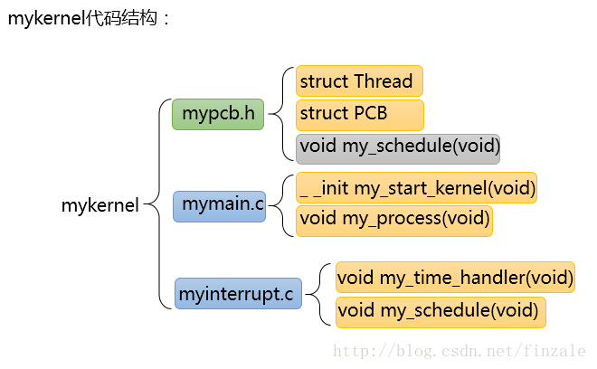
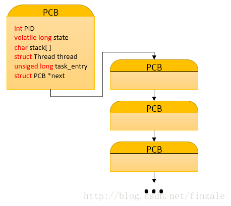
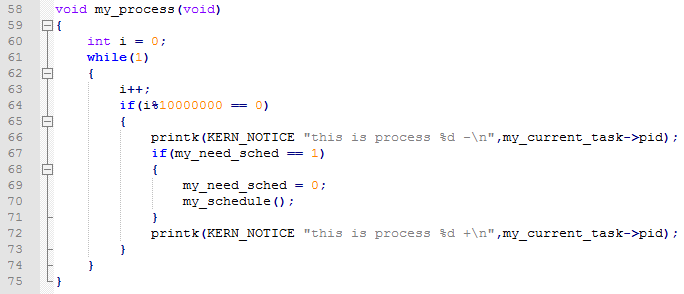
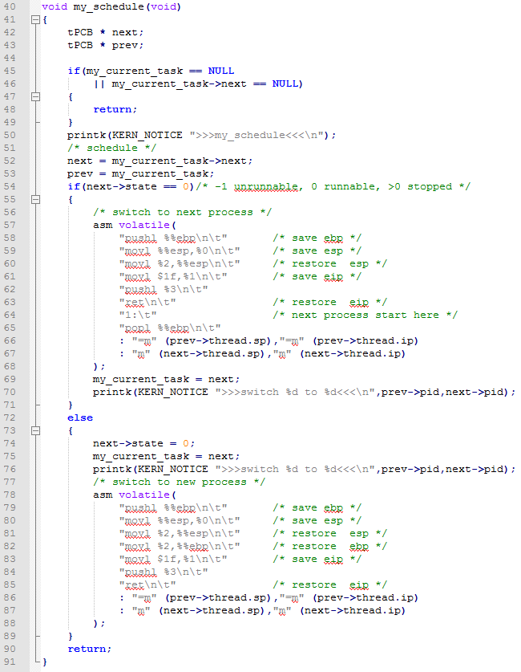
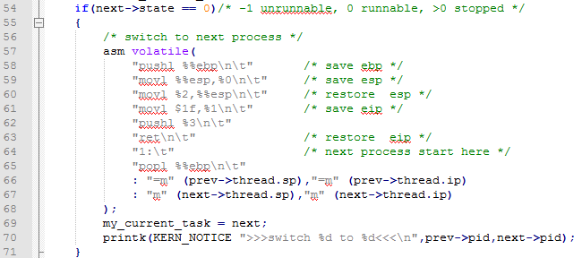
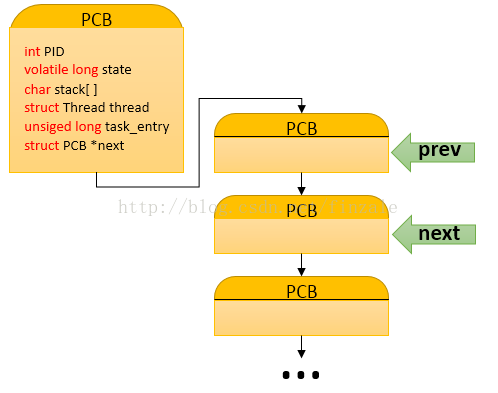
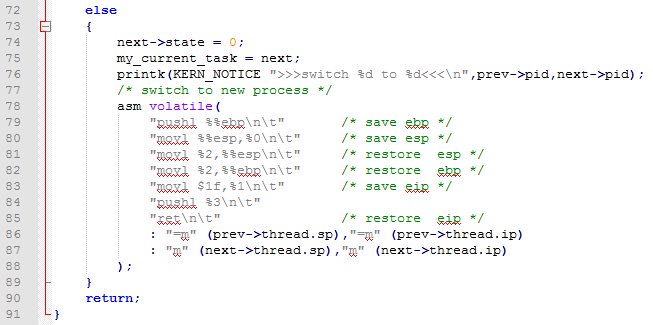
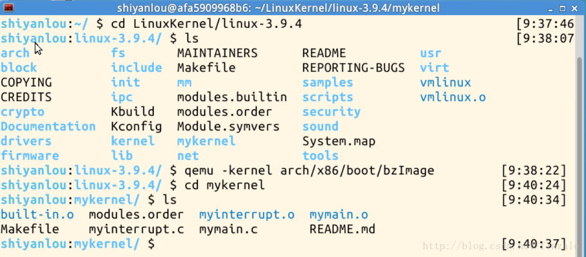
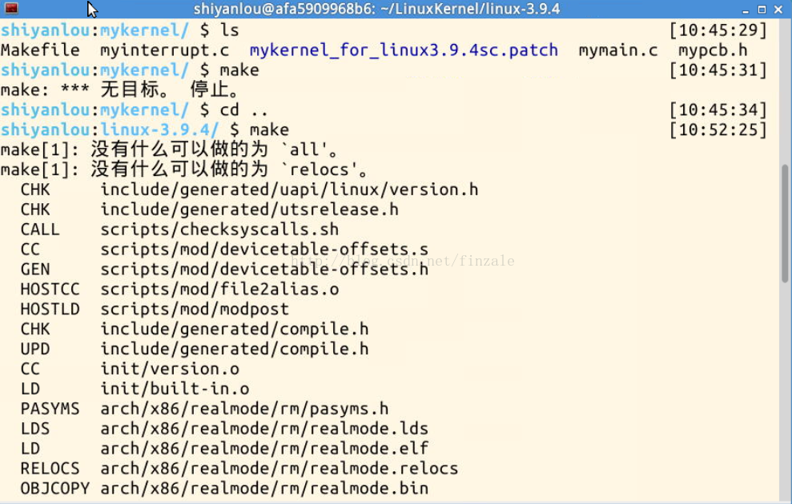
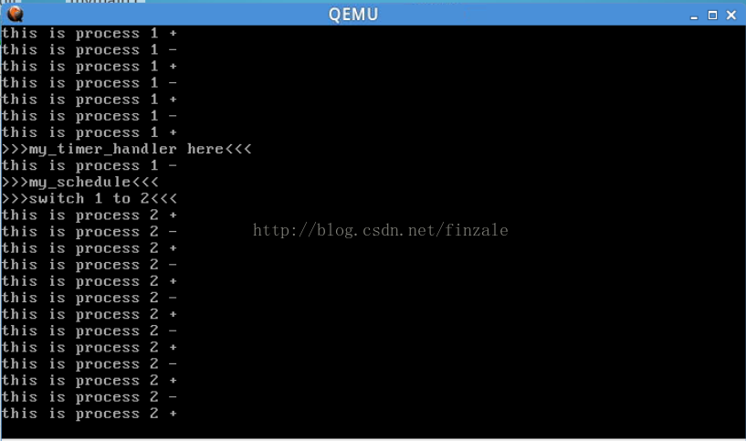

# Linux內和分析（二）操作系統是如何工作的


##一、計算機系統是怎麼樣工作及mykernel代碼分析
（一）內容概述
本次文章的內容主要講述了計算機系統是如何進行進程調度的，代碼部分大家可以參見網易雲課堂中USTC孟寧老師的第二週的實驗內容。實際上我們知道計算機中對進程的定義是：進程（Process）是計算機中的程序關於某數據集合上的一次運行活動，是系統進行`資源分配和調度的基本單位`，是操作系統結構的基礎。在早期面向進程設計的計算機結構中，進程是程序的基本執行實體；在當代面向線程設計的計算機結構中，進程是線程的容器。程序是指令、數據及其組織形式的描述，進程是程序的實體。

所以我們可以看出進程的一個首要的特點是系統進行資源分配及調度的一個單位。所以我們得出一個結論就是一個進程需要執行的時候操作系統是需要對他分配相應的`資源`的。這裡的資源指的就是計算機的硬件和系統資源。比如這個進程需要運行的內存空間，系統中負責指向運行指令的IP指針，運算需要用到的一些寄存器，系統的調度（實際上就是系統開始運行這個進程了）等等。但是計算機不可能只有一個進程一直在運行，他會有很多進程。而CPU只有一個（假設是個單核的系統，即使是多和計算機也不可能核心數大於進程執行數量）所以系統需要給進程分配CPU這個硬件資源。最簡單的方式就是大家輪流使用CPU，每個人都用一會兒之後再給別人用，這樣在一段時間之後每個進程都會被計算機執行到。這就是所謂的`時間片輪轉法`的調度。


`那麼問題就來了`，進程之間切換的時候是如何進行的呢。我們知道不同進程運行需要的內存空間是不一樣的。就像是每個函數都有自己的堆棧一樣（上篇文章說過）。`所以在進程切換時候首先需要做的就是講這個進程當前執行到的位置（一個內存的地址——CS：IP）保存起來[1]`，這樣下次等到他得到CPU開始執行的時候至少系統可以知道從哪開始繼續運行它。那麼除了上述的這個運行位置需要保存起來還有什麼東西也是需要記錄並用於恢復進程的呢？

我們還是用函數作為類比，我們假設函數就是一個簡單的數值運算處理，那麼處理的時候也會用到很多的變量用於運算步驟中的結果或者中間值的保存，這些數值有些保存在自己的內存堆棧中，有些則是CPU的寄存器中。`那麼問題又來了`，這些寄存器有的是通用寄存器大家都要用。所以計算的中間結果如果保存到這裡的話，別的函數也會用到這些寄存器用於數值處理，所以上一個函數的這些數值就被覆蓋了，即使是恢復到之前運行的內存地址，中間結果不對，執行結果也不會正確。`所以其次需要保存就是這些中間值，我們也可以叫他們保存現場`，這樣的話在恢復的時候看起來就差不多不會出問題了（實際上可能需要保存的信息還有很多但是他們的目的都是講這個進程可能用到的系統資源複製出來，這樣即使別人篡改了這些公共資源中的一些，回來時還能恢復到執行時候的樣子）。

##（二）代碼分析
那麼現在我們就可以開始做實驗了，mykernel代碼實際上就實現了一個基於時間片輪轉的系統調度。我們首先來看一下他的代碼結構。




上述代碼中我們看到mykernel包括了三個文件，mypcb.h、mymain.c、myinterrupt.c。下面我們來分析這段代碼中的以一個部分：頭文件mypcb.h主要代碼如下：

```c
#define MAX_TASK_NUM        4
#define KERNEL_STACK_SIZE   1024*8

/* CPU-specific state of this task */
struct Thread {
    unsigned long		ip;
    unsigned long		sp;
};

typedef struct PCB{
    int pid;
    volatile long state;	/* -1 unrunnable, 0 runnable, >0 stopped */
    char stack[KERNEL_STACK_SIZE];
    /* CPU-specific state of this task */
    struct Thread thread;
    unsigned long	task_entry;
    struct PCB *next;
}tPCB;

void my_schedule(void);
```

mypcb.h中定義了兩個結構體以及聲明瞭一個函數。首先就是Thread結構體裡面存放了兩個用於存放地址的變量，一個是堆棧指針，一個是指令指針。另一個結構體PCB用於存放進程的相關信息（Process Control Block）包括進程的標誌ID，進程狀態，進程堆棧大小，一個線程，一個任務入口地址，還有一個指向下一個PCB的指針。這裡模們可以看出實際上進程在系統中是由進程控制塊來控制的（PCB），並且這些控制塊是一個鏈表結構的如下圖。




下面我們分析mymain.c中的代碼：


我們看到首先程序之前新建了一個任務數組，裡面都是PCB結構體。在上面代碼中是mymain.c中的啟動代碼。首先我們開始新建了一個任務（PCB或者說是進程控制塊）並給裡面的屬性賦值（line30~line34）。然後利用一個for循環新建了一些基本一樣進程（一共MAX_TASK_NUM這麼多，實際上就是4個）並連接成鏈表（line43）。之後進入啟動process0。實際上就是將它ip賦值給esp寄存器然後保存自己的sp（基地址->ebp）和ip。然後就返回即可。下面的代碼就是進程執行時候的實際運行內容（打印自己是pid到控制檯for的判定條件可以調控他的打印速度，被執行多少次打印一次信息，以及調用一次進程調度函數line70）


下面我們來看最重要的部分就是進程調度的代碼分析，這段代碼在myinterrupt.c中。首先是時間中斷，my_time_handler。



這是一個產生調度時機的函數。就是所謂的產生了時間片，每當他執行的時候就是一個進程調度的時機。後面的實驗截圖中我們可以看到。它的運行說明進程已經用完了自己的時間片需要保存自己的運行現場信息然後讓其他的進程使用CPU。下面的代碼就是調度的關鍵代碼了：my_schedule(void)。



代碼中我們看到首先是兩個指向PCB的指針，next和prev意思就是下一個和上一個的意思。之後有一個判斷希望當前鏈表不是空的。然後輸出打印信息說明開始進行調度了。調度的時候有兩種情況，一種是調度一個已經運行過的進程，另一種情況就是調度一個新的未運行過得進程。


首先說明第一種情況：
 


上面的代碼中就行我們說的首先是保存一下現場信息（實際上是它上一個進程的運行信息）然後將需要調度的進程的堆棧指針放入esp中並載入ip（sp：ip）然後將自己的ip入棧，然後將這個值在彈出給ebp這樣，系統將轉入這個進程的內存空間開始執行。





然後看第二週情況：





##二、實驗過程

下面我們看一下實驗過程，首先是將mykernel的代碼不全，然後重新編譯（詳細步驟參見雲課堂中的實驗二）如下圖所示首先進入我們要的內核目錄：



然後進行將代碼補全之後重新編譯：



然後執行這個命令“qemu -kernel arch/x86/boot/bzImage”就會看到如下的實驗效果：





 我們看到這裡面調度的實際就是my_time_handler中的那個。然後系統執行了調度my_schedule之後進程1就會切換到進程2。
 
 ##三、總結分析
本次實驗我們總結了進程是如何切換的，實際上操作系統中進程都用兩個任務首先是保存上一個進程的信息然後載入自己的運行指令，只有這樣進程才會得以執行。


總結一下進程切換大體上有以下工作：
```
(1)決定是否作上下文切換以及是否允許作上下文切換。這裡面實際上就是有my_time_handler決定的，時間片用完之後就進行調度；
(2)保存當前執行進程的上下文。原因文章分析過了，就是當你恢復的時候得以繼續執行的基礎；
(3)使用進程調度算法，選擇一處於就緒狀態的進程。這裡面就是my_schedule的工作；
(4)恢復或裝配所選進程的上下文，將CPU控制權交到所選進程手中。實際上有事再次時間片用完時進行調度。
```


文中介紹了一個基於時間片輪轉的建議操作系統內核代碼。分析了操作系統中進程之間是如何進行調度的。通過對mykernel的源代碼分析，體會進程在切換過程中操作系統對進程運行環境的管理。事實上有時候我們可以把它叫做運行框架，也可以說是上下文，現場環境等等。實際上這些東西指的都是程序運行時候的堆棧，運行內存空間的地址，寄存器值的集合。因為程序運行需要改變他們，二他們中的一些也許會被其他程序運行時改變，所以在切換進程的時候要對所有進程恢復當前狀態的系統資源進行保存。這就是切換的核心意義。